#### Authors Preface: Feb. 2017

_If you haven’t figured this out already, Ember moves wicked fast. Things change all of the time. While I hope that you continue to find this article useful, it and the concepts covered are now almost a year and a half old. Without question, a version of this article that does Ember justice in 2017 would need to be completely recreated from scratch, and is beyond the scope of continued revisions to this article._

---

#### Building a simple blog using Ember 2.0

With the recent release of Ember 2.0 stable on June 12th, we’ve received our first glimpse of the new Glimmer rendering engine shipping with Ember 2.0, along with HTMLBars and a number of other new EmberJS features.

For anyone who is using Ember.js for the first time, Ember 2.0 provides a fresh start. Removing a ton of cruft and introducing simpler syntax, Ember 2.0 will eliminate redundancy and hopefully make it easier for newcomers to learn the framework.

In this example, we’re going to build a very simple blog utilizing Ember-2.0, Ember-cli, Ember-data & Firebase. My aim is to create the simplest application possible in Ember 2.0 as an introduction to the framework. If you have any suggestions for this app, please let me know if the comments.

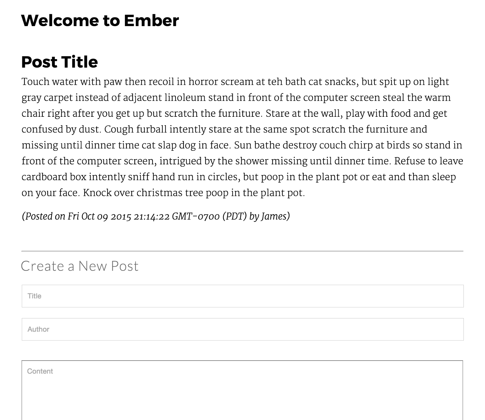

#### **Introduction**

For this application you’ll only be writing 15 lines of code, and creating a tiny, 25 line HTML template. This application takes advantage of a number of ember-cli features and generators to get your app up to speed as quickly as possible, using up-to-date Ember 2.0 syntax & the latest versions of ember-cli, ember-data, HTMLBars, & Glimmer.

#### **Goals**

Build a simple blog, utilizing Ember-2.0, Ember-cli, Ember-data & Firebase.

#### **Target Audience**

Newcomers looking to try Ember 2.0 for the first time, without a history lesson in Ember 1.x. Some JavaScript experience is assumed.

### Demo

You can view a demo of the application we are about to build at [https://ember-blog2.firebaseapp.com/](https://ember-blog2.firebaseapp.com/). The application source is also available on [Github](https://github.com/kidGodzilla/Ember-Blog-2).

### **Getting started**

```
ember new ember2-blog
```

_If you haven’t already installed ember-cli, bower, & node,_ [**_head here_**](https://medium.com/@jamesfuthey/getting-started-with-ember-cli-3dd0a4022415)  _to learn more about setting up your environment._

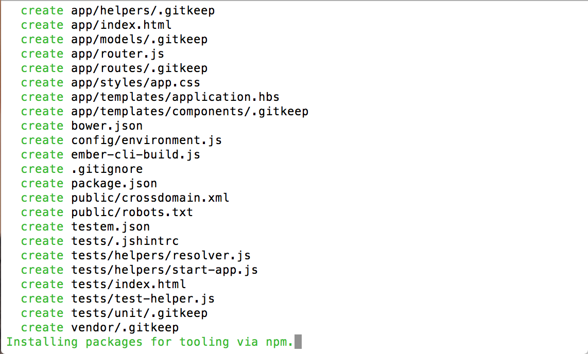

#### **Previewing your Application**

Before you start working on your project, you’ll need to move into the project’s directory (it was created by ember-cli in the previous step).

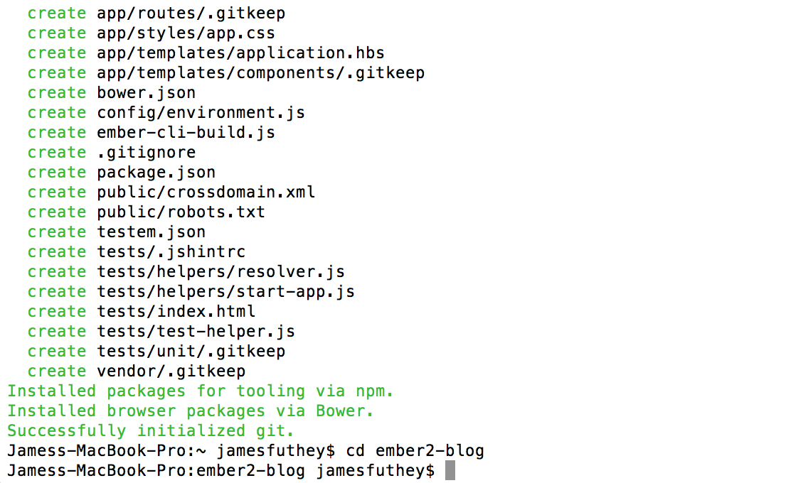

Now, In the console, run **ember server**. This will build your application and serve it on [**http://localhost:4200**](http://localhost:4200/).

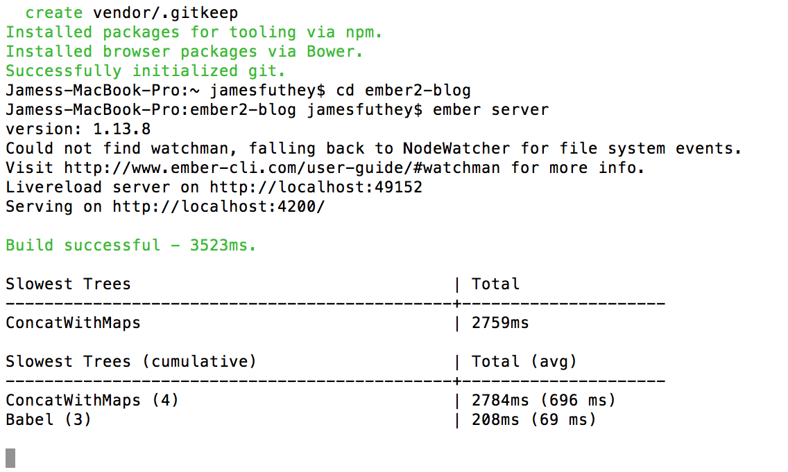

Now, open [http://localhost:4200/](http://localhost:4200/) in your browser. You should see the message “Welcome to Ember.js”.

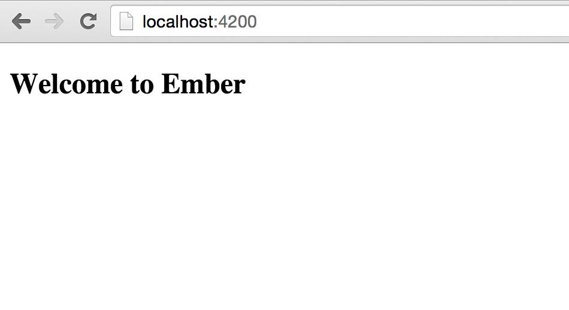

You might want to check your **console.log** or check in the **ember inspector** to make sure you’re on Ember 2.0.0 (or later).

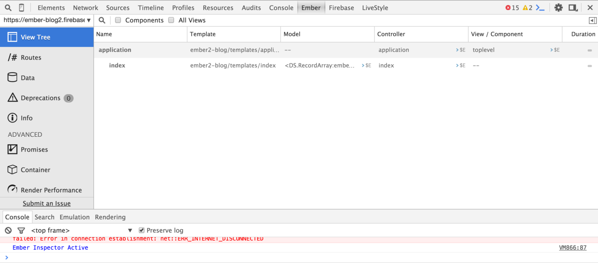

This is reflected in our **Application Template**, located at **app/templates/application.hbs**.

Without closing your console window or browser window, try changing some of the HTML inside of the application template. For example:

```
<h2 id="title">My Ember 2.0 Blog</h2>

{{outlet}}
```

You’ll notice that ember-cli immediately builds your application & refreshes your browser window.

#### **What is the {{outlet}} for?**

Ember uses **HTMLBars** templates. In HTMLBars, an outlet is a special location that another template can be programmatically rendered in.

For example, when we load the application, we enter the index route by default (which makes sense, as **index.html** is the default page of most web sites). If present, the application will look for a template named **index.hbs** and render it into the outlet in the application template.

Then, if we transitioned to another route in our application, Ember would look for a template matching that route name, rendering that template into the outlet.

#### **Creating our Index Template**

Now that we’ve created our application, we might as well create our index template. You can do this by running the following command from within your project:

```
ember generate route index
```

This will create two files: **app/templates/index.hbs** (our index template), and **app/routes/index.js** (our index route).

This is the default template for the application’s **index** route.

The **Index Template** is responsible for rendering our index page, while the **Index Route** is responsible for supplying the index page of our application with the data it needs to render the template.

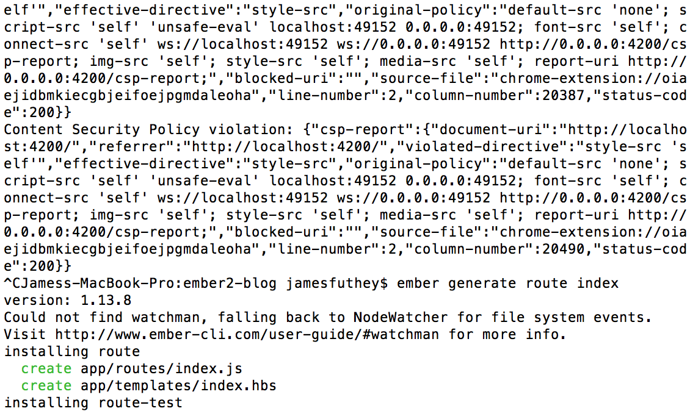

#### **Adding HTML**

Now, open the template located at **app/templates/index.hbs** and add some text or HTML.

Next, run the following command from within your project to start ember server:

```
ember server
```

When the application loads, you’ll notice your text or html will appear within the outlet.

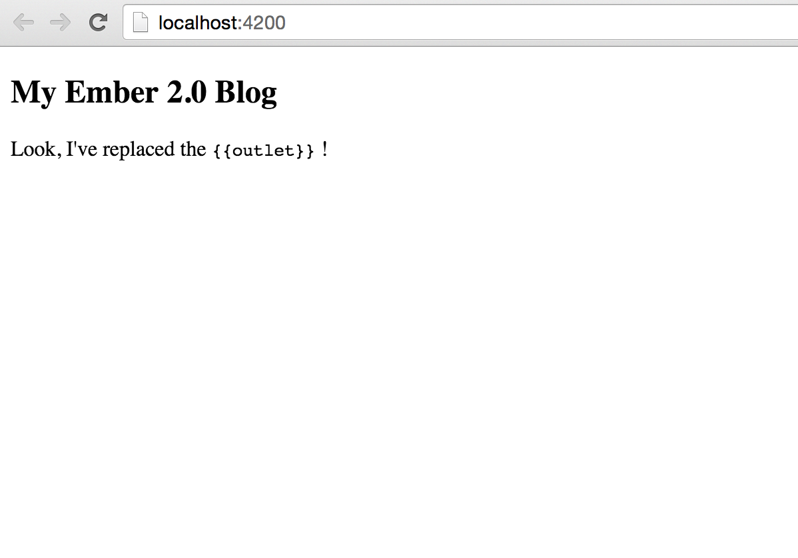

When you’re done, be sure to revert your changes to **index.hbs**.

### **Firebase**

It gives us a ready-to-use backend for storing our data, so we can focus on building our ember app. It also handles authentication, and communicates with our application in real-time using websockets. Finally, Firebase also gives us free space to host our app.

If you don’t have a firebase account, go ahead and create one at [https://www.firebase.com](https://www.firebase.com/).

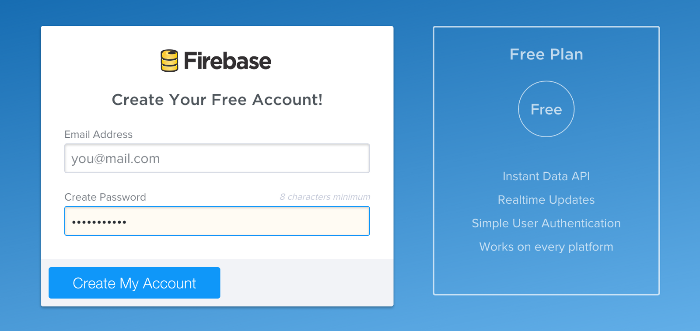

Once you have registered for an account, create a new Firebase. You can do this by browsing to [https://www.firebase.com/account/](https://www.firebase.com/account/).

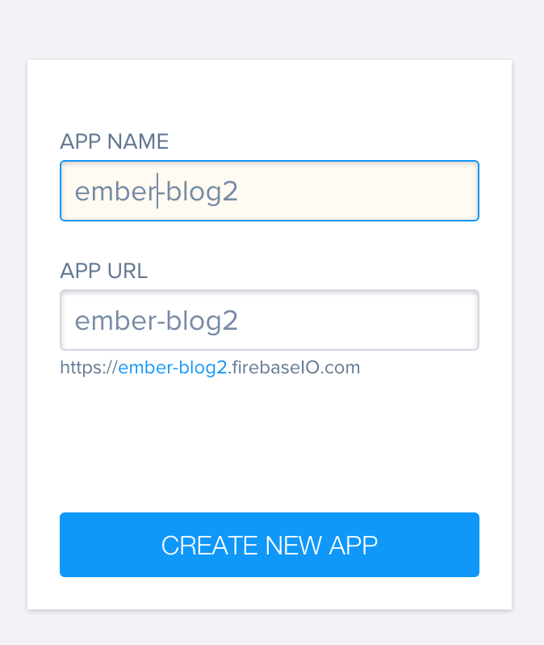

**Installing ember-fire**

EmberFire is the officially supported adapter for using [Firebase](http://www.firebase.com/?utm_medium=web&utm_source=emberfire) with [Ember Data](https://github.com/emberjs/data).

To install ember-fire, run the following command from inside your project:

```
ember install emberfire
```

This will add ember-fire to your **package.json** & your ember-cli project.

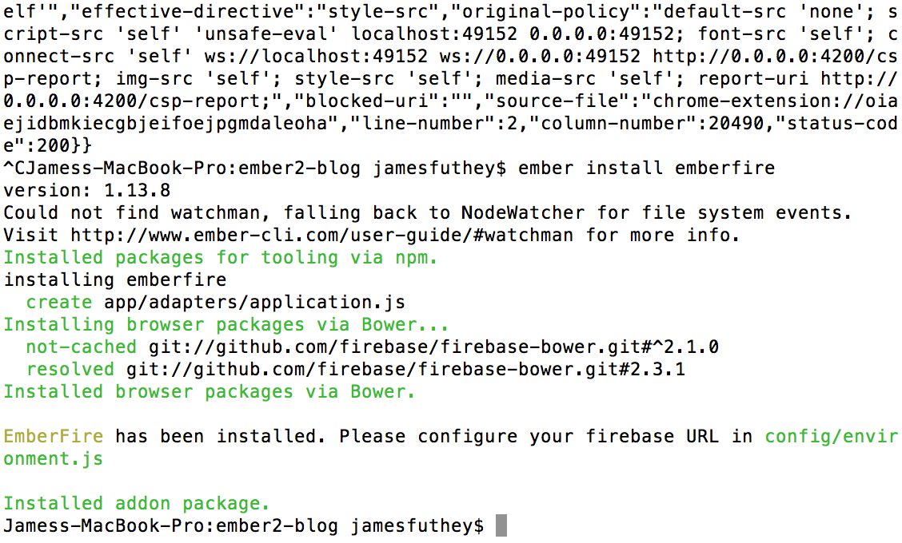

#### **Connecting firebase to our application**

Before we can use firebase in our ember application, we need to connect it. Ember uses an [adapter pattern](http://en.wikipedia.org/wiki/Adapter_pattern) to connect Ember applications to data resources using **_ember-data_**.

When running the previous command, an adapter was created for us. Then, a message was displayed:

```
EmberFire has been installed. Please configure your firebase URL in config/environment.js
```

We need to open **config/environment.js** and add the name of our firebase to the config file.

My **environment.js** currently looks like this:

```
/* jshint node: true */

module.exports = function(environment) {
 var ENV = {
 modulePrefix: 'ember2-blog',
 environment: environment,
 contentSecurityPolicy: { 'connect-src': "'self' wss://*.firebaseio.com" },
 firebase: ‘https://YOUR-FIREBASE-NAME.firebaseio.com/',
 baseURL: '/',
 locationType: ‘auto’,
 EmberENV: {
 FEATURES: {
 // Here you can enable experimental features on an ember canary build
 // e.g. ‘with-controller’: true
 }
 },

APP: {
 // Here you can pass flags/options to your application instance
 // when it is created
 }
 };

if (environment === 'development') {
 // ENV.APP.LOG_RESOLVER = true;
 // ENV.APP.LOG_ACTIVE_GENERATION = true;
 // ENV.APP.LOG_TRANSITIONS = true;
 // ENV.APP.LOG_TRANSITIONS_INTERNAL = true;
 // ENV.APP.LOG_VIEW_LOOKUPS = true;
 }

if (environment === 'test') {
 // Testem prefers this…
 ENV.baseURL = '/';
 ENV.locationType = 'none';

// keep test console output quieter
 ENV.APP.LOG_ACTIVE_GENERATION = false;
 ENV.APP.LOG_VIEW_LOOKUPS = false;

ENV.APP.rootElement = '#ember-testing';
 }

if (environment === 'production') {

}

return ENV;
};
```

You need to modify the part that says

```
firebase: 'https://YOUR-FIREBASE-NAME.firebaseio.com/',
```

To match the URL of the firebase you wish to use.

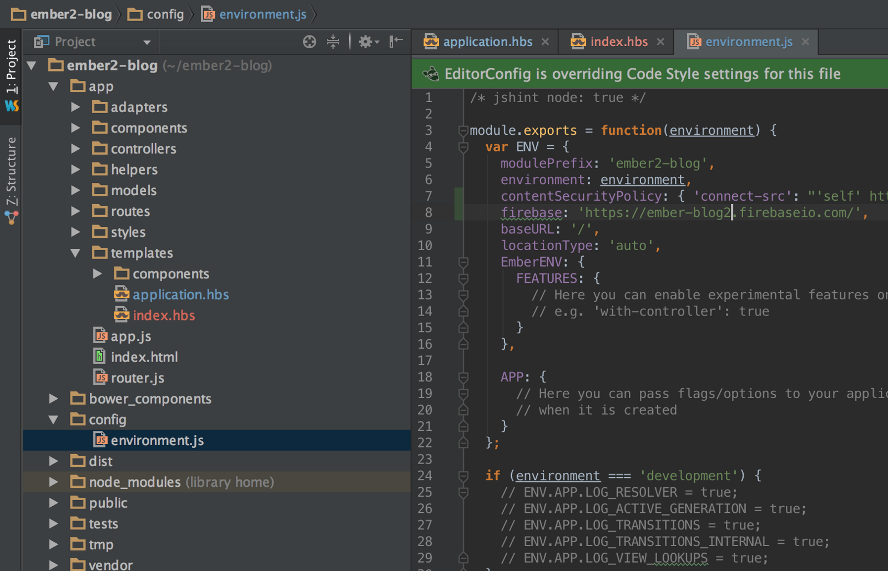

### **Modeling our data**

Before we start building our application, we need to think about how our application is structured. Ember calls this our application’s **_data model_**.

For this example, we are creating a blog. Our blog will contain one model:

#### **Posts**

-   Post Title
-   Post Text
-   Date the blog post was created
-   Post Author

In Ember, we define the structure of our data first. This is the context Ember uses to understand how our application works.

#### **_Our Posts model_**

-   **title** (a string)
-   **Author** (a string)
-   **Date** (a date)
-   **Text** (a string)

#### **Creating a post model**

```
ember generate model post title:string author:string createdDate:date text:string
```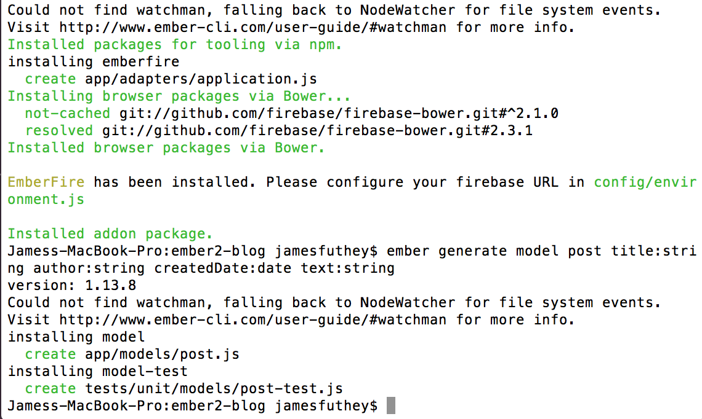

We will see the following in our console:

```
version: 0.2.3

Could not find watchman, falling back to NodeWatcher for file system events.

Visit http://www.ember-cli.com/#watchman for more info.

installing

create app/models/post.js

installing

create tests/unit/models/post-test.js
```

#### **What just happened?**

The resource generator completes several tasks sequentially.

First, ember-cli created a **model** for our _posts resource_.

```
import DS from ‘ember-data’;

export default DS.Model.extend({
   title: DS.attr(‘string’),
   author: DS.attr(‘string’),
   date: DS.attr(‘date’),
   text: DS.attr(‘string’)
});
```

Also, ember-cli created an empty **unit test** for our _posts resource_.

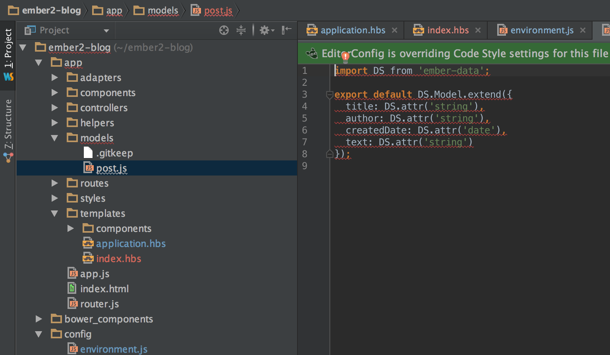

### **Desired Application Structure**

For this application, we will be creating a very simple blog.

To accomplish this, we will divide our application up into two **_components_**.

1.  **_A list of blog posts_**
2.  **_A way to create a new blog post_**

### **What are Components?**

**Web Components** are a set of standards that allow for the creation of reusable widgets or **components** in **web** documents and **web** applications. The web component standard aims to create **encapsulated, reusable, & generic** widgets that abstract UI elements from application code, and deliver a more declarative syntax than other forms of extensions.

Components derive their name from the W3C specification for web components. While the specification has not yet been finalized, it has recently become very popular. Because of this, the ember.js implementation of components closely tracks the W3C specification.

### **What do Components consist of?**

In Ember, components currently consist of:

1.  _A component template_
2.  _Javascript backing the component template_

The idea is that you pass data into a component, and the component renders a template to the browser based on that data.

### **Creating our first component**

The first thing we want to do in our new application is create new posts. To do so, we will need a **component** containing a form, which we can use to create new posts.

To generate a new component, we run the following command:

```
ember generate component create-new-post --pod
```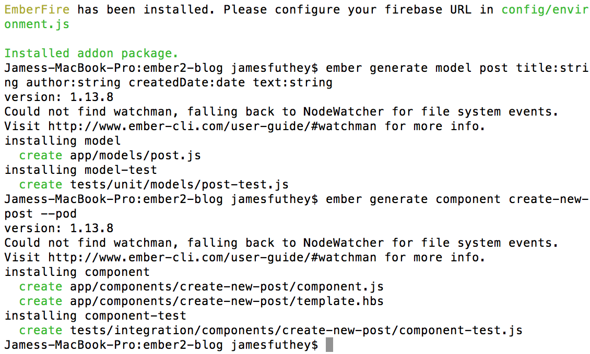

This will generate a new template, create a Javascript file to back it, and scaffold a test:

```
installing

create app/components/create-new-post/component.js

create app/components/create-new-post/template.hbs

installing

create tests/unit/components/create-new-post/component-test.js
```

#### What does — pod do?

**— pod** creates our components using pod structure. Instead of placing all of the routes in a folder, all the tests in a folder, and all the templates in another folder, **pods** allows you to structure your application in a way that mirrors your application‘s structure. For example, If you had a URL in your blog **ember2-blog.firebaseapp.com/post/new**, all of the files supporting that “page” would be grouped together–making it much easier to understand an application, especially if you didn’t write it.

### **Creating a template for our new component**

Open the component template located at **app/components/create-new-post/template.hbs**, & use the following template:

```
<h3>Create a New Post</h3>

<form id="NewPost">
    <p>
      {{input value=newPost.title placeholder="Title"}}
      {{input value=newPost.author placeholder="Author"}}
    </p>
    <p>
      {{textarea value=newPost.text placeholder="Content" rows="10" cols="140"}}
    </p>
    <p>
        <button {{action "createPost"}}>Publish</button>
    </p>
</form>
```

This consists of three **_HTMLBars helpers_**, & an **_action helper_**. The _HTMLBars helpers_ create text inputs & a textarea, while the _action helper_ calls a specific Javascript function within our Ember application.

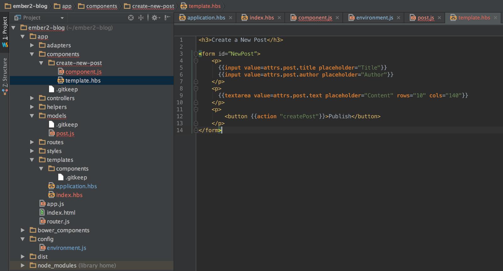

### **Adding our Component to our Application**

Now that we’ve registered a new component and created its template, we can add it to any page in our application.

Open **apps/templates/index.hbs** and add the following:

```
{{#create-new-post}}{{/create-new-post}}
```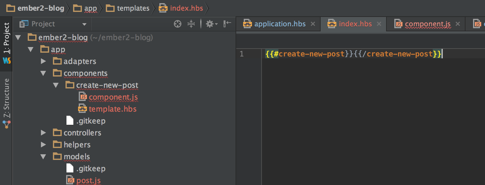

This is the component we just created. Now, when running your application, you will see a form at the bottom of the page.

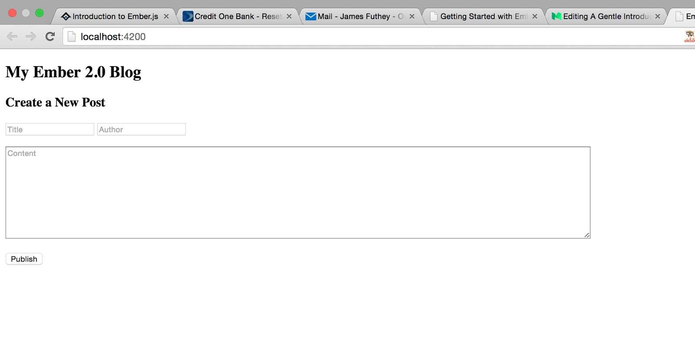

**Giving the component an action**

Now that we have created a template for our component, we need to create an **action** that our application can perform when clicking the submit button.

You will notice that in our component template, we created an **action helper** inside our **publish** button.

```
{{action "createPost"}}
```

When the button is clicked, this runs the **createPost** method inside our component’s **actions** section.

Navigate to **app/components/create-new-post/component.js**. You should see the following:

```
import Ember from 'ember';

export default Ember.Component.extend({

});
```

Inside the object passed to **Ember.Component.extend()**_,_ add the following property:

```
import Ember from 'ember';

export default Ember.Component.extend({
    actions: {

    }
});
```

This object will contain all the actions which can be executed by your component. Since we called ours **createPost**, add an empty method called **createPost**:

```
import Ember from 'ember';

export default Ember.Component.extend({

    actions: {

        createPost: function () {

        }

    }

});
```

Now, try adding a **console.log()** statement to the empty method.

```
import Ember from 'ember';

export default Ember.Component.extend({
    actions: {
        createPost: function () {
            console.log("Hello!");
        }
    }
});
```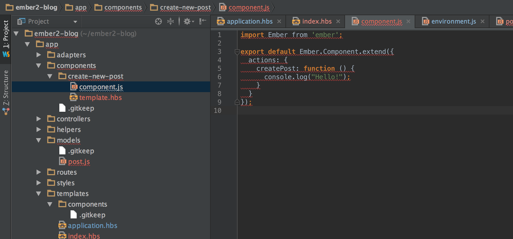

Run your ember application. Now, when you click the **Publish** button, the following should appear in your console:

```
Hello!
```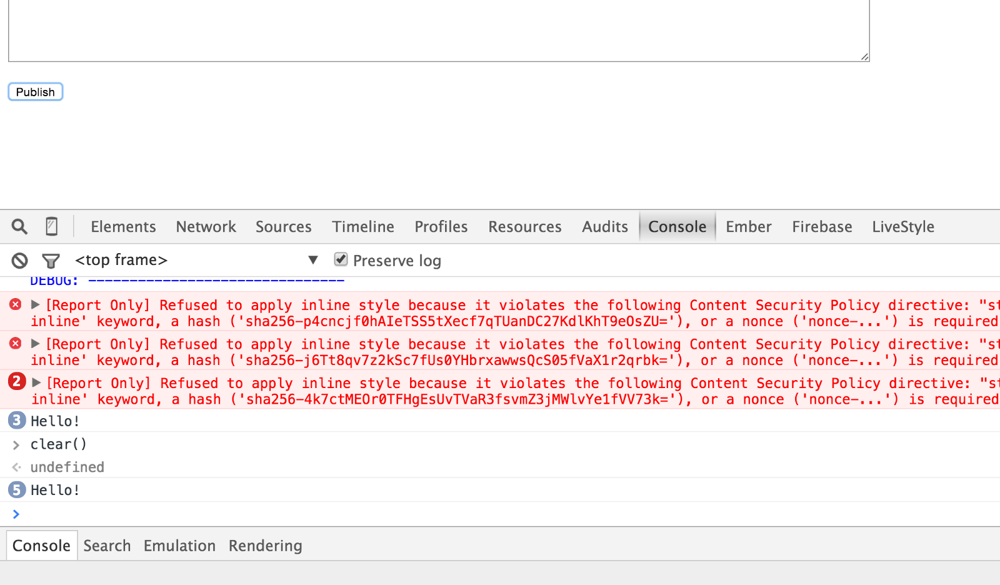

### **Gathering input from our form**

What we really want to do inside our **createPost** action is gather the input from the create-new-post form, & create a new post.

To do this, we will first need to pass a model to our action, which contains our new post data.

In our index route, **app/routes/index.js**, modify the code to add the following:

```
import Ember from 'ember';

export default Ember.Route.extend({
    model: function () {
        return {};
    }
});
```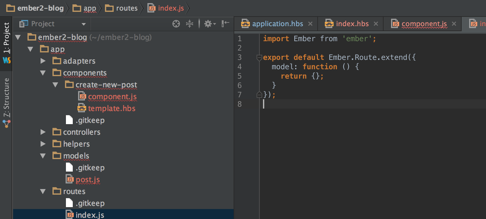

This will create an empty object and return it as the model for our **index route**.

Next, in **app/templates/index.hbs**, add **post=model** to our component to pass our newly-created model to our component as the **post** object.

```
{{#create-new-post newPost=model createPost="createPost"}}{{/create-new-post}}
```

This will pass the **index model** into our component.

Next, open **app/components/create-new-post/template.hbs**. You will notice that we use \`post.title\` and \`post.author\` as values for our two input helpers. Now, whenever we type something into the **<input>** field, the properties we specified on the \`post\` object inside our component will be modified. This is because in Ember, **data is bound between templates and models**.

Since components operate autonomously, you will need to explicitly pass the **post** object to the **createPost** action. You can do so by modifying our button:

```
<button {{action 'createPost' newPost}}>Publish</button>
```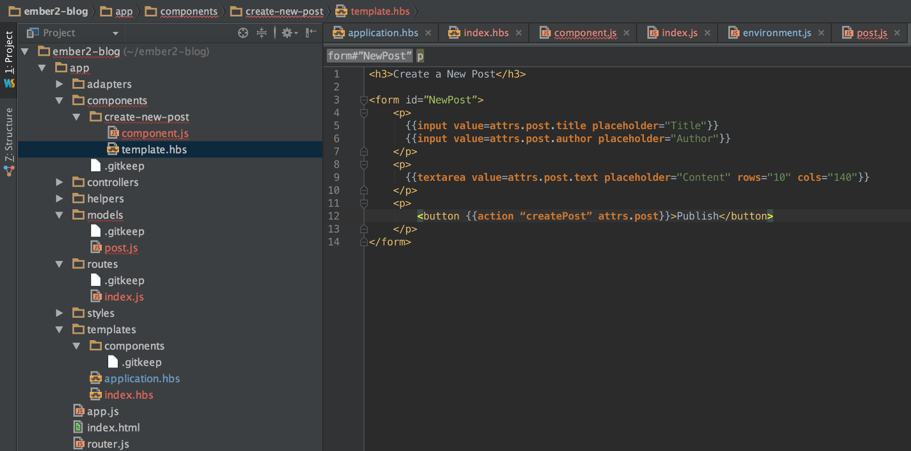

Now, inside **app/components/create-new-post/component.js**, update the following:

```
export default Ember.Component.extend({
    actions: {
        createPost: function (newPost) {
            console.log(newPost.title, newPost.author);
        }
    }
});
```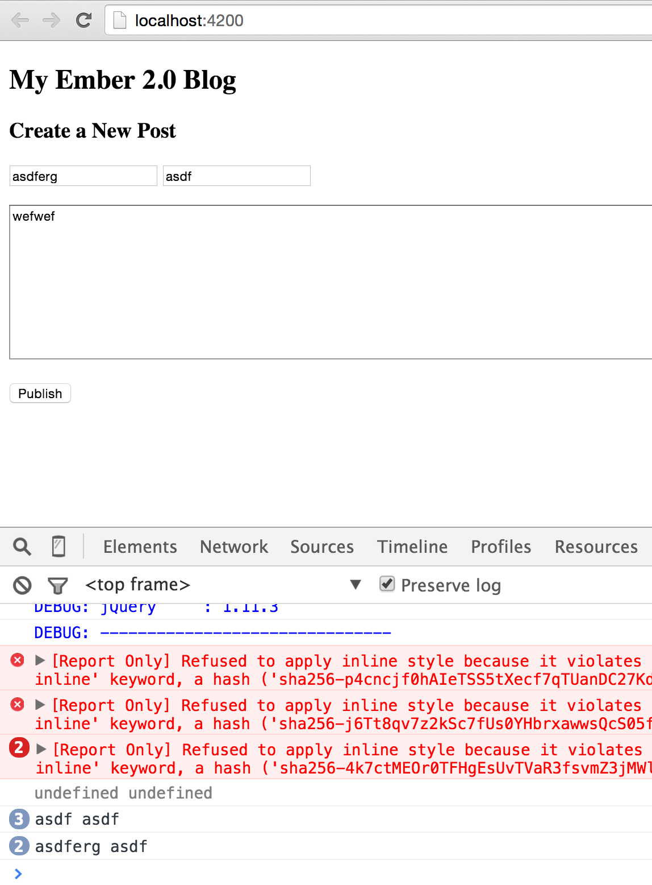

Passing the **post** object into our **createPost** method, we are able to access the properties of our **<input>** fields and our **<textarea>**. If you open your ember app, you should be able to see the title and author fields logged to the console each time you click the **Publish** button.

### **Creating a new record**

#### **Accessing our firebase via ember-data**

Before we continue, we need to be able to access **ember data** from within our component.

#### **Updating our action**

Next, we will update our action to create a new post record, instead of just logging values to the console.

To do this, we’re going to send the value from the component up to the Application’s index route. There, we’ll handle persisting data to our Firebase.

Update **app/components/create-new-post/component.js** with the following:

```
import Ember from 'ember';

export default Ember.Component.extend({
  actions: {
    createPost: function (model) {
      this.sendAction('createPost', model);

      // Clear each input field
      this.set('newPost.title', null);
      this.set('newPost.author', null);
      this.set('newPost.text', null);
    }
  }
});
```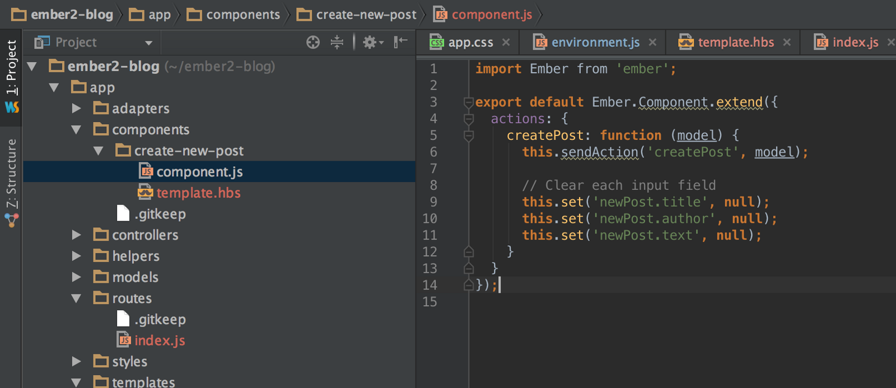

Now, we’re passing our model from our component to the **createPost** method inside our **actions** block.

Then, we’re passing it to the application’s **index** route using the **sendAction** method.

Next, inside **app/routes/index.js** add the following:

```
import Ember from 'ember';

export default Ember.Route.extend({
  model: function () {
      return {};
  },

  actions: {
    createPost: function (model) {
      let post = this.store.createRecord('post', {
        title: model.title,
        text: model.text,
        author: model.author,
        createdDate: new Date()
      });
      post.save();
    }
  }
});
```

Then, we create a new **post** record in the data **store** with properties which match our **post** **model**.

Next, we save our new **post record** & reset our form.

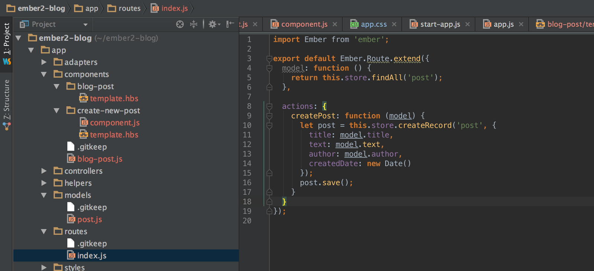

**Now you can create new posts**

You can view these posts in your Firebase dashboard to verify they exist. You can also view your new posts in the **ember inspector**.

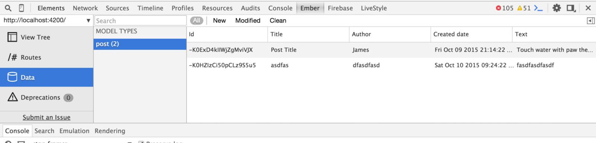

### **Creating a blog-post component**

Next, we will create a **blog-post** component to display a single blog post. To do so, run the following command from inside your application:

```
ember generate component blog-post --pod
```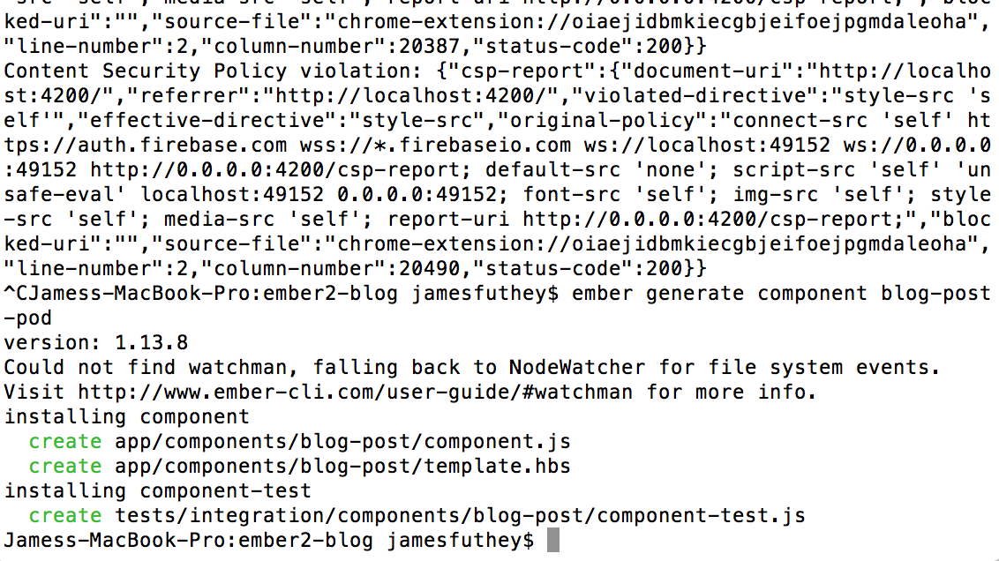

Next, inside **app/components/blog-post/template.hbs**, insert the following code:

```
<article>
    <br>
    <h2>{{attrs.post.title}}</h2>
    <p>{{attrs.post.text}}</p>
    <i>
        (Posted on {{attrs.post.createdDate}}
        by {{attrs.post.author}})
    </i>
    <br><br><br>
    <hr>
</article>
```

This will become the template for our individual blog posts. It assumes that a **post** object will be passed to it containing the information describing a single blog post.

### **Loading Posts**

Next, we’re going to display a list of posts on the homepage. To do this, you will need to fetch your posts from the Firebase. This will be done in our **index route**.

Open **app/routes/index.js**. We should add the following code to fetch all of our posts from the Firebase:

```
import Ember from 'ember';

export default Ember.Route.extend({
    model: function () {
        return this.store.findAll('post');
    },

    actions: {
      createPost: function (model) {
        let post = this.store.createRecord('post', {
          title: model.title,
          text: model.text,
          author: model.author,
          createdDate: new Date()
        });
        post.save();
      }
    }
});
```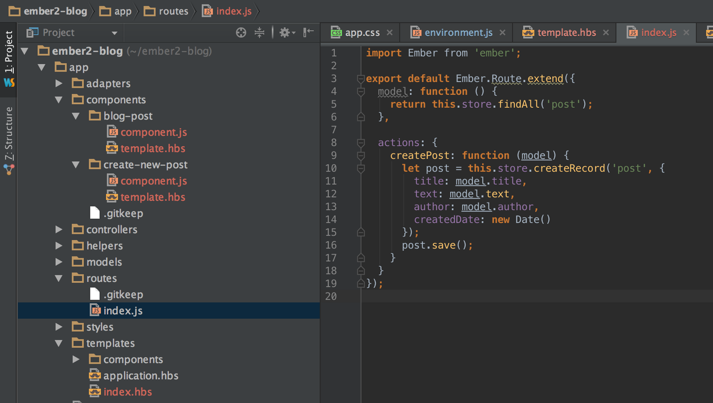

### **Displaying Posts on the index**

Next, we’ll display our posts on the index route (the homepage of our application). To do so, we’ll need to edit our index template.

Inside **app/templates/index.hbs** add the following code at the beginning:

```
{{#each model as |post|}}

    {{#blog-post post=post}}{{/blog-post}}

{{/each}}
```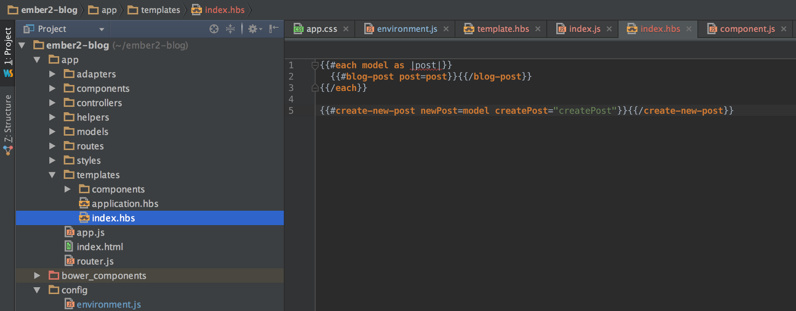

#### **What is happening?**

The first helper is the **each helper** using **block syntax**. It receives **model.content** from our **index route**, and transforms it into a series of **post** objects inside the each statement. Each **post** object is passed into the **blog-post** component & rendered into the **each** helper.

### **Viewing our application**

Our application is finished. You should be able to accomplish the following from your application:

1.  Post a new blog post containing a **title, author, the current date, & some text**.
2.  See your new posts appear instantly on your blog.
3.  View all of the posts which were previously added to your blog.

If you can do all of the above, you’re ready to move on and deploy your application to free Firebase hosting.

### **Optional: Adding Styles**

Optionally, you can add some basic styles to your **app/styles/app.css** file. I added the following:

[https://gist.github.com/kidGodzilla/39a651dced3dc2fe84ea#file-style-css](https://gist.github.com/kidGodzilla/39a651dced3dc2fe84ea#file-style-css)

### **Deploying our Application**

#### **Installing Firebase Tools**

Run the following command to install Firebase Tools:

```
npm install -g firebase-tools
```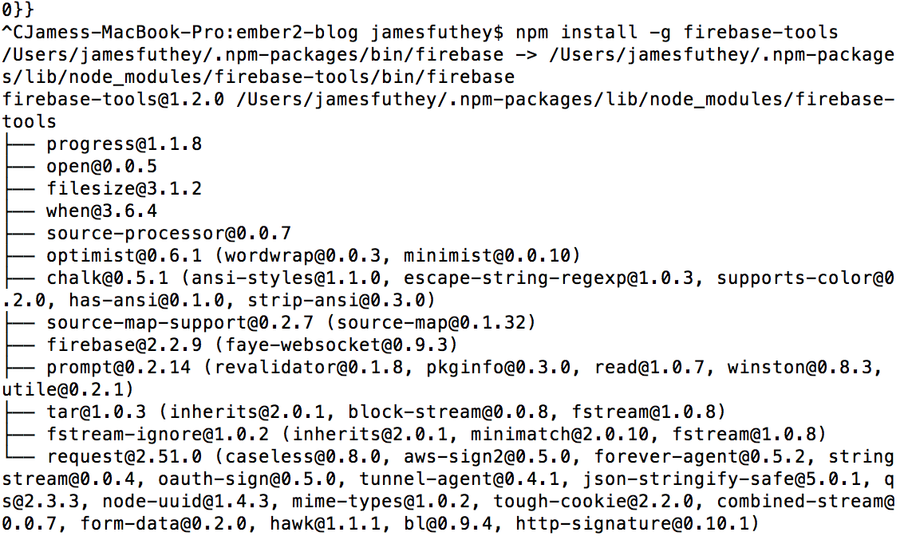

#### **Initializing Firebase**

Now that our application works, we can deploy it to our Firebase hosting (this was configured when you created your firebase).

From inside your application, run the command:

```
firebase init
```

and follow the instructions it gives you. You will need to enter your firebase username and password, select the firebase you wish to deploy to, and the directory you wish to deploy.

When selecting the directory you wish to deploy, you should enter:

```
dist
```

to deploy your compiled ember app (and not your entire source).

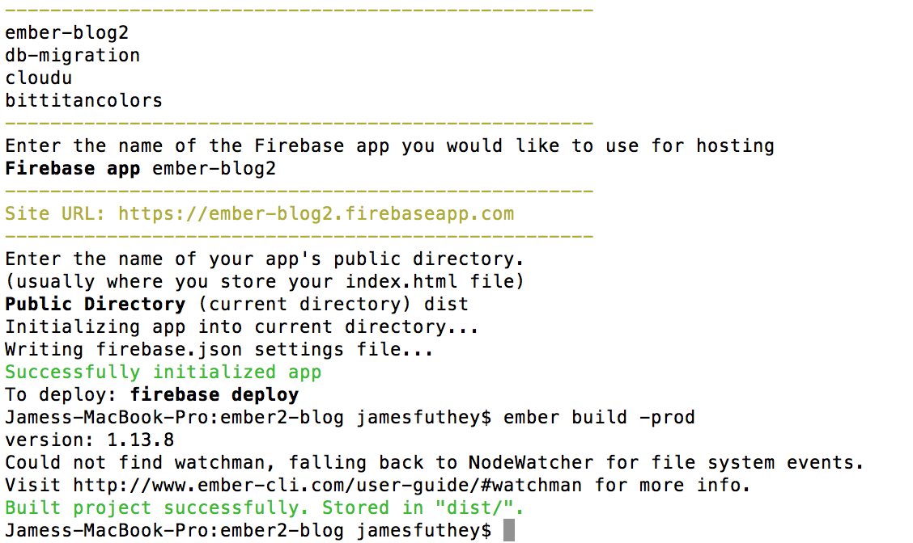

#### **Ember Build**

Next you need to run the

```
ember build -prod
```

command from inside your project.

Up until now, you’ve been running a development version of your ember application. While this was easier to debug than a production build, you will gain a significant performance boost from compiling your project for production.

#### **Update your firebase.json file**

You will have to make a small modification to your **firebase.json** file to enable Ember URLs by adding the following code:

```
"rewrites": [{
  "source": "**",
  "destination": "/index.html"
}]
```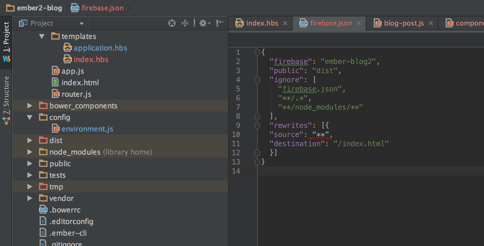

Your final firebase.json file should look something like this:

```
{
 “firebase”: “ember2-blog”,
 “public”: “dist”,
 “ignore”: [
 “firebase.json”,
 “**/.*”,
 “**/node_modules/**”
 ],
 "rewrites": [{
   "source": "**",
   "destination": "/index.html"
 }]
}
```

#### **Deploying to Firebase**

Now, you are ready to deploy to Firebase. All you need to do is type

```
firebase deploy
```

from within your application. Follow the onscreen instructions and you should see your application online in just a few seconds!

```
Preparing to deploy Public Directory…

progress: 100%

Successfully deployed

Site URL: https://ember2-blog.firebaseapp.com, or use firebase open

Hosting Dashboard: https://firebase.com/account then view the hosting section of your app
```

Your site is now live at **https://<your-firebase-name>.firebaseapp.com/**. Note that Firebase apps are only served via **https**. This means that any resources or ajax calls you include in your Firebase application must be served via https as well.

### This is what success looks like!


#### Administering your posts

You can delete or modify existing posts from your Firebase admin panel. For example, if you would like to delete all your posts, click the red **x** beside **posts**.

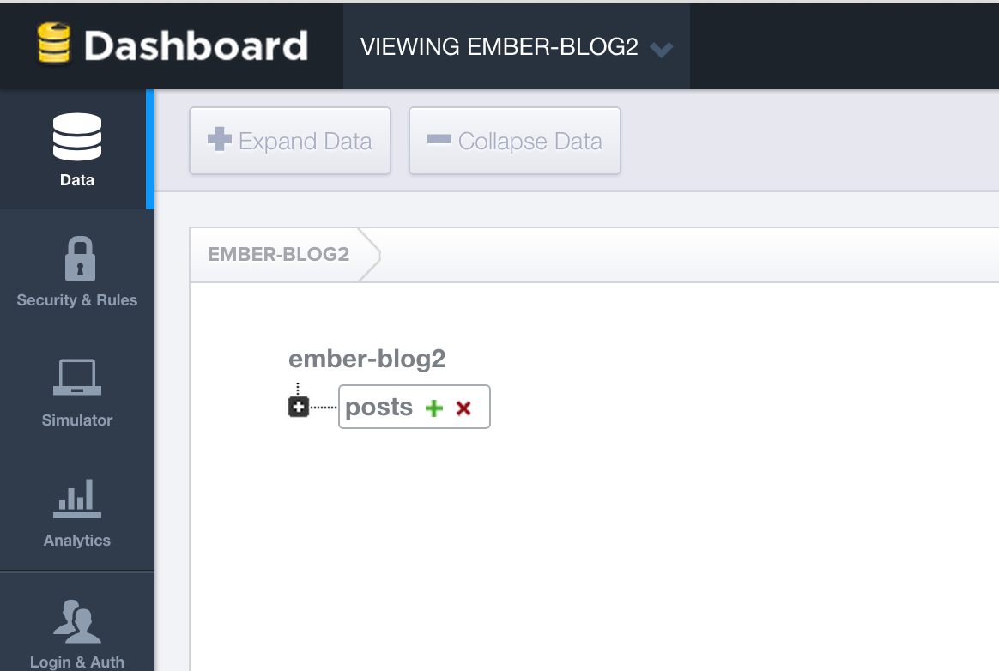

Stick around for part two where we’ll add some nicer styling and make a few upgrades to our app!