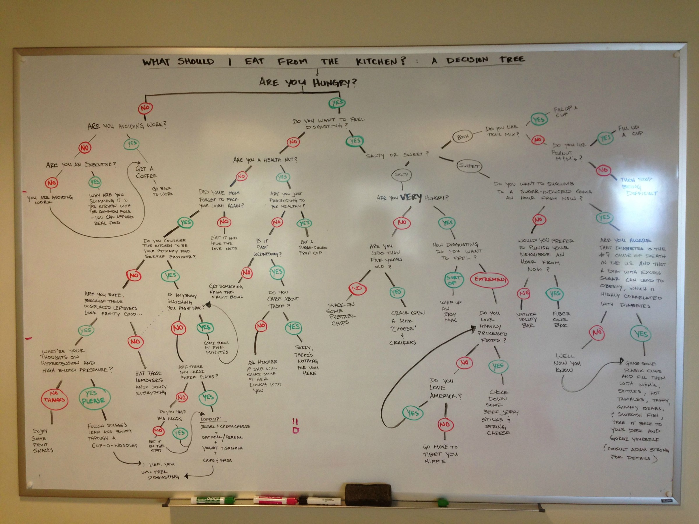
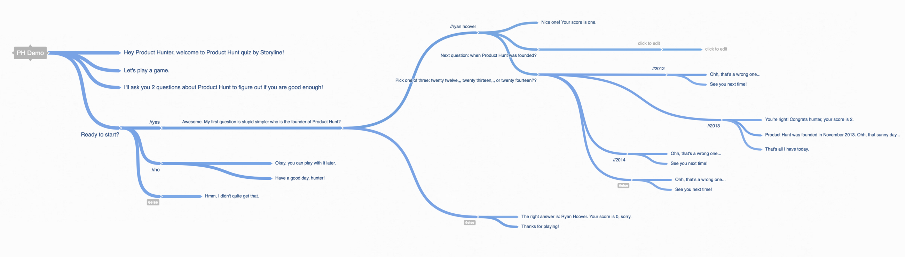

## **What is an Alexa skill?**

**Alexa** is Amazon’s voice service and the brain behind millions of devices like the Amazon Echo, Echo Dot, and Echo Show. **Alexa** provides capabilities, or **skills**, that enable customers to create a more personalized experience.

For the purposes of our design, an Alexa skill is an elaborate [**decision tree**](https://en.wikipedia.org/wiki/Decision_tree).

#### **Benefits of an Alexa Skill**

### Know the weaknesses of Amazon’s Alexa before you begin

Right now, Alexa is more of a _“cutting edge”_ technology than a mature ecosystem. For the time being, the uniqueness of it’s interaction needs to be substantial enough to outweigh some pretty obvious UX concerns.

Amazon’s strategy here hasn’t yet been to create the most sophisticated device. Instead, it relies on a small army of independent developers to create unique and interesting content for consumers.

For those of you familiar with [Nielsen’s heuristics](https://www.nngroup.com/articles/ten-usability-heuristics/), there are four areas in particular where Alexa comes up measurably short.

#### **Help users recognize, diagnose, and recover from errors**

> Error messages should be expressed in plain language (no codes), precisely indicate the problem, and constructively suggest a solution.

The decision tree, arguably, isn’t sophisticated enough to fully solve this problem. However, this is where the built-in **AMAZON.StopIntent** can be used to help alleviate the pain of a mis-understanding.

Always remember to test what happens at each stage of your Skill if a user says **“Alexa, Stop!”**.

The complexity of real-world interaction is often impossible to predict.

#### **User control and freedom**

> Users often choose system functions by mistake and will need a clearly marked “emergency exit” to leave the unwanted state without having to go through an extended dialogue. Support undo and redo.

Since we’re basically building a decision tree, the skill is really limited to what we can anticipate and script in advance of our users. Perhaps in the future, more sophisticated analytics and testing methodologies will be available so that we can learn from our users, and improve our apps over time.

In the mean time, familiarize yourself with the following built-in intents: **AMAZON.StartOverIntent** & **AMAZON.CancelIntent**, and test your app to understand how it will operate when a user utters phrases such as “What was that?” or “Alexa, can you repeat that?”.

#### **Flexibility and efficiency of use**

> Accelerators — unseen by the novice user — may often speed up the interaction for the expert user such that the system can cater to both inexperienced and experienced users. Allow users to tailor frequent actions.

Same point as above. Since our skills are limited to what we can anticipate and script in advance of our users, flexibility isn’t going to happen unless we work hard to make it happen.

Synonyms can add additional flexibility to the system. Consider adding support for some of the following phrases: _Yes, yeah, uh huh, sure, whatever, what? nuh-uh, not really, nope_.

Additionally, consider **_efficiency of use_** as you work through your script to eliminate unnecessary or confusing blocks of text. In most cases, you should aim to make no block of text more than 12 seconds in length without stopping to allow for user interaction.

#### **Help and documentation**

> Even though it is better if the system can be used without documentation, it may be necessary to provide help and documentation. Any such information should be easy to search, focused on the user’s task, list concrete steps to be carried out, and not be too large.

This may not be obvious, but think of a strategy early for handling a user’s use of the built-in **AMAZON.HelpIntent**. This is activated if a user says a “help” keyword at any time during your Skill dialogue.

Also, you can avoid common problems in advance by giving your users clear intent examples when writing this section of your app. A little planning goes a long way.

#### **Common Interactions**

### UX Considerations

#### Quick Reference: UX Best Practices for Amazon Alexa

[**Getting Information from the User**](https://developer.amazon.com/docs/custom-skills/voice-design-best-practices-legacy.html#getting-info)

-   [Make It Clear that the User Needs to Respond](https://developer.amazon.com/docs/custom-skills/voice-design-best-practices-legacy.html#make-it-clear-that-the-user-needs-to-respond)
-   [Don’t Assume Users Know What to Do](https://developer.amazon.com/docs/custom-skills/voice-design-best-practices-legacy.html#dont-assume-users-know-what-to-do)
-   [Clearly Present the Options](https://developer.amazon.com/docs/custom-skills/voice-design-best-practices-legacy.html#clearly-present-the-options)
-   [Keep It Brief](https://developer.amazon.com/docs/custom-skills/voice-design-best-practices-legacy.html#keep-it-brief)
-   [Avoid Overwhelming Users with Too Many Choices](https://developer.amazon.com/docs/custom-skills/voice-design-best-practices-legacy.html#avoid-overwhelming-users-with-too-many-choices)
-   [Offer Help for Complex Skills](https://developer.amazon.com/docs/custom-skills/voice-design-best-practices-legacy.html#offer-help-for-complex-skills)
-   [Ask Only Necessary Questions](https://developer.amazon.com/docs/custom-skills/voice-design-best-practices-legacy.html#ask-only-necessary-questions)
-   [Use Confirmation Selectively](https://developer.amazon.com/docs/custom-skills/voice-design-best-practices-legacy.html#selective-confirmation)
-   [Obtain One Piece of Information at a Time](https://developer.amazon.com/docs/custom-skills/voice-design-best-practices-legacy.html#obtain-one-piece-of-information-at-a-time)
-   [Use the Amazon Alexa App to Enhance Discovery](https://developer.amazon.com/docs/custom-skills/voice-design-best-practices-legacy.html#use-the-amazon-alexa-app-to-enhance-discovery)

[**Presenting Information to the User**](https://developer.amazon.com/docs/custom-skills/voice-design-best-practices-legacy.html#presenting-information-to-the-user)

-   [Make Sure Users Know They are in the Right Place](https://developer.amazon.com/docs/custom-skills/voice-design-best-practices-legacy.html#make-sure-users-know-they-are-in-the-right-place)
-   [Present Information in Consumable Pieces](https://developer.amazon.com/docs/custom-skills/voice-design-best-practices-legacy.html#present-information-in-consumable-pieces)
-   [Write for the Ear, not the Eye](https://developer.amazon.com/docs/custom-skills/voice-design-best-practices-legacy.html#write-for-the-ear-not-the-eye)
-   [Avoid Technical and Legal Jargon](https://developer.amazon.com/docs/custom-skills/voice-design-best-practices-legacy.html#avoid-technical-and-legal-jargon)

[**Using Text-to-Speech Effectively**](https://developer.amazon.com/docs/custom-skills/voice-design-best-practices-legacy.html#using-text-to-speech-effectively)

-   [Use SSML Tags to Modify Prosody](https://developer.amazon.com/docs/custom-skills/voice-design-best-practices-legacy.html#use-ssml-tags-to-modify-prosody)
-   [Clarify Specialized Abbreviations and Symbols](https://developer.amazon.com/docs/custom-skills/voice-design-best-practices-legacy.html#clarify-specialized-abbreviations-and-symbols)
-   [Use SSML to Specify the Right Variants When Necessary](https://developer.amazon.com/docs/custom-skills/voice-design-best-practices-legacy.html#ssml-variants)
-   [Write Text-to-Speech in the Target Language or Using Supported Phonemes](https://developer.amazon.com/docs/custom-skills/voice-design-best-practices-legacy.html#write-text-to-speech-in-the-target-language-or-using-supported-phonemes)
-   [Test the Text-to-Speech Results and Revise as Needed](https://developer.amazon.com/docs/custom-skills/voice-design-best-practices-legacy.html#test-the-text-to-speech-results-and-revise-as-needed)

[**Handling Dialogue Errors**](https://developer.amazon.com/docs/custom-skills/voice-design-best-practices-legacy.html#handling-dialogue-errors)

-   [Use Re-Prompting to Provide Guidance](https://developer.amazon.com/docs/custom-skills/voice-design-best-practices-legacy.html#use-re-prompting-to-provide-guidance)
-   [Offer a Way Out if the User Gets Stuck](https://developer.amazon.com/docs/custom-skills/voice-design-best-practices-legacy.html#offer-a-way-out-if-the-user-gets-stuck)
-   [Don’t Blame the User](https://developer.amazon.com/docs/custom-skills/voice-design-best-practices-legacy.html#dont-blame-the-user)
-   [Expect the Unexpected](https://developer.amazon.com/docs/custom-skills/voice-design-best-practices-legacy.html#expect-the-unexpected)

#### **Ideation**

#### Whiteboard Diagramming

#### Role playing

#### Diagramming

#### Heuristics

1.  No “block of Alexa speech” should exceed 12 seconds.

#### Prototyping

**View the interactive voice design prototype at:** [https://thestoryline.io/preview/6cd3024ce861b26188ce63728c12e01be0227487](https://thestoryline.io/preview/6cd3024ce861b26188ce63728c12e01be0227487)

#### Iteration