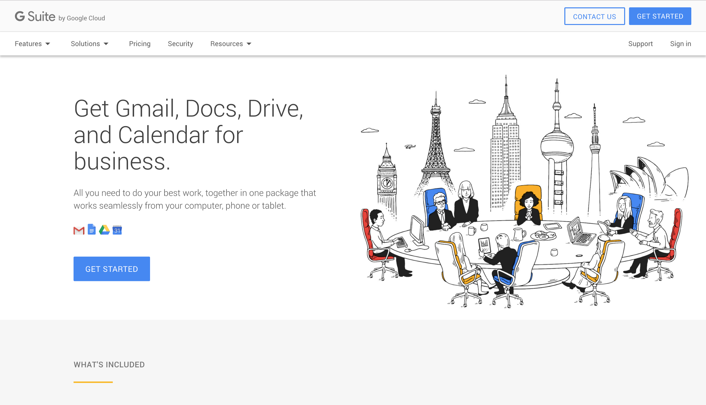
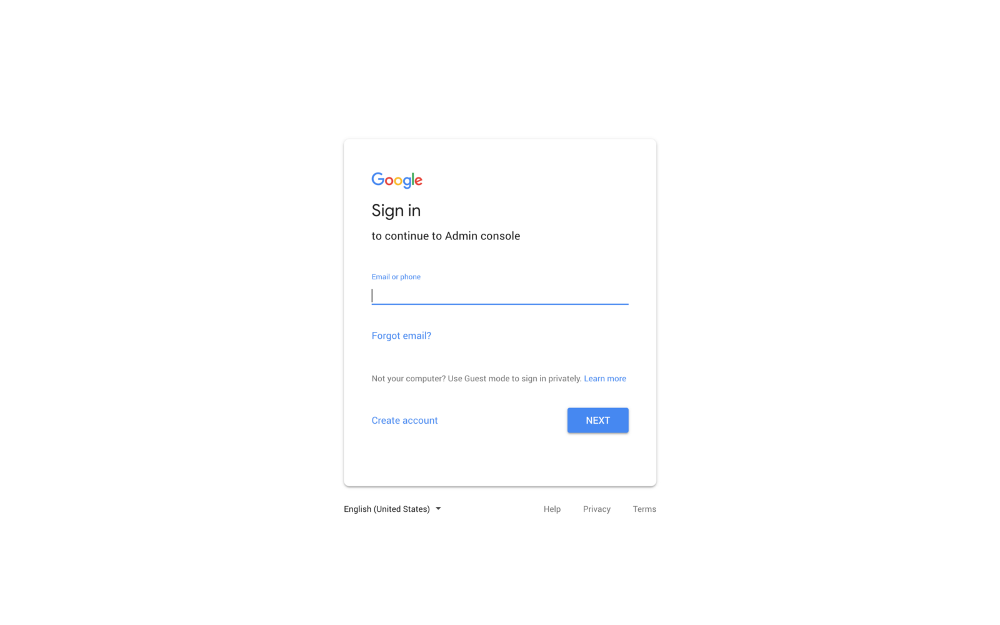
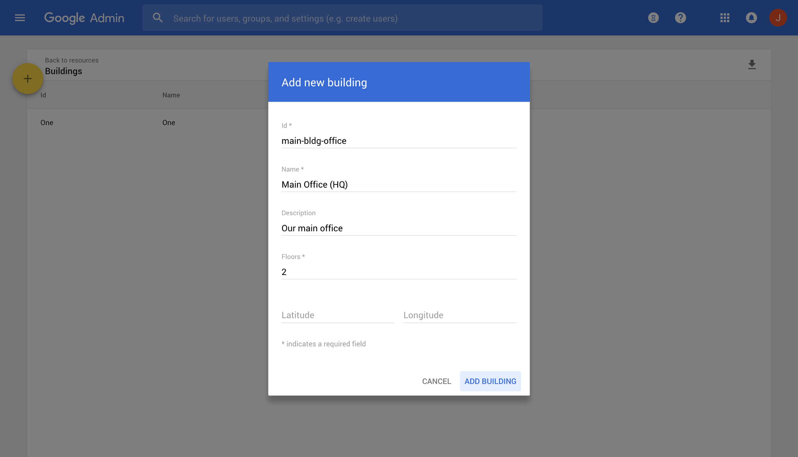
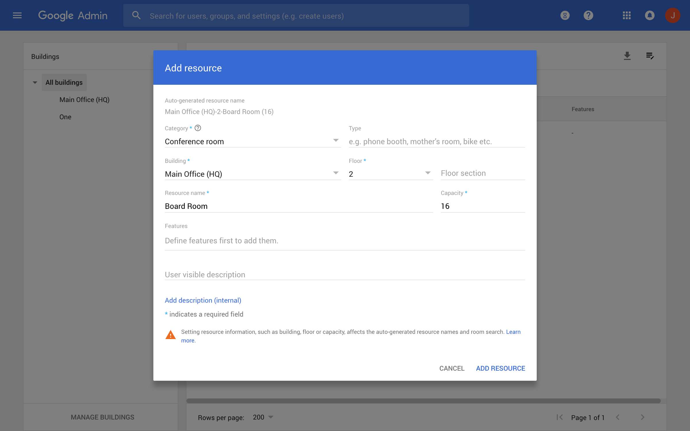
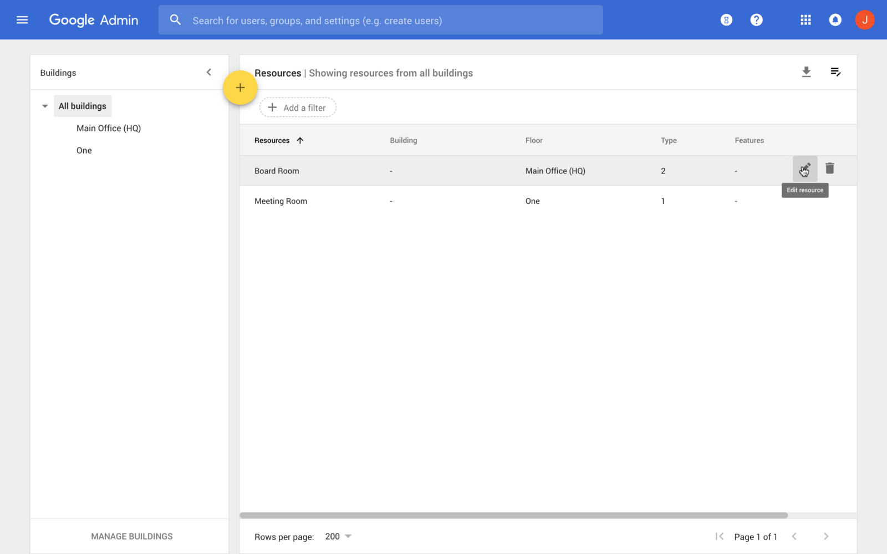
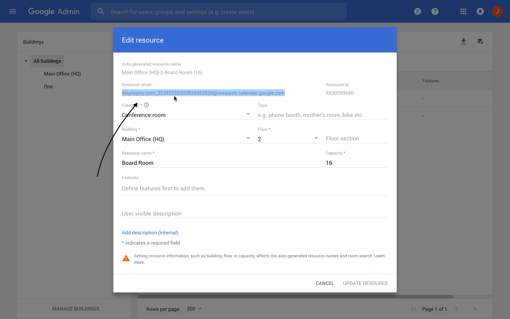

## A Simplified Guide to adding a Meeting Room Resource Calendar and Mailbox to G Suite

Last April, Google released a series of updates to G Suite, including a new system for creating and organizing Meeting Room Resources. While this solves a number of problems, especially for larger organizations, it makes the whole process of setting up a resource mailbox much more complicated.

In this guide, we’ll try to break down that process and reduce it to a simple set of easy-to-follow instructions.

### Getting Started

#### From the Official website:

> In addition to scheduling events in Google Calendar, G Suite users in your organization can book resources that people share. The most common example is a meeting room. Other examples might include projectors, company fleet cars, guest offices, recreation equipment, or any other resource people might schedule a time to use.

#### Admin privileges

> To manage calendar resources, you need an administrator role with calendar resource privileges. The Services Admin [pre-built role](https://support.google.com/a/answer/2405986) has calendar resource privileges. You can use that role or create a custom administrator role. See [Assign administrator roles to a user](https://support.google.com/a/answer/172176) or [Create custom administrator roles](https://support.google.com/a/answer/2406043) for instructions.

---

### Sign into your G Suite Admin Console

Your admin console is located at: [**https://admin.google.com/**](https://admin.google.com/)

### Add a building in the Admin console

In the new version of G Suite, each meeting room resource must belong to a building. So your first task will be to create a building for your organization.

You can do this from the **Buildings Page**: [**https://admin.google.com/u/0/ac/calendarresources/buildings**](https://admin.google.com/u/0/ac/calendarresources/buildings)

**(Apps > G Suite > Calendar > Resources > Manage Buildings > Add)**

### Add a Resource Calendar

Next, you’ll want to add a **Resource Calendar** to your newly-created building.

Head over to [**https://admin.google.com/u/0/ac/calendarresources/resources**](https://admin.google.com/u/0/ac/calendarresources/resources) and click **Add a New Resource**.

**(Apps > G Suite > Calendar > Resources > Add > Add Resources)**

#### Add Resource Dialog:

#### Re-open your Newly-created Resource

**Congratulations!** You’ve probably just successfully added your resource. But where exactly is your **Resource Mailbox Email Address**?

To find this, you’ll need to **re-open your Newly-created Resource Mailbox**

If you’ve left the page, head over to [**https://admin.google.com/u/0/ac/calendarresources/resources**](https://admin.google.com/u/0/ac/calendarresources/resources)

**(Apps > G Suite > Calendar > Resources)**

From there, you’ll be able to select and copy your resource mailbox email address. You’ll need this to configure your Meeting Room display.

### That’s it! You’ve just set up your first Resource in G Suite.

---

#### If you’re stuck, chat with us on [Meeting Room 365](https://meetingroom365.com/), and we can help you out with display setup, configuration, and provisioning.

#### References

[**Manage Calendar resources — G Suite Administrator Help**  
_If you have the legacy free edition of G Suite, upgrade to G Suite Basic to get this feature. In addition to scheduling…_support.google.com](https://support.google.com/a/answer/1686462?hl=en "https://support.google.com/a/answer/1686462?hl=en")

---

### Thanks for reading!

Please Recommend and Share if you found this article useful!