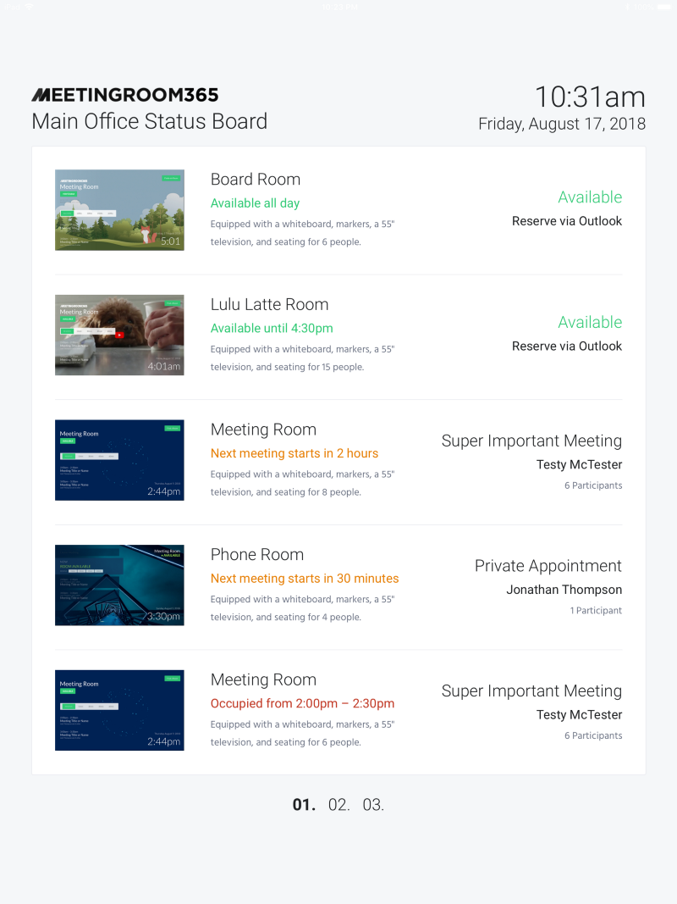

  

Yes, we do have a Status Board (Rollup) display for All Meeting Room 365 users.

​

​  
It allows you to mount a display which helps your employees and guests find available rooms, or rooms near their local area.

Office 365 account can be setup with just a few clicks through Delegated Access (service accounts). We’ve put together a quick guide for how to designate a Service User in the Office 365 Admin Portal.  
[https://medium.com/meeting-room-365/adding-account-delegates-exchange-delegates-to-an-office-365-resource-mailbox-a90b93678da2](https://medium.com/meeting-room-365/adding-account-delegates-exchange-delegates-to-an-office-365-resource-mailbox-a90b93678da2)

In order to set up Status Board Display you simply need to add a display to [Other Displays](https://manage.meetingroom365.com/#/otherDisplays). 

Once that is done, please head on to your Display Tablet and use Display Key: **statusboard** for the first Display Key Prompt. It will redirect you to a login screen and once you have logged in, you’ll get a second Display Key prompt, for which you will be using the Display Key shown under Other Displays in the Admin Portal.