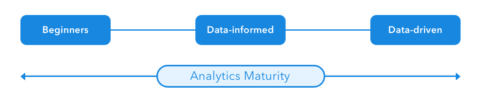

## Findings from research into how companies become data-driven.

In 2017, during the process of exiting from a failed business concept @ an analytics company in Seattle, and having spent the last couple of years thinking about analytics, I brainstormed a concept with a few industry experts, and set out to build a concept. That concept would be named **Gumshoe Analytics**.

It stemmed from several observations, the first being the **Analytics Maturity Model** I had developed, in the process of encountering dozens of startups and large companies adopting new data solutions. My thinking is as follows:

1.  **Analytics Maturity is a spectrum.** Companies (hopefully) progress over time from **“What KPIs should we measure?”** to “Data informed”, and finally **“Data-driven”**. The expectation is that they move from decision-making by **“Executive-consensus”** to decisions made by leaders who garner support to their ideas by backing it up with relevant **data, metrics, research** and **testing**.
2.  **Companies can’t make the switch overnight.** Even if they’re fully onboard.  Internal resistance and effective leadership (in most companies) will seek to preserve the status-quo in many areas, including internal decision-making processes. This isn’t a bad thing, but a reality to be accepted.
3.  **As companies progress toward full adoption, the size and importance of data teams will grow.** Budgets increase. Headcount increases. Typically, this culminates in a VP or Director level hire.

This corresponds to a fairly normalized progression in tooling / process as well.

1.  Startling as it may be, only about **Half of Early-stage Startups** (first 12 months of operation) implement any kind of analytics. I concluded this from research undertaken by several reliable web-tool tracking datasets. The first tool adopted by most tech startups is **Google Analytics**. This is produced by a slight bias toward North American markets, European and Asian trends vary.
2.  Typically, if you encounter a company at this stage, their biggest problem is **they don’t know what KPIs to track**. Most companies at this stage do not have an experienced analyst or data scientist, and are tracking metrics they heard were important from an external source. They also lack a **North-star metric**, or have picked one inadequately-tailored to their business needs (revenue, raw user signups, etc.)
3.  Next, companies typically adopt **Google Analytics**. The company may also hire an SEO or Marketing analyst (or someone with this expertise), almost completely by accident. Big wins tend to be limited to marketing analytics maturity, and not product / behavioral analytics. Most companies emerge from this stage with a loose grasp of how effective various types of marketing spend are within their company (**acquisition**), but no precise attribution model. The best companies emerge with a firm grasp on retention as well (although this is rare).
4.  At this point someone on the executive team might ask for more complex dashboards or reporting. Don’t spend too much effort on this. Your real challenge is **numeric literacy**. **Google Analytics** and **Google Data Studio** will get you all the dashboards and reporting you need. **Don’t spend thousands of dollars putting charts on TVs, or buying dashboard or visualization software.** You’ll struggle to get anyone to use the data anyway. Most people can’t read charts, or at least don’t read them the same way that an analyst would.
5.  Next, many companies adopt a mass-market tool such as **Mixpanel** (most popular), or **Heap Analytics**. The split usually comes down to the technical ability and experience of the team advocating for the solution. More technical and more experienced teams tend to choose Mixpanel. Smaller, less-technical or marketing / PM-led teams tend to choose Heap. This may change as their feature set and pricing becomes less differentiated. These solutions, for what they provide, are typically underpriced or free at lower utilization tiers, and extremely overpriced at scale.
6.  Marketing and Product teams who really excel **adopt additional tools** to try to drive more value from data. This may include Heatmaps & Session Recordings. What they really need is an analyst consultant or hire.
7.  Marketing teams at this point should be A/B testing. Often with a self-serve tool like **Optimizely** or **VWO**. Neither is better then the other, so be a cheapskate. If a Product Team is doing really well, they start A/B Testing as well. If you’re building mobile apps, Optimizely might be your best bet (regardless of price).
8.  Typically, the driving force for progression in analytics maturity at this point tends to be a **shift from acquisition to retention**. Small companies, in general, see the most success from their limited efforts when focusing on acquisition. Most companies under 1,000 employees have very messy **acquisition channels**, poor copy / strategy, and little specificity as to who their **ideal market segment** is.
9.  Once acquisition is working somewhat efficiently, larger companies with more mature products tend to see more success shifting their focus to **retention**. This typically involves the evolution from a “support is a cost-center” mentality to “support is our last line of defense against customer attrition”. Companies hire a **VP of Customer Success** and build out **CX teams** at this stage. Customer Support is no longer a crap job that no one wants to do.
10.  Companies are now beginning to realize that the mechanics of retention requires more complex analysis to understand than acquisition. There are no tools that do the heavy lifting for you. You need real analysts who understand statistics & data integrity. You can no longer get by on the limited data views that come with a product like **Mixpanel**. This caliber of analyst doesn’t work in **Microsoft Excel**.  They work in **SQL, R,** or **Python**.
11.  When companies finally begin to bring in these new people, they begin to ask for new tools, and displace the usage of previous tools. Eventually, the new goal for the company becomes **building a centralized data warehouse**. On a basic level, this means all of your data from various tools moves through an **ETL pipeline** so that it can be **normalized** and stored in a data warehouse (right now that’s typically **Redshift** on AWS).
12.  When you’re building a data warehouse, you might happen upon a wonderful tool called **Segment**. This tool works miracles for marketing teams when they’re experimenting and trying out new tools. It will even bring your data into a Redshift instance that your development or infrastructure team can manage for you. One word of caution: **Segment isn’t going to help you with ETL, Data Quality, or Data Normalization.** Take a look at **Fivetran** or **Stitch Data**.
13.  Nobody has **“Big Data” problems** at this scale, although the trend is that most companies think they do. **Big Data** is typically defined as the generation of hundreds of terabytes of logs per year, or more. Most SaaS companies & mobile app companies, once their data is denormalized, tend to have gigabytes of data for several millions of users. **Your data is going to be just fine living on Redshift**, which should cost a few hundred dollars per month, or less**.**
14.  **You don’t need any kind of expensive tool on top of this.** Tableau may cost you **$x,xxx per year**. Unless you’re operating at the scale of the Fortune 100, or in the real world (think **Uber**), you don’t have complex data visualization problems. Your analysts & data scientists are probably going to use their favorite free Python library to make simple charts. You can use **Google Data Studio** or something like **Mode Analytics** to share web-based charts & create dashboards.
15.  Your next goal is to **move from Data-informed to Data-driven**. What does this mean? In a nutshell, Data-informed companies track the right metrics. **VPs are compensated (bonuses) on performance** (think revenue, retention, and growth). They use data to maximize their bonuses (and this is good for everybody). But they still **use their gut** (and **executive consensus**) to make decisions. As companies become more reliant on data, they commission research projects (Usability Research, Market Research, & Data Analysis) to figure out what to do next, and **use Data to push initiatives forward** (and not just their influence within the organization).
16.  Until you’re data-driven, you’re still not ready to do anything predictive, whether it uses Machine Learning, Deep Learning, or whatever the guys from Uber and AirBnb are bragging about (It’s always some kind of recurrent neural-network these days, or TensorFlow). You don’t have the scale to succeed here. Do, however, let your analysts and data scientists experiment with new techniques. They’re likely to be incorporating regression or random forests (perhaps Sci-kit learn) for simpler data models (perfect when your scale is smaller).

I contrasted with my time working in the US **Intelligence Community**.

Contrast the difference between the words **Intelligence Community** and **Analytics Team** or **Data-science Team**. The biggest difference isn’t just a more mature process (that has evolved over the past 75 years) and data-driven decision-making. The difference is scale.

Intelligence (vs. Data Science or Analytics) is a time-intensive process, and requires stratification in your organization to achieve. One person doesn’t create an intelligence products. A single team doesn’t create intelligence products. Teams of analysts build intelligence products on the basis of a thriving community of researchers, analysts, and intelligence professionals.

This requires the scale of a Google, Apple, Microsoft, or Amazon (although none are practicing Intelligence as an organization).

I imagine this is probably what the far right end of the “Analytics Maturity” spectrum looks like, so that I can understand the gap in a greater context.

This leads me to believe that very few organizations have made significant progress toward becoming data-driven. Don’t fret if you’re still at the beginning. Keep moving, and pushing your organization to do more with Analytics & data science.