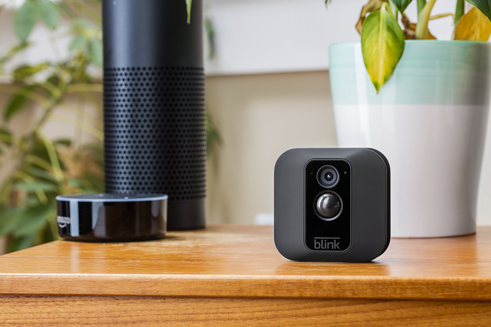
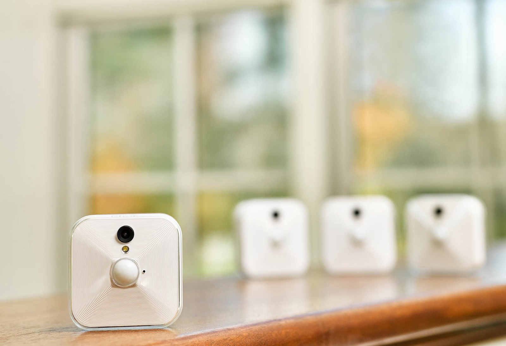
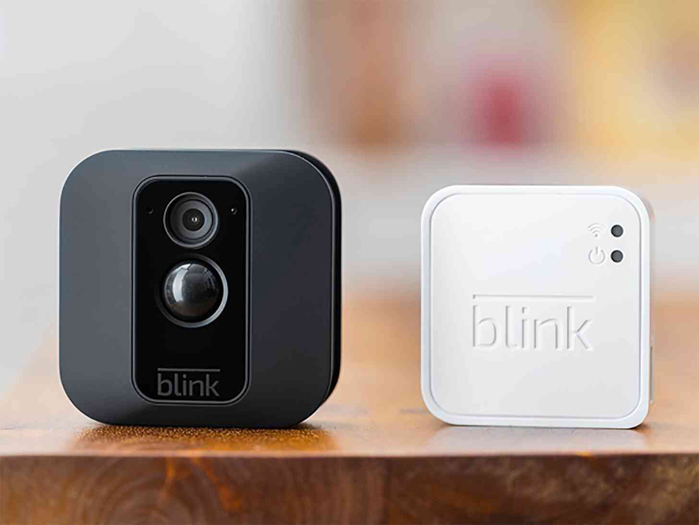
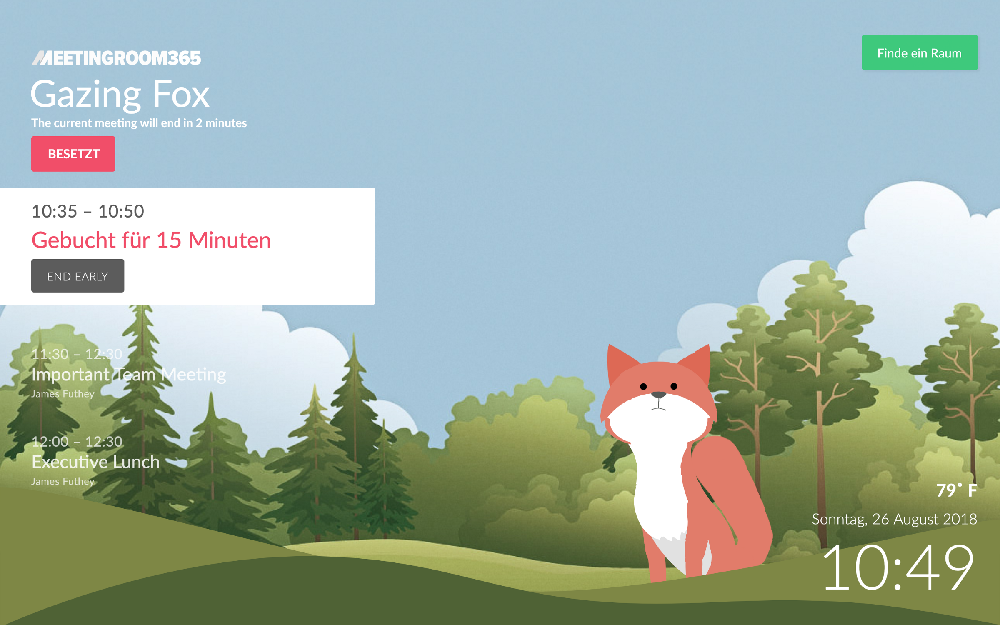

## Coming soon to Meeting Room 365: An Integration between Meeting Room Displays and Blink Camera Equipment, for real-time presence detection, and more!

I wanted to share a new feature our team has been working on. We’re using Blink Cameras from Amazon to bring automation to the Meeting Room experience.

We were impressed with the hardware when we first tested it this past April. And since, we’ve been working on ways to integrate real-time images, video, sensor input, and presence detection into the Meeting Room 365 Application.

### Real-time Presence Detection

#### Force Check-ins, without the hassle

Want to enable a forced-check-in policy in your organization, and prevent meetings from cluttering up your calendars, when they never actually occur?

This technique is incredibly effective. But for your users, equally annoying. Mistakenly loosing your meeting room can be a frustrating experience.

Luckily, with Automatic check-ins, your users will never forget to check in to their meeting room. As long as they make it to their meetings on time, they won’t even realize they’re being forced to check in!

#### End Meetings Early, Every time

Ensure your Outlook calendars accurately reflect the current state of your room by enabling Presence Detection and automatically ending meetings early, when all of your participants have left the room.

#### Impromptu Reservations without a touch

If a room is available, presence detection gives you the ability to let users book a room just by walking into it. This is quickly reflected on Outlook calendars throughout the office. And when they leave, the room will revert back to being available in Outlook.

### See it in action!

Our example room below is currently being pressure-tested with **Presence Detection features** enabled. Please excuse our localization if you’re not a German speaker (we test multiple features concurrently).

As you can see, an instant reservation was created for this room, because a user was detected inside by the Blink camera, using a combination of Motion Detection and video capture.

Additionally, the check-in status was updated automatically as soon as the room was reserved, and the status of the room is now reflected accurately on Outlook calendars across the organization.

After the room remains unoccupied for 5 minutes, the instant reservation below will be cancelled automatically, updating the room’s Outlook status across the organization.

#### Interested in testing out this feature? Send me a message and let me know! You can reach me from the Meeting Room 365 Admin Portal.