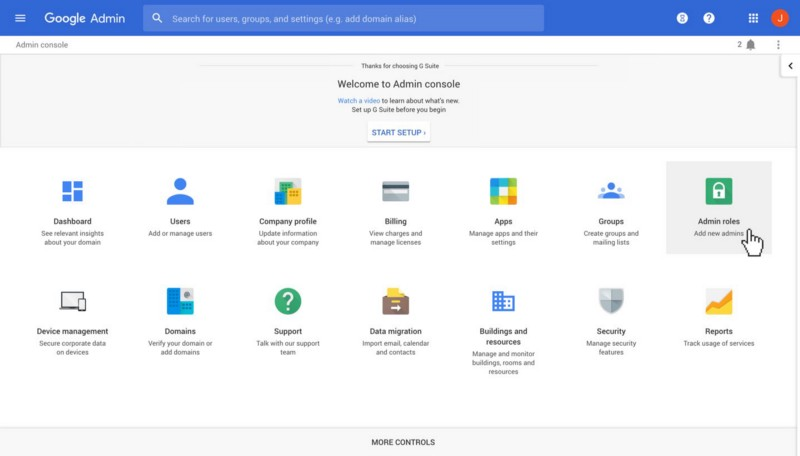
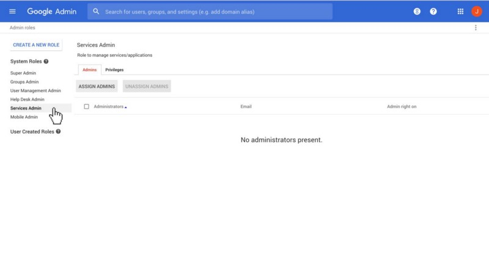
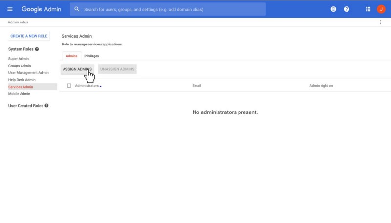
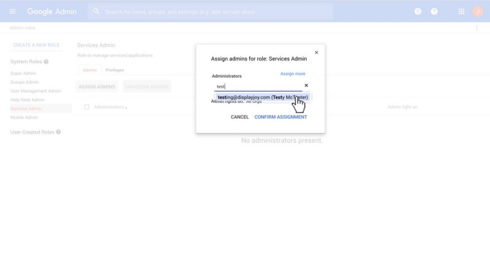
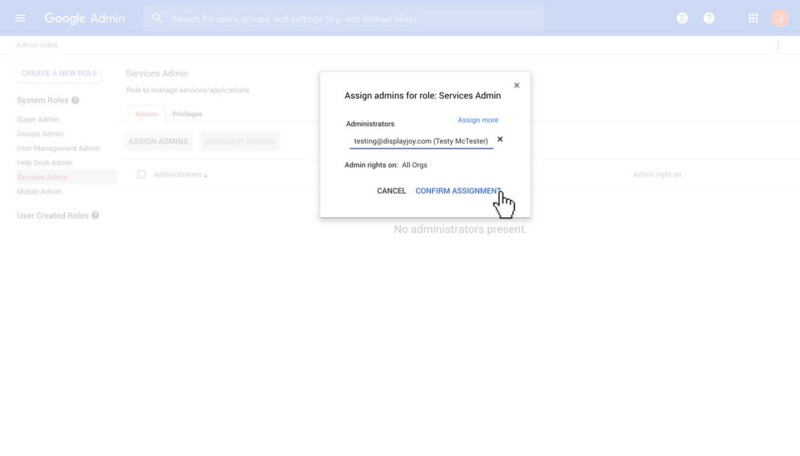
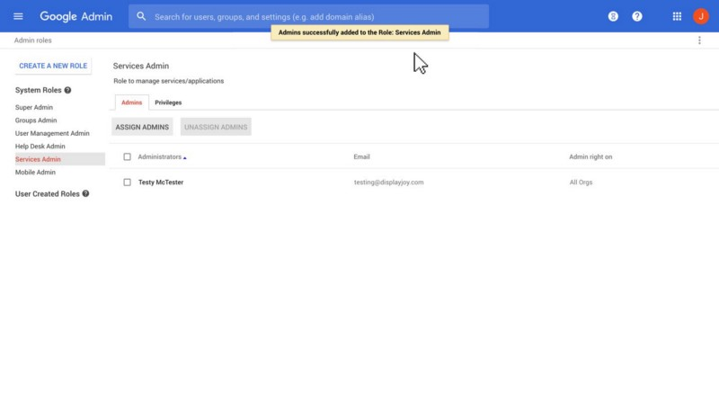
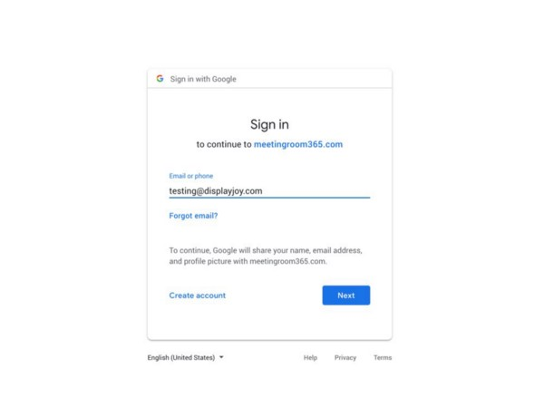
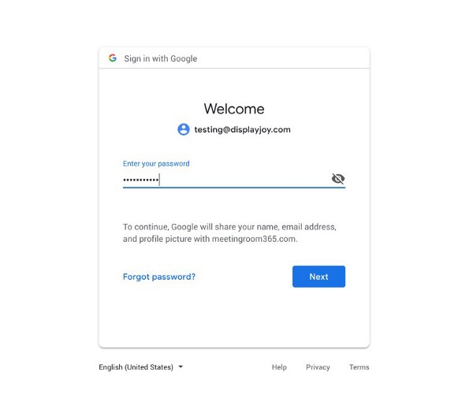
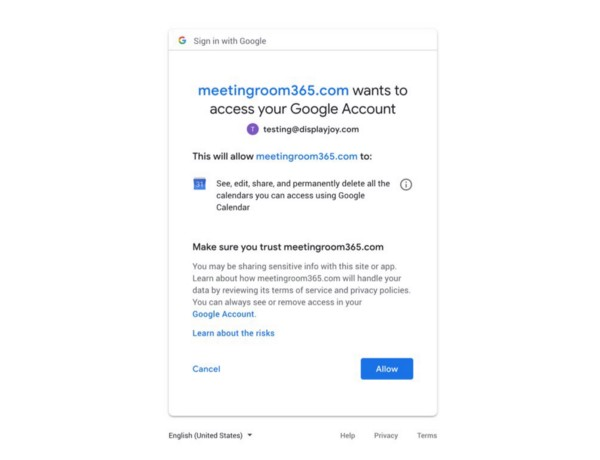
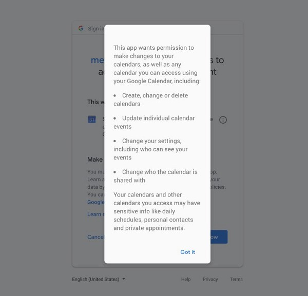

  

### Step 1: Sign into the G Suite Admin Console

[**Sign in - Google Accounts**  
_Edit description_admin.google.com](https://admin.google.com/ "https://admin.google.com/")

  

Select **Admin Roles**

Select **Services Admin**

  

Click **Assign Admins**

Enter your **Service Account User** (by email address or name)

  

Click **Confirm Assignments**

  

**Success!** Your user now has limited (but sufficient) admin privileges to be used as a service account!

  

#### Sign into the Meeting Room 365 App

You can now sign into the Meeting Room 365 App on your tablet, or via

[https://app.meetingroom365.com/intro](https://app.meetingroom365.com/intro)

  

If your resource mailboxes are not listed, no worries. You can enter a display key (found in the admin portal) instead.