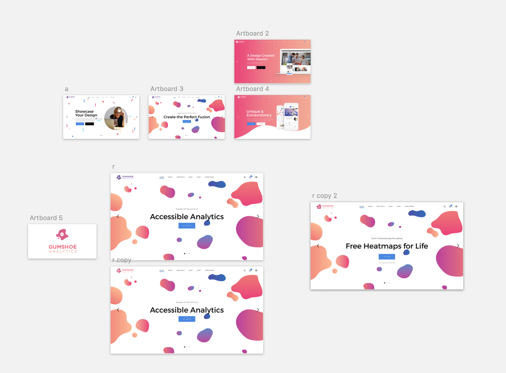

## Keeping it simple, cheap, and to the point

### The company

If you haven’t been following along in this series, the company is [**Gumshoe Analytics**](https://medium.com/r/?url=http%3A%2F%2Fwww.gumshoeanalytics.com%2F)**.** We’re building a suite of analytics tools, accessible from inside your website or single-page app, to help everyone on your team get a sense of what’s going on (not just your analysts).

Our MVP product is **Heatmaps**. No signup, no dashboards, and nonsense. Just grab the code, plug it into your site, and come back later to see how people interact with it.

### Why Heatmaps?

Heatmaps may not be the most reliable analysis technique, but they are dead simple to interpret without any formal training, and they’re visually appealing to our demographic _(non-analysts)_.

They also lend credibility to anyone who invests time to share their findings with others. And, my bet is, if you prove a point or win an argument at work because you spent time looking at the analytics data (heatmaps), you’re going to be a customer for life.

### Planning the website

Before building the website, we looked through hundreds of templates we thought might be compatible with the current direction of our branding project. When we found a few we liked, we mocked up how the homepage might look, and got feedback.

### Building the website

Next, I installed the Wordpress theme we had purchased, locked myself in a room for 3 hours, and churned out a very minimal concept.

I got feedback from our team, and after only one round of revisions, published the wordpress website.

### Deployment

Next, I ripped the source code & files using `wget`, and manually reconstructed it as a static website, which could be served cheaply from a storage bucket (such as cloudfront or cloudfiles), with a CDN in front of that (cloudflare). This would bring the cost of getting a large amount of traffic (say, from a ProductHunt post?) down to pennies per day.

### Feedback

That’s about it! Not much depth or complexity for an ‘overnight’ concept, but the result is very polished, and on-brand. Let us know what you think!

---

Thanks for taking the time to check this out! Let us know what you think!

**If you’re new to our publication, welcome!**  A month ago, five of us set out to build a startup. We’re documenting & sharing the process, so you can follow along as we build & launch our company, and present it to the world in Vienna this June.