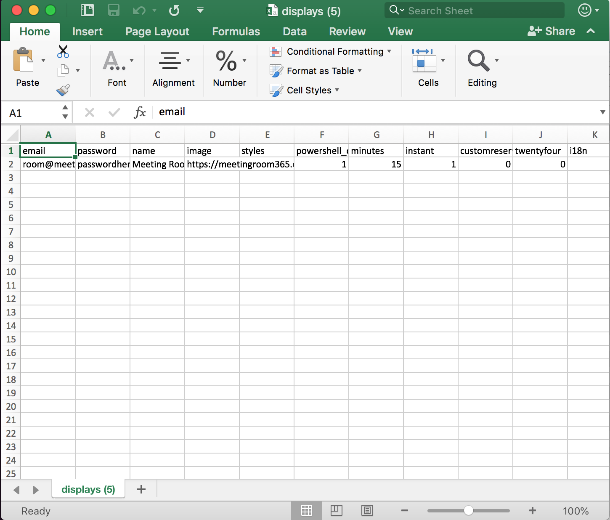
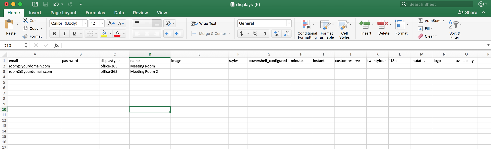
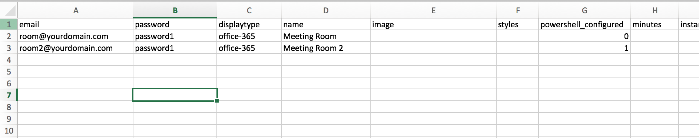

## Use the new .CSV format to upload or update your Meeting Room 365 displays in bulk



### The Problem

Many tools make it easy to perform a task once or twice. And, I believe Meeting Room 365 handles smaller tenants relatively well.

But, let’s say you have a dozen or more displays to add and maintain? What do you do then?

For many tools, the answer is a bulk upload / bulk update tool. Ours is modeled after a few tools we’ve worked on in the past, which handle this via **CSV**.

### Why use the .CSV Template?

With the .CSV template, you can maintain and update your displays outside of the Meeting Room 365 app, and email us your changes, which we will update at your convenience.

You can use this to queue display creation, run PowerShell updates, change / sync i18n localization, update styles, and more. Anything you can do in the Meeting Room 365 app can be automated via CSV import.

Our CSV template is designed to be both backwards-compatible with our Legacy display application, and forwards-compatible with new versions of our software, such as the current public beta. It is also designed to be forward-looking, so that as we add new display types, and tenants, the format will not change (although new columns may be added in the future).

### How to use the CSV Template

Each .CSV file is reviewed by a real person as well as the resulting logs. So, if you have any questions, feel free to take a stab at the .CSV template and send us an email with any questions you might have.

#### How it works

We iterate through each row of your .CSV file, and search for an existing display which uses the email address specified in your first field, `email`.

If that display exists, we update it with the values specified in your CSV row. If no value is specified for a specific setting, your previous value will not be changed.

If no display exists at the email specified, we will create it, with the configuration specified in your CSV.

#### Minimum Configuration

The minimum fields required are **email**, **displaytype**, and **name**.

1.  **email** is the email address of your Resource Mailbox
2.  **displaytype** lets our system know which type of display you are provisioning. Currently, the default value is **office-365**. You may also specify **g-suite**, or **exchange**.
3.  **name** is the display name for your display. It appears in the upper-right corner of your display (unless you hide it with a display style).



#### Legacy Accounts (Office 365 & Exchange)

If you wish to use the .CSV template to provision resources in a **legacy Meeting Room 365 account**, for **Office 365** or **Exchange**, you must also supply a **password**.

1.  **password** is the Office 365 or Exchange password for your **Resource Mailbox**

This must also be supplied if you want us to update your PowerShell configuration (next section).

### PowerShell configuration

You can also have our systems automatically run PowerShell update scripts on your account, by specifying a desired PowerShell script code.

#### How it Works

In Meeting Room 365, each account with a valid Resource Email and Password, of the type Office 365 display, can be queued to run a PowerShell script automatically, to update your resource mailbox behavior.

In Office 365, a Resource mailbox’s calendar shows the organizer’s name instead of the subject by default. However, most users wish to see meeting subjects appear on their displays.

To fix this, we run a very simple PowerShell command on each new Resource Mailbox added to Meeting Room 365, which performs the following:

```
-DeleteSubject $False
-AddOrganizerToSubject = $false
```

More details: [https://support.microsoft.com/en-us/help/2842288/resource-mailbox-s-calendar-shows-the-organizer-s-name-instead-of-the](https://support.microsoft.com/en-us/help/2842288/resource-mailbox-s-calendar-shows-the-organizer-s-name-instead-of-the)

#### Applying this script to your displays

If you want this to occur, all you need to do is supply a valid email and password for your resource mailbox, and we will attempt this (once) for your account.

1.  **powershell\_configured** is a status code, which directs our system to run a PowerShell script to finish account provisioning (optional)

#### Opting-out

If you would like to opt-out, simply set **powershell\_configured** to **1**. This will direct our system to skip PowerShell configuration.

#### Retrying the PowerShell script

If you are updating a display, and wish to explicitly direct our system to attempt to run the PowerShell script again (maybe it failed, or your password was incorrect the first time it ran), set **powershell\_configured** to **0**.



### Optional Fields

Here is a complete list of optional columns, which do not need to exist in the CSV template. You can remove them, or use them (as needed). They can appear in any order in the .CSV template.

1.  **image** is the URL (beginning with http or https) of your desired background iamge
2.  **styles** contains the CSS style overrides you wish to apply to your display
3.  **minutes** is the number of minutes for the instant reserve option. The default value is **15** minutes. Your value should just be a number. Pressing instant reserve (with **customreserve** disabled) will result in a reservation for the next **N** minutes.
4.  **instant** is a boolean value, either **true** or **false**. If true, anyone who walks up to your display will be able to reserve it instantly for a few minutes. If false, this will not be enabled.
5.  **customreserve** is a boolean value, either **true** or **false**. If true, it adds more options to the **instantreserve** option, allowing users to book the room for 15, 30, 45, or 60 minutes.
6.  **twentyfour** is a boolean value, either **true** or **false**. If enabled, your display will utilize the 24-hour (standard international) time format.
7.  **i18n** corresponds exactly to the i18n field in the Meeting Room 365 admin panel, expecting the contents of an i18n file (JSON object).
8.  **intdates** is a boolean value, either **true** or **false**. If enabled, your display will utilize the most common international date format (1 July 2018 vs. July 1 2018).
9.  **logo**, supported on some platforms, allows you to easily add your logo to a display, in the upper-right corner. This field expects a **URL**, beginning with **http://** or **https://**.

### Questions?

#### Please reach out and let us know, so we can expand this article.