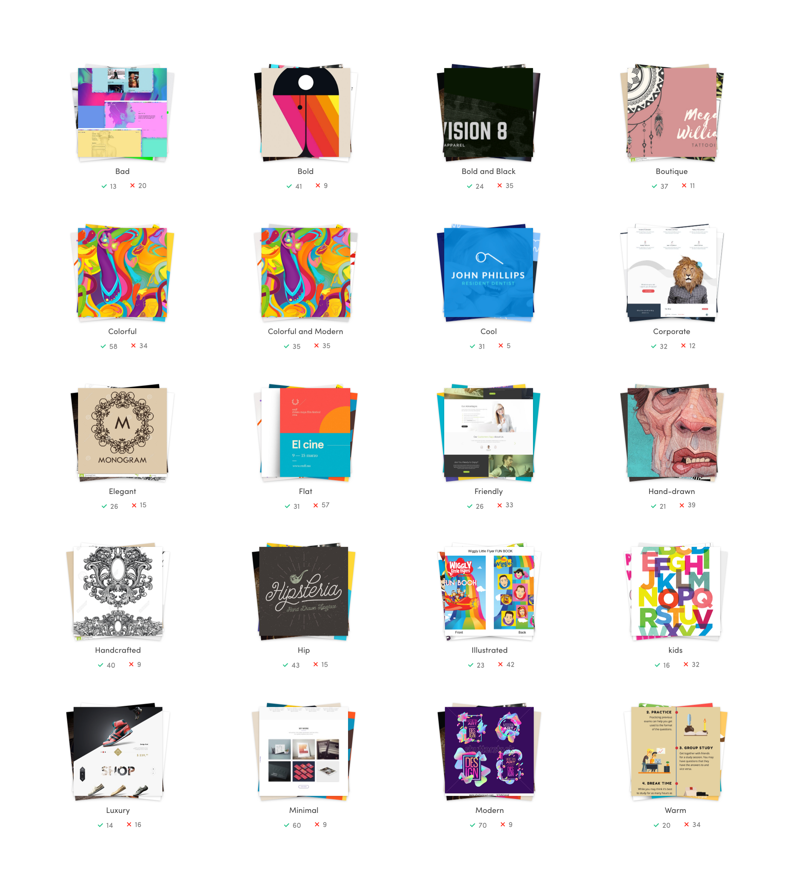
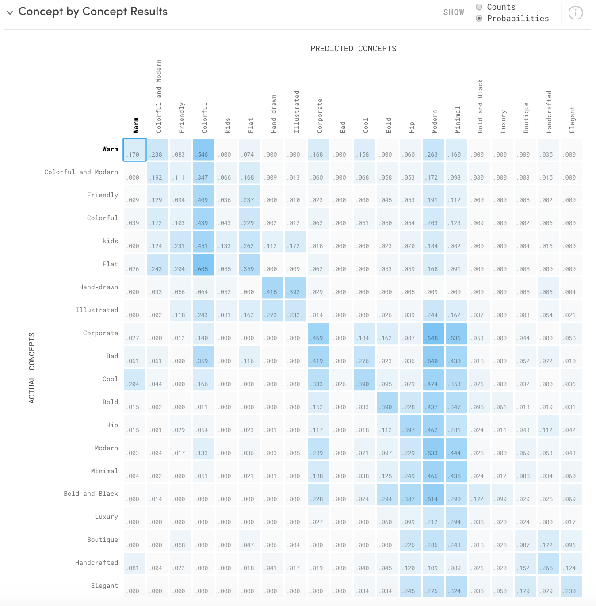
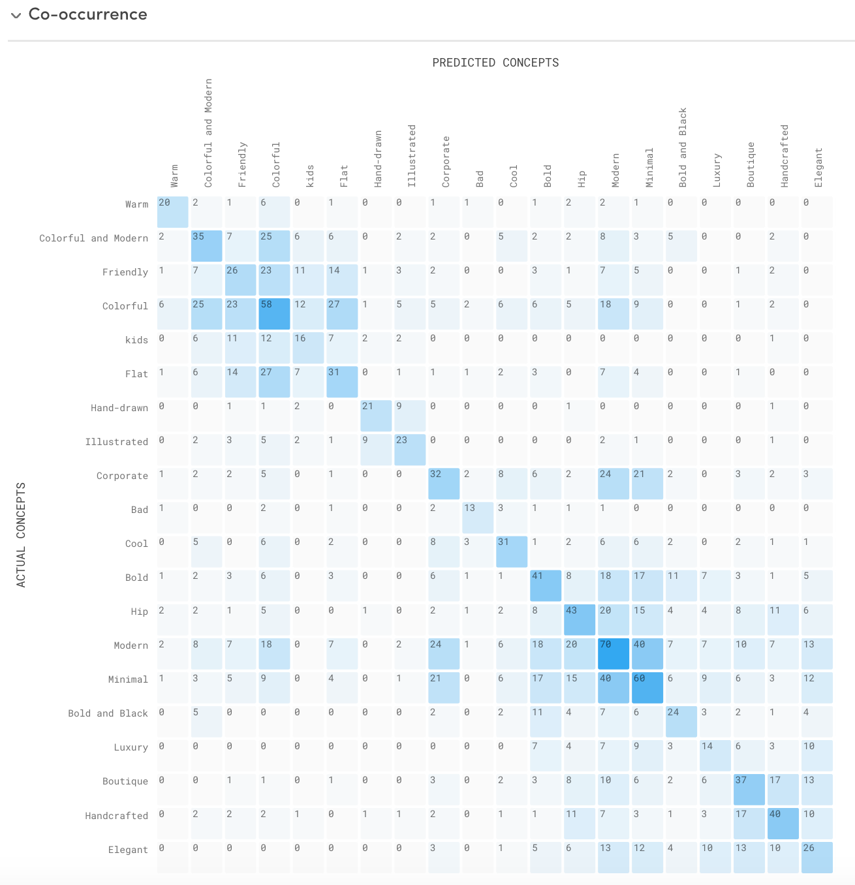
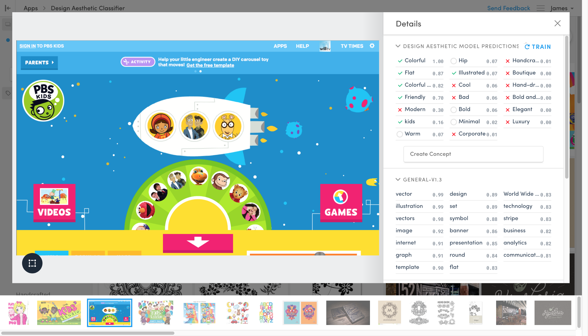
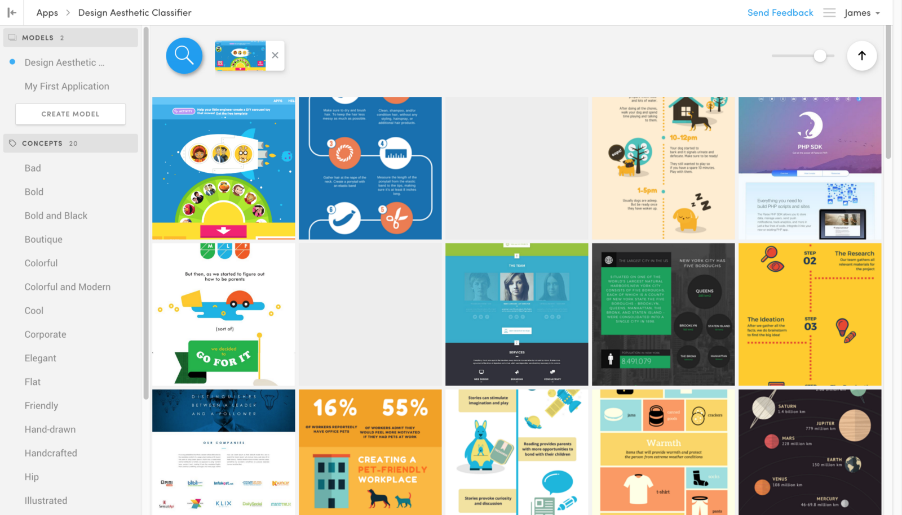
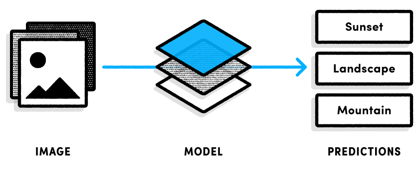
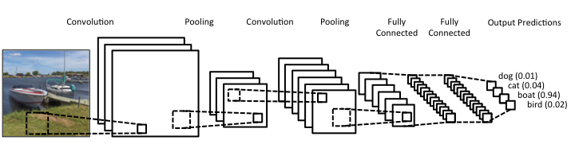
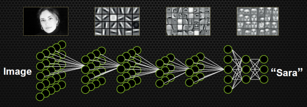
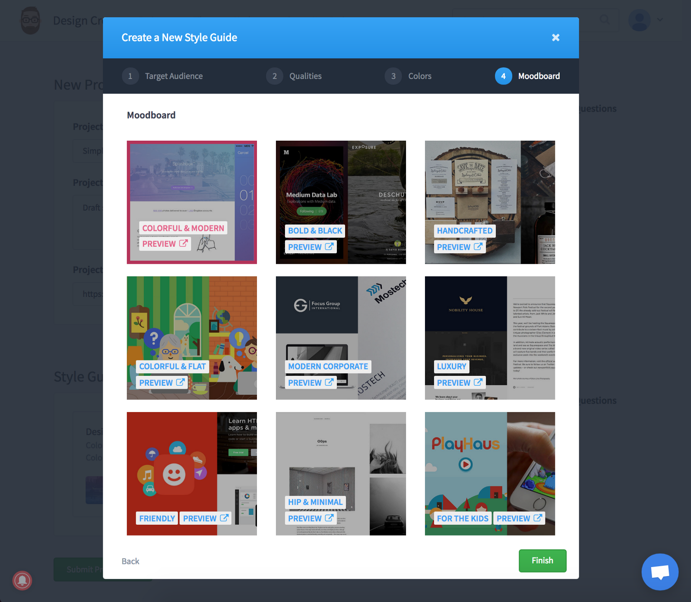
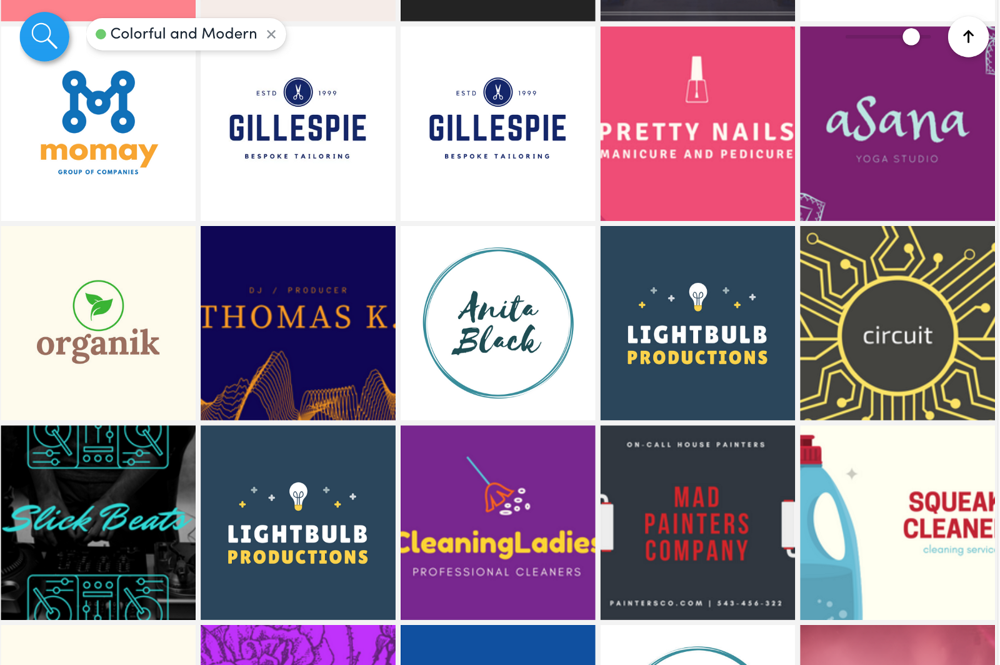

## Saving time for designers by making client communication and project prep effortless

### \[In-progress case study\]

Unfinished, in-progress case study, for your reading pleasure. Updates to come!

---

Previously, I came up with the concept of [**Design Aesthetic Classification**](https://medium.com/@jamesfuthey/recreating-facemash-to-kickoff-my-company-s-branding-project-7a88005e7aca) as a way to bridge a communication gap between Designers and Everyone Else.

As designers, we develop a shared set of vocabulary to describe visual aesthetics. Some are easy: Illustrations can be hand-drawn, flat, iconic; rough, abstract, or realistic. Some are more difficult for outsiders: Modern? Clean? Friendly? Outside of the design community, these terms are meaningless. Yet, they have a lot of industry consensus, and they result in a surprisingly-small dimensional graph of qualities which can effectively describe a target aesthetic for a design project.

The goal of this classifier is to bridge the communication gap between stakeholders and designers, and help the average person communicate instantly to their design partner the exact visual aesthetic they feel best represents their brand or project.

Typically, it takes several rounds of client interviews, moodboards, and examples to hone in on the exact visual aesthetic a client is looking for. With a classifier, this can be reduced to a few questions and examples. And, we can categorize an infinite number of design resources (stock photos, graphics, illustrations, and templates) into these categories, to easily narrow our search to the types of resources appropriate for our project.

To better communicate

### Concepts

\[in-progress\]

### Data cleaning

1.  Images that are “framed” present issues
2.  This is typical for design resources (mockups, etc).
3.  Pre-cropping images using a “focal point detection” model helps

### Feature Building & Feature Selection

1.  Labeling data (tagging images)
2.  Clarifai handles a lot of this for us

#### Evaluating Model Accuracy

We do get good feedback on model output (ROC AUC)

Improving accuracy isn’t complicated, since we‘re not actively improving the machine learning stack (only the model). So we only have one option: More (and more diverse) data!

### Training

\[in-progress\]

1.  Sufficiently large & diverse dataset
2.  Positive / negative feedback

### Why Machine Learning?

Machine Learning involves teaching computers to learn by example, rather than programming its behavior based on specific rules. These patterns can be found within large datasets.

Because our problem is difficult to define and complex to program with a small number of discrete rules, machine learning provides a significant advantage. If we choose machine learning techniques well-suited to the problem we are solving, supply a sufficiently-large dataset with examples of all the results we are attempting to classify, we can build a working model using a relatively-simple training process.

### Image Classification

To achieve this, we are going to train a deep learning model to classify our images by design aesthetic.

In theory, our problem is no more difficult than object detection or any other demonstrated use of machine learning for image classification. Since we can theoretically build features and rules based on color palette, hue, chroma, color range, brightness, etc. to classify our items, we can theoretically achieve the same result with a neural network approach, given that we supply our model with a sufficient amount of training data.

### What is Clarifai?

**Clarifai** is an artificial intelligence company that excels in visual recognition, solving real-world problems for businesses and developers alike. It ships with a number of classification models for common use-cases, such as object detection and NSFW scoring, and image similarity. Additionally, Clarifai gives you the ability to train new models, with an unlimited number of features and training images.

### Putting the model to work

