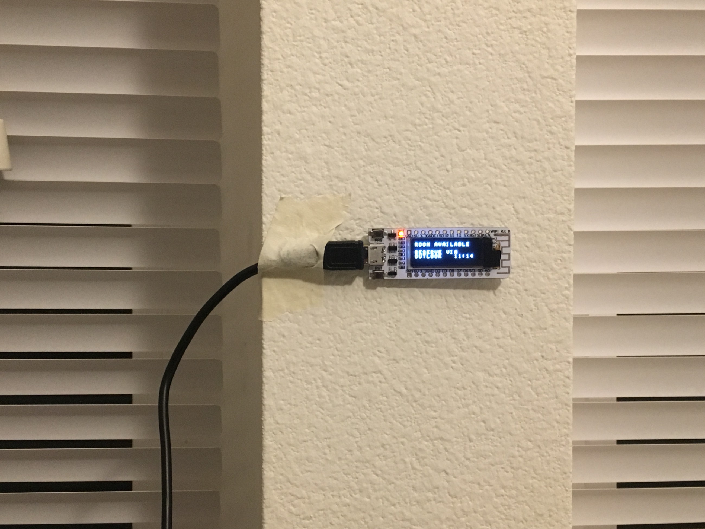
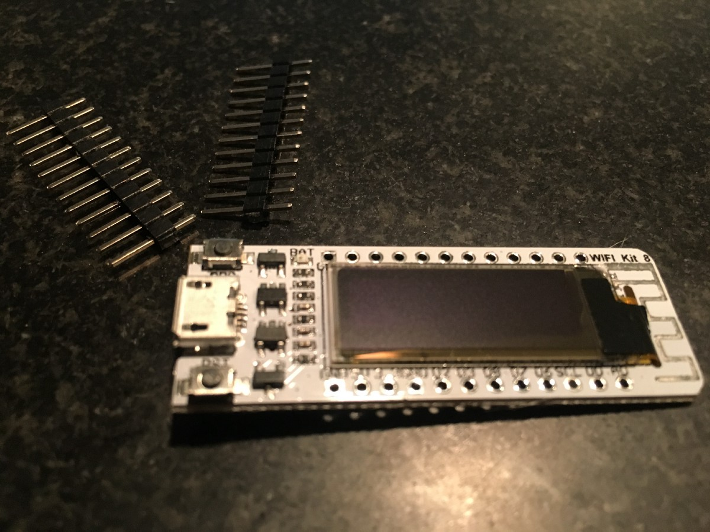
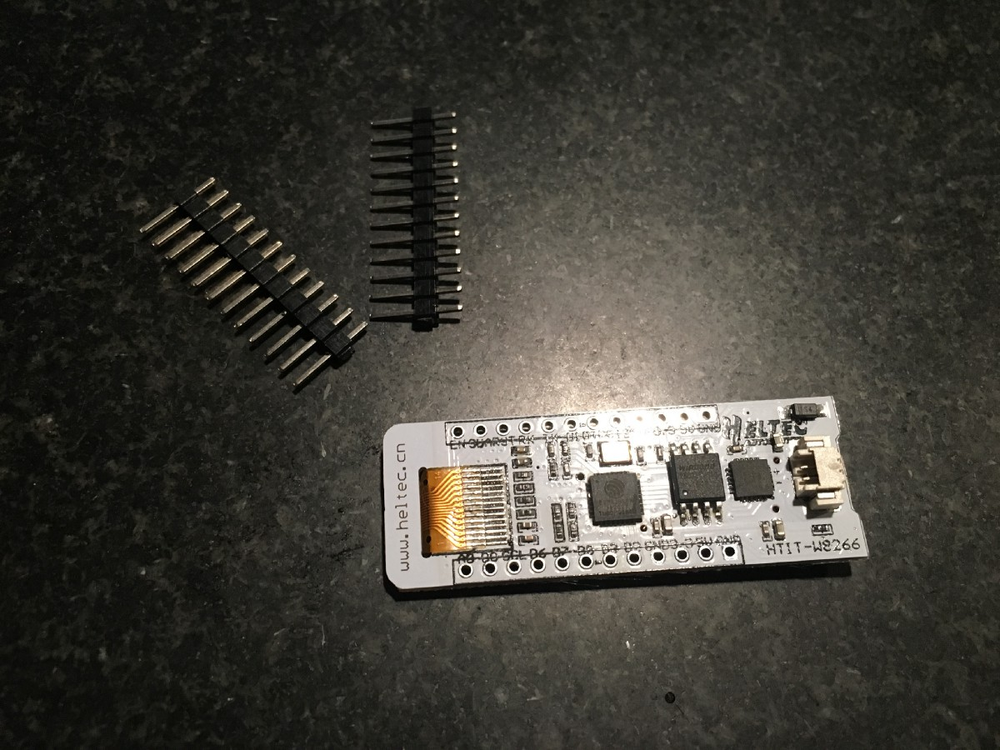
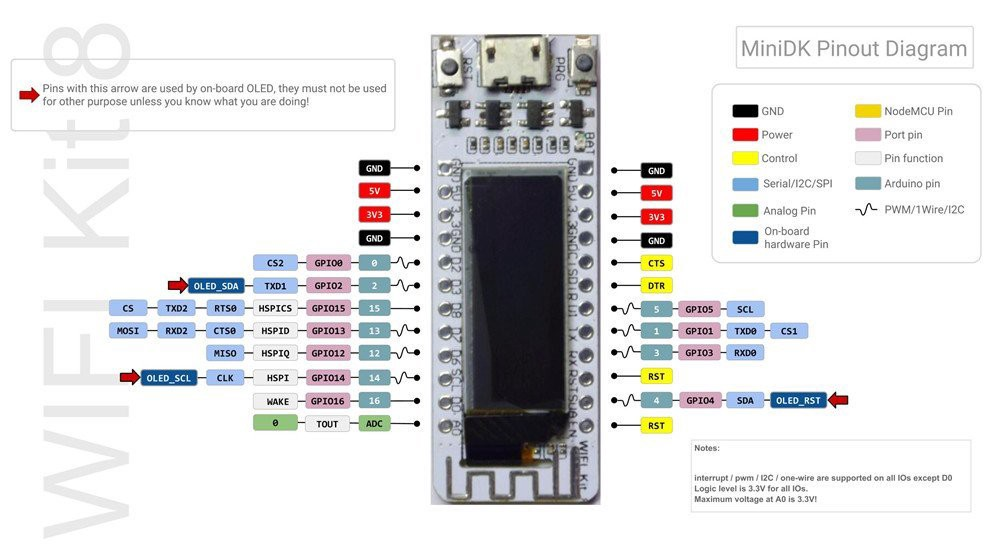
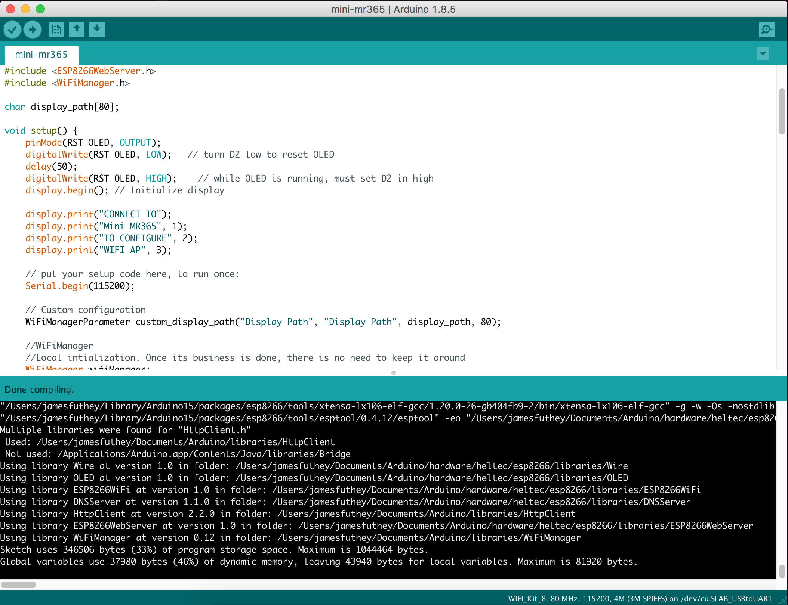
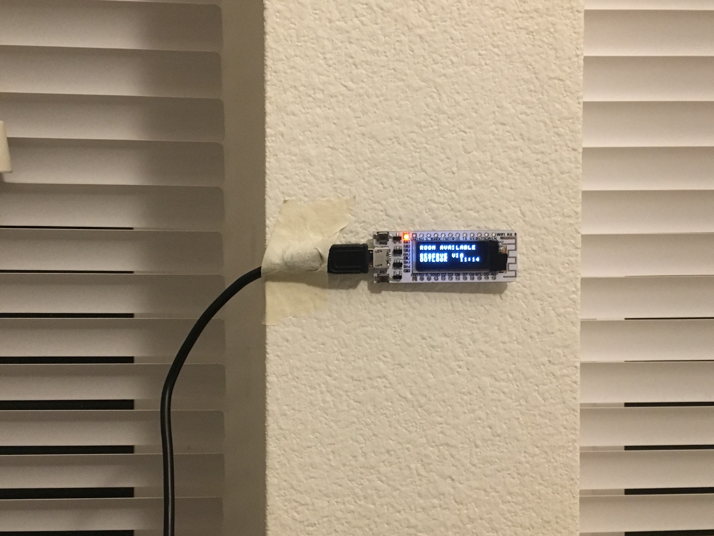
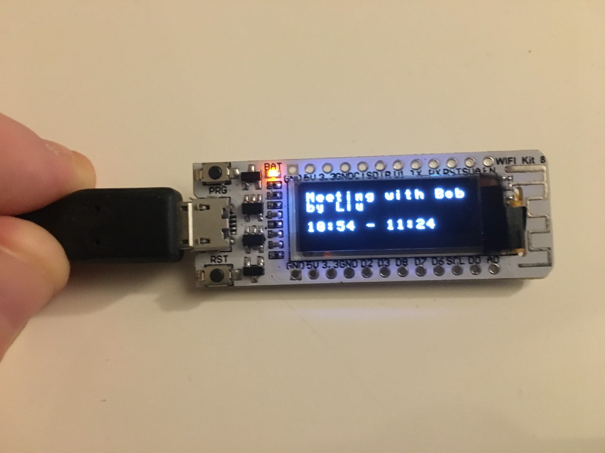
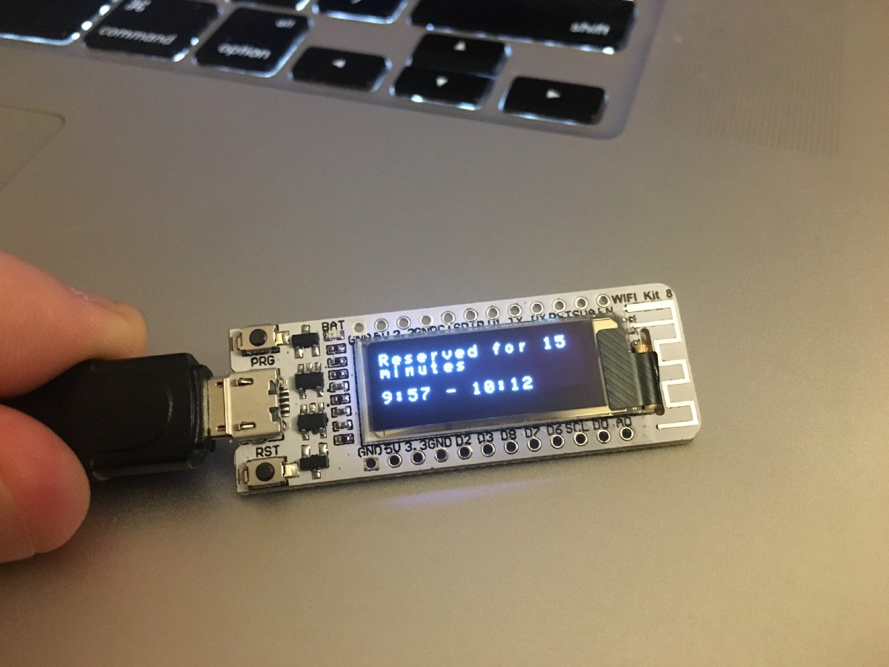

## Creating a tiny, embedded version of our Meeting Room display software for Office 365



### Introduction

I run a [small business that produces Meeting Room display software](https://meetingroom365.com/) that is used by companies around the world. It works by integrating with **Office 365**, and displaying a list of upcoming meetings for a **Resource Mailbox**. Normally, our users prefer small tablets like the iPad Mini or the Amazon Fire Tablet [(See how easy it is to add a Meeting Room display to Office 365 with Meeting Room 365)](https://medium.com/p/how-to-add-a-meeting-room-display-to-office-365-in-5-minutes-diy-6e6ee6d4aec7). But, I thought it would be fun to create a microscopic, embedded version of our software, as a promotional item.

.](./asset-2.png)

### The Hardware

For this project I chose the **ESP8266 System on a Chip**, which connects to a PCB antenna to include cpu, ram, flash rom, & wifi in a single QFP package. This package is pre-configured with an 0.91" OLED, power circuitry, and a usb/serial driver for programming the device (for about the price of a fancy Latte).

We also have a guide for the Raspberry Pi if you’re interested:

[**Using a Raspberry Pi as a Meeting Room Display \[Office 365\] \[DIY\]**  
_How to Add a Meeting Room Display to Office 365_medium.com](https://medium.com/@jamesfuthey/using-a-raspberry-pi-as-a-meeting-room-display-office-365-diy-ad34b8c3e5da "https://medium.com/@jamesfuthey/using-a-raspberry-pi-as-a-meeting-room-display-office-365-diy-ad34b8c3e5da")[](https://medium.com/@jamesfuthey/using-a-raspberry-pi-as-a-meeting-room-display-office-365-diy-ad34b8c3e5da)

#### SoC Specifications

-   Processor: L106 32-bit RISC microprocessor core based on the Tensilica Xtensa Diamond Standard 106Micro running at 80 MHz†
-   64 KiB of instruction RAM, 96 KiB of data RAM.
-   External QSPI flash: up to 16 MiB is supported (512 KiB to 4 MiB typically included)
-   IEEE 802.11 b/g/n Wi-Fi. ([WEP](https://en.wikipedia.org/wiki/Wired_Equivalent_Privacy "Wired Equivalent Privacy") or [WPA/WPA2](https://en.wikipedia.org/wiki/Wi-Fi_Protected_Access "Wi-Fi Protected Access") authentication, or open networks)
-   16 GPIO pins
-   SPI

#### ESP8266 SoC with 0.91" OLED (16x4 characters)



#### Demo Program

Here is the demo program you see when the device is first powered-up.

#### Board Pinout



### Designing the software



#### Allowing the user to configure the device

The first challenge to overcome was configuring the device. It wouldn’t be very easy to use if someone had to manually enter their Wifi SSID & Password & recompile and reflash the device before use. So, I went looking for a captive portal library that could be used to configure the device. The basic logic is as follows:

1.  If the device has a stored configuration, attempt to use that.
2.  If the stored configuration doesn’t work or doesn’t exist, broadcast a new network called **“Mini MR365”**.
3.  When a user connects to the network, hijack DNS to create a [Captive Portal](https://en.wikipedia.org/wiki/Captive_portal).
4.  Serve a single webpage which can be used to configure the device. Allow the user to store their settings permanently.
5.  Once a connection is established. shut down the network and resume normal operation

#### Device (Initial state)

The initial state for the device is a screen instructing the new user to connect to the device via Wifi, so they can configure the display.


#### Connecting to the device & Setting it up via Wifi (Finished Product)

Once the device is powered up for the first time, a user needs to connect to the special Wireless hotspot with their phone or computer, to let the device know what Wireless network to use, and which URL to look for the display.

Here are a series of screenshots outlining the process to configure the device. This was taken from my iPhone, but working on any device with a wireless connection:


#### Short Preview of the device Booting up

#### Display a “Room Available” message

Taken from my design doc. In the original, there are options to reserve a meeting room directly from the display. But, since we have no accessible buttons, we’ll display a message instructing visitors to **“Reserve \[a meeting\] via Outlook”**.

```
-----------------------------------
Room is available:
-----------------------------------

1234567890123456
  ----------------
1|ROOM AVAILABLE  |
2|                |
3|RESERVE VIA     |
4|OUTLOOK         |
  ----------------
  1234567890123456
```

#### Meeting Room Available (Finished product)

You’ll notice I deviated from the design to add the time back in to the display. Readability becomes a bit of an issue, but, without it, the display output does not change for several hours, and I became a bit uneasy.

Was the device working? How do I know?

With the time displayed, I can simply take a look at my watch or see the time change to feel confident that the system is working.



#### Display the current meeting

The second state displays the meeting room title, and the time it begins & ends. Since the Meeting Name is the most important bit of information, it gets two lines. Also, in the final version we do not include AM or PM (many of our users are international, but even in the US space is at a premium on our display).

```
-----------------------------------
Current / Next Meeting:
-----------------------------------

1234567890123456
  ----------------
1|MEETING TITLE OR|
2|MEETING NAME..  |
3|                |
4|12:00PM-12:00pm |
  ----------------
  1234567890123456
```

#### Meeting Room Reserved (Finished product)

You’ll notice, on the right, a room is occupied, and the meeting name & reservation time is displayed. Since space is a premium, we can only display 32 characters of text for the title, and we break it without regard to word breaks. Not a limitation of our hardware or software, but this was typical of devices using multiline character array displays (you might have used a personal assistant or organizer in the 90s with a similar display, or perhaps a high-end electronic typewriter).



#### That’s not all! This is an in-progress article. Check back for updates as this project progresses!

---

Looking for a fully-fledged solution for your office? Check out [**Meeting Room 365**](https://meetingroom365.com/)**:**

[**How to Add a Meeting Room Display to Office 365 in 5 minutes \[DIY\]**  
_Mount any tablet or iPad outside your conference rooms as a meeting room display, and keep your space organized_medium.com](https://medium.com/@jamesfuthey/how-to-add-a-meeting-room-display-to-office-365-in-5-minutes-diy-6e6ee6d4aec7 "https://medium.com/@jamesfuthey/how-to-add-a-meeting-room-display-to-office-365-in-5-minutes-diy-6e6ee6d4aec7")[](https://medium.com/@jamesfuthey/how-to-add-a-meeting-room-display-to-office-365-in-5-minutes-diy-6e6ee6d4aec7)

---

### Thanks for reading!

Please Recommend and Share if you found this article useful!