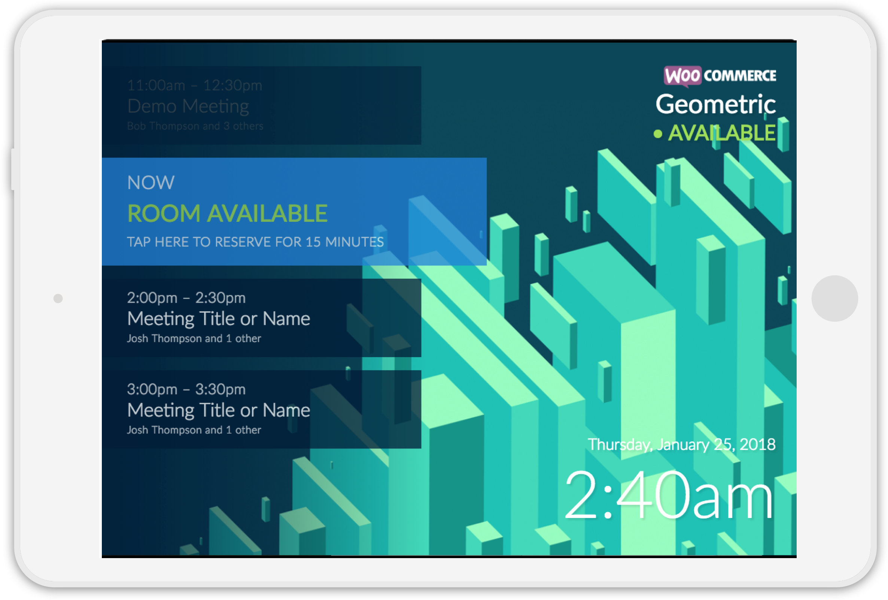
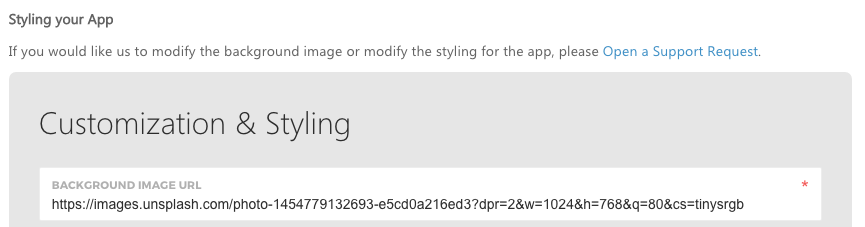
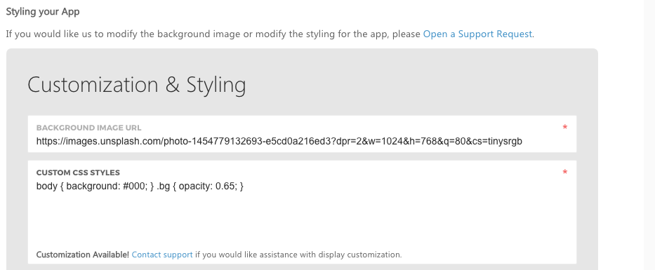
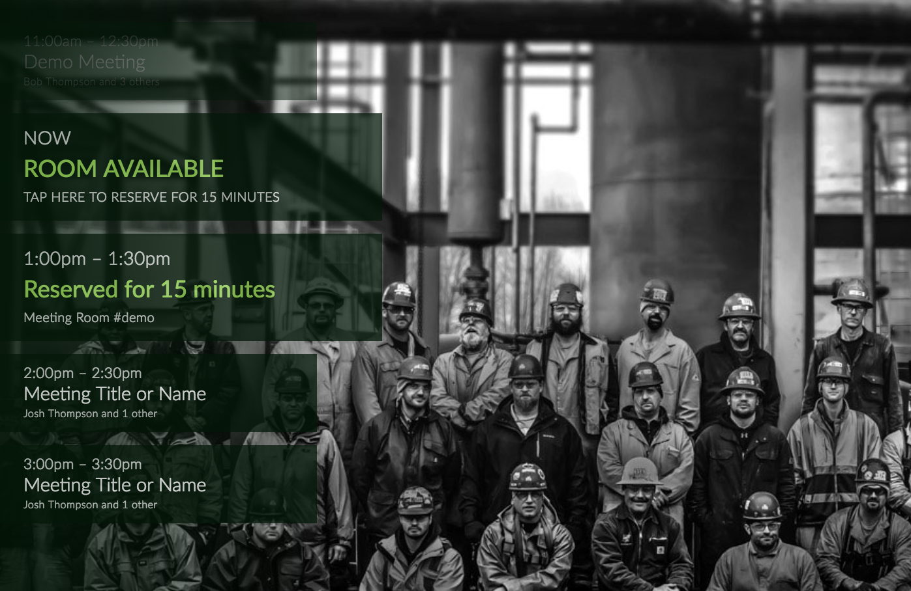
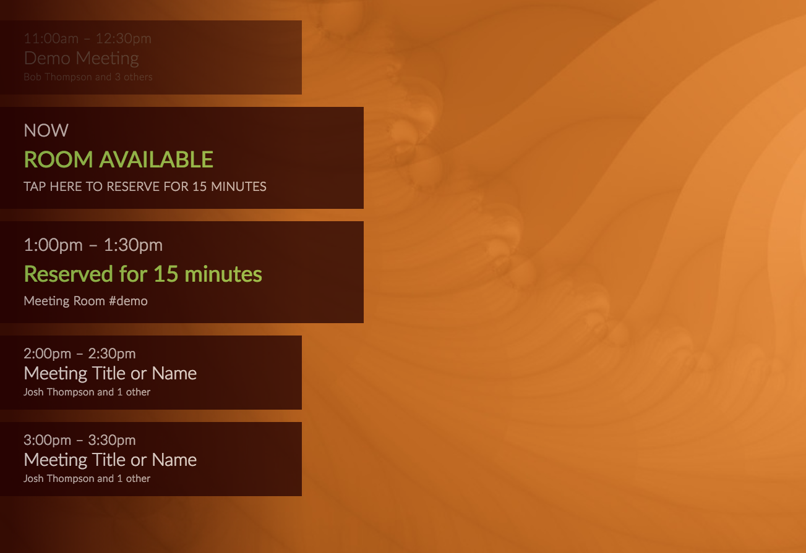
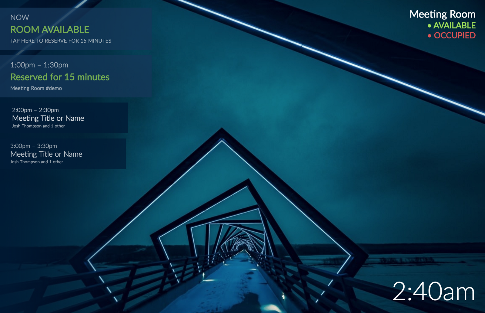
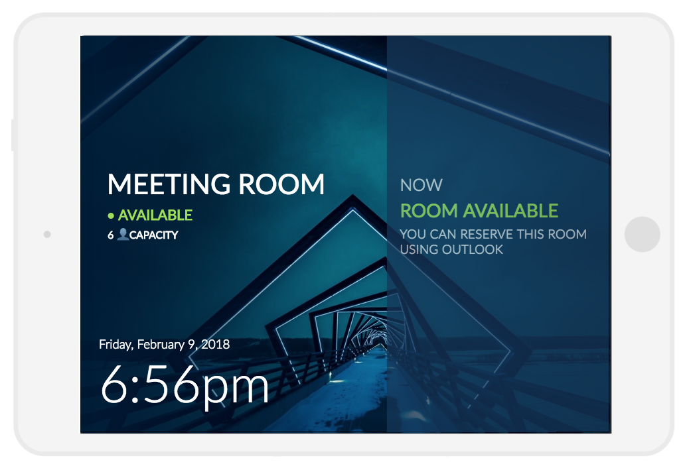

## Creating custom themes, layouts, and styles for Meeting Room 365 Displays

One of the most requested guides this week from our customers was a guide on creating **Custom Display Themes**. So, with this guide, I’ll attempt to cover everything you can do to customize your [**Meeting Room 365**](https://meetingroom365.com/) displays.

### Using the CodePen

If you are interested in creating a custom display theme or layout, I would recommend forking the [**Official CodePen**](https://codepen.io/kidGodzilla/pen/aEgWjB) for the **Meeting Room 365 app**, which will give you a live playground to operate in.

[https://codepen.io/kidGodzilla/pen/aEgWjB](https://codepen.io/kidGodzilla/pen/aEgWjB)

#### Examples on CodePen

We also have a growing collection of examples on CodePen (feel free to tag your own!) under the **#meetingroom365** tag.

[**Meeting Room 365 - a Collection by James Futhey on CodePen**  
_Meeting Room 365 Templates, Layouts, & Themes_codepen.io](https://codepen.io/collection/AWRVwp/ "https://codepen.io/collection/AWRVwp/")[](https://codepen.io/collection/AWRVwp/)

### Changing the Background

One of the most obvious (but most effective) changes you can make is to change your display’s **background image**.

Take a look at one of the example displays we created recently:



#### Four changes were made to accomplish this:

1.  We uploaded a **custom background image** which closely matched the display’s native resolution.
2.  We tweaked the color of the ‘available’ background to a slightly brighter blue.
3.  We added **text shadows** to some low-contrast text.
4.  We’re beta testing a new feature allowing a **custom logo** to be added in the upper-right corner.

#### Hosting your Image

We currently do not host custom background images from the app. However, if you would like us to host your image, just send it to us via email, as an attachment. It’ll give us a chance to help you resize it as well.

#### Updating your Configuration with the New Image

To update your meeting room configuration with the new image, [login to Meeting Room 365](https://meetingroom365.com/app/admin), and click the **EDIT** button to the right of the display you wish to customize.

Next, click on the third tab **(CONFIGURE TABLET),** and scroll to the field labeled **BACKGROUND IMAGE URL**. Changing this will instantly update the background of your display.



### Custom CSS

We also allow you to add arbitrary, custom CSS to your tablet, to modify the styles. Any CSS you create should override existing CSS styles (depending on which rules you modify).

To make this change in Meeting Room 365, just paste your CSS into the **Customization & Styling tab,** in the **CUSTOM CSS STYLES** field, below Background Image URL.



### Frequently Requested CSS

The most common changes requested via CSS are alternate color themes to match different background images. Here, I will provide two examples to get you started (they are also already included in the CodePen).

These three themes should give you excellent coverage for almost any background image you wish to use.

Just add the CSS below to your configuration to change the color of the Foreground elements:

#### Green Theme

```
/* Green theme */

.meeting, .meeting.current { background-color: #021707; }

.left-bg {
  background: #021707;
  background: -moz-linear-gradient(left,rgba(2,23,7,0.85) 0%,rgba(2,23,7,0.85) 5%,rgba(2,23,7,0) 100%);
  background: -webkit-linear-gradient(left,rgba(2,23,7,0.85) 0%,rgba(2,23,7,0.85) 5%,rgba(2,23,7,0) 100%);
  background: linear-gradient(to right,rgba(2,23,7,0.85) 0%,rgba(2,23,7,0.85) 5%,rgba(2,23,7,0) 100%);
}
/* END GREEN THEME */
```

#### Red Theme

```
/* Red theme */

.meeting, .meeting.current { background-color: #230000; }

.left-bg {
    background: #230000;
    background: -moz-linear-gradient(left,rgba(36,0,0,0.85) 0%,rgba(36,0,0,0.85) 5%,rgba(36,0,0,0) 100%);
    background: -webkit-linear-gradient(left,rgba(36,0,0,0.85) 0%,rgba(36,0,0,0.85) 5%,rgba(36,0,0,0) 100%);
    background: linear-gradient(to right,rgba(36,0,0,0.85) 0%,rgba(36,0,0,0.85) 5%,rgba(36,0,0,0) 100%);
}

/* END RED THEME */
```

### Hiding Elements

You can also use CSS to hide elements. Just find the appropriate CSS selector, and use `display: none`.



An example is, perhaps you don’t want to display the date in the lower-right corner, only the time. You could hide it using the following code:

```
/* Hide the Date */
.bottom.right h1 {
  display: none;
}
```

Or, a more effective use would be to hide meetings which have already occurred. You can do so with the following code:

```
/* Hide meetings that have already occurred */

.meeting.passed {
  display: none;
}
```

### Complete Layout Customization

One of the most powerful features of exposing CSS is that it allows a more advanced user to do a complete layout customization. For example, here is one that we came up with:



We did so with the following code:

```
/* ALTERNATE LAYOUT */

/* reset some styles */
.meetings { 
        top: initial;
        left: initial;
        right: initial;
        bottom: initial;
        padding-top: initial;
        overflow-y: initial;
        width: initial;
        height: initial;
      }

/* Custom layout */
.meeting.z:not(.current) {
        display: none;
      }
      .meeting.current {
        height: 100vh;
        width: 42vw;
        padding-top: calc(48vh - 100px);
        padding-left: 25px;
        margin-bottom: 0;
        transform: initial !important;
      }
      .meeting.current h2 {
        font-size: 36px;
      }
      .meeting.current h3 {
        font-size: 32px;
      }
      .meeting.current h4 {
        font-size: 24px;
      }
      .meetings {
        top: 0;
      }
      .meetings.in {
        right: 0;
        left: initial;
      }
      .bottom.right {
        right: initial;
        left: 36px;
        text-align: left;
      }
      .top.right {
        right: initial;
        left: 5vw;
        max-width: 46vw;
        width: 100%;
        top: calc(50vh - 130px);
        text-align: left;
      }
      .top.right h1 {
        font-size: 54px;
        display: inline-block;
        text-transform: uppercase;
        width: 100%;
        padding-bottom: 10px;
        /*margin-bottom: 20px;*/
        /*border-bottom: 5px solid #fff;*/
      }
      .top.right h2 {
        font-size: 28px;
      }
      .top.right h2:after {
        content: '6 👤 CAPACITY';
        display: block;
        color: #fff;
        font-size: 20px;
        margin-top: 5px;
        margin-left: 2px;
        line-height: 1.75;
        max-width: 150px;
      }
      @media screen and (max-width: 1000px) {
        .meeting.current {
          height: 133.33vh;
          width: 56vw;
        }
      }
/* END ALTERNATE LAYOUT */
```

#### Check out the **CodePen** to see how it works:

[https://codepen.io/kidGodzilla/pen/mXOoqL](https://codepen.io/kidGodzilla/pen/mXOoqL)

### Common Issues

#### Images which are larger than the display resolution do not resize by default

The solution to this is to enable scaling. You can do so with the following CSS snippet:

```
/* Use a Full-screen, Scaled Cover Image */
div.bg.cover.hidden { display: block !important; }
```

#### I want to add my logo to the display

We don’t yet have an option to do this from the Admin portal (coming soon), but can do this for you manually. Contact us and let us know what you would like. Works best for the **WHITE** version of your logo, if available.

---

#### Any other requests? Let us know!

### Thanks for reading!

Please Recommend and Share if you found this article useful!