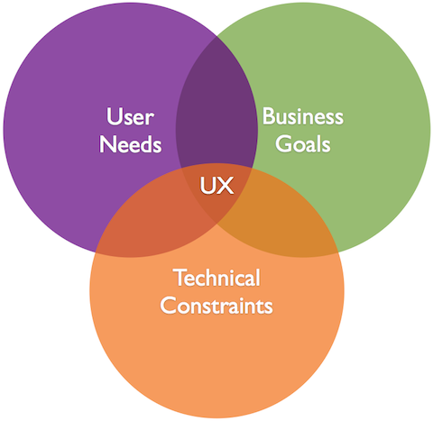

### Introduction

Want to learn the basics of UX while participating in the [DailyUI Challenge](http://www.dailyui.co/)? Look no further! Follow along with our simple series of Medium posts and learn the basics of UX design while you work. 

### Inspiration

Before you start, you should look at examples of other registration forms, and develop a concept. A good collection of DailyUI examples comes from [CollectUI](http://collectui.com/challenges/sign-up).

. Visually, this is a stunning piece. It provides a simple and minimalist registration form with complex branding (purple and yellow are not for the faint of heart!). However, it could be improved by adhering to Facebook’s branding guidelines when implementing Social Sign-in.](./asset-1.png)

### **Examples (with feedback)**

We’ve put together a collection of [examples](https://invis.io/E57OZD0DM) and provided our feedback, to get you started. 

### [Craft a Persona](https://www.smashingmagazine.com/2014/08/a-closer-look-at-personas-part-1/)

This doesn’t need to be incredibly complicated. However, you should start each design with a specific user in mind, and consider their goals for a few minutes before you begin. 

Try to avoid generic users, or assuming that many different users will need to use your design. Begin by designing specifically for a single Persona, and expand your design later to accommodate additional personas.

### **User Goals**

-   Evaluate a new product
-   Compare a new product to other products
-   Use the new product as quickly as possible
-   **Tip:** _Demonstrate the Core Product Value to the user as quickly as possible._ Before the user attempts registration, we have made a number of promises to the user about what problems our product will solve for them. Onboarding isn’t really complete until the we have demonstrated our ability to fulfill these promises to our user.

  

### **Business Goals**

-   Optimize conversion rates
-   Gather information that can identify the user
-   For freemium or paid products, this information may include information that can help a sales team convert this user to a paid plan (work email vs. personal email, company name, industry, business size)

  

  

### Technical constraints

-   **Responsive Design (Web):** Design flexibly. Users will stretch and distort your designs.
-   **Design on a grid**

### **Minimum Functional Requirements**

-   Text inputs for **Email** & **Password**
-   Link to Login form
-   Form Submit button

### **Heuristic (Usability) Requirements**

-   [Status of System](https://en.wikipedia.org/wiki/Heuristic_evaluation#Nielsen.27s_heuristics) (Where am I?)
-   [Emergency Exit](https://en.wikipedia.org/wiki/Heuristic_evaluation#Nielsen.27s_heuristics)
-   Why should I sign up?

### **Optional Components**

-   Social login
-   Password confirmation
-   Gravatar integration after entering email
-   reCaptcha (I am Human)
-   Name or Username

### **Other Considerations**

-   Form validation
-   Switch Language
-   Sell the user on the benefits of the product or service

### **Possible** [**UI Substates**](https://medium.com/swlh/the-nine-states-of-design-5bfe9b3d6d85)

-   Loading State
-   Initial State
-   Error State
-   Success State

### **Things to avoid**

-   Asking for too much information
-   Asking the user’s gender
-   Unnecessarily complex form validations or field requirements
-   Broken user flow between pages
-   Social Signup

### Considerations when designing for a Mobile app

-   Your form may not need an [“Emergency Exit”](https://en.wikipedia.org/wiki/Heuristic_evaluation#Nielsen.27s_heuristics)

### Considerations for Desktop application

-   Registration may be implicit or based on device identification (no user account)
-   User accounts may be secondary– used only to sync devices (think Google Chrome)

### **Things to Consider**

#### **1) Psychology**

The mind of a user is complex. You should know; you have one (I assume). UX practitioners work with subjective thoughts & feelings a lot; they can make or break your results. And the designer must ignore their own psychology sometimes too, and that’s hard! Ask yourself:

-   _What is the user’s motivation to be here in the first place?_
-   _How does this make them feel?_
-   _How much work does the user have to do to get what they want?_
-   _What habits are created if they do this over and over?_
-   _What do they expect when they click this?_
-   _Are you assuming they know something that they haven’t learned yet?_
-   _Is this something they want to do again? Why? How often?_
-   _Are you thinking of the user’s wants and needs, or your own?_
-   _How are you rewarding good behavior?_

#### **2) Usability**

If user psychology is mostly subconscious, usability is mostly conscious. You know when something is confusing. There are cases where it is more fun if something is hard — like a game — but for everything else, we want it to be so easy that even [**a Miss Teen USA contestant**](http://t.umblr.com/redirect?z=http%3A%2F%2Fwww.youtube.com%2Fwatch%3Fv%3Dlj3iNxZ8Dww&t=ODkwYmYwYmQzMGNiZDJkMTVlNDVmODcxOWI5M2QyZTE4NDdlZGM2OCx6R2Z1ckp6bQ%3D%3D) could use it. Ask yourself:

-   _Could you get the job done with less input from the user?_
-   _Are there any user mistakes you could prevent? (Hint: Yes, there are.)_
-   _Are you being clear and direct, or is this a little too clever?_
-   _Is it easy to find (good), hard to miss (better), or subconsciously expected (best)?_
-   _Are you working with the user’s assumptions, or against them?_
-   _Have you provided everything the user needs to know?_
-   _Could you solve this just as well by doing something more common?_
-   _Are you basing your decisions on your own logic or categories, or the user’s intuition? How do you know?_
-   _If the user doesn’t read the fine print, does it still work/make sense?_

#### **3) Design**

As the UX designer, your definition of “design” will be much less _artistic_ than a lot of designers. Whether you “like it” is irrelevant. In UX, design is how it works, and it’s something you can prove; it’s not a matter of style. Ask yourself:

-   _Do users think it looks good? Do they trust it immediately?_
-   _Does it communicate the purpose and function without words?_
-   _Does it represent the brand? Does it all feel like the same site?_
-   _Does the design lead the user’s eyes to the right places? How do you know?_
-   _Do the colours, shapes, and typography help people find what they want and improve usability of the details?_
-   _Do clickable things look different than non-clickable things?_

#### **4) Copywriting**

There is a _huge_ difference between writing brand copy (text) and writing UX copy. Brand copy supports the image of the company. UX copy gets things done as directly and simply as possible. Ask yourself:

-   _Does it sound confident and tell the user what to do?_
-   _Does it motivate the user to complete their goal? Is that what we want?_
-   _Is the biggest text the most important text? Why not?_
-   _Does it inform the user or does it assume that they already know what it’s about?_
-   _Does it reduce anxiety?_
-   _Is it clear, direct, simple, and functional?_

#### **5) Analysis**

The weak spot for most designers is **analysis**. But we can fix that! Analysis is the main thing that separates UX from other types of design, and it makes you extremely valuable. It _literally_ pays to be good at it. So, ask yourself:

-   _Are you using data to prove that you are right, or to learn the truth?_
-   _Are you looking for subjective opinions or objective facts?_
-   _Have you collected information that can give you those types of answers?_
-   _Do you know why users do that, or are you interpreting their behaviour?_
-   _Are you looking at absolute numbers, or relative improvements?_
-   _How will you measure this? Are you measuring the right things?_
-   _Are you looking for bad results too? Why not?_
-   _How can you use this analysis to make improvements?_