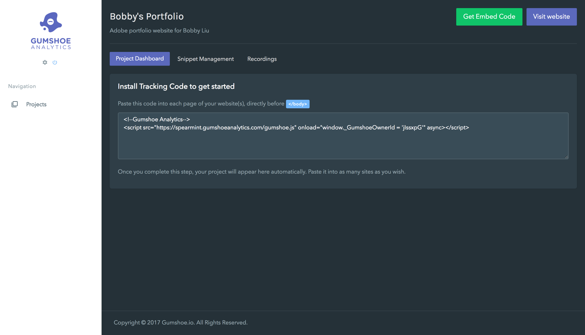
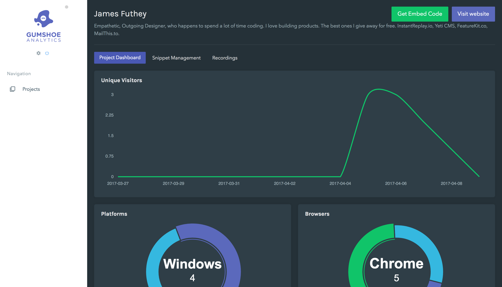
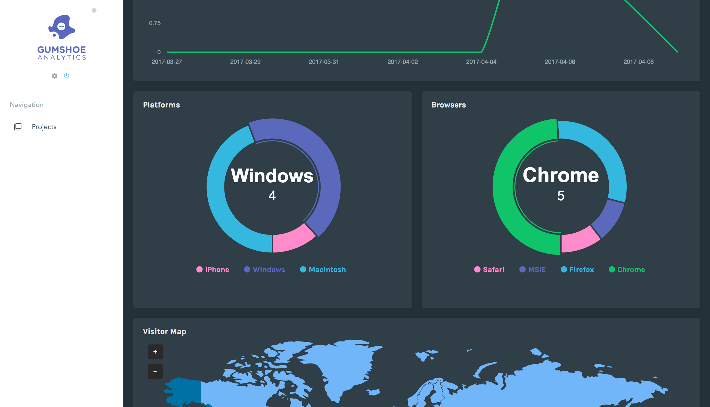
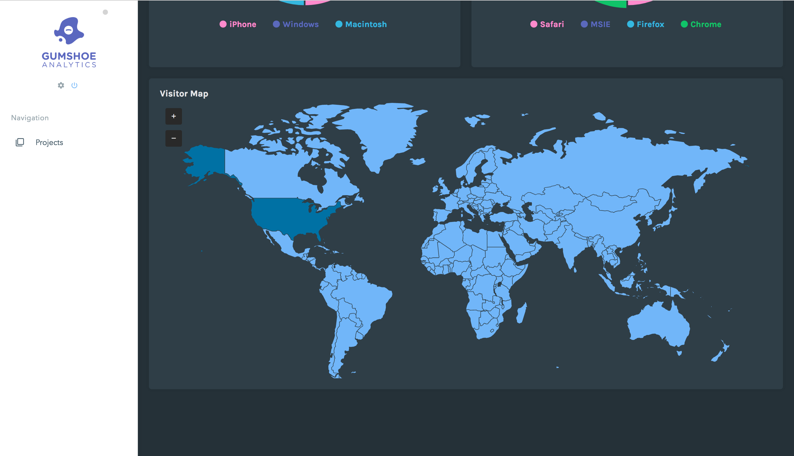

## Adding a ‘minimum-viable dashboard’ to Analytics projects

Small update, but we’ve added a few new visualizations of “table-stakes” data about visitors to your Gumshoe project.

### Table-stakes data

We consider this to be two things:

1.  Things users noticed / remembered in our usability testing from the Google Analytics homepage, AWstats, or some competing product. The kinds of things people naturally list off when you engage them in a conversation about **descriptive analytics**.
2.  Things we can collect and present with very little preparation or processing.

### Keeping things simple

When testing Google Analytics, one insight we found was that many participants did not immediately understand the terminology we used to describe the most basic concepts. Many participants could not articulate the difference between Visits, Sessions, and Unique Visitors.

This was disturbing enough for us to decide early on to standardize on a single metric (since these are all correlative). For us, that is **Unique Users per Day**, since this also simplifies the task of collection, storage, and computation (for things like funnels, retention, and calculating the inactivity interval for a user).

### Pre-installation state

Before you’ve installed your tracking code, you will see a splash page / empty state, prompting you to install your tracking code.

Then, once we begin to receive data from your project, we visualize it in three ways: Unique visitors over time (for the last two weeks)

Distribution of browsers and operating systems for your users (current month)

And finally, a map of user locations (current month).

---

Thanks for taking the time to check this out! Let us know what you think!

**If you’re new to our publication, welcome!**  A month ago, five of us set out to build a startup. We’re documenting & sharing the process, so you can follow along as we build & launch our company, and present it to the world in Vienna this June.