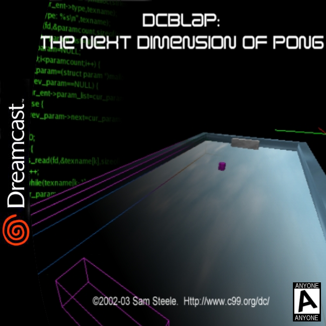
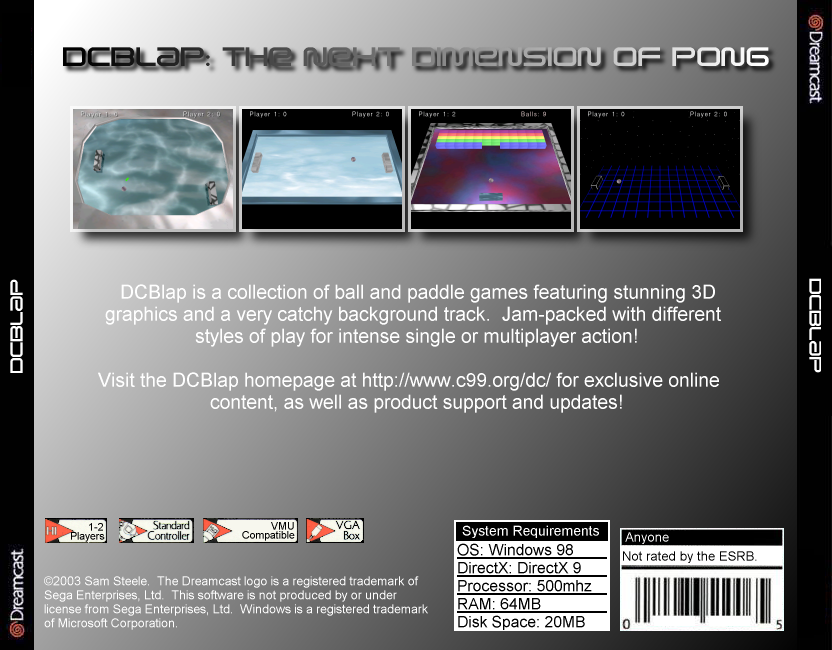
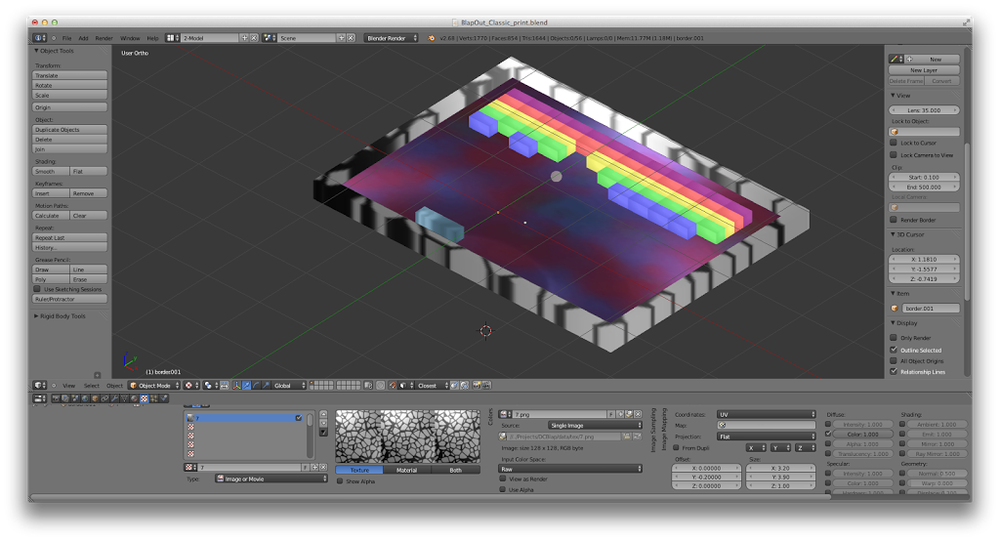
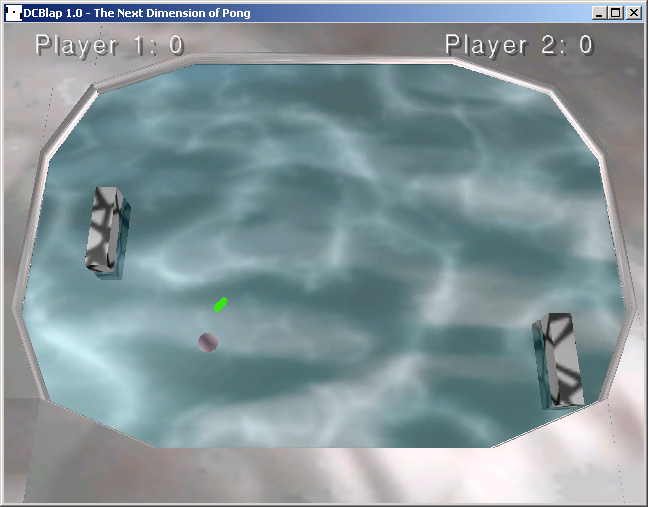
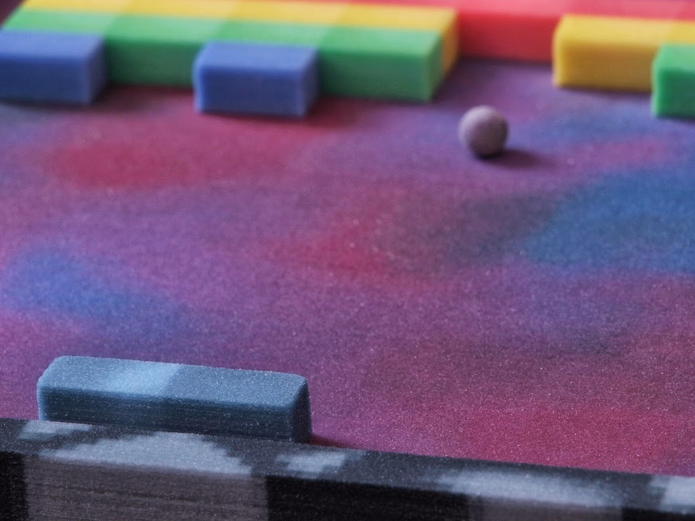

## Creating a console game at 14 that was experienced by thousands

Video courtesy of [**@**panteric](https://medium.com/r/?url=https%3A%2F%2Ftwitter.com%2Fpanteric) (DCEric)

Sometime around the year 2000, when it became apparent that the Dreamcast couldn’t compete with the PS2, a small community of a few dozen devoted fans took to the internet, organized around a bulletin board, and formed the **Dreamcast Homebrew community**.

I was about 13 at the time. I had begun programming by reading the source code to popular games & trying to create my own. Just a few years earlier, **John Carmack** released the source code to **Doom** & **Wolfenstein**, both AAA titles, bucking industry trends to keep their proprietary technology a secret for as long as possible.

Compared to my peers, my programming skills were terrible. But, unlike others, I had a creative streak, and a knack for creating 2d sprites, simple 3d models, and writing music. I quickly found opportunities to help others expand demos and projects for the new console, and [Sam Steele](https://medium.com/r/?url=http%3A%2F%2Fwww.c99.org%2F) was one of those collaborators.

Ok, you know what? I was mediocre to terrible at all of those things. But thankfully, nobody ever told me that, and we were able to put together a really solid game in a short summer of hacking.

In time, the game expanded to include a breakout clone, and a few interesting twists (like gravity).

Sam eventually released the [Source Code](https://medium.com/r/?url=https%3A%2F%2Fgithub.com%2Fc99koder%2FDCBlap%2F).

This was my first experience [**creating something for other people**](https://medium.com/r/?url=https%3A%2F%2Fcase.wantedly.com%2Fportfolio%2Fprojects%2F2628), and I quickly became an addict. It was an amazing experience to create something from nothing that other people could enjoy, and I’ve been chasing that high ever since.

