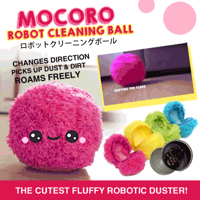
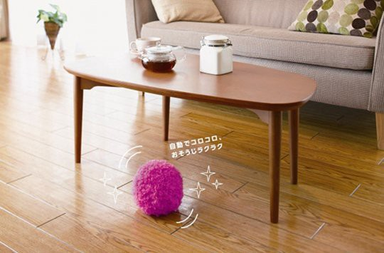
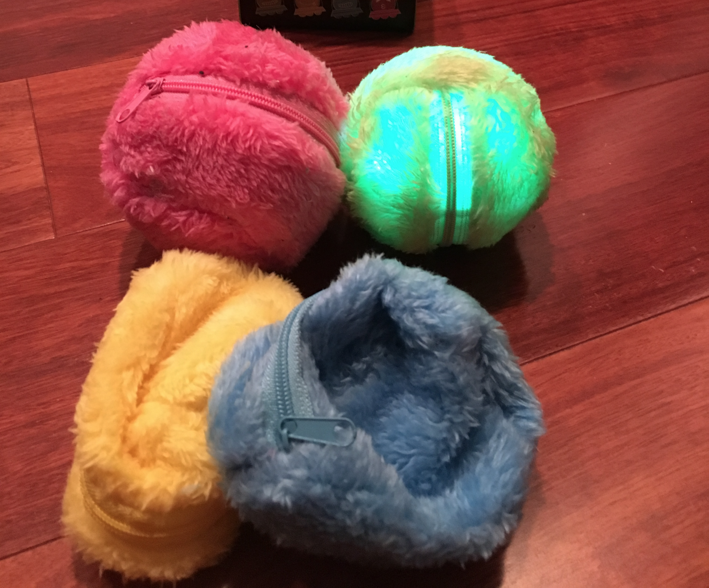
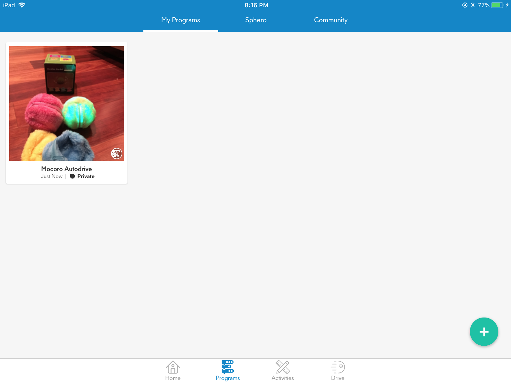
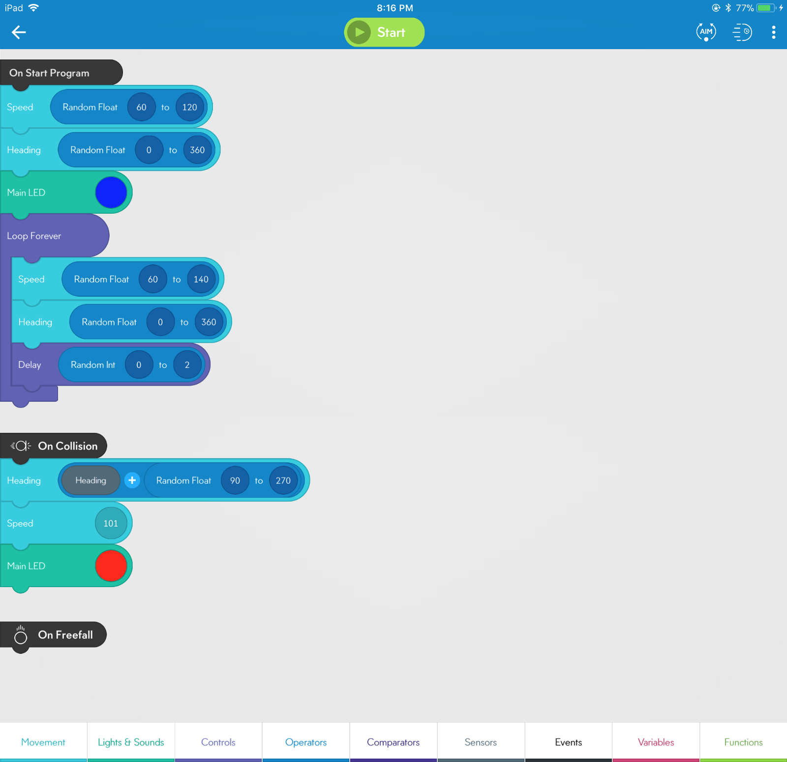
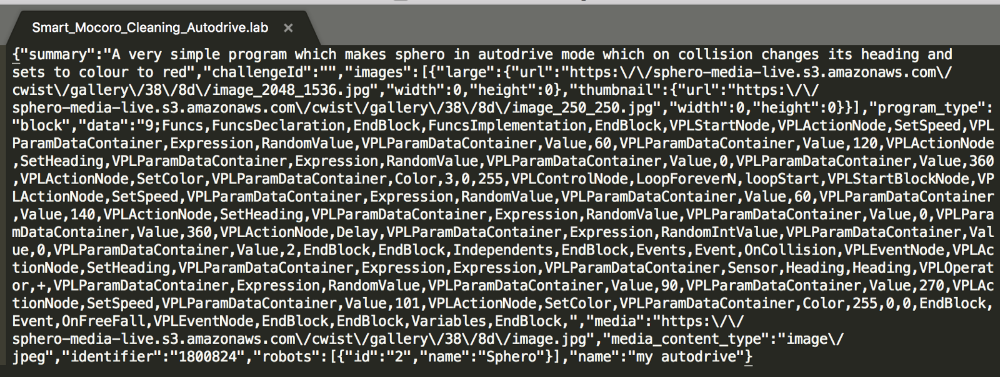
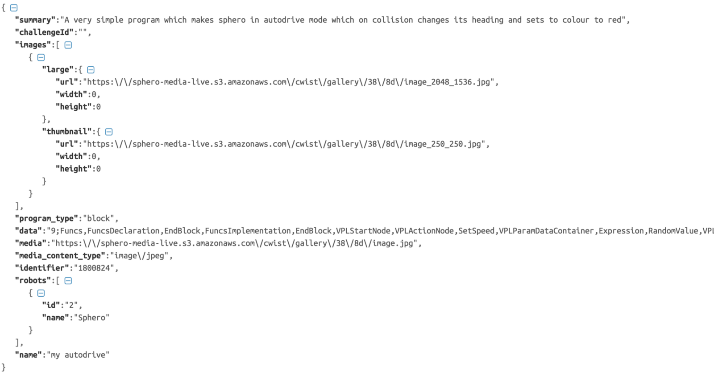
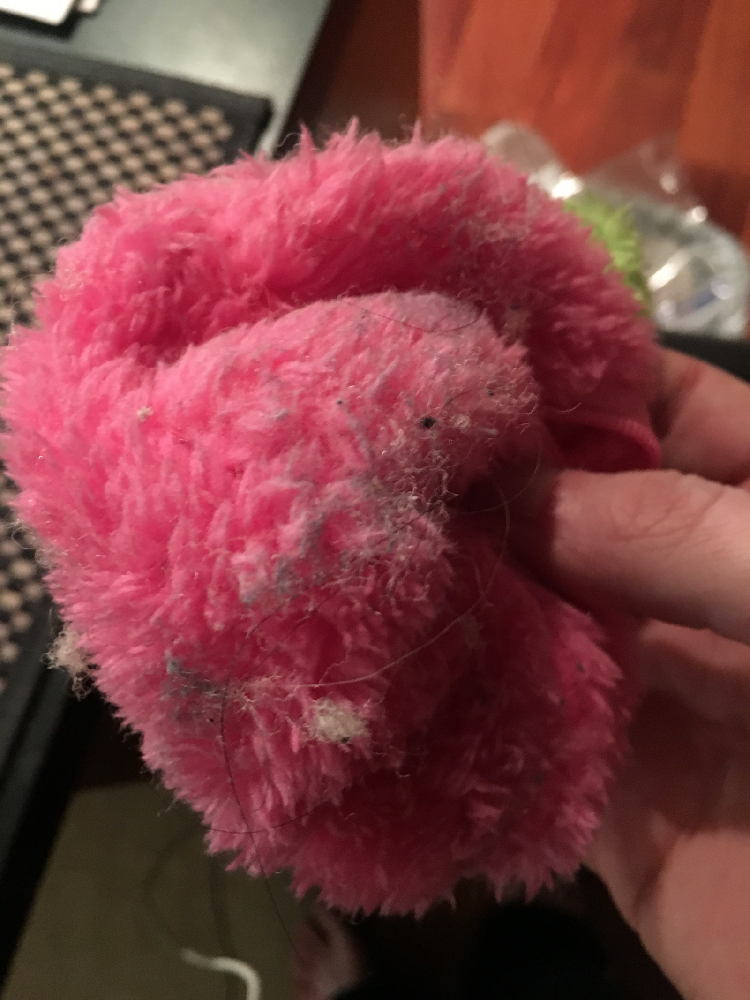
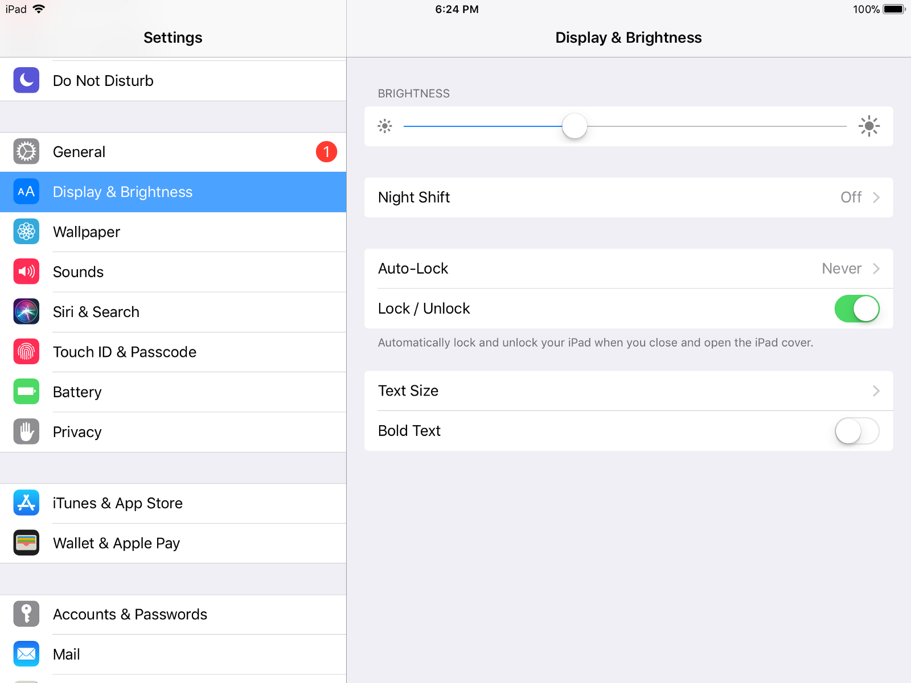
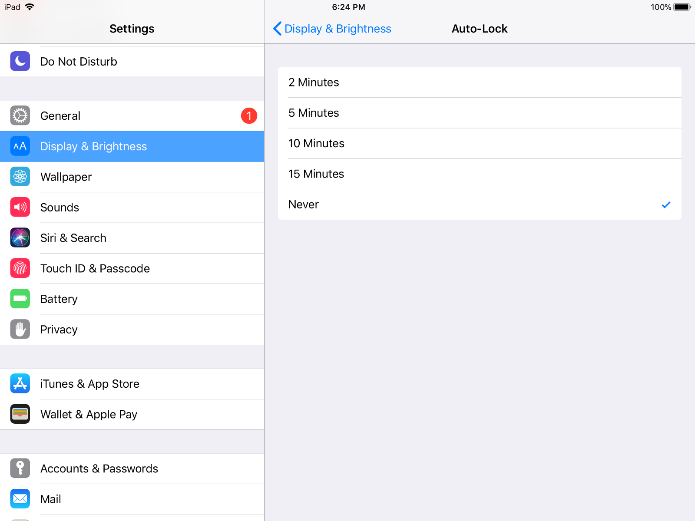

## How to turn your Sphero into something useful (For about $8)

I recently bought a [Mocoro “Robot Cleaning Ball”](http://www.japantrendshop.com/mocoro-robotic-fur-ball-vacuum-cleaner-p-1611.html). I was really excited!

### What is a Mocoro?

<Embed src="https://www.youtube.com/embed/aKpGajyRpRU?feature=oembed" aspectRatio={0.562} />

This “microfiber hop ball” is one of the funnest in the recent trend for robotic vacuum cleaners in Japan. The **Mocoro** might sound like a bizarre but sophisticated piece of technology — a colorful “fur” ball that rolls automatically around home cleaning — but actually its beauty lies in its simplicity. All you need to do is clean the furry cover and then let the ball do the rest!

It has an internal timer so this fluffy “space ball” will roll around every 15 minutes picking up dust and dirt in all those annoying nooks and crannies under the furniture. When the floor is clean, just slip off the mop and wash it.

### Disappointment

I was incredibly excited to receive and assemble my new cleaning pet.

..but it turned out to be a knockoff, and wasn’t smart enough to navigate my apartment:

<Embed src="https://www.youtube.com/embed/ucu6LfsT-ew?feature=oembed" aspectRatio={0.75} />

It basically just tried going in counterclockwise circles. It got stuck every 30 seconds or so..

Luckily I also had a [**Sphero**](https://www.sphero.com/) lying around ($6 at my local Goodwill), so I could build one myself!

### Demonstration

<Embed src="https://www.youtube.com/embed/Ui4WRa7M0IE?feature=oembed" aspectRatio={0.562} />

### Build your Own Mocoro

Interested in building your own Mocoro? It’s easy! Follow the steps below:

#### What you’ll need:

1.  A [**Sphero**](https://www.ebay.com/sch/i.html?_trksid=p5197.m570.l1313&_nkw=sphero&_sacat=0) (Any model will do, even the BB-8!)
2.  A [**Knockoff Mocoro**](https://www.ebay.com/sch/i.html?_trksid=p5197.m570.l1313&_nkw=mocoro&_sacat=0) (Outfits for your Sphero)
3.  The [**Sphero EDU**](https://itunes.apple.com/us/app/sphero-edu/id1017847674?mt=8) app (iOS or Android)
4.  A mobile device or tablet

#### 1\. Wrap your Sphero in it’s new Mocoro clothing

#### 2\. Download & Install the Sphero Edu app

This is important. Only the Sphero Edu edition can run custom programs.

#### 3\. Search the Sphero Community for the **“Mocoro”** Program

Click **“Programs”**, and then the **“Community”** tab. Then, search for **“Mocoro”**. There, you’ll find the program I created to navigate your home like a Mocoro.

#### Optional: Program it yourself

You can recreate the program in just a few minutes, and learn about Sphero programming at the same time.

It turns out, programming the Sphero is really easy. They give you a drag-and-drop block coding library. There’s even a [Node SDK](https://www.npmjs.com/package/Sphero-Node-SDK) for controlling the Sphero robot!

#### Run the program

<Embed src="https://www.youtube.com/embed/BHVfffwXlKg?feature=oembed" aspectRatio={0.562} />

#### Sphero Program internals

Sphero’s block programming is exported as a .LAB file

Which turns out to be plain ‘ol Javascript Object Notation..

Interestingly, it seems like the programs are just a hash of commands in a comma-separarted list (under `data`).

### The Result

Now you can run the program and watch your Sphero clean up your hardwood floors.

### Bonus Tip:

#### Prevent your iOS device from sleeping

You’ll want to prevent your iOS device from sleeping while you run the program (your sphero’s battery may last for several hours).

Navigate to **Settings**, and select **Display & Brightness**. Next, adjust the brightness to your desired level, and set **“Auto-Lock”** to **“Never”**. This will prevent the display from powering off when idle.

### Thanks for reading!