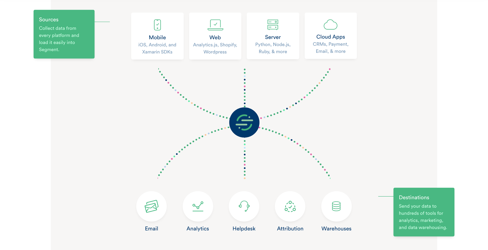
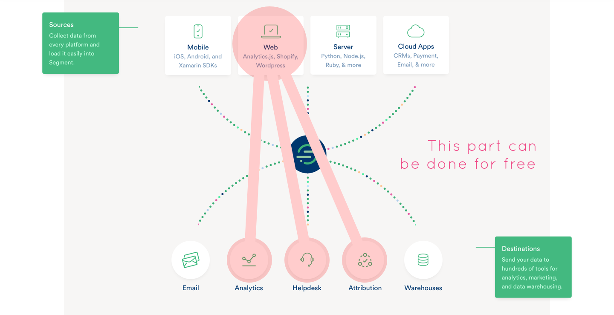
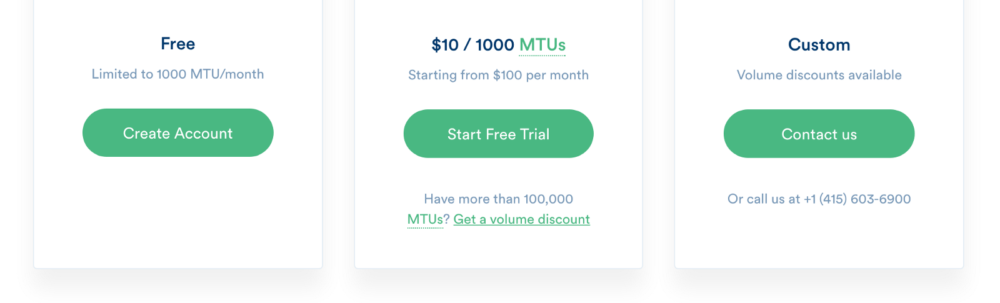

**TLDR;** We’ve forked parts of the open source library **Analytics.js**, and rewritten it for our own purposes, so that we can send data directly to third-party services, without sending it through Segment.com’s ETL pipeline (for **privacy, compliance,** and **cost** issues). It’s helped us tremendously, and now we want to share this with the Open Source community, so other people can adapt this to their needs as well. Get an early release [here](https://github.com/kidGodzilla/electric-love), and let me know your thoughts.

#### Confession: We love Segment

We’ve been using this tool for years, and it’s relieved a lot of pain in our lives. Big shoutout to the [Segment.com](https://segment.com/) team for creating the first version of [**Analytics.js**](https://segment.com/docs/sources/website/analytics.js/). If you have a data team, are building a data warehouse, and need to centralize your data in Redshift, [have I got a killer product for you](https://segment.com/).

### But, we weren’t good Segment customers.

While Segment has been great in the past, we ran into a situation where we had to come up with another tool to solve our problem.

#### 1\. Our needs are only on the client-side (Javascript).

We‘re small. We don’t have a data team, and although I’ve managed real analytics infrastructure, Pre-Series-A companies have no business making a huge investment here (as long as they cover their bases). I’m not building a mobile app, and what I really need is to just send my tracking data to three places: **Google Analytics,** **Intercom.io,** **Hotjar,** and **Mixpanel,** in a clean way. I would also like to experiment with a few other destinations, such as **Keen.io,** and **Heap**. And, I want to keep switching costs low if I do decide to move everything to **Drift** or **Keen.io** in the future.

#### 2\. We blew through our free 1,000 Monthly-tracked Users limit, but most were visitors.

And, while Segment.com’s pricing model is reasonable ($10 per 1,000 MTUs), there is a **$100/mo minimum charge for 10,000 MTUs,** which understandably makes a lot of since for Segment, but not for us.

#### 3\. Our client was concerned about the implications of storing data with Segment.

Our client was very concerned by the disclosure that, in order to implement **Analytics.js,** we would need to send their data through a third-party, **Segment,** and that the data would be stored ([indefinitely?](https://community.segment.com/t/y7t3rw/how-long-does-segment-store-my-data)) in an s3 bucket.

Additionally, anyone who gained access to Segment, would potentially have access to that data (and the ability to replay previous datasets into a new destination, with only a limited window of access).

Although, we feel we could have pushed back and overcome this obstacle, for others this may not be the case.

### So, we forked it, and then we rewrote it.

We started with an abstraction layer between the services we wanted to implement and our existing **Analytics.js** implementation. Then, we looked into forking **Analytics.js** itself, which turned out to be pretty large **(~300k),** and we only need a few bits of it.

What we ended up with is a **syntax-compatible replacement** for **Analytics.js** that allowed us to move off Segment, and do the lightweight transforms we needed to perform on our data **client-side**. This allows us to write tracking code once, and send our data where we need it.

### Where to get it

You can find the quirky-named repository here:

[**kidGodzilla/electric-love**  
_electric-love - An analytics abstraction layer. Write your events once, then send them where ever you want._github.com](https://github.com/kidGodzilla/electric-love "https://github.com/kidGodzilla/electric-love")

### Limitations

This isn’t a complete replacement for Segment.com (nor is it meant to be). It only handles client-side data, and currently only sends it to a limited number of destinations. But, it’s easily extensible, and if you need it, I’ll help you integrate it and implement new destinations.

### Join us on Slack

[https://slack.gumshoeanalytics.com/](https://slack.gumshoeanalytics.com/) (give this page a few seconds to load, it shuts down when it idles).

I’ll help write any integrations you can come up with. If the documentation is there, or there’s already an Analytics.js reference implementation, send it our way and let us know that you would like to use it.

### Thanks!