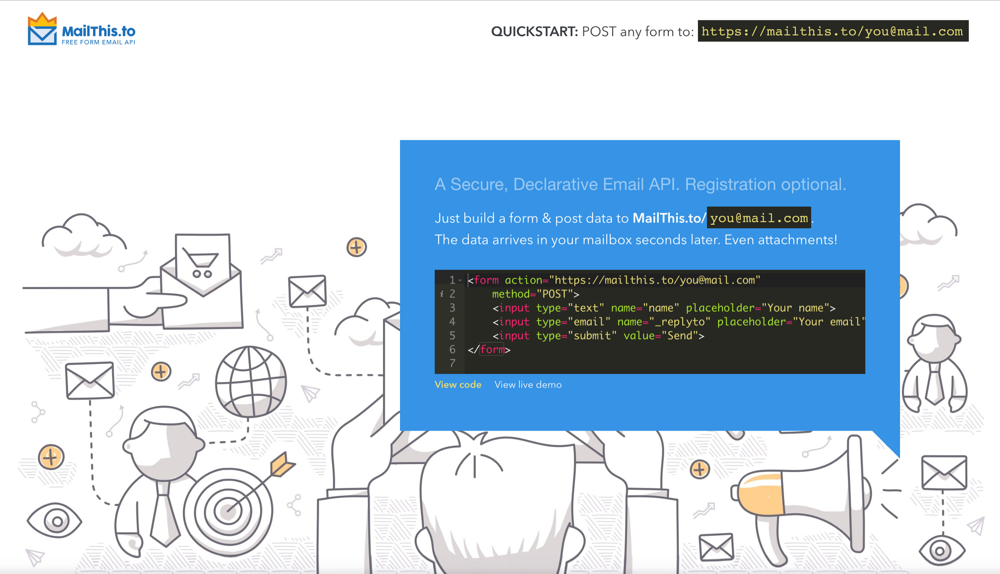

## The Free APIs that will Protect you from Fraud, Spam, and Abuse

#### Why Form to Email as a Service?

Sites like SendGrid and Mailjet help us improve open rates and deliverable rates for our email by baking best-practices into every email we send. In addition to this, using a Form to Email service provider like MailThis.to or Formspree will protect you from lost data, Fraud, Spam, and Abuse, by monitoring and filtering the traffic that accesses your API.

Whether you’re building a project for a client, or yourself, having good defaults and sticking to them will help you in the long run.

<Embed src="https://gist.github.com/kidGodzilla/0952f3bb44ae568dbe60029182bbba6e.js" aspectRatio={0.357} />

#### What is MailThis.to?

**MailThis.to** is a Free Email API, which you can securely embed into your website, to receive an email whenever a visitor submits a form. Think of it as **form2mail as a service**, for static websites.

You get a permanent, memorable address that can receive **POST DATA**, including file attachments. So, you just remember **MailThis.to/<email>** whenever you are building a landing page, or a website, or a quick project, and you have an instant, working HTML form.

A simple example

### Using advanced fields

Here are some advanced field names that can be used with the APIs listed above to change the behavior of the service:

#### \_subject

This allows you to specify a custom subject for your email message.

#### \_replyto

This allows you to specify a custom reply-to field for your email message.

#### \_after

This allows you to specify a redirect URL to send users to after they send a message.

#### \_honeypot

This is a special field which acts as a form of SPAM protection. This hidden field will not be shown to regular visitors, but most SPAM bots will automatically enter a value into this field. If Mailthis.to detects a value, the data is considered SPAM and won’t be processed (no email will get sent).

#### File uploads

Simply add a file upload, switch your form to encType=”multipart/form-data” and you will receive the file as an attachment.

#### \_confirmation

Set a custom confirmation message shown to the user after successfully submitting the form.

### An Example using AJAX

You can also use AJAX to send email, without an HTML form. However, in order to prevent spam, your users will need to complete recaptcha after your request is completed.

To do this, redirect your users to [https://mailthis.to/confirm](https://mailthis.to/confirm) after your request has completed.

<Embed src="https://gist.github.com/kidGodzilla/bdd453129a1e30ac9d86b9fd7b412ca8.js" aspectRatio={0.357} />

### Pricing

#### MailThis.to is free for up to 1,000 emails.

Additional emails can be purchased for **$5 per 1,000 emails.** Contact us for better rates on larger volumes.

### Thanks for Reading!

Please let me know if you have any comments.