## Finding a simpler approach to build a Furlexa

#### This is an in-progress journal (incomplete)

I followed the [Furlexa project](https://howchoo.com/g/otewzwmwnzb/amazon-echo-furby-using-raspberry-pi-furlexa) passively for a while now, hesitant to attempt on my own. It’s always fascinated me, but I only recently decided to put in the time to complete the project on my own.

<Embed src="https://www.youtube.com/embed/BW4TOgzZMxQ?feature=oembed" aspectRatio={0.75} />

Here is my journey:

### The Parts

For this build, I’ve decided to use OEM Amazon **Echo Dot** Gen 2 hardware ($22, Amazon Warehouse Deals) for the voice assistant, along with a standard **1998 Furby** ($20, ebay).

Other guides have attempted this with a much more complex **Raspberry Pi Zero W** setup. Interestingly, if you look at a teardown of the **Echo Dot Gen 2**, there are several opportunities to reduce it’s size, with little or no tooling required. The largest component is the Echo speaker, which I wanted to bring along anyway, since it’s custom plastic amplification chamber delivers much higher quality sound than any comparable speaker I could find.

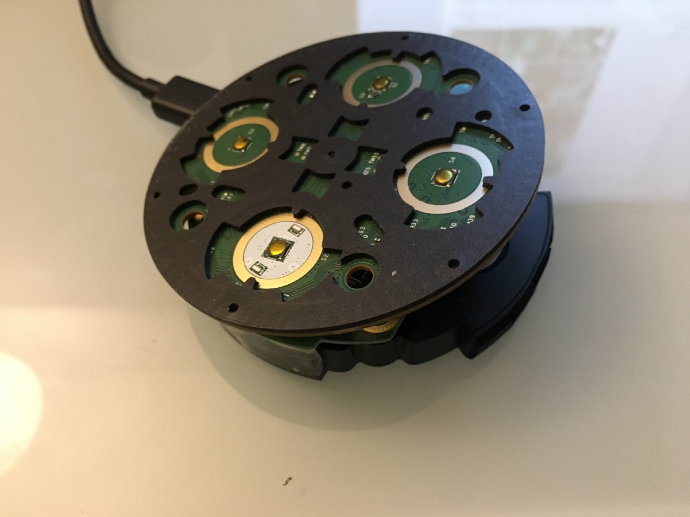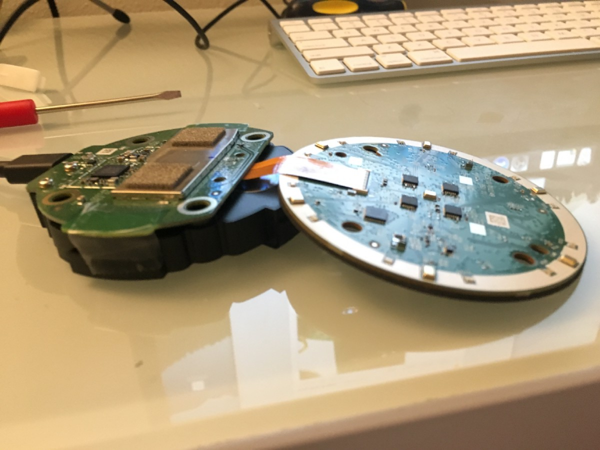

### Theory of Operation

Crudely put, my goal is to replace Furby’s large battery compartment with the miniaturized Echo Dot hardware. Having stuffed the dot up the business end of the Furby, it’d be nice if it still moved it’s mouth when talking.

To accomplish this in the least invasive manner possible, I’ll be placing a photo-resistor (light sensor) inside the Alexa hardware. The LEDs shine when the Echo is activated, and most brightly when Alexa is speaking. So, without any work at all I should be able to detect exactly what the Dot is doing, and communicate that to the hardware controlling the Furby.

I’ll be feeding this into an Atmega328p microcontroller running Arduino, which will directly control the electric motor driving Furby’s movement. This should result in the simplest build possible, with only a few common components and simple modifications to the most important bits of hardware.

### Full Parts List

1x 1998 **Furby** (original version)

1x Amazon **Echo Dot** (Gen 2 if you can get it)

1x **Atmega328p Microcontroller** (plus the required hardware for programming. I suggest an Arduino Uno board with an extra microcontroller.

1x **Photo-resistor** (Tip: you can salvage this from your Furby!)

1x **NPN Transistor**

1x **Schottky Diode**

1x **270 Ohm resistor** (or anything close)

1x **10k Ohm resistor**

#### Recommended

Breadboard, Jumper Wires for Prototyping, soldering iron, etc.

Furby: before the teardown

### Furby Teardown

#### Strip off Furby’s Fur

(I guess he’s just a b now)

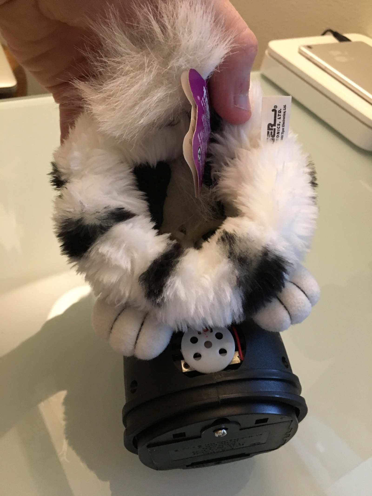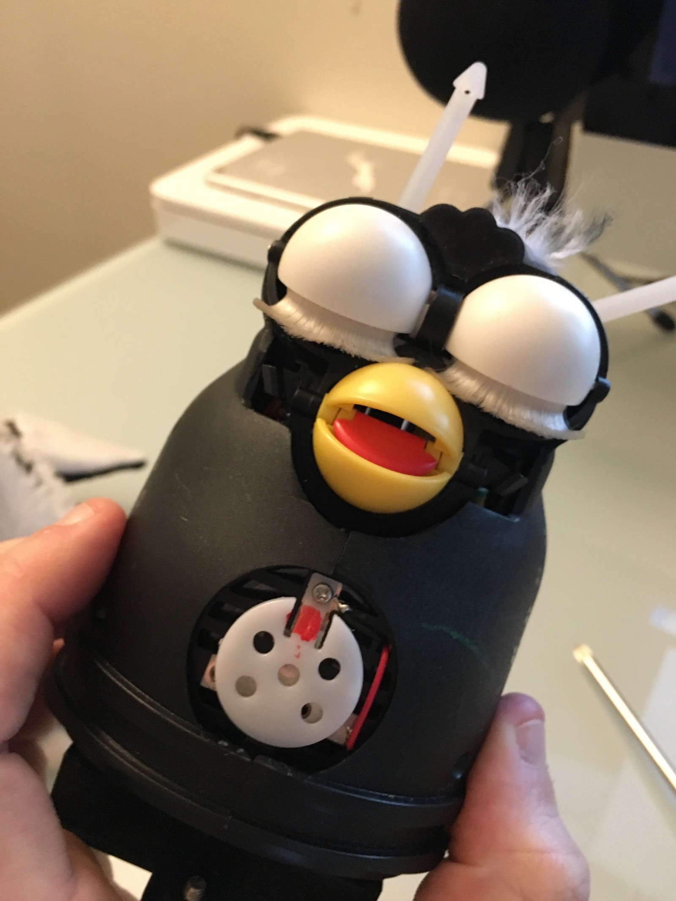

#### Partial Disassembly

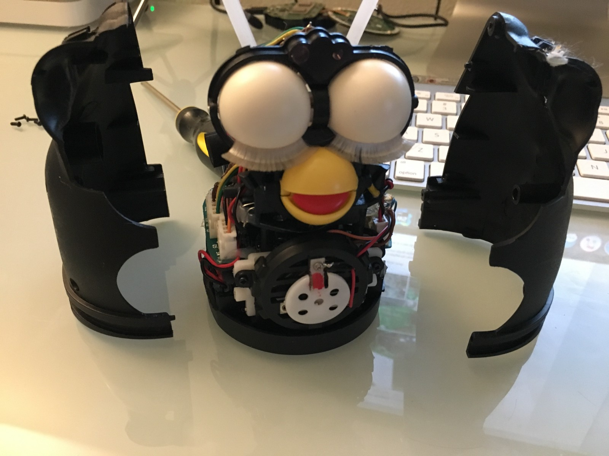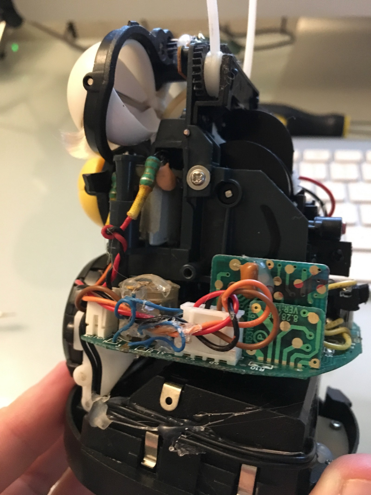

#### Just the Head, that’s all we need.

Now, you can strip the Furby down to just the head. That’s all you’re going to need.

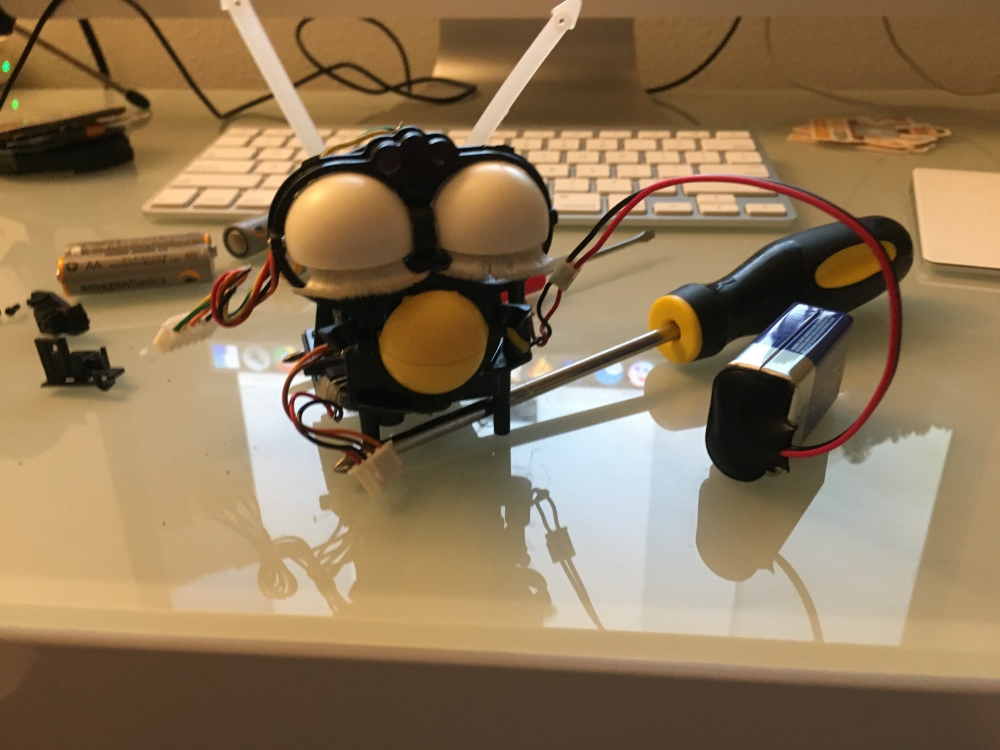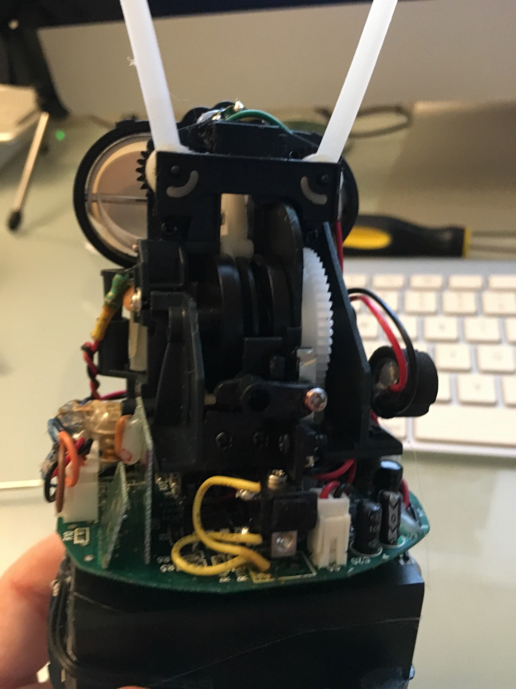

Interestingly, Furby only has one motor driving its entire operation. A complex set of gears cycles through its entire range of motion, with a slotted gear, LED, and sensor giving the Furby Microcontroller feedback on its current position. When speaking, for example, it is quickly reversing movement every second or so.

<Embed src="https://www.youtube.com/embed/u_j0TUBhMFw?feature=oembed" aspectRatio={0.562} />

I’m not going to attempt anything quite as complicated (yet). My first goal is to sync movement with Alexa’s speech. It doesn’t need to be accurate. I’m okay with the cycling, since it simplifies things.

A quick moment of probing with a multimeter helped me discover that the leads on the right (connected) drive the motor to produce movement. Later, we can power the leads on the right to track movement of the gear system, and build a controller with finer control of Furby’s features, but I’ll save that for another time.

Proof of concept: Driving Furby’s Movement

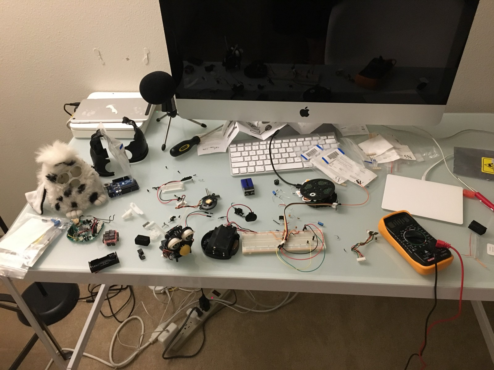

Fitting the Echo hardware inside the Furby, & reassembling everything

Proof of concept, just making sure everything fits.

### Building the Controller

First, I built the entire controller project in a simulator. Simple enough.

It should be simple enough to design a circuit without a Microcontroller, if you’re satisfied with current operations. However, you would need to fiddle around with specific resistor values (vs. iterative programming) to calibrate your project to the specific light values to activate the motor, as well as add a relay & transistor to the circuit. It seems wasteful, but given the low cost ($2) of the Atmega328p, it’s really not worth the trouble. And, it gives us the capability of fine-tuning Furby’s movement in the future.

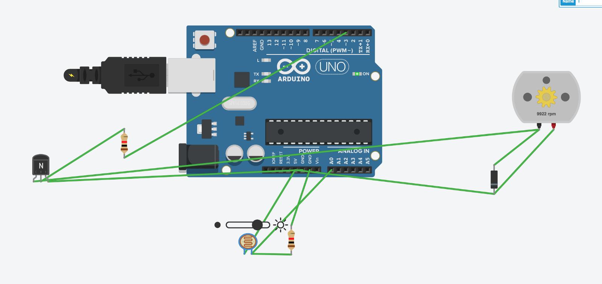

#### Running the Controller Proof of Concept

<Embed src="https://www.youtube.com/embed/Iqo3-MiSIXw?feature=oembed" aspectRatio={0.75} />

### Furlexa Mark II

#### Sound detection vs. photosensor input

For the second attempt at Furlexa, I transitioned my design from light detection & a micro-controller to a simpler circuit, consisting of just three components: a sound-detection circuit, a microphone placed near the Alexa device, and a single transistor (switching circuit).

The prototype

A bit disappointed with the speed of movement. Turns out, it only appears realistic when the movement is constant (regardless of whether noise reaches a volume cutoff or not). But, it’s a compromise. Would need to bring in another micro-controller and write a program which produced more realistic movements if I want to do better (along this approach).

#### Finalizing & Cleanup

Next, I soldered the connections and used a hot-glue gun on all of the components (including the Echo dot board & speaker) to minimize the risk of damage during movement.

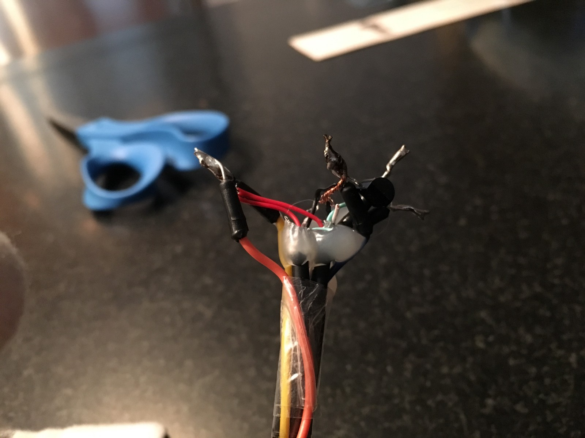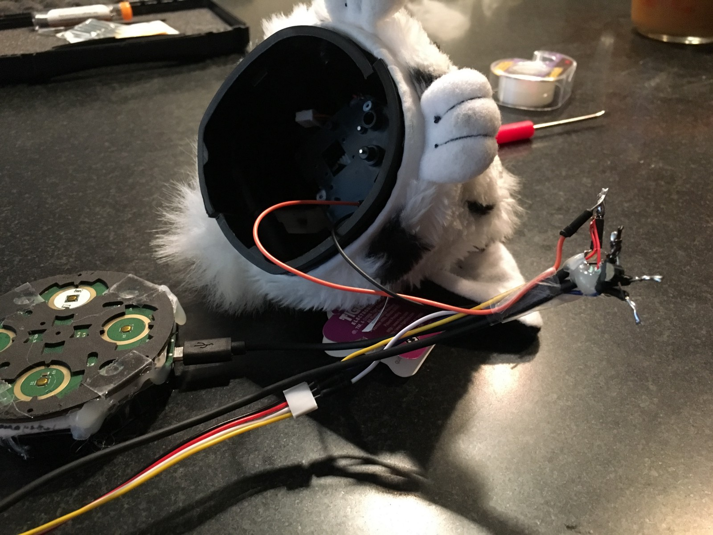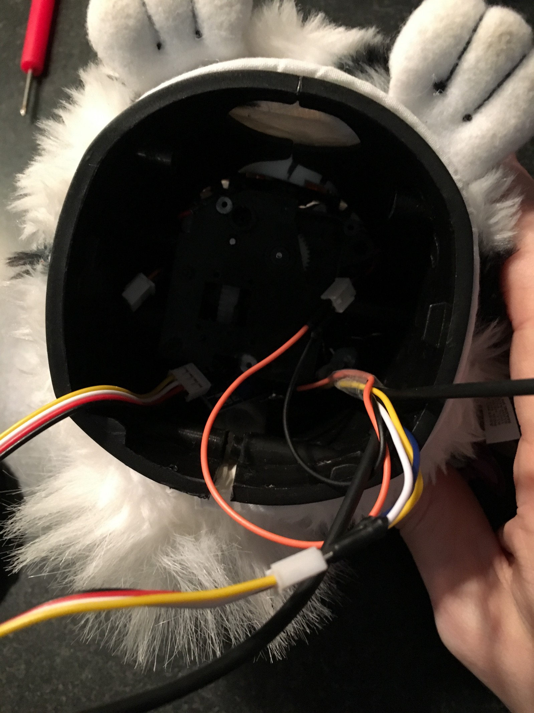

### First Working Trial

First trial

\[That’s it, where I’m currently at. Follow along for updates!\]