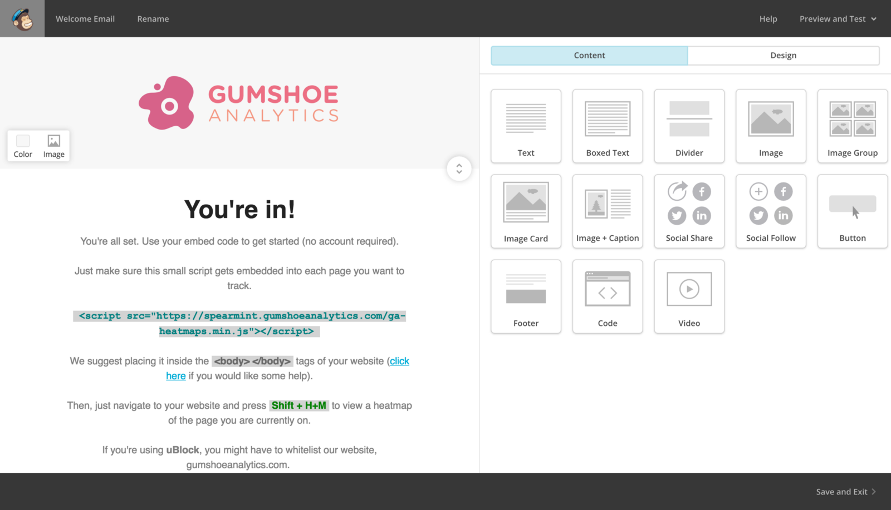
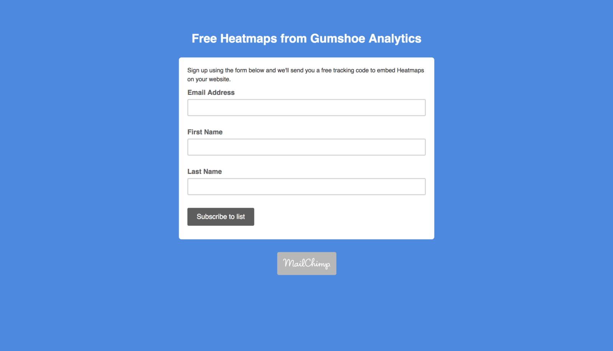
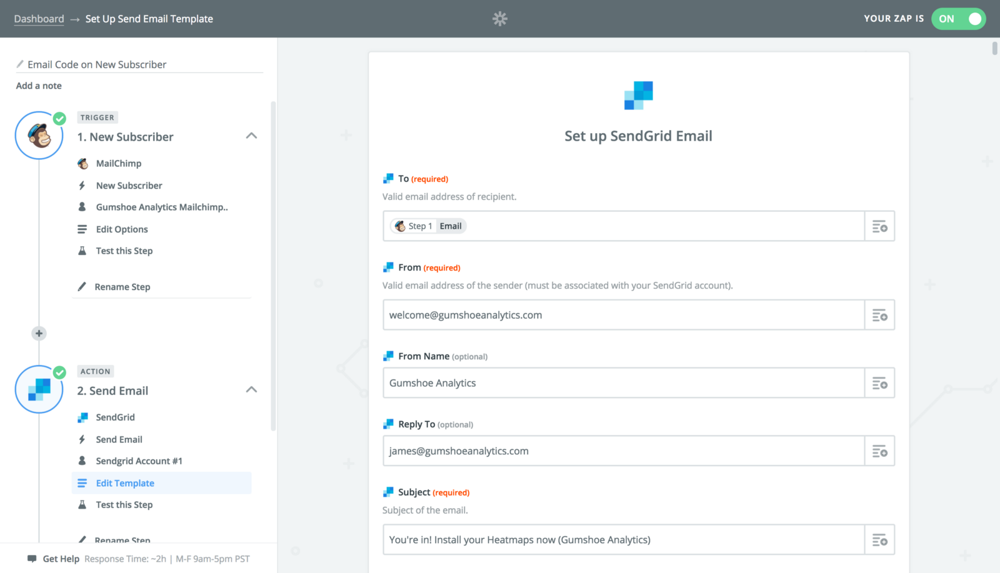

## How to solve user registration for our first 1,000 or so beta signups, in under 10 minutes.

### The problem

We want to distribute the embed code for our Heatmap solution quickly, but we also need to capture email addresses for our new users, otherwise we may never be able to onboard them to a fully-functional Gumshoe Analytics account down the road.

### What should happen

1.  The potential user should visit our website and decide they want to try out Heatmap tool.
2.  The potential user should enter their email address in a form.
3.  This user should be added to our mailing list
4.  The user should receive an email with the embed code

### Designing the Email

To design the email, we chose to use the Mailchimp email designer, since it’s fast and comes with a few halfway-decent transactional email templates, out of the box. **This took about 5 minutes.**

### Building the Mailchimp form

From there, we created a list and a new Mailchimp subscriber form. This generated a unique URL we could link to from our website, so “beta users” can sign up. **This took about 30 seconds.**

### Automating the initial email (with the embed code)

Next, I moved on to **Zapier** to build the automation it takes to send our welcome email, with the Embed code, to our new beta users. **This took about 2 minutes.**

### How scalable is this?

Not very. We have to pay a very high price for Mailchimp if we continue to use this for more than 2,000 subscribers, and a high price for Zapier if we continue to use this for more than 1,000 signups per month.

However, how valuable is it to build this out in under an hour without a developer? **_Priceless._**

So, now we can spend the next couple weeks working on our actual product, and take care of this when we absolutely need to.

#### Wait to figure out scalability when it makes sense to do so.

---

Thanks for taking the time to check this out! Let us know what you think!

**If you’re new to our publication, welcome!**  A month ago, five of us set out to build a startup. We’re documenting & sharing the process, so you can follow along as we build & launch our company, and present it to the world in Vienna this June.