## Setting up an Android Tablet with Meeting Room 365

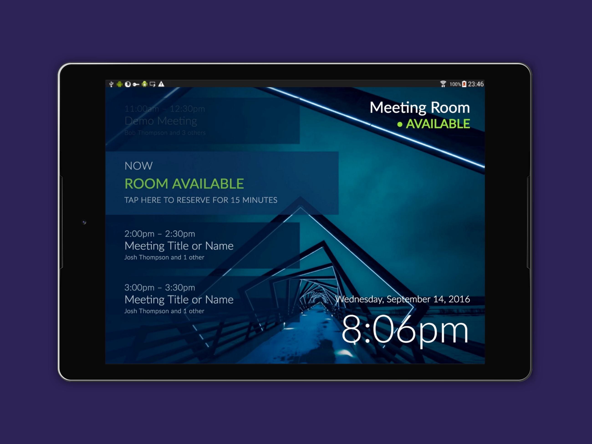

In our previous guide, we walked through the [universal instructions](https://medium.com/@jamesfuthey/how-to-add-a-meeting-room-display-to-office-365-in-5-minutes-diy-6e6ee6d4aec7) for provisioning a new display for Meeting Room 365. In this guide, we’ll walk through the same process, specifically for Android tablets.

_This guide requires Android 5.0 (Lollipop) or newer._

### What you’ll need:

1.  A **small tablet** with a web browser and an internet connection. At least 7" is recommended.
2.  **Mounting hardware**. There are tons of options here. Search Amazon for the mounting hardware that makes the most sense to you, ranging from $3 for 3M velcro mounting adhesive strips, or ~$100 for a secure, aluminum designer mount (Hekler Design).
3.  **Extra-long power cord & Power adapter**. Self-explanatory. You’re going to need a reliable power adapter, and an extra-long power cable that reaches your desired mounting location. We also recommend picking up some **zip ties** or **3M adhesive strips** if you’re worried about dangling cables.
4.  **Office 365 Tenant Credentials** (you’ll need to provision a resource mailbox from your Office 365 Admin panel).
5.  A free **Meeting Room 365** account.

### Create a free Meeting Room 365 Account

Sign up for a Free [**Meeting Room 365**](https://www.meetingroom365.com/) account. This will allow you to create and deploy unlimited, customizable meeting room displays. Pay when you’re ready (each display is free for 30 days, then it’s $5/month per display. Annual & bulk discounts available).

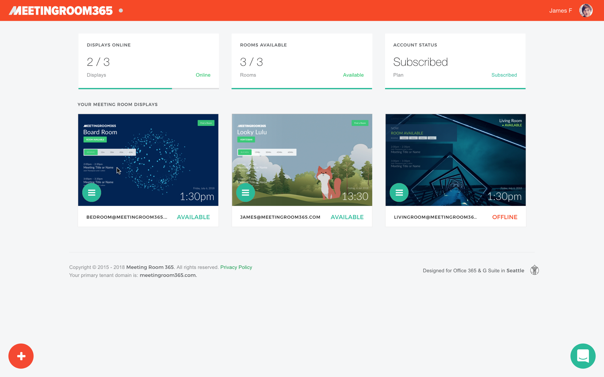

### Configure Office 365

You will need to login to your Office 365 admin portal and provision free meeting room mailboxes. You will not be charged for these meeting-room-only accounts, but they will all get an email address @yourdomain.com (or the onmicrosoft.com variant).

#### 1\. Log into your Office 365 Admin Portal.

Log into [https://portal.office365.com](https://portal.office365.com), and navigate to your **Admin Portal**. You can access the admin portal from the waffle menu.

#### 2\. Create a new meeting room.

To get started, select **‘Rooms & Equipment’** from the left**,** which takes you to [https://admin.microsoft.com/AdminPortal/Home](https://admin.microsoft.com/AdminPortal/Home)

Next, click the plus icon to create a new meeting room.

#### 3\. Configure your new meeting room.

**Name:** You will need to give it a name. This is the name that will be displayed in your Outlook calendar.

**Email:** You will need to create an email address for this room. You can choose whatever you wish, but your users will see this name. You will not be billed for this email address.

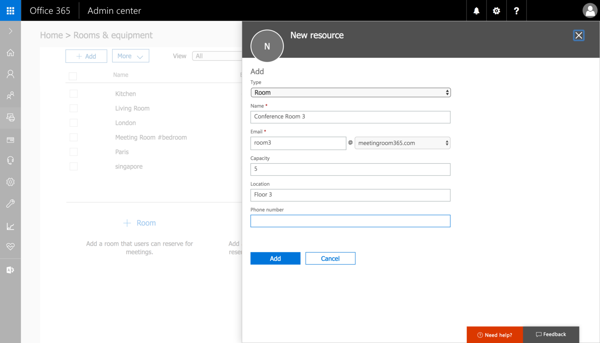

**Room Capacity:** This lets your users see how many attendees can fit into this room. This is a suggestion for your users. It will not limit the number of attendees who can be invited to a calendar event.

#### 4\. Reset the password for the new mailbox.

Before you can link your new mailbox to Meeting Room 365, you will need to reset the password for the new mailbox.

To do this, navigate to **USERS > ACTIVE USERS** in the left navigation, which takes you to: [https://admin.microsoft.com/AdminPortal/Home#/users](https://admin.microsoft.com/AdminPortal/Home#/users)

Next, select the user who corresponds to your meeting room and select **‘Reset Password’** from the right.

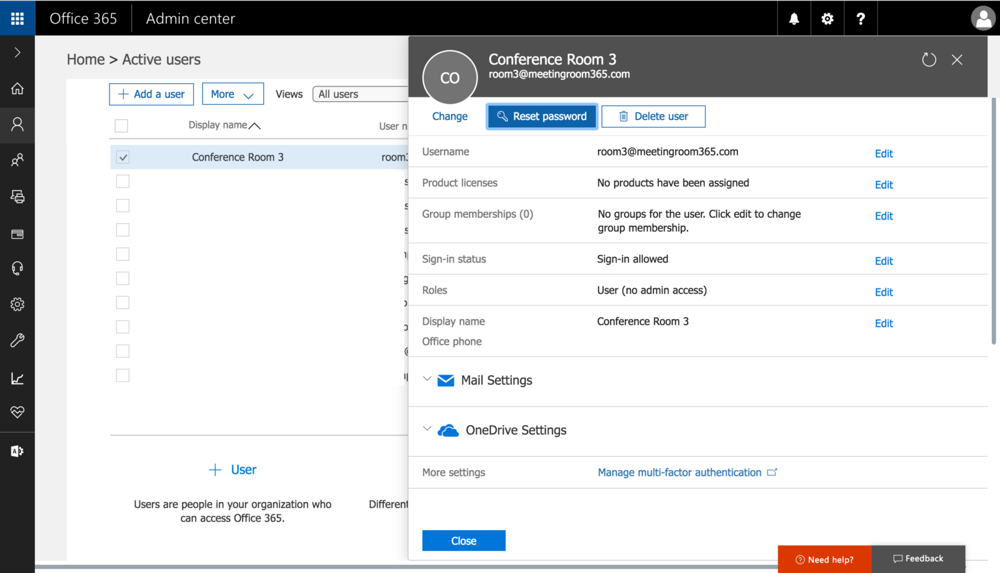

Save the email address and new password. **You will need this to complete the next steps.**

#### 5\. Complete Provisioning in Meeting Room 365

This will provision a display that automatically updates when your meeting room is booked via Outlook.

**Here is a full guide:**

[**Provision a Meeting Room Display in Meeting Room 365**  
_A Guide to Setting up a new Display in Meeting Room 365_medium.com](https://medium.com/meeting-room-365/provision-a-meeting-room-display-in-meeting-room-365-e605a15b9c0c "https://medium.com/meeting-room-365/provision-a-meeting-room-display-in-meeting-room-365-e605a15b9c0c")

### Provision Tablets

Next, you will need to setup your tablet to act as a meeting room display.

We support native apps for most devices on Android, and you can also use any device with a Web Browser, in full-screen mode.

#### Enable Developer Options

First, you’ll need to enable developer mode for your tablet, so you can complete the next step.

To do this, navigate to your **Build Options** screen under **Settings**.

**Stock Android**: Settings > About phone > Build number

**Samsung Galaxy S5**: Settings > About device > Build number

**LG G3**: Settings > About phone > Software information > Build number

**HTC One (M8)**: Settings > About > Software information > More > Build number

Once you’ve found the Build number section of the settings, tap on the section 7 times. After two taps, a small pop up notification should appear saying “you are now X steps away from being a developer” with a number that counts down with every additional tap.

[**How to enable Developer Options on your Android phone or tablet**  
_So you've finally decided to root your phone and install a custom ROM, or maybe you want to sideload an app from your…_www.greenbot.com](https://www.greenbot.com/article/2457986/android/how-to-enable-developer-options-on-your-android-phone-or-tablet.html "https://www.greenbot.com/article/2457986/android/how-to-enable-developer-options-on-your-android-phone-or-tablet.html")

#### Set your device to never sleep when plugged in

Next, under developer options, you will be able to setup your device to stay powered on and never sleep when plugged in. Once you have enabled **Developer options**, check the **_Stay awake_** box to keep your phone from sleeping while you have it plugged in. Of course, pressing the power button will still turn the screen off.

[**How to keep your Android phone's screen on longer**  
_If you've ever wished that the screen on your Android phone or tablet stayed on longer before going to sleep, you're…_www.greenbot.com](https://www.greenbot.com/article/2463970/how-to-keep-your-android-phones-screen-on-longer.html "https://www.greenbot.com/article/2463970/how-to-keep-your-android-phones-screen-on-longer.html")

#### Add Meeting Room 365 to Home screen

Next, if you’re using a full-screen web browser, you’ll want to pin your meeting room to the home screen. This enables it to launch in full-screen mode, and is handy if it accidentally gets switched off.

First, navigate to your **meeting room display URL** on your tablet using the **Chrome Browser**. The default meeting room display URL is: [https://app.meetingroom365.com/intro](https://app.meetingroom365.com/intro)

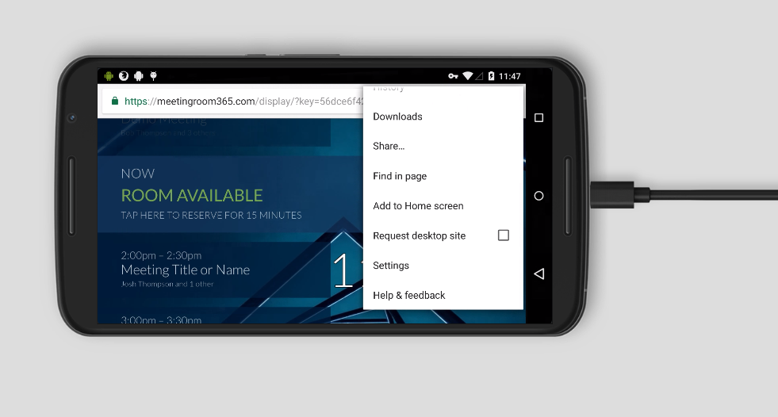

Next, click on the **options menu** (three dots), and select **“Add to Home screen”**.

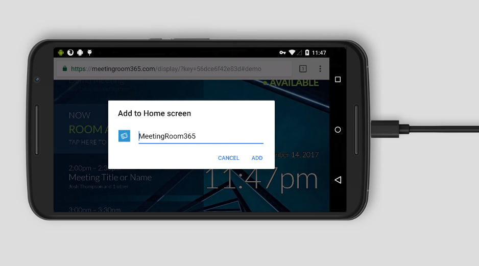

Your display will now appear as an app icon from the home screen of your tablet. You can now launch it by tapping the icon on your home screen.

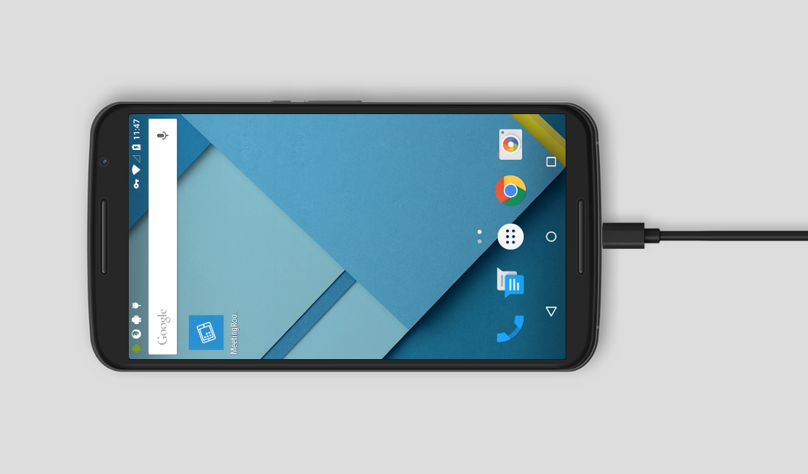

[**Add to Home screen - Google Chrome**  
_Since Chrome 31, you can set up your web app to have an application shortcut icon added to a device's homescreen, and…_developer.chrome.com](https://developer.chrome.com/multidevice/android/installtohomescreen "https://developer.chrome.com/multidevice/android/installtohomescreen")

#### Enable Pin Task Mode

Next, you can enable pin-task mode to prevent your visitors from browsing away from your display.

To do this, navigate to **Settings**, and then **Security**. **Screen Pinning** should be an option listed near the end, under **Advanced**.

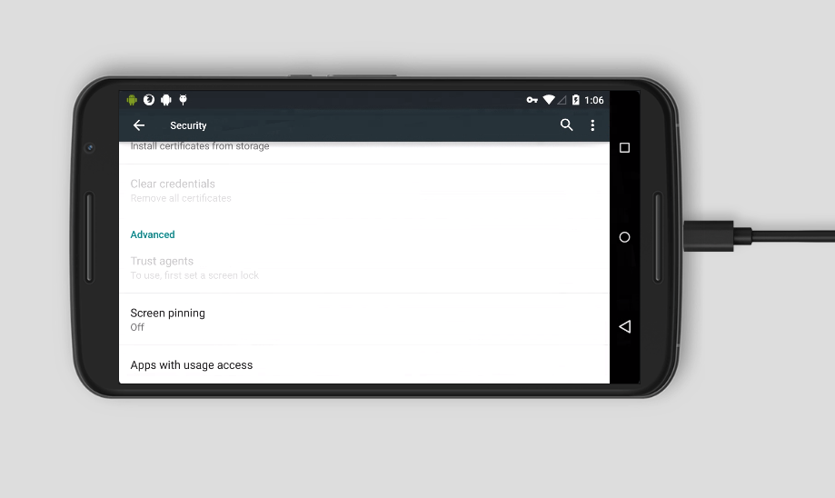

Tap **Screen Pinnning**, and flip the slider to **on**.

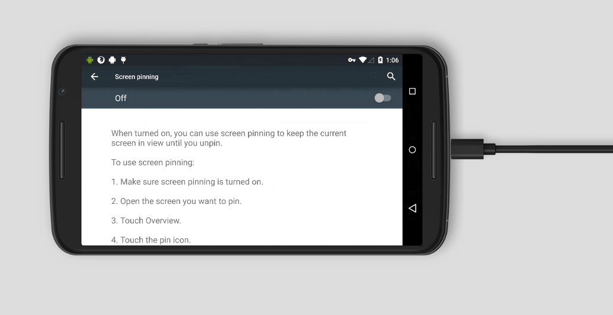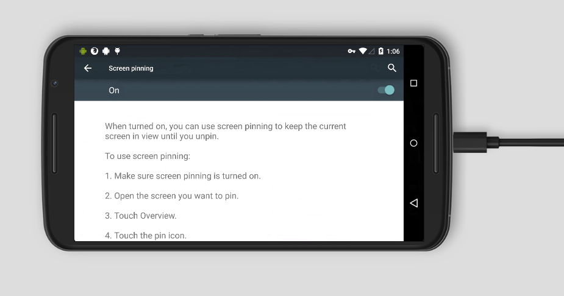

Next, tap the Square **Overview Button**, and find the application you want to pin.

#### Enter Pin Task Mode

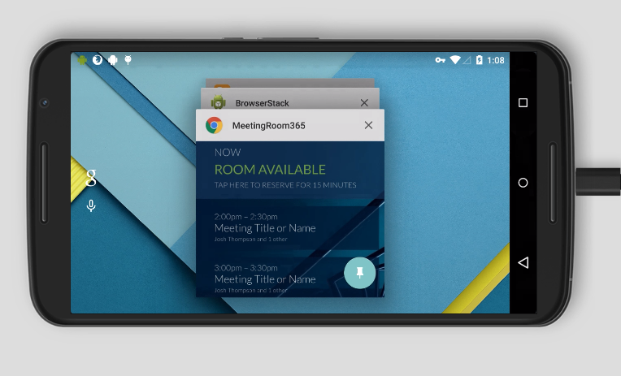

Next, **tap the pin icon in the lower-right corner**. You will see a prompt confirming that you wish to use Screen Pinning. Click **Start**.

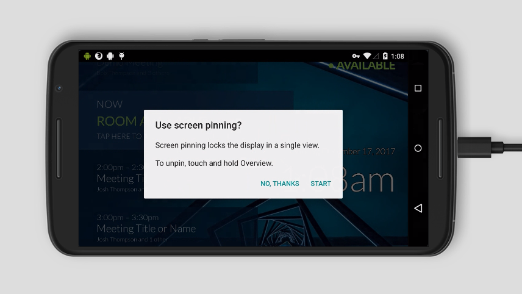

Your device is now pinned. To unpin, **press and hold the overview button**.

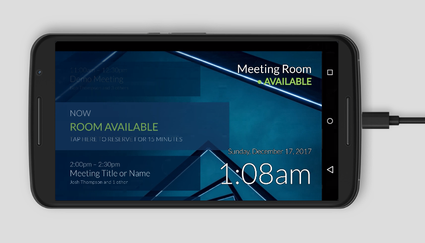

[**How to use screen pinning in Android Lollipop? - Android Guides**  
_What is screen pinning in Android Lollipop? Screen pinning allows you to pin (lock) the screen to a certain app. This…_gadgetguideonline.com](http://gadgetguideonline.com/android/lollipop/how-to-use-screen-pinning-in-android-lollipop/ "http://gadgetguideonline.com/android/lollipop/how-to-use-screen-pinning-in-android-lollipop/")

#### Congratulations! Your device has been provisioned.

### Next Steps

#### Mounting Options

An inexpensive **universal tablet mount**: [https://www.amazon.com/Damage-free-Dockem-Smartphones-eReaders-chrome-plated/dp/B008E0Q0C0/](https://www.amazon.com/Damage-free-Dockem-Smartphones-eReaders-chrome-plated/dp/B008E0Q0C0/)

Looking for an “invisible mounting solution”? Try this **invisible mount** [https://www.amazon.com/PadTab-Damage-Free-Universal-locations-smartphones/dp/B01EBAOUZ0/](https://www.amazon.com/PadTab-Damage-Free-Universal-locations-smartphones/dp/B01EBAOUZ0/)

or **3m velcro adhesive strips** [https://www.amazon.com/3M-Company-RF9731-Re-Close-Strip/dp/B001LTTNOI/](https://www.amazon.com/3M-Company-RF9731-Re-Close-Strip/dp/B001LTTNOI/)

### Locking Down your Display (OPTIONAL)

We’ve found a third-party app which may be useful for Android devices, called **Autostart and StaY!**

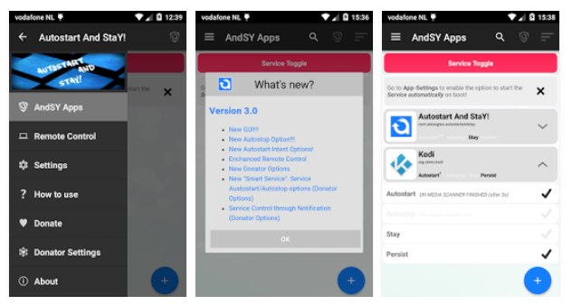

It locks down the display, so that the screen never dims, the app automatically launches on tablet restart, and it prevents users from navigating away from the Meeting Room display.

[**Autostart and StaY! - Android Apps on Google Play**  
_The best - most advanced - Autostart App in the market!_play.google.com](https://play.google.com/store/apps/details?id=com.atasoglou.autostartandstay&hl=en "https://play.google.com/store/apps/details?id=com.atasoglou.autostartandstay&hl=en")

Please note, if you enable **persistent mode**, you’ll need another android device to remotely exit your app. You’ll also need to enable remote management from the **Autostart and StaY!** app.

### Mount Displays

Once everything is set up, you’re ready to mount your displays. This is probably the most challenging part of this guide.

Depending on the hardware you choose, you will either need to mount your display using 3m adhesive (fastest), or drywall / mounting screws.

For instance, the Koala Mount consists of two small, sturdy plastic brackets that gently cradle your device. Designed to be used with 3M Command Strips (included). The strips are rated to hold up to 5 lbs each (far more than any tablet). To remove, the strips can simply be stretched off without causing any damage.

### Other Considerations

By default, in Office 365, a [**Resource mailbox’s calendar will show the organizer’s name instead of the subject in an Exchange Server environment**](https://support.microsoft.com/en-us/help/2842288/resource-mailbox-s-calendar-shows-the-organizer-s-name-instead-of-the)**.** You will need to run a short PowerShell command to solve this issue.

[**Meeting Room 365**](https://meetingroom365.com/) will run this automatically for you after your tablet is provisioned.

#### Power

You will also need to provide continuous power to your display. Fortunately, Extra-long USB cables for most tablets can be purchased inexpensively on Amazon, along with cable clips and more 3m adhesive tape (optional).

### Thanks for reading!

Please Recommend and Share if you found this article useful!