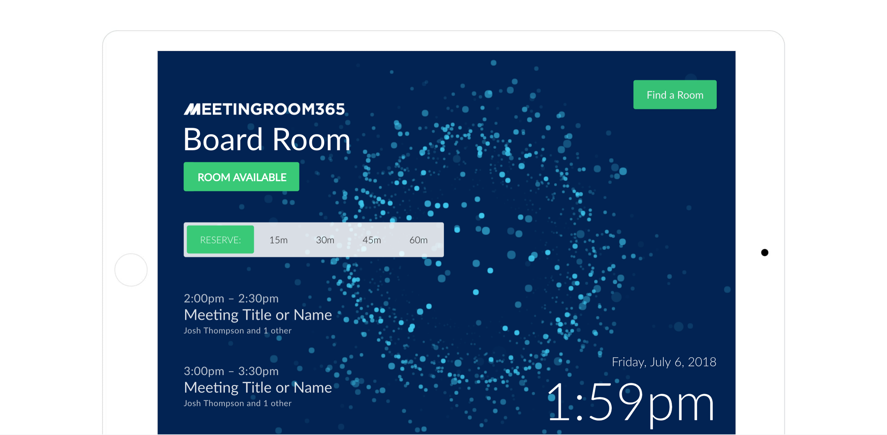
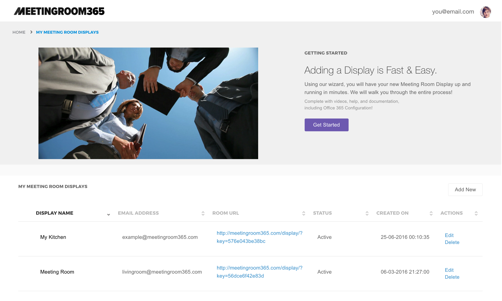
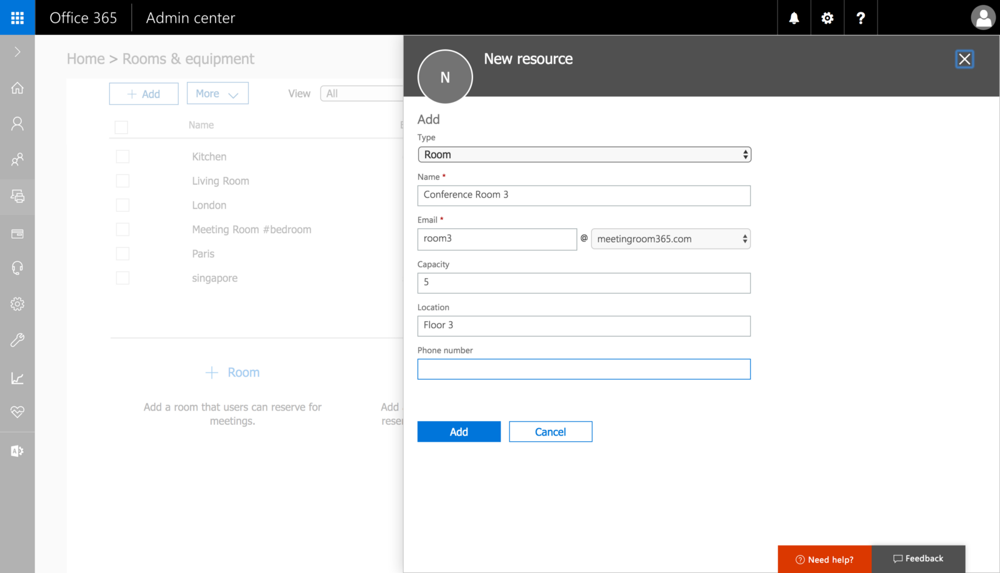
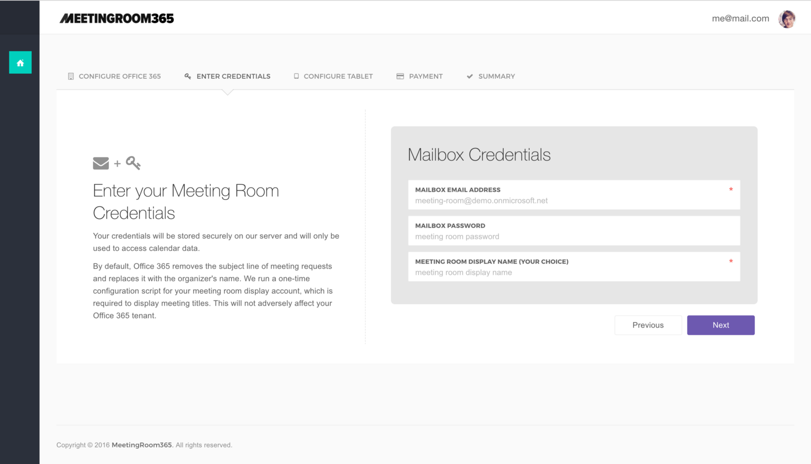
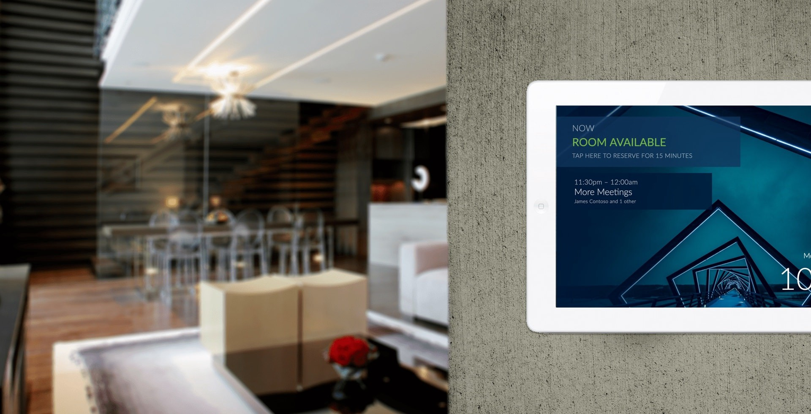

## Mount any tablet or iPad outside your conference rooms as a meeting room display, and keep your space organized

### What you’ll need:

1.  A **small tablet** with a web browser and an internet connection. At least 8" is recommended. **Android**, **iOS**, and **Windows** will work great.
2.  **Mounting hardware**. There are tons of options here. Search Amazon for the mounting hardware that makes the most sense to you, ranging from $3 for 3M velcro mounting adhesive strips, or $100 for a secure, aluminum designer mount (Hekler Design).
3.  **Extra-long power cord & Power adapter**. Self-explanatory. You’re going to need a reliable power adapter, and an extra-long power cable that reaches your desired mounting location. We also recommend picking up some **zip ties** or **3M adhesive strips** if you’re worried about dangling cables.
4.  **Office 365 Tenant Credentials**
5.  A free **Meeting Room 365** account.

---

### Looking for a device-specific guide?

> We’re currently in the process of writing device-specific guides for popular tablet options. Here’s what we’ve got so far:

[**How to Add a Meeting Room Display to Office 365 \[iPad Version\]**  
_Setting up an iPad with Meeting Room 365_medium.com](https://medium.com/@jamesfuthey/how-to-add-a-meeting-room-display-to-office-365-ipad-version-24b1338702c "https://medium.com/@jamesfuthey/how-to-add-a-meeting-room-display-to-office-365-ipad-version-24b1338702c")

[**How to Add a Meeting Room Display to Office 365 \[Android Tablets\]**  
_Setting up an Android Tablet with Meeting Room 365_medium.com](https://medium.com/@jamesfuthey/how-to-add-a-meeting-room-display-to-office-365-android-tablets-70dca93afc92 "https://medium.com/@jamesfuthey/how-to-add-a-meeting-room-display-to-office-365-android-tablets-70dca93afc92")

[**How to use the Amazon Fire Tablet as an Office 365 Meeting Room Display / Conference Room signage…**  
_See how I set up meeting room display kiosks for Office 365 at just $27.41 per room, with ultra-cheap Fire tablets from…_medium.com](https://medium.com/@jamesfuthey/how-to-use-the-amazon-fire-tablet-as-an-office-365-meeting-room-display-conference-room-signage-777b7a793e1d "https://medium.com/@jamesfuthey/how-to-use-the-amazon-fire-tablet-as-an-office-365-meeting-room-display-conference-room-signage-777b7a793e1d")

[**Using a Raspberry Pi as a Meeting Room Display \[Office 365\] \[DIY\]**  
_How to Add a Meeting Room Display to Office 365_medium.com](https://medium.com/@jamesfuthey/using-a-raspberry-pi-as-a-meeting-room-display-office-365-diy-ad34b8c3e5da "https://medium.com/@jamesfuthey/using-a-raspberry-pi-as-a-meeting-room-display-office-365-diy-ad34b8c3e5da")

We also have a guide for the Public Beta of the new version of our software, if you would like to take a sneak peek:

[**Getting Started with Meeting Room 365 (New Version, Public Beta)**  
_How to get set up with the Meeting Room 365 Public Beta, and provision your first displays._medium.com](https://medium.com/@jamesfuthey/getting-started-with-meeting-room-365-public-beta-adb981c958f5 "https://medium.com/@jamesfuthey/getting-started-with-meeting-room-365-public-beta-adb981c958f5")

---

### Create a free MeetingRoom365 Account

Sign up for a Free [**MeetingRoom365**](https://www.meetingroom365.com/) account. This will allow you to create and deploy unlimited, customizable meeting room displays. Pay when you’re ready (each display is free for 30 days, then it’s $5/month per display. Annual discounts available). [View Demo](https://meetingroom365.com/display/?key=56dce6f42e83d#demo).

### Configure Office 365

You will need to login to your Office365 center and provision free meeting room mailboxes. You will not be charged for these meeting-room-only accounts, but they will all get an email address @yourdomain.com.

#### 1\. Log into your Office 365 Admin Portal.

Log into [portal.office365.com](http://portal.office365.com/), and navigate to your **Admin Portal**. You can access the admin portal from the waffle menu.

#### 2\. Create a new meeting room.

To get started, select the **‘Meeting Rooms’** tab from the left. If you’re using the new Admin Center Preview, this is called **‘Rooms & Equipment’**.

Next, click the plus icon to create a new meeting room.

#### 3\. Configure your new meeting room.

**Name:** You will need to give it a name. This is the name that will be displayed in your Outlook calendar.

**Email:** You will need to create an email address for this room. You can choose whatever you wish, but your users will see this name. You will not be billed for this email address.

**Room Capacity:** This lets your users see how many atendees can fit into this room. This is a suggestion for your users. It will not limit the number of atendees who can be invited to a calendar event.

#### 4\. Reset the password for the new mailbox.

Before you can link your new mailbox to MeetingRoom365, you will need to reset the password for the new mailbox.

To do this, navigate to **USERS > ACTIVE USERS** in the left navigation.

Next, select the user who corresponds to your meeting room and select **‘Reset Password’** from the right.

Save the email address and new password. **You will need this to complete the next steps.**

#### 5\. Complete Provisioning in MeetingRoom365

This will provision a display that automatically updates when your meeting room is booked via Outlook.

### Provision Tablets

Next, you will need to setup your tablet to act as a meeting room display. You can use any tablet with a Web Browser, including the Surface, iPad, and inexpensive Android tablets.

You can configure any tablet with a full-screen web browser to run MeetingRoom365, such as the iPad, any Android Tablet, or Windows tablet. Configuration steps may vary depending on the model you have selected.

#### Haven’t selected a tablet yet?

We recommend the [iPad Mini](http://www.apple.com/shop/buy-ipad/ipad-mini-2) (any generation) and the [Heckler Design Wall Mount](http://hecklerdesign.com/shop/highsign/).

Apple usually has inexpensive inventory of the [Refurbished iPad Mini 2](https://www.apple.com/shop/browse/home/specialdeals/ipad/ipad_mini_2) that makes for a really stunning display.

#### Other Hardware

Looking for something cheaper?

You could try the **8" NuVision Windows 10 Tablet ($60)** [https://www.amazon.com/gp/product/B01MYZEPGP/](https://www.amazon.com/gp/product/B01MYZEPGP/)

and an inexpensive **universal tablet mount**: [https://www.amazon.com/Damage-free-Dockem-Smartphones-eReaders-chrome-plated/dp/B008E0Q0C0/](https://www.amazon.com/Damage-free-Dockem-Smartphones-eReaders-chrome-plated/dp/B008E0Q0C0/)

---

Looking for an “invisible mounting solution”? Try this **invisible mount** [https://www.amazon.com/PadTab-Damage-Free-Universal-locations-smartphones/dp/B01EBAOUZ0/](https://www.amazon.com/PadTab-Damage-Free-Universal-locations-smartphones/dp/B01EBAOUZ0/)

or **3m velcro adhesive strips** [https://www.amazon.com/3M-Company-RF9731-Re-Close-Strip/dp/B001LTTNOI/](https://www.amazon.com/3M-Company-RF9731-Re-Close-Strip/dp/B001LTTNOI/)

### Mount Displays

Once everything is set up, you’re ready to mount your displays. This is probably the most challenging part of this guide.

Depending on the hardware you choose, you will either need to mount your display using 3m adhesive (fastest), or drywall / mounting screws.

For instance, the Koala Mount consists of two small, sturdy plastic brackets that gently cradle your device. Designed to be used with 3M Command Strips (included). The strips are rated to hold up to 5 lbs each (far more than any tablet). To remove, the strips can simply be stretched off without causing any damage.

### Configure your tablet for Kiosk mode

Next, you’ll probably want to configure your tablet so that it doesn’t **put it’s display to sleep**, or **power down on idle**. For most hardware, this is called **Kiosk Mode**, and you can find instructions for most devices by googling `<Tablet Name> Kiosk Mode.`

If you have an iPad, for example, the quickest solution is to enable **“Guided Access”**. Howtogeek has a detailed tutorial for how to do this on an iPad:

[**How to Put an iPad Into "Kiosk" Mode, Restricting It to a Single App**  
_An iPad makes a great "kiosk" device-a tablet restricted to one specific app for your home or small business. You can…_www.howtogeek.com](https://www.howtogeek.com/252670/how-to-put-an-ipad-into-kiosk-mode-restricting-it-to-a-single-app/ "https://www.howtogeek.com/252670/how-to-put-an-ipad-into-kiosk-mode-restricting-it-to-a-single-app/")

If you’re on **Android**, it’s called **“Pin-task mode”**:

[**How to use screen pinning in Android Lollipop? - Android Guides**  
_What is screen pinning in Android Lollipop? Screen pinning allows you to pin (lock) the screen to a certain app. This…_gadgetguideonline.com](http://gadgetguideonline.com/android/lollipop/how-to-use-screen-pinning-in-android-lollipop/ "http://gadgetguideonline.com/android/lollipop/how-to-use-screen-pinning-in-android-lollipop/")

Note: If you want to further “lock down” your Android device, try **“Lock-task mode”**:

[**Set up Single-Purpose Devices | Android Developers**  
_Learn how to develop single-use solutions for Android devices._developer.android.com](https://developer.android.com/work/cosu.html "https://developer.android.com/work/cosu.html")

If you’re on **Windows**, you can use this guide to create a Kiosk:

[**Set up a kiosk on Windows 10 Pro, Enterprise, or Education (Windows 10)**  
_Looking for Windows Embedded 8.1 Industry information? See Assigned Access A single-use or kiosk device is easy to set…_docs.microsoft.com](https://docs.microsoft.com/en-us/windows/configuration/set-up-a-kiosk-for-windows-10-for-desktop-editions "https://docs.microsoft.com/en-us/windows/configuration/set-up-a-kiosk-for-windows-10-for-desktop-editions")

#### Other things to Consider

#### Power

You will also need to provide continuous power to your display. Fortunately, Extra-long USB cables for most tablets can be purchased inexpensively on Amazon, along with cable clips and more 3m adhesive tape (optional).

### Optional Steps

#### **1\. Creating a Home Screen App Launcher**

You can refer to one of the following guides to create a shortcut to this page on your homescreen. By creating a shortcut, this app will open in a fullscreen window.

[**iPad:** Creating a Home Screen Bookmark](http://www.quepublishing.com/articles/article.aspx?p=2266925&seqNum=5)

[**All Devices:** Creating a Home Screen Bookmark](http://www.howtogeek.com/196087/how-to-add-websites-to-the-home-screen-on-any-smartphone-or-tablet/)

[**Windows Devices:** Launching a full-screen browser window on a tablet browser (without a keyboard)](https://youtu.be/WP27LuOFwos?t=20s)

### Look & Feel Customization

We now have a short guide that covers custom style, theme, and layout options:

[**Customizing your Display’s Look & Feel \[Meeting Room 365\]**  
_Creating custom themes, layouts, and styles for Meeting Room 365 Displays_medium.com](https://medium.com/@jamesfuthey/customizing-your-displays-look-feel-meeting-room-365-16939dce8aec "https://medium.com/@jamesfuthey/customizing-your-displays-look-feel-meeting-room-365-16939dce8aec")

### Localization

We’ve put together a short guide on localizing your display. Check it out!

[**How to Localize your Meeting Room 365 Display (Office 365)**  
_Customize language, time format, and other options_medium.com](https://medium.com/@jamesfuthey/how-to-localize-your-meeting-room-365-display-office-365-2432d8ef48c6 "https://medium.com/@jamesfuthey/how-to-localize-your-meeting-room-365-display-office-365-2432d8ef48c6")

### Other Considerations

By default, in Office365, a [**Resource mailbox’s calendar will show the organizer’s name instead of the subject in an Exchange Server environment**](https://support.microsoft.com/en-us/help/2842288/resource-mailbox-s-calendar-shows-the-organizer-s-name-instead-of-the)**.** You will need to run a short PowerShell command to solve this issue.

[**Meeting Room 365**](https://meetingroom365.com/) will run this automatically for you after your tablet is provisioned.

---

### If you’re stuck, you can always send an email to [**Meeting Room 365**](https://meetingroom365.com/), and they can help you out with setup, configuration, and provisioning.

---

### Thanks for reading!

Please Recommend and Share if you found this article useful!