## Setting up an iPad with Meeting Room 365

In our previous guide, we walked through the [universal instructions](https://medium.com/@jamesfuthey/how-to-add-a-meeting-room-display-to-office-365-in-5-minutes-diy-6e6ee6d4aec7) for provisioning a new display for Meeting Room 365. In this guide, we’ll walk through the same process, specifically for Android tablets.

_This guide requires an iPad running iOS._

### What you’ll need:

1.  A **small tablet** with a web browser and an internet connection. At least 7" is recommended. All versions of the iPad work well as meeting room displays (including refurbished and older out-of-production models).
2.  **Mounting hardware**. There are tons of options here. Search Amazon for the mounting hardware that makes the most sense to you, ranging from $3 for 3M velcro mounting adhesive strips, or ~$100 for a secure, aluminum designer mount (Hekler Design).
3.  **Extra-long power cord & Power adapter**. Self-explanatory. You’re going to need a reliable power adapter, and an extra-long power cable that reaches your desired mounting location. We also recommend picking up some **zip ties** or **3M adhesive strips** if you’re worried about dangling cables.
4.  **Office 365 Tenant Credentials** (you’ll need to provision a resource mailbox from your Office 365 Admin panel).
5.  A free **Meeting Room 365** account.

### Create a free Meeting Room 365 Account

Sign up for a Free [**Meeting Room 365**](https://www.meetingroom365.com/) account. This will allow you to create and deploy unlimited, customizable meeting room displays. Pay when you’re ready (each display is free for 30 days, then it’s $5/month per display. Annual & bulk discounts available).

### Configure Office 365

You will need to login to your Office365 center and provision free meeting room mailboxes. You will not be charged for these meeting-room-only accounts, but they will all get an email address @yourdomain.com.

#### 1\. Log into your Office 365 Admin Portal.

Log into [portal.office365.com](http://portal.office365.com/), and navigate to your **Admin Portal**. You can access the admin portal from the waffle menu.

#### 2\. Create a new meeting room.

To get started, select the **‘Meeting Rooms’** tab from the left. If you’re using the new Admin Center Preview, this is called **‘Rooms & Equipment’**.

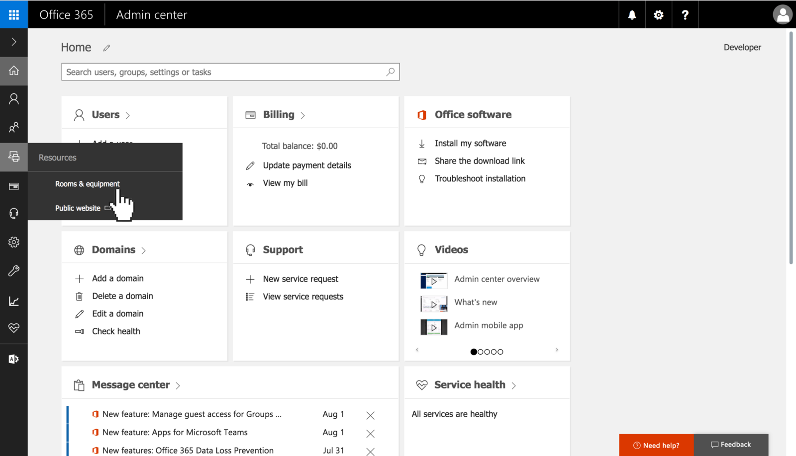

Next, click the plus icon to create a new meeting room.

#### 3\. Configure your new meeting room.

**Name:** You will need to give it a name. This is the name that will be displayed in your Outlook calendar.

**Email:** You will need to create an email address for this room. You can choose whatever you wish, but your users will see this name. You will not be billed for this email address.

**Room Capacity:** This lets your users see how many atendees can fit into this room. This is a suggestion for your users. It will not limit the number of atendees who can be invited to a calendar event.

#### 4\. Reset the password for the new mailbox.

Before you can link your new mailbox to MeetingRoom365, you will need to reset the password for the new mailbox.

To do this, navigate to **USERS > ACTIVE USERS** in the left navigation.

Next, select the user who corresponds to your meeting room and select **‘Reset Password’** from the right.

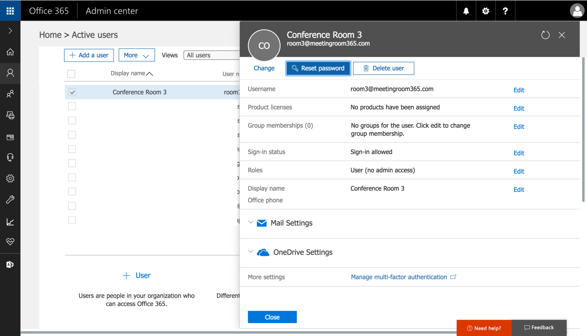

Save the email address and new password. **You will need this to complete the next steps.**

#### 5\. Complete Provisioning in MeetingRoom365

This will provision a display that automatically updates when your meeting room is booked via Outlook.

**Here is a full guide:**

[**Provision a Meeting Room Display in Meeting Room 365**  
_A Guide to Setting up a new Display in Meeting Room 365_medium.com](https://medium.com/meeting-room-365/provision-a-meeting-room-display-in-meeting-room-365-e605a15b9c0c "https://medium.com/meeting-room-365/provision-a-meeting-room-display-in-meeting-room-365-e605a15b9c0c")

### Provision Tablets

Next, you will need to setup your iPad to act as a meeting room display.

#### Setup display to Never Lock

Navigate to **Settings**, and select **Display & Brightness**. Next, adjust the brightness to your desired level, and set **“Auto-Lock”** to **“Never”**. This will prevent the display from powering off when idle.

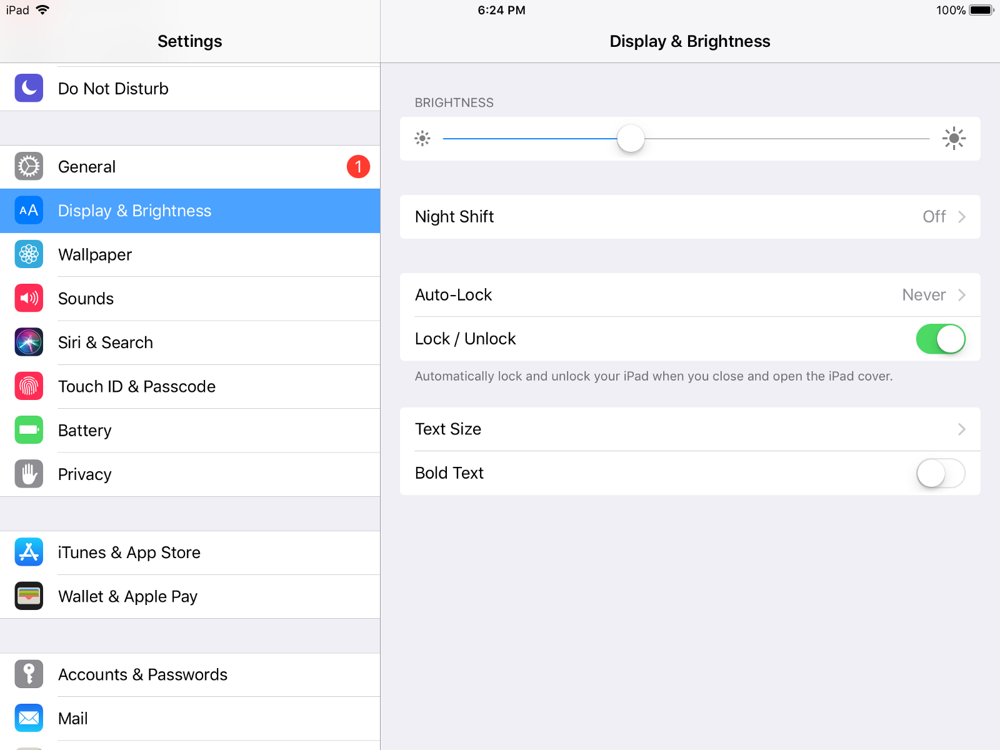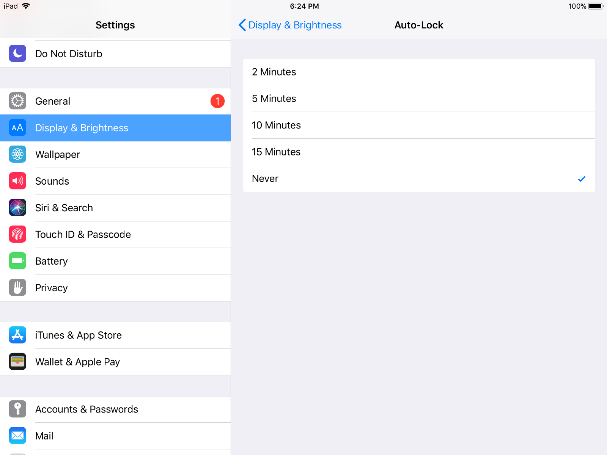

Optionally, you may want to lock orientation by swiping up from the bottom of the screen and enabling **lock orientation**.

#### Enable Guided Access Mode

Next, you’ll enable **“Guided Access mode”**. This locks down your tablet so it can be used as a Kiosk.

From the settings menu, click **General**, and then **Accessibility**.

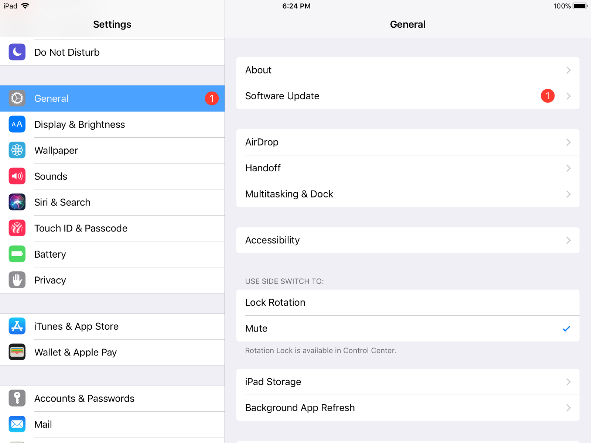

Next, scroll to the bottom, and click **“Guided Access”**.

Next, enable Guided Access, and (optionally), set a passcode. This will require a passcode to unlock your device from Kiosk mode. Note: this is a separate passcode than your tablet pass code.

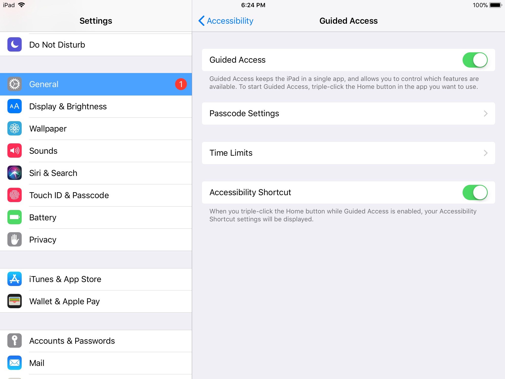

#### Pin your display to the home screen

Next, you will need to pin your display to your homescreen.

Navigate to the **Unique Display URL** you provisioned in Meeting Room 365 using the **Safari browser**.

Next, click the share button in the upper-right corner of the screen.

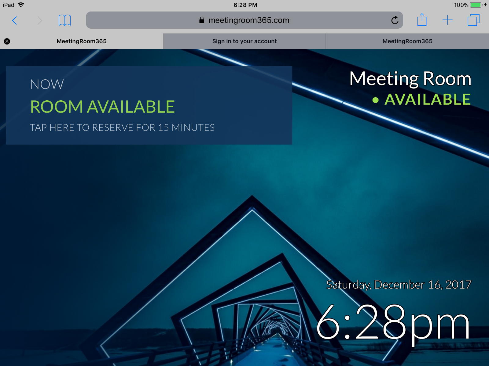

Next, in the bottom drawer, slide right until you reach an option titled **“Add to Home Screen”**

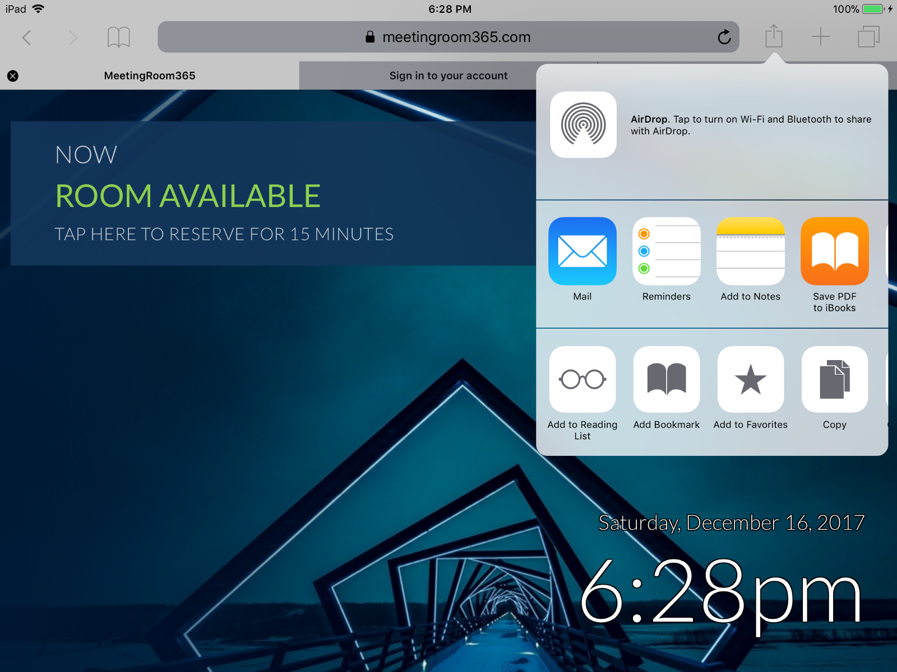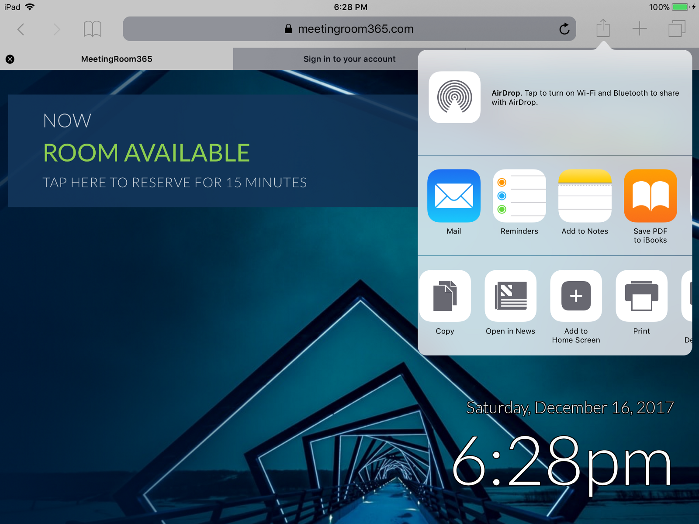

Next, tap **“Add to Home Screen”**.

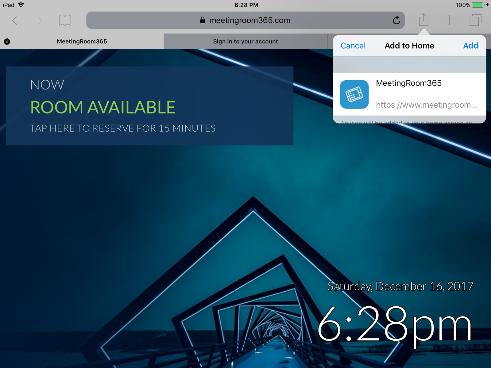

That’s it. Now that your app is on your home screen, and you can launch it to Full Screen mode by **tapping the icon**.

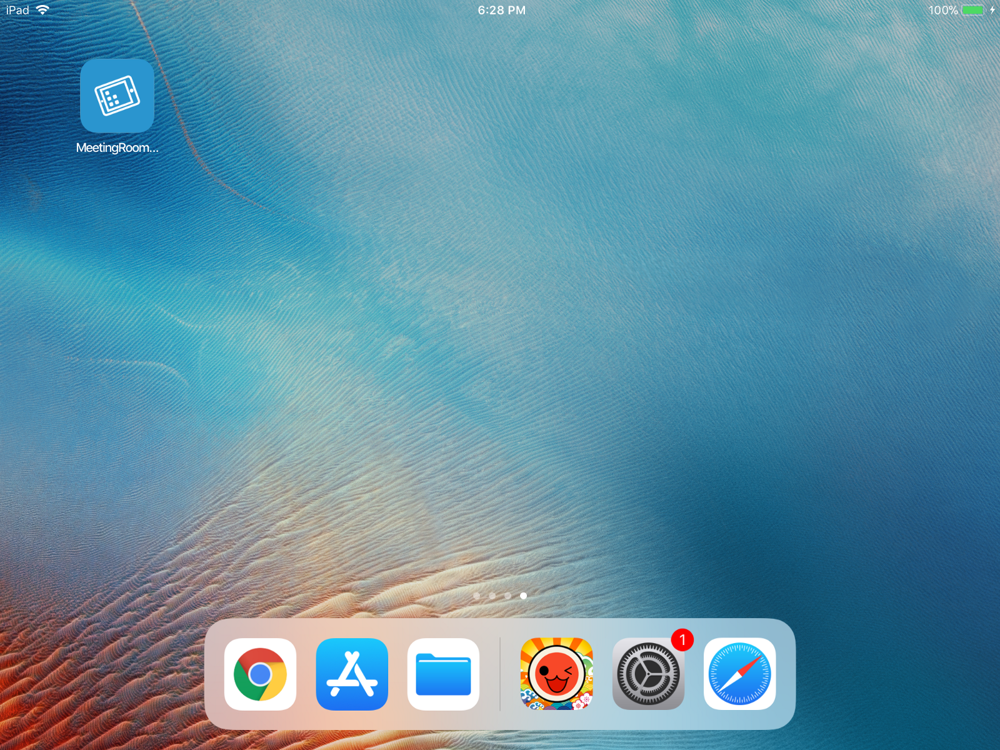

#### Enter Guided Access Mode

Next, you’ll want to enable Guided Access mode. Make sure you have your Kiosk Application open before proceeding.

To do this, **press the home button three times**. You’ll get some options.

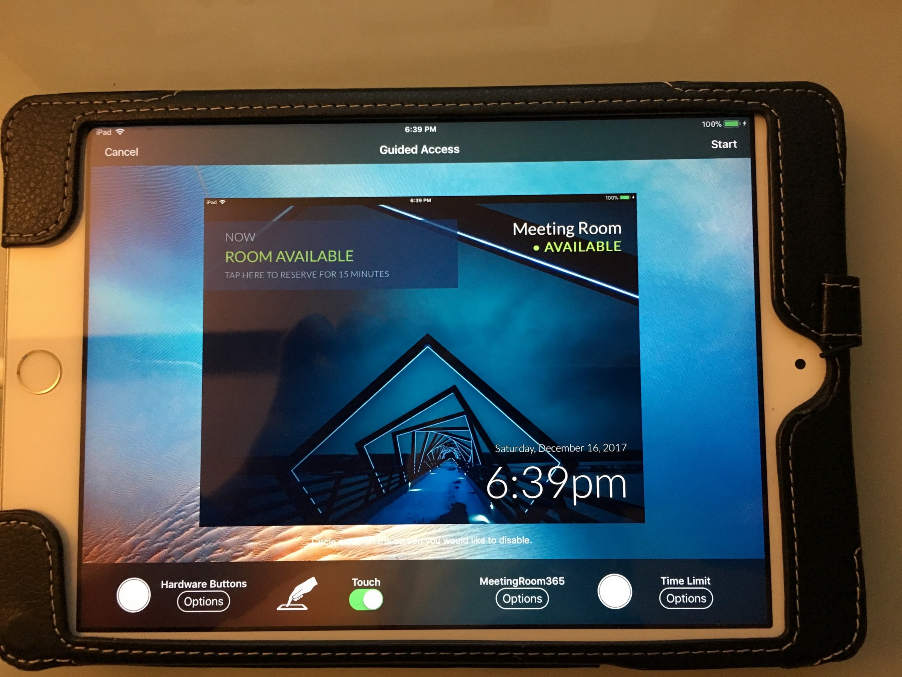

Make sure you don’t set a time limit. Press **Start**.

You may be asked to create a PIN. Remember it, this will be required to unlock your iPad.

To exit kiosk mode, press the home key three times (again), and enter your pin.

[**How to Put an iPad Into "Kiosk" Mode, Restricting It to a Single App**  
_An iPad makes a great "kiosk" device-a tablet restricted to one specific app for your home or small business. You can…_www.howtogeek.com](https://www.howtogeek.com/252670/how-to-put-an-ipad-into-kiosk-mode-restricting-it-to-a-single-app/ "https://www.howtogeek.com/252670/how-to-put-an-ipad-into-kiosk-mode-restricting-it-to-a-single-app/")

#### Congratulations! Your device has been provisioned.

### Next Steps

#### Mounting Options

An inexpensive **universal tablet mount**: [https://www.amazon.com/Damage-free-Dockem-Smartphones-eReaders-chrome-plated/dp/B008E0Q0C0/](https://www.amazon.com/Damage-free-Dockem-Smartphones-eReaders-chrome-plated/dp/B008E0Q0C0/)

Looking for an “invisible mounting solution”? Try this **invisible mount**[https://www.amazon.com/PadTab-Damage-Free-Universal-locations-smartphones/dp/B01EBAOUZ0/](https://www.amazon.com/PadTab-Damage-Free-Universal-locations-smartphones/dp/B01EBAOUZ0/)

or **3m velcro adhesive strips** [https://www.amazon.com/3M-Company-RF9731-Re-Close-Strip/dp/B001LTTNOI/](https://www.amazon.com/3M-Company-RF9731-Re-Close-Strip/dp/B001LTTNOI/)

### Mount Displays

Once everything is set up, you’re ready to mount your displays. This is probably the most challenging part of this guide.

Depending on the hardware you choose, you will either need to mount your display using 3m adhesive (fastest), or drywall / mounting screws.

For instance, the Koala Mount consists of two small, sturdy plastic brackets that gently cradle your device. Designed to be used with 3M Command Strips (included). The strips are rated to hold up to 5 lbs each (far more than any tablet). To remove, the strips can simply be stretched off without causing any damage.

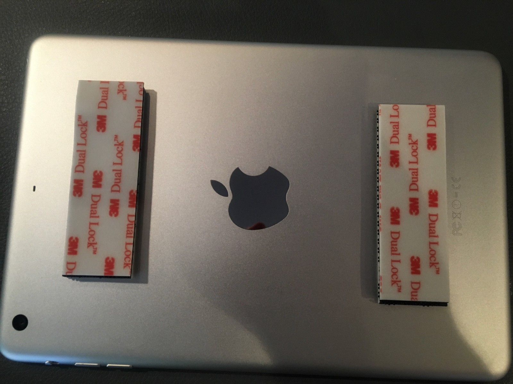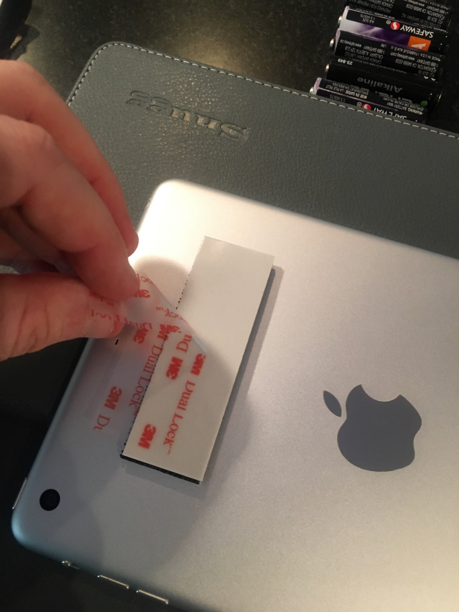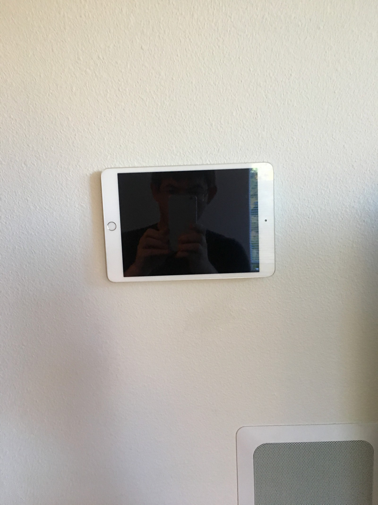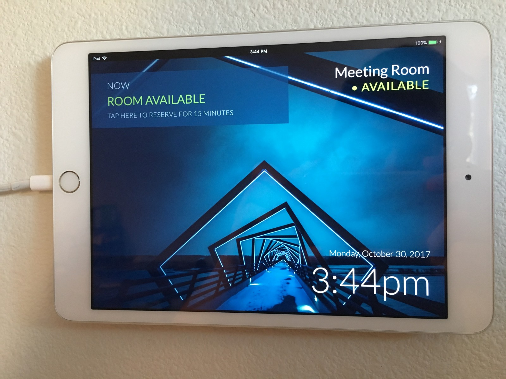

### Other Considerations

By default, in Office365, a [**Resource mailbox’s calendar will show the organizer’s name instead of the subject in an Exchange Server environment**](https://support.microsoft.com/en-us/help/2842288/resource-mailbox-s-calendar-shows-the-organizer-s-name-instead-of-the)**.** You will need to run a short PowerShell command to solve this issue.

[**Meeting Room 365**](https://meetingroom365.com/) will run this automatically for you after your tablet is provisioned.

#### Power

You will also need to provide continuous power to your display. Fortunately, Extra-long USB cables for most tablets can be purchased inexpensively on Amazon, along with cable clips and more 3m adhesive tape (optional).

### Thanks for reading!

Please Recommend and Share if you found this article useful!