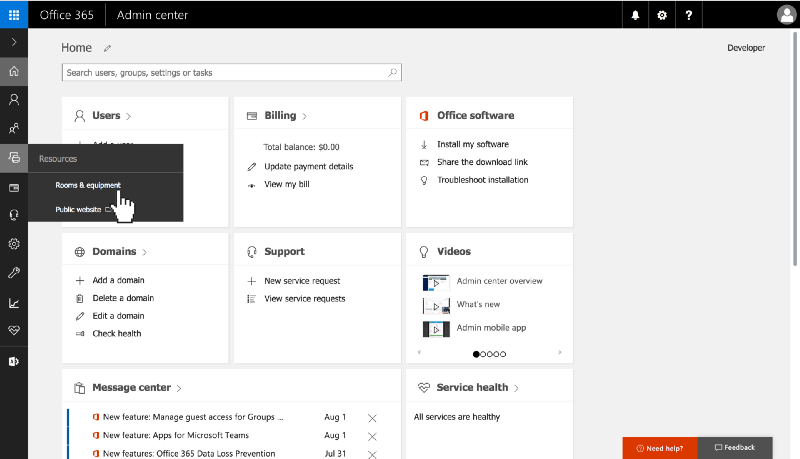
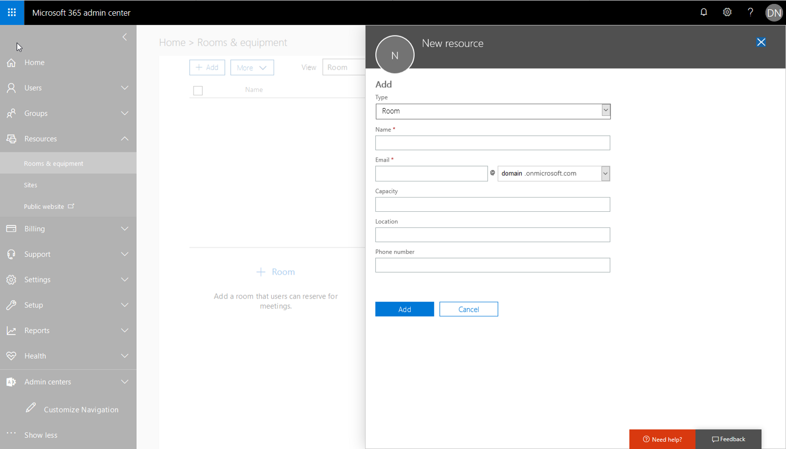
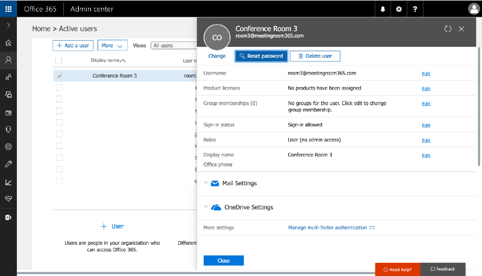
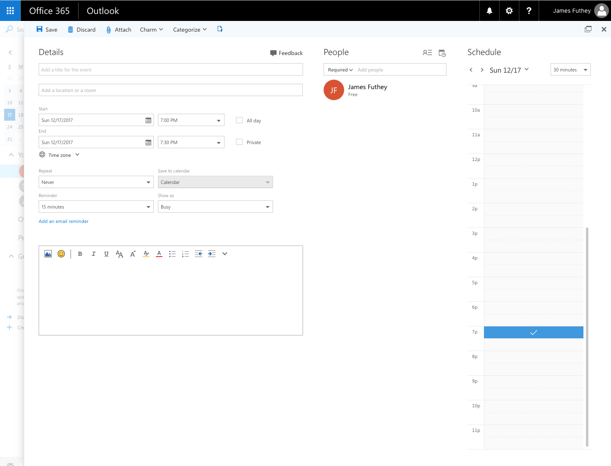
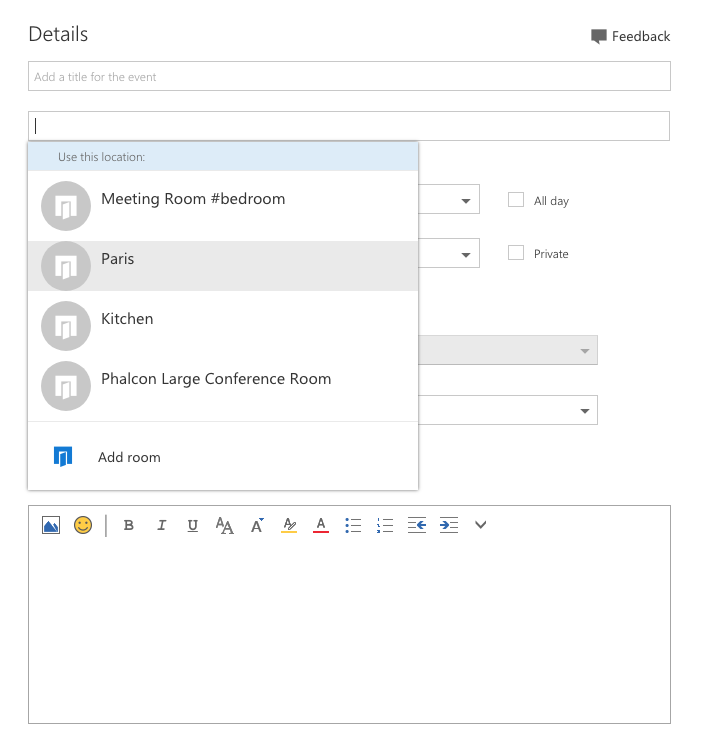

## How to add a meeting room to Outlook & Office 365 for Free

If you’ve been a part of an organization with Meeting Rooms integrated into Outlook and Office 365, you know how easy and convenient it is to manage and book conference rooms right from your Outlook or mobile calendar.

To do this, you can take advantage of a feature hidden-away in your Office 365 account called **Resource Mailboxes**.

**Resource Mailboxes** get their own email address @ your domain, and can be added to your Office 365 organization without any additional licenses (so, they’re free). They will appear as Meeting Rooms or Locations in Outlook, and contain some pre-configured logic to automate the process of accepting / declining reservations (on a first-come, first-served basis), to avoid double-booking.

You can read more here: [https://support.office.com/en-us/article/Room-and-equipment-mailboxes-9f518a6d-1e2c-4d44-93f3-e19013a1552b](https://support.office.com/en-us/article/Room-and-equipment-mailboxes-9f518a6d-1e2c-4d44-93f3-e19013a1552b)

But how do you get those rooms to show up in Outlook? Just follow this simple guide.

In a hurry? We also cover the entire process in this short video.

### 1\. Log into your Office 365 Admin Portal.

Log into [portal.office365.com](http://portal.office365.com/), and navigate to your **Admin Portal**. You can access the admin portal from the waffle menu.

### 2\. Create a new meeting room.

To get started, select the **‘Meeting Rooms’** tab from the left. If you’re using the new Admin Center Preview, this is called **‘Rooms & Equipment’**.

Next, click the plus icon to create a new meeting room.

### 3\. Configure your new meeting room.

**Name:** You will need to give it a name. This is the name that will be displayed in your Outlook calendar.

**Email:** You will need to create an email address for this room. You can choose whatever you wish, but your users will see this name. You will not be billed for this email address.

**Room Capacity:** This lets your users see how many atendees can fit into this room. This is a suggestion for your users. It will not limit the number of atendees who can be invited to a calendar event.

### 4\. Reset the password for the new mailbox.

Before you can link your new mailbox to MeetingRoom365, you will need to reset the password for the new mailbox.

To do this, navigate to **USERS > ACTIVE USERS** in the left navigation.

Next, select the user who corresponds to your meeting room and select **‘Reset Password’** from the right.

That’s it! You’ve now created a resource mailbox in Office 365. Now, when anyone in your organization wants to schedule an event or meeting from their calendar, they will see options to book that room. It even takes care of cancellations, and prevents double-booking.

### Reserving a Room in Outlook

In Outlook, all of the **_“Resources”_** _(or rooms)_ in your organization will show up as locations.

Once you pick a room, you will see any conflicts if the room is already reserved. Then you can switch rooms and/or times until you find one that works for you.

You may have to click **“Add Room”** the first  time you log in, but it should automatically discover any resources available to your organization.

---

#### Common Issue: Display shows Organizer’s name instead of the Meeting Subject.

Office 365 users need to run a short PowerShell script after Resource Mailbox creation, to display Meeting Subjects. You can read more here:

[**Issue: Display shows organizer’s name instead of subject**  
_Solution to a common Office 365 & Exchange Resource Mailbox Issue_medium.com](https://medium.com/meeting-room-365/issue-display-shows-organizers-name-instead-of-subject-731f4cf414ac "https://medium.com/meeting-room-365/issue-display-shows-organizers-name-instead-of-subject-731f4cf414ac")

#### That’s it!

---

While you’re at it, take a look at our **conference room display** product. It helps you manage and provision meeting room displays that you can mount outside your conference room.

 for more information](./asset-6.png)

[**Meeting Room 365**  
_The fastest & Easiest way to add a meeting room display to Office 365 and Outlook._www.meetingroom365.com](https://meetingroom365.com/ "https://meetingroom365.com/")

### Thanks for reading!

Please Recommend and Share if you found this article useful!