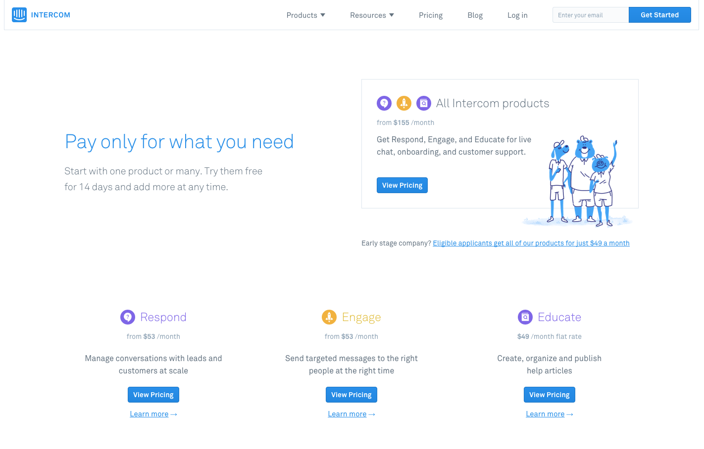
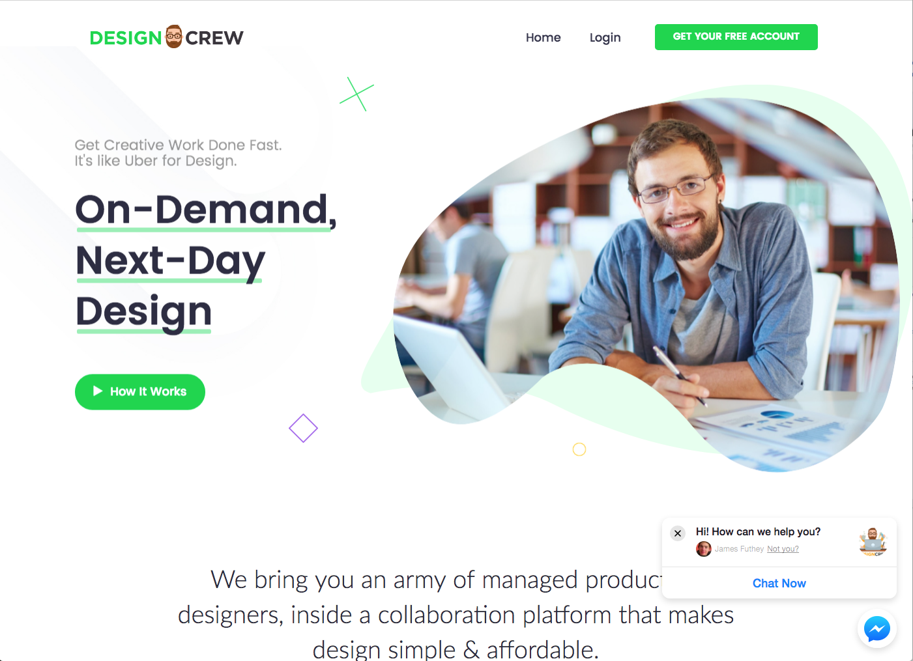
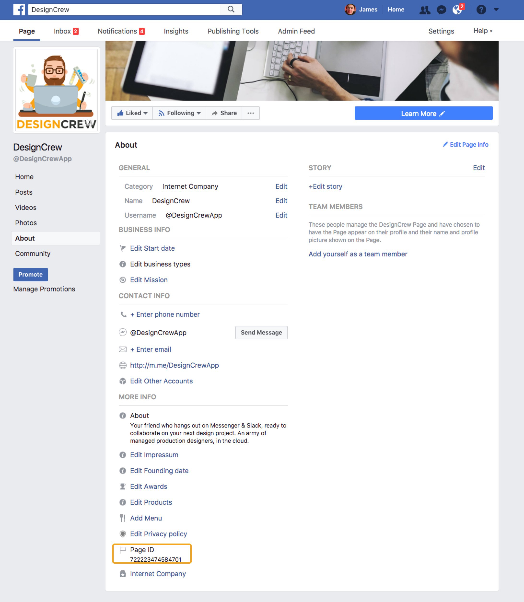
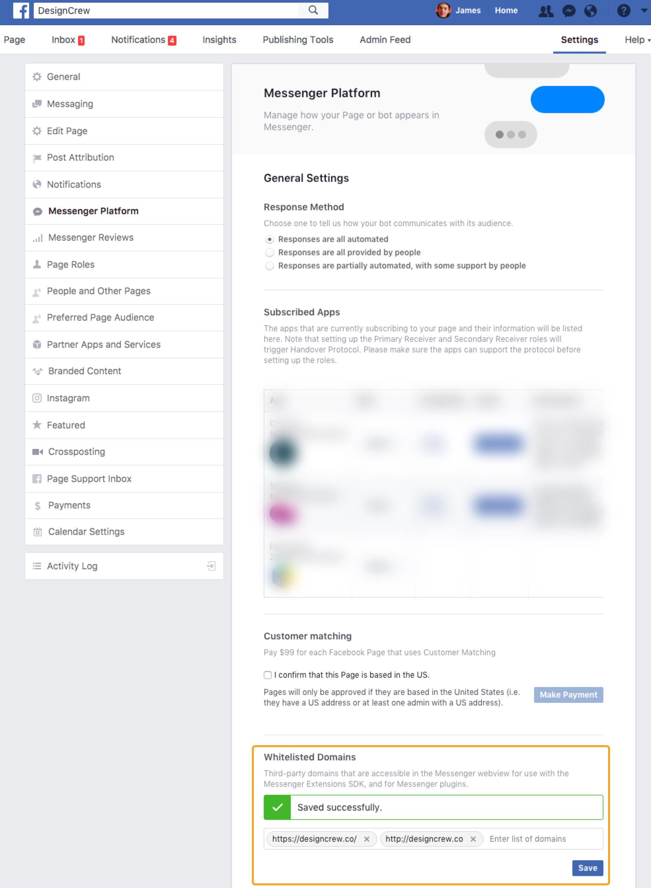
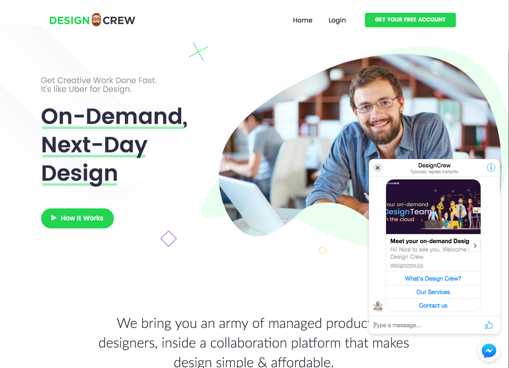
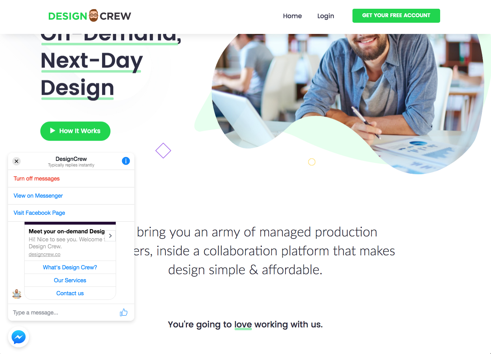
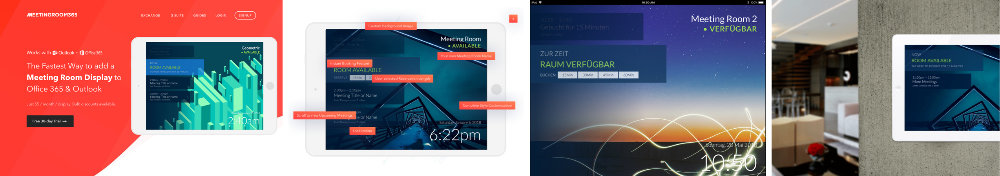

## Don’t pay big $$$ for Intercom or Drift when you’re just starting out! Get live chat on your website for free, integrated with your Facebook page. All without a developer account.

Earlier this month, facebook launched the [Messenger customer chat plugin](https://developers.facebook.com/docs/messenger-platform/discovery/customer-chat-plugin) in closed beta as a simple way to allow people to chat with businesses on their websites and in Messenger. With this plugin, customers can transition back and forth seamlessly without losing the conversation’s history and context. **But you can use it today by following these instructions!**

#### How does Live Chat work?

**Live chat** allows you to instantly communicate with your website visitors via instant messaging. The chat simply appears within their browser window, and the website visitor can chat with an operator by typing into the live  chat box.

#### Most startups are using Intercom or Drift.

But that doesn’t mean you’re ready for those tools just yet. You should start to think about this when you reach a few hundred paying customers, and are feeling some pain points with your initial / free setup.

#### Intercom is an AMAZING product. For startups with paying customers. But I don’t got $100/mo to add Live Chat to every side project I start.



### Solution

Use your **Facebook page** as a lightweight CRM, and integrate Facebook Messenger as a live chat solution!



### Bonus Feature: Bot Support

Something I don’t hear a lot of people talking about is Bot Support. If you want to create a facebook messenger bot, you can add Bot Support, embedded directly on your website.


If you’re looking for an easy, DIY solution to creating your own chat bot, I would suggest checking out [**Chat Fuel**](https://chatfuel.com/) (Free).

### How to set it up

#### Prerequisites

1.  Most obviously, you need to create a Facebook Page for your website or business.  [**Click Here**](https://www.facebook.com/business/learn/set-up-facebook-page) to view instructions on Facebook.com.
2.  You’ll need you **Facebook Page ID**. Follow the instructions below to retrieve that.
3.  You’ll need to **whitelist your domain** name on your facebook page. We’ll show you how in the guide below.
4.  You’ll need to **embed a snippet of code** on the pages where you wish to display your widget.
5.  You should consider setting up notifications on your mobile & in email for when customers message you, as well as downloading the Messenger App for your phone.

Detailed documentation & setup instructions on [Facebook](https://developers.facebook.com/docs/messenger-platform/discovery/customer-chat-plugin)

#### 1\. Retrieve your Facebook Page ID

First, you’ll need to retrieve your Facebook page ID. You can do this by navigating to your page, clicking on the **About** tab, and scrolling to the bottom of the page. There, you will see your **page ID** (It should be a number).



Alternatively, you can type the name of your facebook page into [this website](https://findmyfbid.in/) and find your numerical facebook page ID.

 to find your facebook ID.](./asset-5.jpeg)

#### 2\. Whitelist your Domain

Next, you’ll need to navigate to the **“MESSENGER PLATFORM”** tab and whitelist your domain. Type in both the **HTTP:// and HTTPS://** variants of your domain to ensure it works for 100% of users. Click the **SAVE** button.



#### 3\. Embed a snippet of code in your website

Now, our final step, is to embed a small snippet of code on our website. You should place it just before the closing **</body>** tag of your webpage, or use a tag manager, like **Google Tag Manager** or [**Gumshoe.io**](https://gumshoe.io/).

```
<div class="fb-customerchat"
 page_id="<ENTER-YOUR-FACEBOOK-ID-HERE>"
 minimized="true">
</div>
<script>
  window.fbAsyncInit = function() {
    FB.init({
      appId            : '912333495590130',
      autoLogAppEvents : true,
      xfbml            : true,
      version          : 'v2.11'
    });
  };

(function(d, s, id){
     var js, fjs = d.getElementsByTagName(s)[0];
     if (d.getElementById(id)) {return;}
     js = d.createElement(s); js.id = id;
     js.src = "https://connect.facebook.net/en_US/sdk.js";
     fjs.parentNode.insertBefore(js, fjs);
   }(document, 'script', 'facebook-jssdk'));
</script>
```

Note, you’re going to have to replace your facebook page id with your own.

Optionally, you can create a facebook App from the developer’s portal and replace your facebook App ID as well (the above code uses ours).

#### Final result:


### Additional Setting: Messenger widget open by default

Facebook also gives you the ability to open your chat widget by default on page load. It looks like this:



Just change **minimized=”true”** to **minimized=”false”** in your code snippet.

```
<div class="fb-customerchat"
 page_id="<ENTER-YOUR-FACEBOOK-ID-HERE>"
 minimized="false">
</div>
```

### Bonus: Aligning the widget left instead of right

You can add this snippet of code, along with your other snippet of code, to align the widget left instead of right:

```
<style>
  #fb-root > div.fb_dialog.fb_dialog_advanced.fb_shrink_active {
     right: initial !important;
     left: 18pt;
     z-index: 9999999 !important;
  }
  .fb-customerchat.fb_invisible_flow.fb_iframe_widget iframe {
     right: initial !important;
     left: 18pt !important;
  }
</style>
```



### Setup Tip: Add a welcome message with first name

Including your customer’s first name in the greeting message of both new and existing threads is a nice way to drive customer engagement. Here’s how to implement a personalized welcome message:

1.  Handling NEW conversations: when a new conversation is started via the plugin and your bot has set up the [Get Started button](https://developers.facebook.com/docs/messenger-platform/discovery/welcome-screen#set_postback), we will send a [messaging\_postbacks webhook event](https://developers.facebook.com/docs/messenger-platform/reference/webhook-events/messaging_referrals) to your webhook when the person enters the thread
2.  Handling EXISTING conversations: whenever an existing thread is continued via the plugin, a [messaging\_referrals webhook event](https://developers.facebook.com/docs/messenger-platform/reference/webhook-events/messaging_referrals) will be sent to your webhook.

### Setup Tip #2: Provide customers with context

Having a conversation begin on your website and continue it on Messenger is a new experience for many customers. Including text to remind people that the conversation can continue even if they leave the website is helpful context for navigating this new experience.   
   
 Examples:

> “If you ever need to return to this conversation, look for us in your Messenger inbox.”

> (Out of Office): We’re currently out of the office but will reply as soon as we’re available. Look for a reply from us in your Messenger notifications.

### Customer chat is already being used in production

If you want to see the customer plugin in action, you can check out the websites for businesses like: **Adore Me, Air France, Argos, Aviva (Eurofil), Bodeaz, Elves, Goibibo, Keto Mojo, KLM, Mermaid Pillow, Spoqa, Total Activation, Volaris and Zalando**.

### Thats it!

I hope you enjoyed this article. Thanks for reading!



### Check out our Product, Meeting Room 365

If you enjoyed this article, and would like to continue saving money, check out our product, **Meeting Room 365**. It helps you get a handle on your meeting room spaces in your office, and create attractive displays for your meeting rooms. [https://meetingroom365.com/](https://meetingroom365.com/)