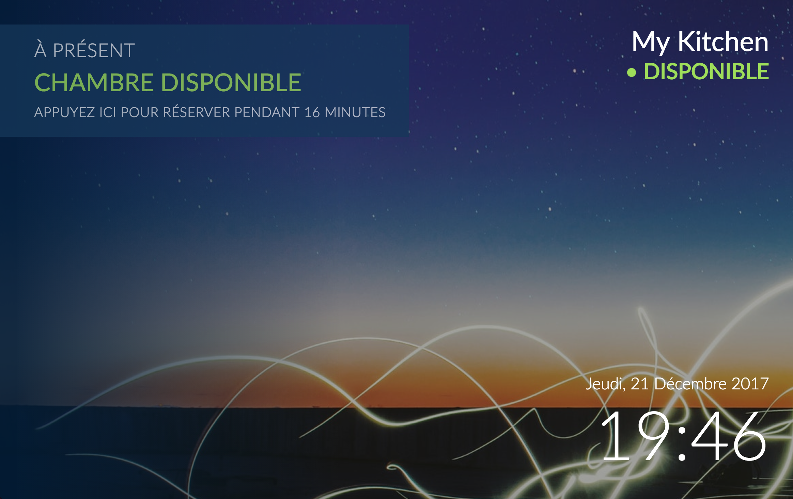
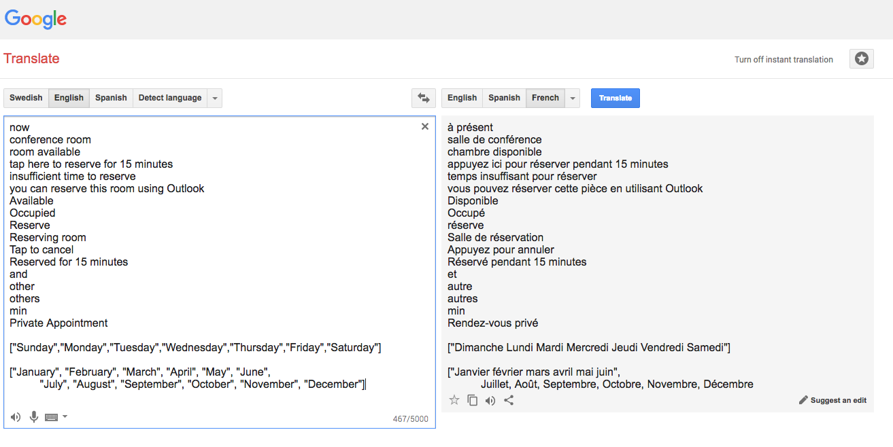
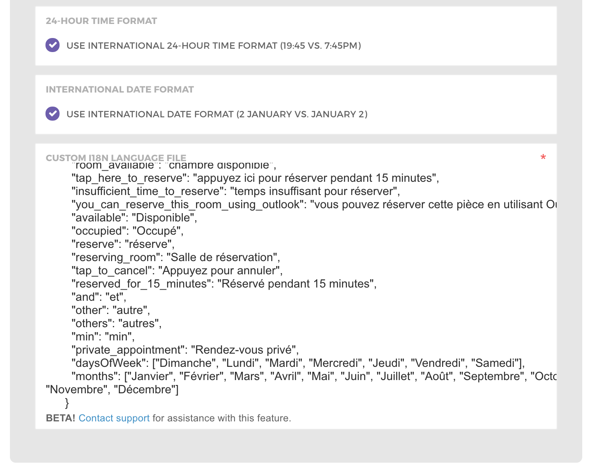

## Customize language, time format, and other options

We build **meeting room display** software specifically for the 150 million users  in the **Office 365** ecosystem. Our system offers flexibility to work on any tablet system, from inexpensive **Fire Tablets** (from $29 each, mounted!), to premium tablets (we currently recommend the **iPad Mini** with Retina display, and the **Heckler** secure locking stainless-steel mount).

[**Meeting Room Display software for Office 365, Microsoft Exchange, and Google G Suite - Meeting Room…**  
_© 2015 - 2019 Meeting Room 365. All Rights Reserved._meetingroom365.com](https://meetingroom365.com/ "https://meetingroom365.com/")

This guide covers localization and customization options for international clients (now over 40% of our user base!)

If you’re interested in seeing a general guide for tablet provisioning and configuration, see one of the guides below.

[**How to Add a Meeting Room Display to Office 365 in 5 minutes \[DIY\]**  
_Mount any tablet or iPad outside your conference rooms as a meeting room display, and keep your space organized_medium.com](https://medium.com/@jamesfuthey/how-to-add-a-meeting-room-display-to-office-365-in-5-minutes-diy-6e6ee6d4aec7 "https://medium.com/@jamesfuthey/how-to-add-a-meeting-room-display-to-office-365-in-5-minutes-diy-6e6ee6d4aec7")

### Customizing your Language

i18n file customization lets you update the strings displayed on your meeting room display. You can download an [**example i18n file (English)**](https://meetingroom365.com/app/en.i18n.json), and use it to make your desired changes. Then, paste the result in your display configuration to see changes in real time.

This allows you to modify any of the strings visible in the display app.

#### Examples and Existing Translations

We have put together a repository to consolidate translations as they are requested or contributed.

[**kidGodzilla/meeting-room-365-app-translations**  
_meeting-room-365-app-translations - Collection of i18n files for the Meeting Room 365 app_github.com](https://github.com/kidGodzilla/meeting-room-365-app-translations "https://github.com/kidGodzilla/meeting-room-365-app-translations")

#### Here’s an example of one we created for testing:

#### Updated configuration:

, and paste your translation into the web app.](./asset-3.png)

-   RTL support requires some custom CSS on our end & has not yet been attempted. Contact support if you would like to try it out!

### Customize Time Format

Time format customization allows you to switch to a 24-hour date and time format.

If you have any questions, please let us know!

### If you’re stuck, you can always send an email to [Meeting Room 365](https://meetingroom365.com/), and we can help you out with setup, configuration, and provisioning.

---

### Thanks for reading!

Please Recommend and Share if you found this article useful!