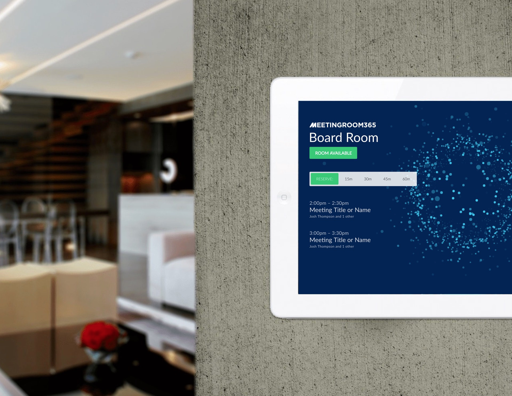
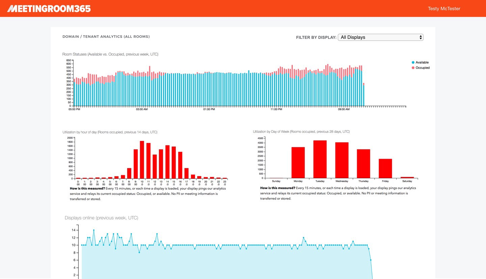
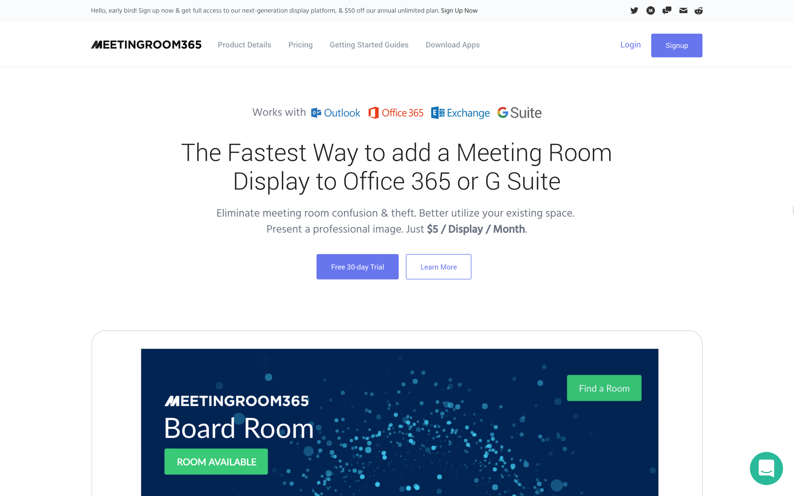

## Why people steal rooms, and what you can do to stop this from happening in your organization

It happens all the time, but no one in business really talks about it. Meeting room theft. Whether it is a boss, coworker or vendor — just about anyone can steal a room you’ve reserved for that important meeting you planned. The worst of this is that it often comes at these times when we least expect it. You’ve got to hold a “crunch” meeting to talk about anemic sales numbers. Or you need to speak to your team while they are out in the field, to update them about a new product. Then….surprise! Your meeting room has people sitting in it, giving you a funny look when you walk in, as if you don’t belong there at 10am. Here’s how to nip that in the bud.

#### Why people steal rooms

There are three reasons that people steal meeting rooms: they neglected to reserve one, they didn’t realize they needed a reservation or — they simply do not care who’s room it is, they just snag it for their meeting.

The 1st reason: neglecting to reserve a meeting room typically is a bit more innocent. You might even be blushing now, realizing that you’ve done this yourself. But stealing a meeting room is a risky game because you never know who reserved it. Your boss might be meeting with their higher-ups and everyone is going to give you “that look” when they enter the room. You know what that means: start updating your resume, because you are on thin ice!

Other times a person may not realize they needed a reservation. Now before you start to holler and wonder what type of moron this could be, think about someone who is new to a management position or even someone new to any type of job with your company that needs to reserve a meeting room — but doesn’t know how you do it. Because in today’s workplace, not everything is explained to you in the first week, let alone the first day. So again, this is more of an innocent mistake and we would recommend taking your colleague aside — no matter their rank — and showing them patiently how to reserve a room.

The 3rd type of person wants your meeting room and really doesn’t care if it is anyone’s. This person actively knows it could be someone else’s but it exerting dominance. Now, you would think that the boss or a higher-up would be more likely to pull this type of action, but actually you’ll typically see someone who is more threatened by other types of authority and wishes they were in a better position than the one they have. This whole stealing a meeting room move is a desperate attempt to show they are powerful, when in reality they just look disorganized.

#### Communicate your policy on room bookings

If you have meeting room swaggers in your office or company, it is critical that you have a crystal clear policy on how to book a room for a meeting. We recommend that you make is “back of the envelope” simple, so that it could be described in the space of a back of an envelope and everyone could understand it!

**Here are a few guidelines we’ve found to help in just about every industry:**

**First-come first-serve reservations.** For the modern office, integration with your calendar system will make this practically effortless. Office 365, Exchange, and G Suite (Google Mail) all offer Resource Mailboxes, which manage your meeting room spaces for you. Anyone can reserve a room in advance, based on the policies you set up, and browse their calendar to see what resources are available.

Alternatively, another simple way to do this is to have people sign up using a Google Sheet or even a spiral notebook you keep in a desk drawer. Sign up should be only one place to avoid confusion and needs to be written down.

**No one gets special privileges:** whoever reserved it, gets it. This is critical to avoid any problems with work flow. If you realize more meetings need to be held than you have space for — it is time to have a hard look at your office space, or the amount of meetings being scheduled.

Do “common sense” cleaning of the room before you leave. Recycle water bottles. Wipe off the table. Unplug the projector. Let alone know if any office equipment appeared to be broken or not operate properly — so it can be fixed before another meeting is scheduled there.

**Leave your room when your reservation ends.** Strongly encourage managers and anyone holding a meeting to keep them on schedule. They should also know if a meeting is following theirs.

#### Mount displays outside meeting rooms

Most meeting rooms in the modern office have an electronic display system, which is integrated with their email & calendar solution (Office 365, Exchange, or G Suite). We recommend out place this outside of the room, so that people can clearly see who’s reserved the space.

Why? Well, it actually makes it a lot more awkward to steal a room! It’s hard to argue when someone else’s name is on it!

And with the ultra-low prices of Android and Amazon tablets (many cost just $50), this can be an accessible & fun IT project within your company.

#### Track utilization to determine if you need to create more meeting room space

As mentioned, if you realize that over the past quarter, your staff and managers are holding more meetings that you have space, it is time to look for more meeting space. Fortunately, if you integrate with one of the top meeting room calendar solutions, this utilization is easier to track than one might think.

Use analytics to understand when meetings are held most, and exactly what type of space that you need.

For example, take a close look at the time of day and days of week you reach 100% utilization. You can use this information to communicate to your office when “rush hour” occurs– and encourage managers to move recurring meetings outside of this period.

Another great use of analytics is to see which conference rooms are free– when employees _feel like_  there aren’t enough rooms to go around. Often, it boils down to a communications issue, and an employee-all message can communicate which spaces might secretly be available, even during busy periods.

---

At the end of the day, you can prevent meeting room theft, and solve other common issues surrounding meeting room space. But, it takes the participation of everyone in the office. It’s far simpler than one might think. It’s actually is a lot simpler than most meetings you been to!

---

If you enjoyed this article, check out our product, **Meeting Room 365**! It’s the fastest and easiest way to add a Meeting Room Display to **Office 365**, **Exchange**, and **G Suite**. And at **$5/display/month**, it’s easy on your budget as well! [https://meetingroom365.com/](https://meetingroom365.com/)

### Thanks for reading!

Please Recommend and Share if you found this article useful!