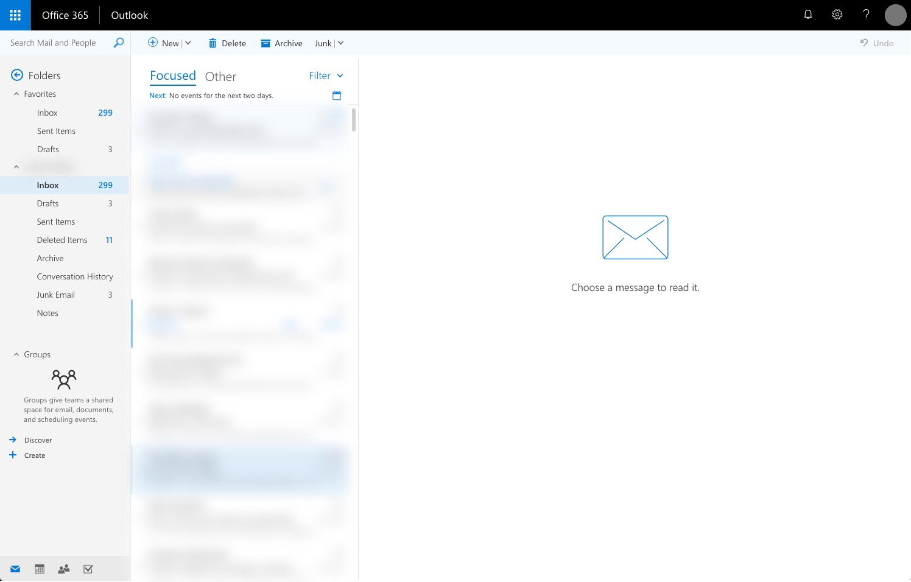
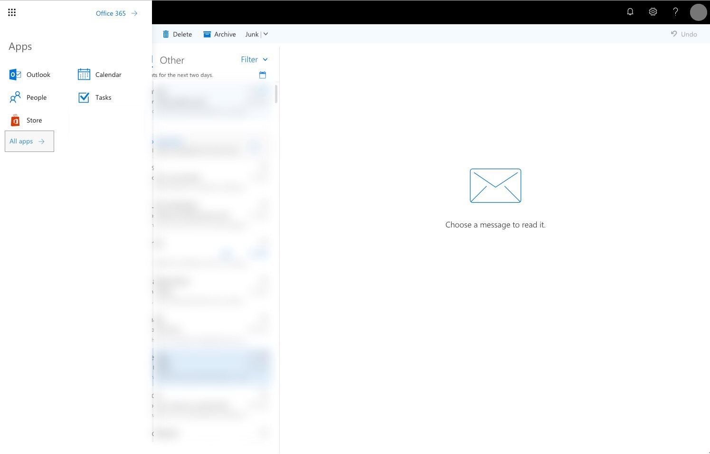
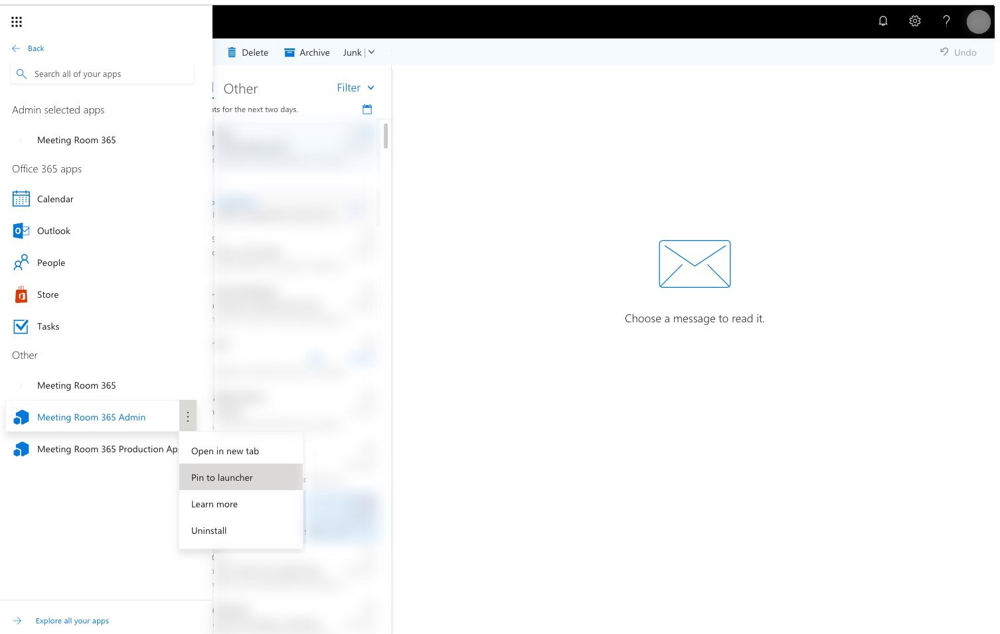

## Background

By default, the Office 365 Launcher provides a simple interface for frequently-accessed applications supporting your Office 365 tenant, including the Admin portal, and the Azure portal. However, you can add any Office 365 SSO-enabled application in just a few clicks.

### Instructions

#### Step One: Log into Office 365

#### Step Two: Open the Quick Launcher & Click “All Apps”

Open the quick launcher (Top-right icon, nine boxes), and click **All Apps** (highlighted).

#### Step Three: Pin Meeting Room 365 Admin to the launcher

Finally, right click on the **Meeting Room 365 Admin** app to reveal more options. Select **Pin to launcher** to pin the app to your launcher.

### Result

Now, when you open your launcher, you will see Meeting Room 365.

That’s it! Let us know if you have any feedback!