## See how I set up meeting room display kiosks for Office 365 at just $27.41 per room, with ultra-cheap Fire tablets from Amazon.

I’ve written previous guides in the past. This time, we’re going to cheap out and try the Amazon Fire tablets. Spoiler: _They work great, and will look pretty good mounted outside your meeting rooms_.

This guide covers setting up, provisioning, locking down, and mounting your tablets. You’ll need access to your Office 365 tenant (Admin Portal), or ask your IT admin to provision you a Resource Mailbox for each display, and send you the credentials to each mailbox.

### Hardware

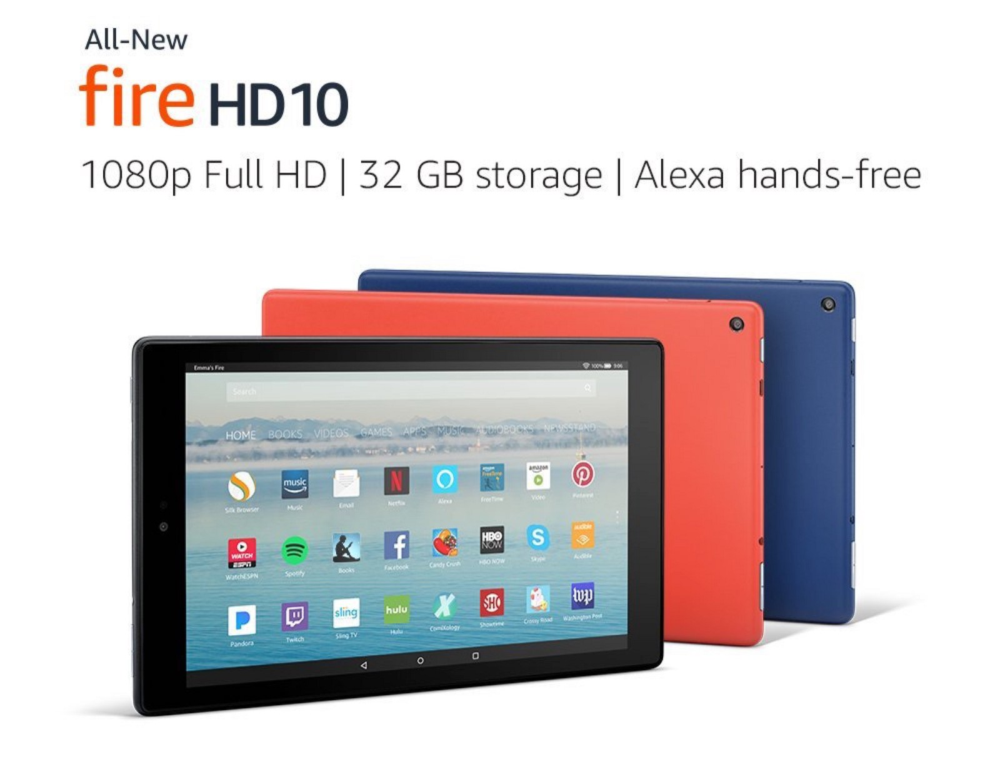

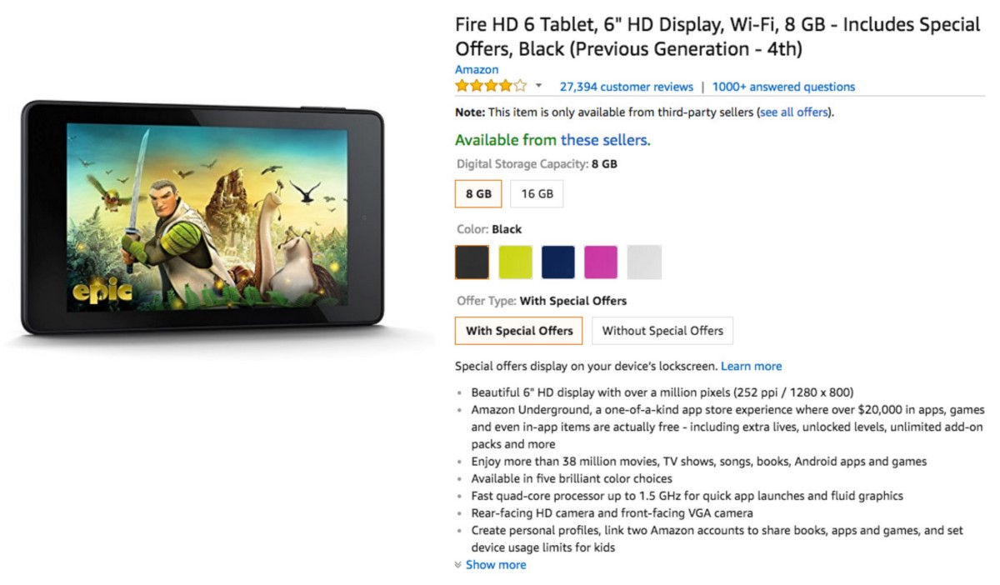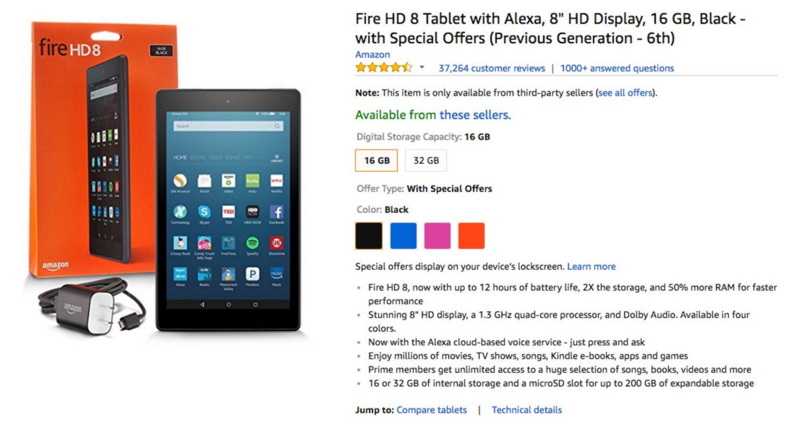

There are as many options for Fire tablets it seems as their are Amazon customers. 6+ generations of hardware, from 6", 7", 8", & 10". These can come Refurbished from Amazon (recommended, they’re in like-new condition and about half price). Each generation has slightly different specs, and each tablet seems to have a slightly different LCD panel.

The meeting room software seemed “at home” on the 8" and 10" tablets. I got it working on the 6" and 7" just fine, but it seems a bit cramped. **\*\[Update: this has been resolved in a recent app update with scaling support\]**

#### 6" Amazon Fire Tablet

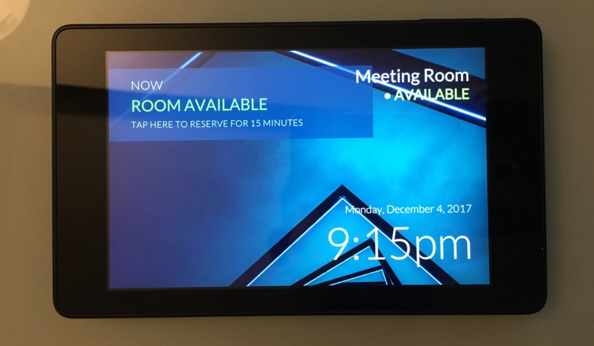

#### 8" Amazon Fire Tablet

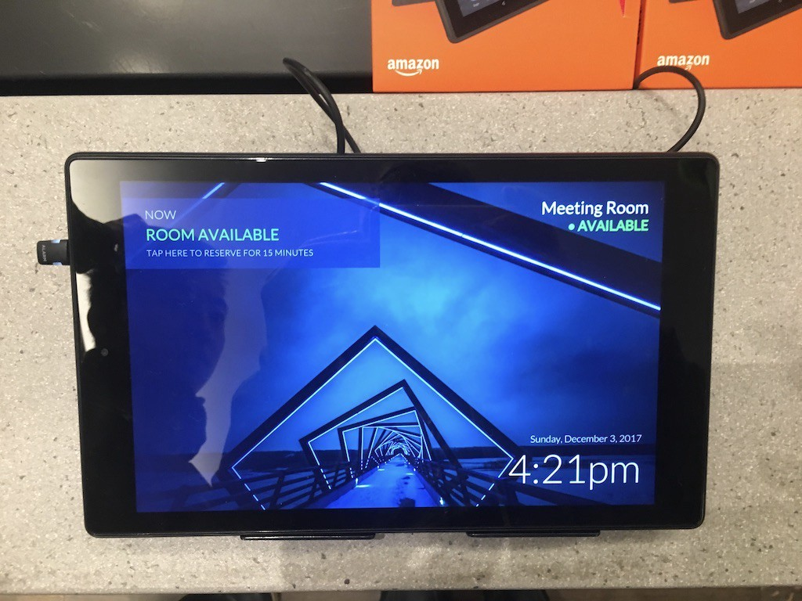

#### Incredibly-low prices for Amazon Certified Refurbished tablets

You can get a used/refurbished/returned tablet in like-new condition (previous generation), with “special offers”, from as low as $25 bucks. Throw in some inexpensive adhesive strips for mounting, and this could be your most cost-effective option for adding meeting room displays to your conference rooms.

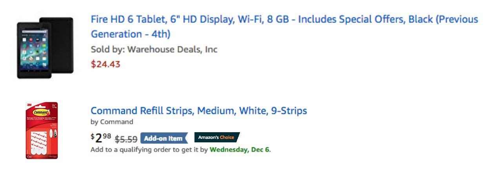

### Create a free Meeting Room 365 Account

Sign up for a Free [**Meeting Room 365**](https://www.meetingroom365.com/) account. This will allow you to create and deploy unlimited, customizable meeting room displays. Pay when you’re ready (each display is free for 30 days, then it’s $5/month per display. Annual & bulk discounts available).

### Configure Office 365

You will need to login to your Office 365 admin portal and provision free meeting room mailboxes. You will not be charged for these meeting-room-only accounts, but they will all get an email address @yourdomain.com (or the onmicrosoft.com variant).

#### 1\. Log into your Office 365 Admin Portal.

Log into [https://portal.office365.com](https://portal.office365.com), and navigate to your **Admin Portal**. You can access the admin portal from the waffle menu.

#### 2\. Create a new meeting room.

To get started, select **‘Rooms & Equipment’** from the left**,** which takes you to [https://admin.microsoft.com/AdminPortal/Home](https://admin.microsoft.com/AdminPortal/Home)

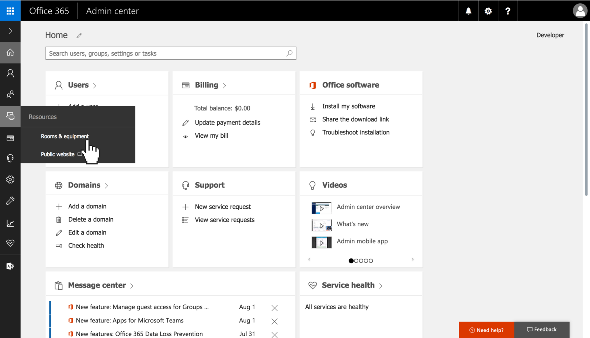

Next, click the plus icon to create a new meeting room.

#### 3\. Configure your new meeting room.

**Name:** You will need to give it a name. This is the name that will be displayed in your Outlook calendar.

**Email:** You will need to create an email address for this room. You can choose whatever you wish, but your users will see this name. You will not be billed for this email address.

**Room Capacity:** This lets your users see how many attendees can fit into this room. This is a suggestion for your users. It will not limit the number of attendees who can be invited to a calendar event.

#### 4\. Reset the password for the new mailbox.

Before you can link your new mailbox to Meeting Room 365, you will need to reset the password for the new mailbox.

To do this, navigate to **USERS > ACTIVE USERS** in the left navigation, which takes you to: [https://admin.microsoft.com/AdminPortal/Home#/users](https://admin.microsoft.com/AdminPortal/Home#/users)

Next, select the user who corresponds to your meeting room and select **‘Reset Password’** from the right.

Save the email address and new password. **You will need this to complete the next steps.**

#### 5\. Complete Provisioning in Meeting Room 365

This will provision a display that automatically updates when your meeting room is booked via Outlook.

### Configure your Tablets

After your initial setup, you’ll need to do a couple things to get your tablets ready for prime time.

1.  Configure the displays to never sleep
2.  Disable notifications
3.  Configure Wifi to never sleep

#### Update: Fire OS 5+

I want to start off by saying this guide was relatively simple and effortless when it was written, targeting Fire OS 4. Recent updates from Amazon have made this process a lot more complicated, as they have fiddled with or disabled seemingly every feature you would need to easily turn this tablet into a kiosk. It’s still doable, but pay attention to the **Fire OS 5+** specific sections of this guide.

> **Note:** There is now an issue impacting **Fire OS 4**. Please use **Fire OS 5+**.

#### Configure the display to never sleep

You’ll definitely want to configure the display on your Fire tablets to “never sleep”. Otherwise, they’ll shut off after a couple minutes. You can do this by selecting **“Display & Sounds”** from the **Settings** menu.

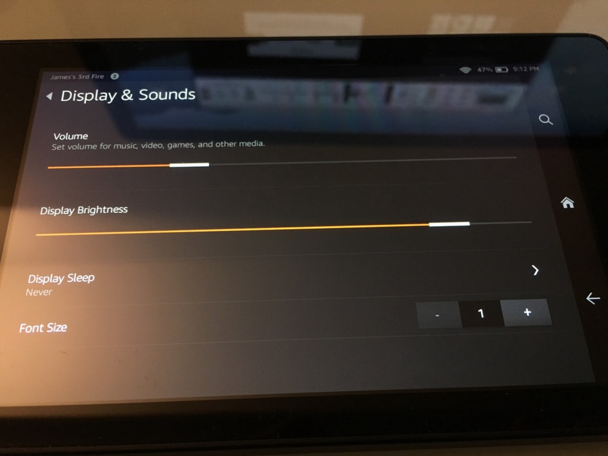

Once you complete this step, the device should never power down or go to standby.

#### Update: Install “Keep Screen on Free” (Fire OS 5+)

Unfortunately, in the latest version of Fire OS, Amazon has inexplicably removed the ability to set your device to “Never sleep”. Thankfully, you can download a simple, free app to solve the problem for you. Just browse to the Amazon app store and download **“Keep Screen on Free”**

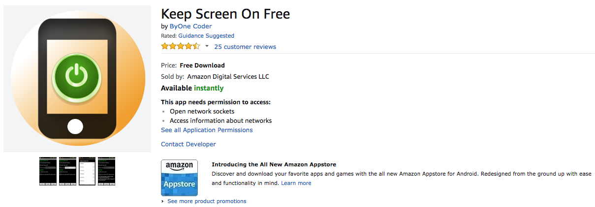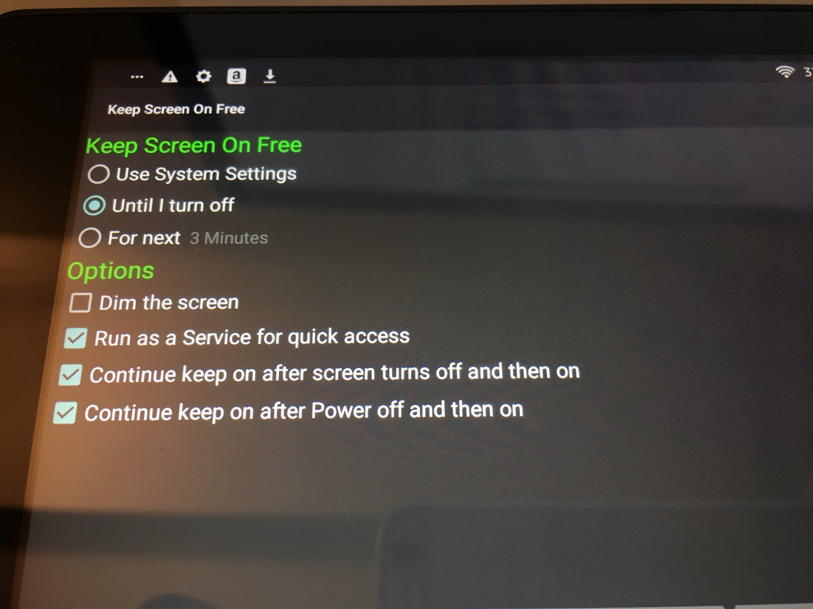

#### Disable Notifications

You’ll want to disable notifications on your new tablet by enabling “quiet time”. Just open the **settings** menu and navigate to **“Notifications & Quiet Time”**. Then, select **“Quiet Time”**, and turn **Quiet Time** to **On**. Depending on other software installed on your device, you may need to be more aggressive in disabling notifications.

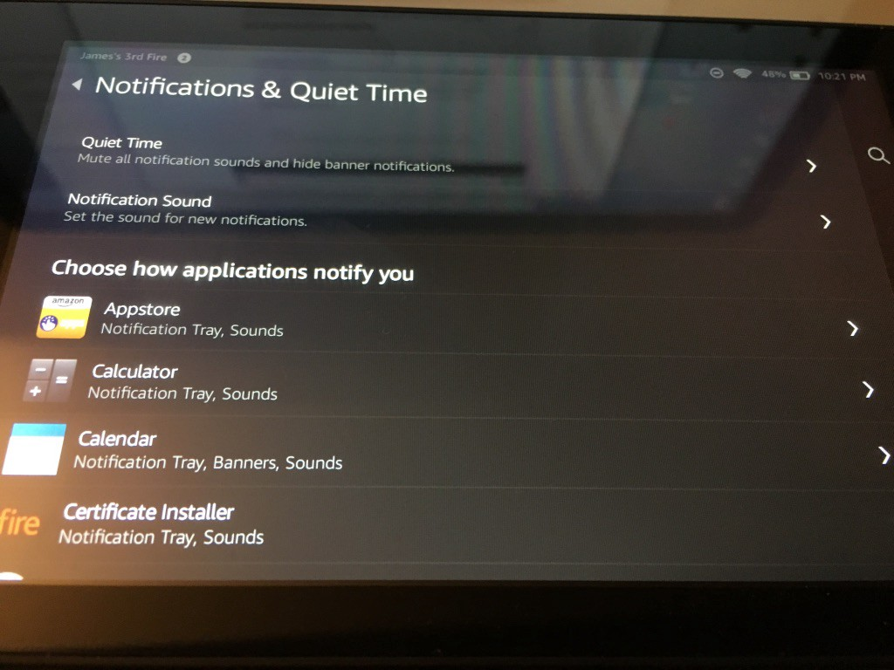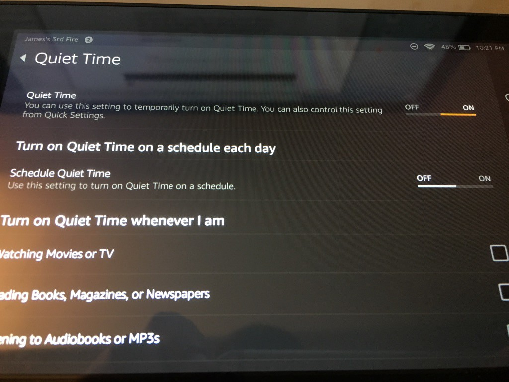

#### Disable Wifi Power saving

By default your device will idle & disconnect from Wifi. You don’t want this (your rooms may not update when you go offline). To get around this, disable power saving for Wifi. Just navigate to **“Power Management”** and disable **“Smart Suspend”**.

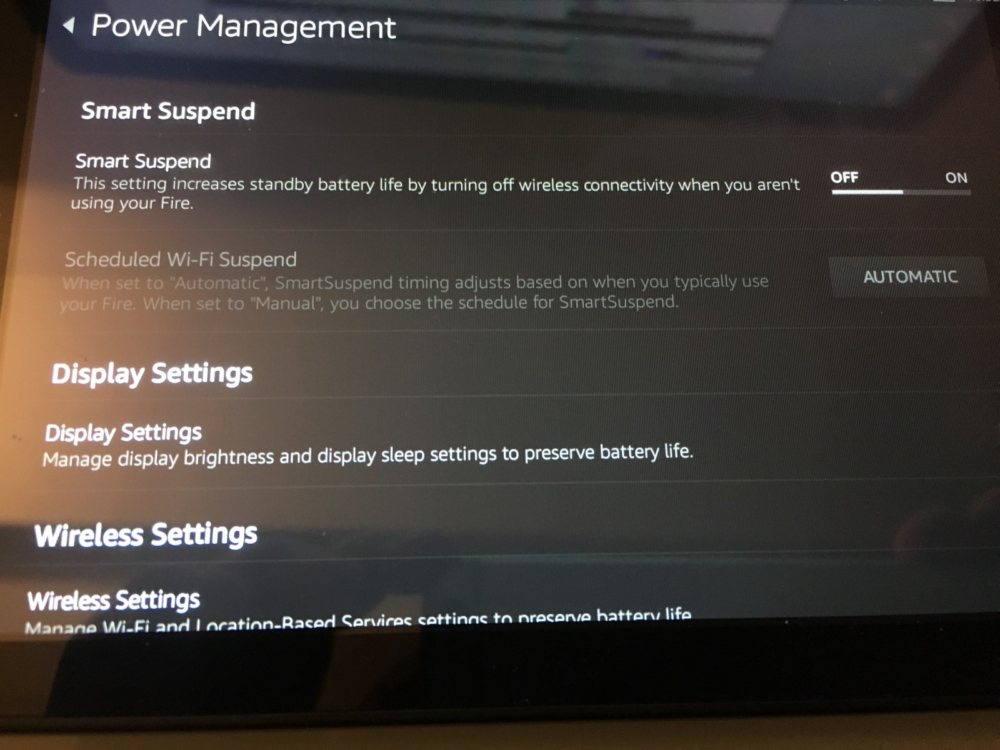

#### Set up Parental Controls (Optional)

Setting up parental controls can help you disable unwanted behavior (and reduce support calls when things go wrong). You can do this by selecting **“Parental Controls”** from the **settings** menu.

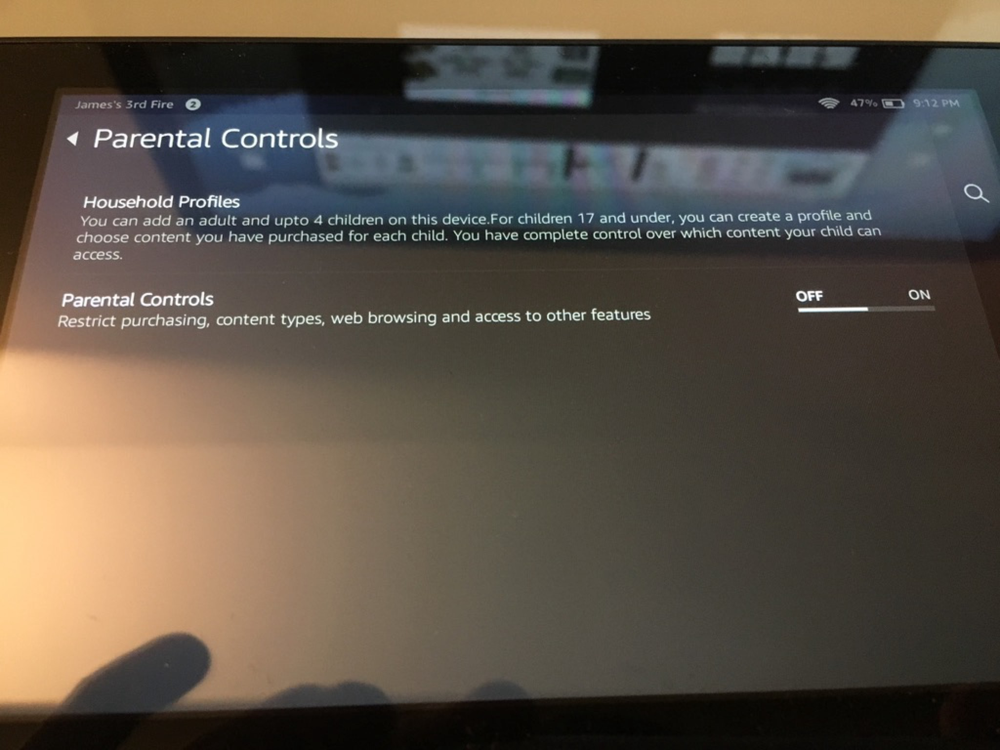

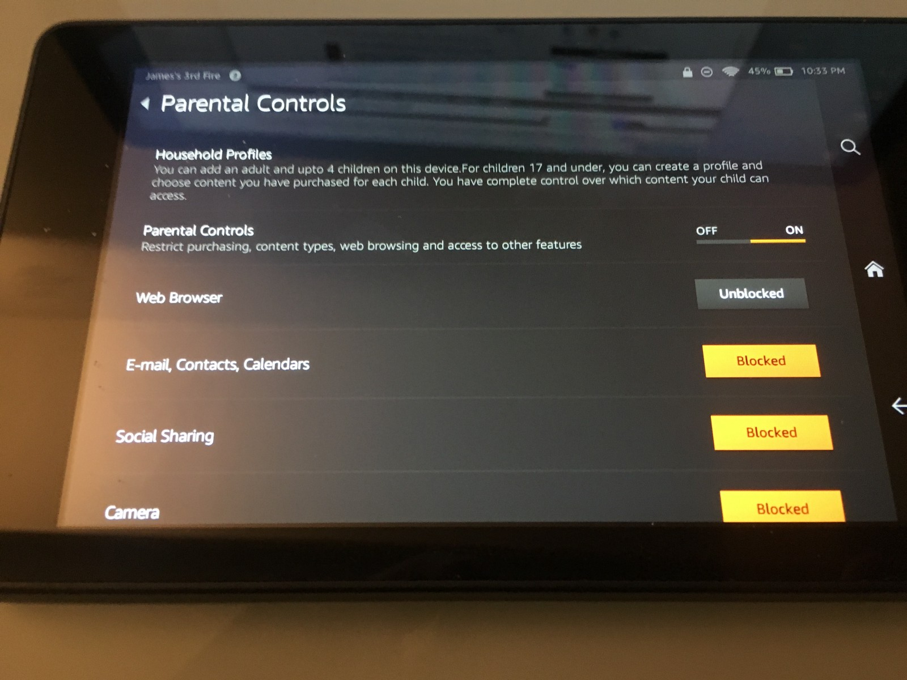

1.  Swipe down from the top of the screen to show **Quick Settings**, and then tap **More**.
2.  Tap **Parental Controls** and then tap **On**.
3.  Enter a password, confirm your password, and then tap **Finish**. Once you’ve set a password, you can restrict one or more of the following:

-   Web browsing
-   The **Email, Contacts, and Calendars** apps
-   The **ability to purchase from the content stores** on your device (for example, the Amazon Appstore)
-   The ability to **play Amazon Video** and Prime Video
-   Specific content types (for example, Books or **Apps**)
-   **Wireless connectivity**
-   **Location-based Services**

[https://www.amazon.com/gp/help/customer/display.html?nodeId=201729930](https://www.amazon.com/gp/help/customer/display.html?nodeId=201729930)

#### Navigate to your Display

Next, grab your display Unique URL from [**Meeting Room 365**](https://meetingroom365.com/app/). Navigate to this URL using the built-in Silk Browser.

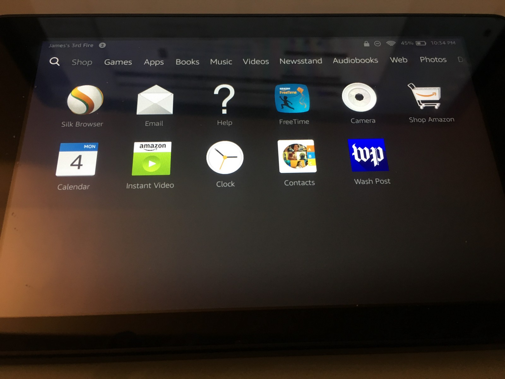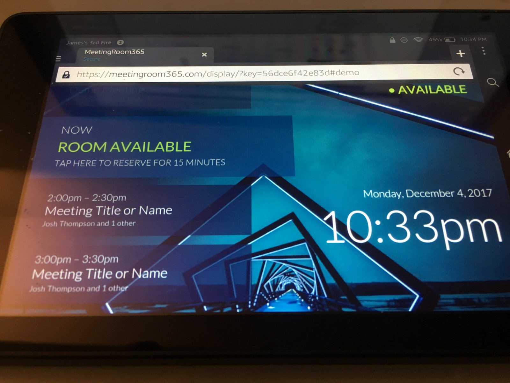

While you’re at it..

#### Bookmark your Display

This will save you a lot of headaches later when someone accidentally restarts your tablet (or an automatic update wipes it out).

#### Set page to Full screen

Use the menu on the top-right hand side of the tablet (icon with three dots) to maximize your browser window to full screen.

#### Update: Fire OS 5+

Amazon (why!?) has _“temporarily disabled”_ full screen mode in the Silk browser. Currently, the only solution to this issue is to install an alternate browser.

Unfortunately, with the latest update, that means you have to install the **Google Play store**, and then install the **UC Browser**.

This involves downloading and installing 4 Google APKs. I followed this guide successfully: [http://blog.the-ebook-reader.com/2017/06/09/how-to-install-google-play-on-2017-fire-tablets-in-5-minutes/](http://blog.the-ebook-reader.com/2017/06/09/how-to-install-google-play-on-2017-fire-tablets-in-5-minutes/)

Then, from the Google Play store, you can download and install **UC Browser** (the only one I could find that still had a full-screen option).

To get around all of this, we packaged a small app for Meeting Room 365 & submitted it to the [**Amazon App Store**](https://www.amazon.com/James-Futhey-Meeting-Room-Client/dp/B079GJ85BJ/ref=sr_1_1?ie=UTF8&qid=1517517988&sr=8-1&keywords=Meeting+Room+365+Client). This bypasses the issues with Silk Browser and lets you enter the KEY for your display, and use it as a full-screen app.

### Mount your display

Once everything is set up, you’re ready to mount your displays.

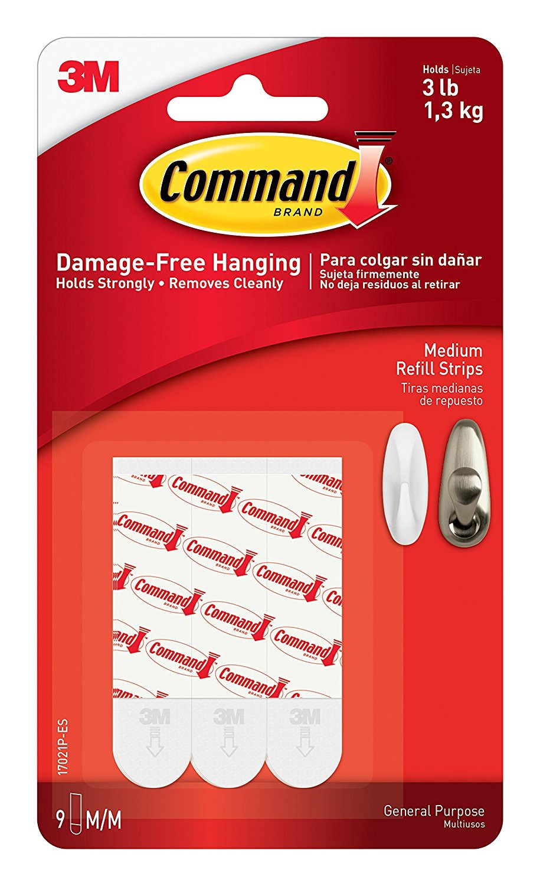

Depending on the hardware you choose, you will either need to mount your display using 3m adhesive (fastest), or drywall / mounting screws.

For instance, the Koala Mount consists of two small, sturdy plastic brackets that gently cradle your device. Designed to be used with 3M Command Strips (included). The strips are rated to hold up to 5 lbs each (far more than any tablet). To remove, the strips can simply be stretched off without causing any damage.

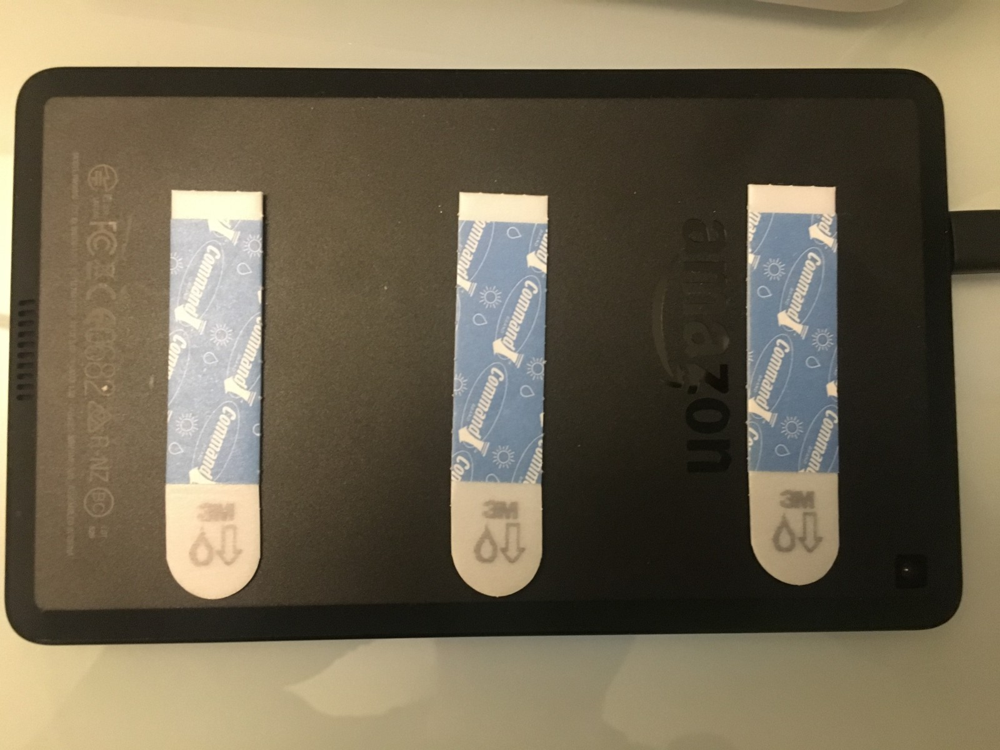

Alternatively, there are many 3m / command adhesive options available for a couple of bucks to mount your displays with. They work fairly well (but are one-time use).

### Locking Down your Display (OPTIONAL)

We’ve found a third-party app which may be useful for Android devices, including the Fire Tablet, called **Autostart and StaY!**

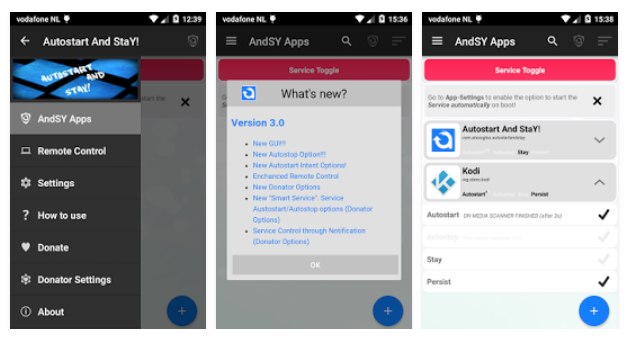

It locks down the display, so that the screen never dims, the app automatically launches on tablet restart, and it prevents users from navigating away from the Meeting Room display.

[**Autostart and StaY! — Android Apps on Google Play**  
_The best — most advanced — Autostart App in the market!_play.google.com](https://play.google.com/store/apps/details?id=com.atasoglou.autostartandstay&hl=en "https://play.google.com/store/apps/details?id=com.atasoglou.autostartandstay&hl=en")

Please note, if you enable **persistent mode**, you’ll need another android device to remotely exit your app. You’ll also need to enable remote management from the **Autostart and StaY!** app.

Please note, that on Fire OS devices, including the Amazon Fire Tablet, you’ll need to sideload the APK file (Google Play isn’t available on the Fire tablet by default). To enable this, you’ll need to go to **SETTINGS**, -> **SECURITY**, and toggle to enable **Apps from Unknown Sources**.

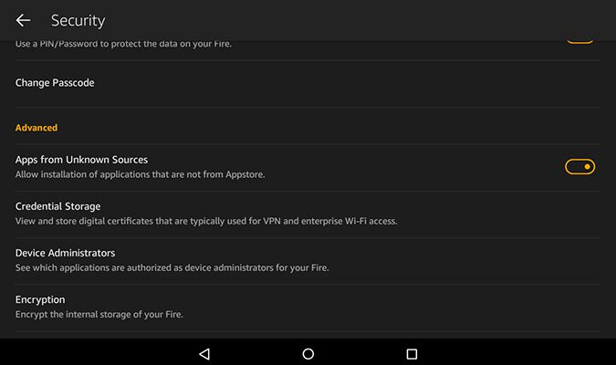

Be careful where you’re getting your APK files from! I haven’t run into any compromised APKs when downloading this app, but this is something you should be careful about.

### Other Considerations

#### Power

You will also need to provide continuous power to your display. Fortunately, Extra-long USB cables for most tablets can be purchased inexpensively on Amazon, along with cable clips and more 3m adhesive tape (optional).

#### Office 365 configuration

By default, in Office 365, a [**Resource mailbox’s calendar will show the organizer’s name instead of the subject in an Exchange Server environment**](https://support.microsoft.com/en-us/help/2842288/resource-mailbox-s-calendar-shows-the-organizer-s-name-instead-of-the)**.** You will need to run a short PowerShell command to solve this issue.

[**Meeting Room 365**](https://meetingroom365.com/) will run this automatically for you after your tablet is provisioned, but it may take a few moments.

#### If you run into issues, reach out and ask for help.

If you’re stuck, you can always send an email to [**Meeting Room 365**](https://meetingroom365.com/), and they can help you out with setup, configuration, and provisioning.

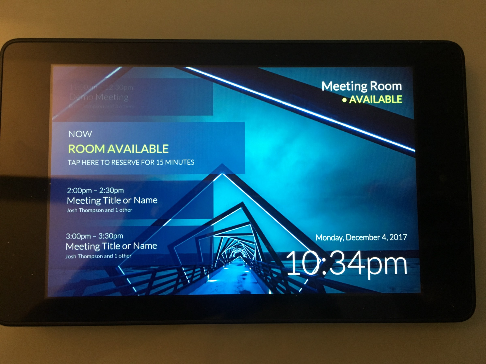

#### **That’s it.**

Thanks for reading!

Please Recommend and Share if you found this article useful.