## Permanently Unlock the Switch’s Hidden Web Browser in under a minute! No mods required. \[DIY\] \[Nintendo Switch\] \[DNS\]


#### About us

We’re **Meeting Room 365,** a startup in **Seattle, WA,** building Meeting Room display software for IT departments around the world. You can find out more at [https://meetingroom365.com/](https://meetingroom365.com/) Full disclaimer: We’re not affiliated with Nintendo in any way.

#### Why the Nintendo Switch?

While the Nintendo Switch may not be an ideal platform for most, it presented an interesting challenge, and we’re a uniquely-curious bunch of IT Developers. Plus, it gave us an opportunity to learn more about the Switch hardware, and built-in web browser. AND, the opportunity to write this cool tutorial. And this same technique can be applied to view any website using the Switch’s built-in browser (neat, right?)

### What you’ll need:

1.  A **Nintendo Switch**
2.  A free **Meeting Room 365** Account (optional)
3.  **Office 365**, **Exchange**, or **G Suite** Meeting Room Resource Mailbox credentials (optional)

### Inspiration

The idea for this post was Inspired by the Nintendo of America HQ in Redmond, WA, near our offices in Seattle. We like to build case-studies and personas, which explore how meeting rooms and office space is used around the world, to continue to improve our products.

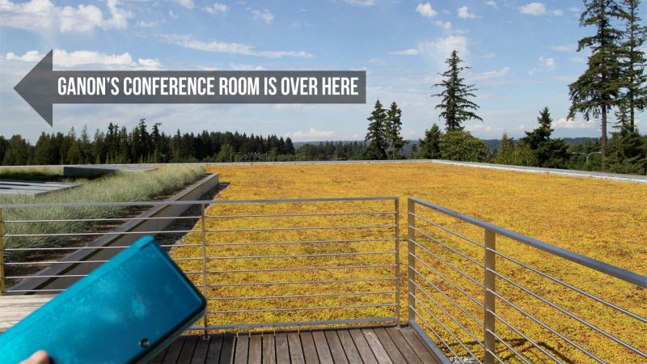

Conference rooms in the building are all named for Nintendo stuff. There’s the **Another Castle room**, for example. The top floor is all Zelda conference rooms, including a **Ganon room** with magnificent views and what sounds like the most important meeting space in the building, the **Master Sword**. On the third floor, is the Mario quadrant. It has a listing of Mario-themed conference rooms: **Hookbill the Koopa**, **Shy Guy**, **Boo**, **Bullet Bill**, **Isle Delfino** and **Koopalings**.

Read more about the Nintendo of America HQ in Redmond:

[**The Coolest Things in Nintendo's American Headquarters (And One Uncool Thing)**  
_Let's get the one uncool thing about Nintendo of America's headquarters out of the way first: They won't let visitors…_kotaku.com](https://kotaku.com/5834386/the-coolest-things-in-nintendos-american-headquarters-and-one-uncool-thing "https://kotaku.com/5834386/the-coolest-things-in-nintendos-american-headquarters-and-one-uncool-thing")[](https://kotaku.com/5834386/the-coolest-things-in-nintendos-american-headquarters-and-one-uncool-thing)

### Nintendo of America Offices in Redmond, WA

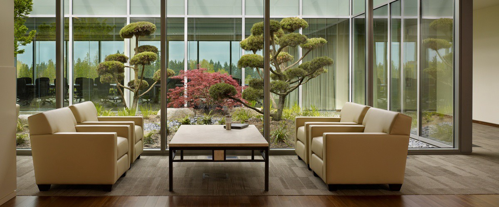](./asset-5.jpg)

#### Create a free MeetingRoom365 Account

Sign up for a Free [**MeetingRoom365**](https://www.meetingroom365.com/) account. This will allow you to create and deploy unlimited, customizable meeting room displays. Pay when you’re ready (each display is free for 30 days, then it’s $5/month per display. Annual discounts available).

**More details:** [https://medium.com/meeting-room-365/how-to-add-a-meeting-room-display-to-office-365-6d42561e2f5b](https://medium.com/meeting-room-365/how-to-add-a-meeting-room-display-to-office-365-6d42561e2f5b)

#### Provision your Resource Mailbox

If you’re looking to setup a real display, go ahead and provision a resource mailbox at this step. However, if you are just testing the waters, feel free to play around with our demonstration account, and skip this step.

#### Creating a G Suite Resource Mailbox

In addition to scheduling events in Google Calendar, G Suite users in your organization can book resources that people share. The most common example is a meeting room. Other examples might include projectors, company fleet cars, guest offices, recreation equipment, or any other resource people might schedule a time to use.

**Full Instructions:** [https://support.google.com/a/answer/1686462?hl=en](https://support.google.com/a/answer/1686462?hl=en)

#### Creating an Office 365 Resource Mailbox

You will need to login to your Office365 center and provision free meeting room mailboxes. You will not be charged for these meeting-room-only accounts, but they will all get an email address @yourdomain.com.

**Full Instructions:** [https://medium.com/meeting-room-365](https://medium.com/meeting-room-365)

### Accessing the Hidden Internet Browser on your Nintendo Switch

You probably already figured this out if you’ve ever visited the **Nintendo e-shop** on your switch: There is a **full internet browser** built-in to the Switch.

This may sound great, but Nintendo isn’t about to let you access it willy nilly.

To get full access to the browser, we’re going to have to employ a really simple hack. We’ll set up a DNS proxy, to trick the Switch into thinking we’ve connected to a Public Wifi Access point. The Switch will then launch a full web browser to deal with our (supposed) captive portal, giving us free reign to access whatever we like.

#### Enter System Settings

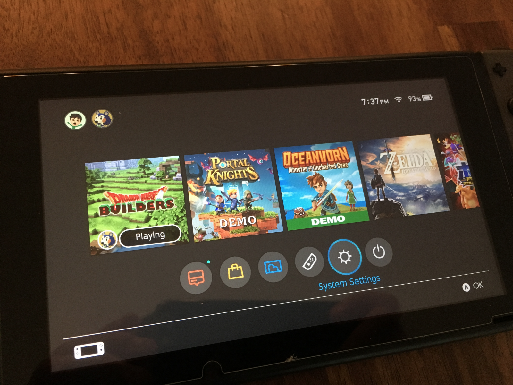

#### Select Internet, -> Internet Settings

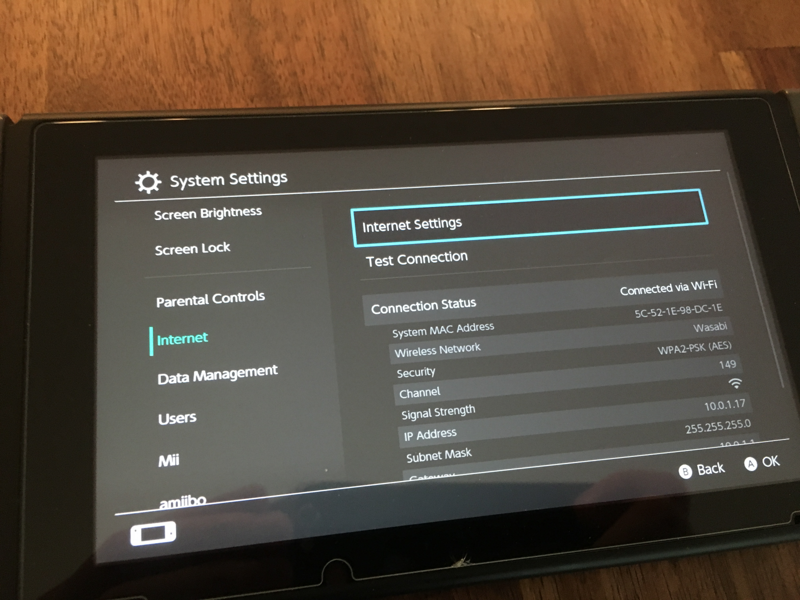

#### Switch your DNS Settings from Automatic to Manual

Then, update your Primary DNS to our interstitial page:

```
54.38.208.116
```

If that doesn’t work, you can use this as a backup: `45.55.142.122`

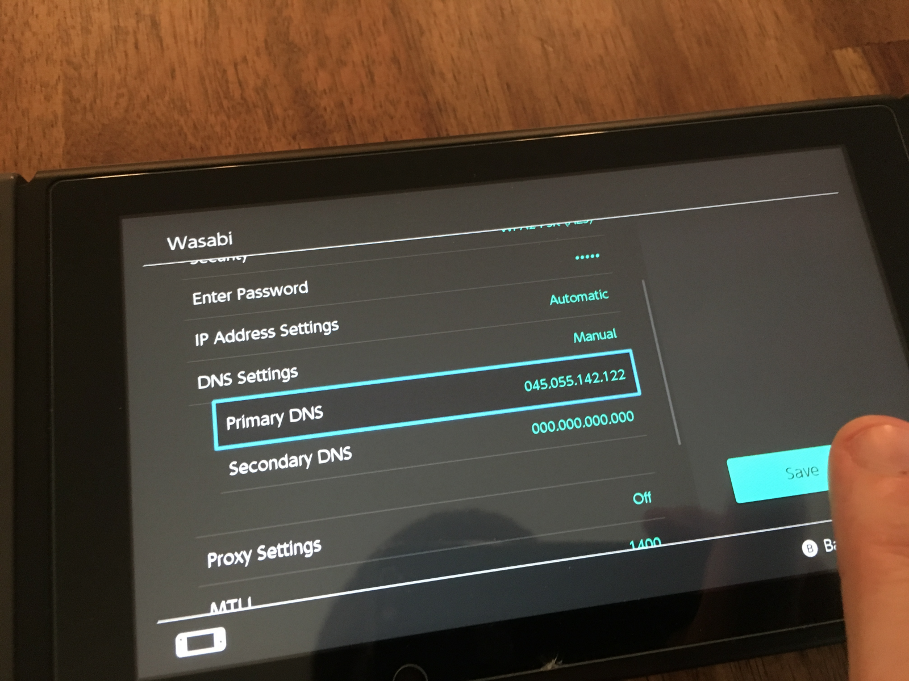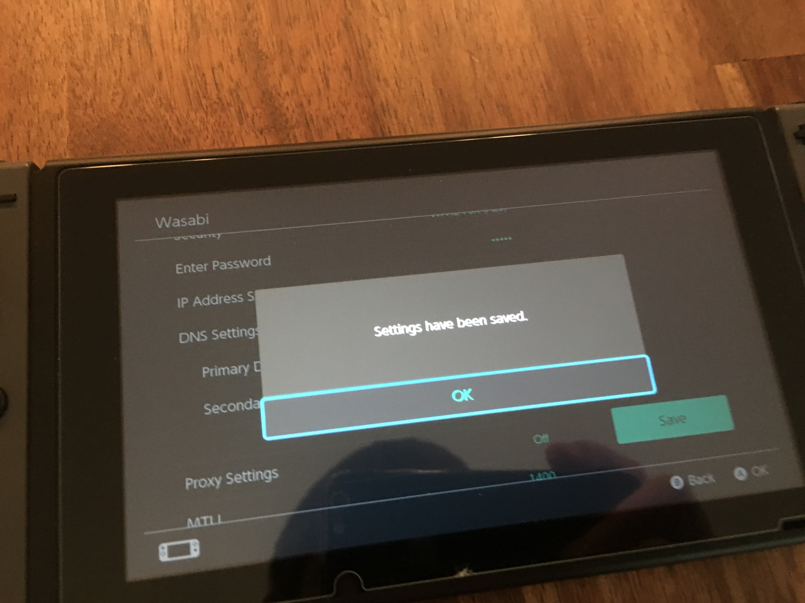

#### Connect to your Wireless Network

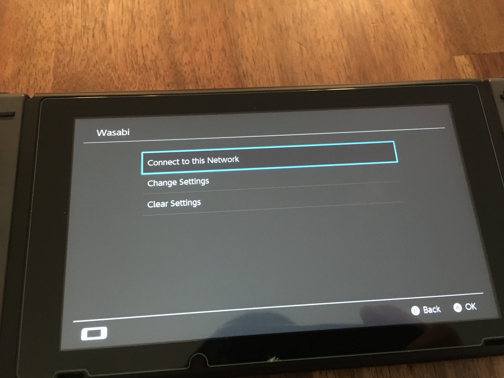

#### Wait for it to FAIL!

Yes, the next step should FAIL! This is because, thanks to this DNS proxy, your Switch will think you are using a public Wifi hotspot, and need to log in. Handing over full browser control in a pop-up window.

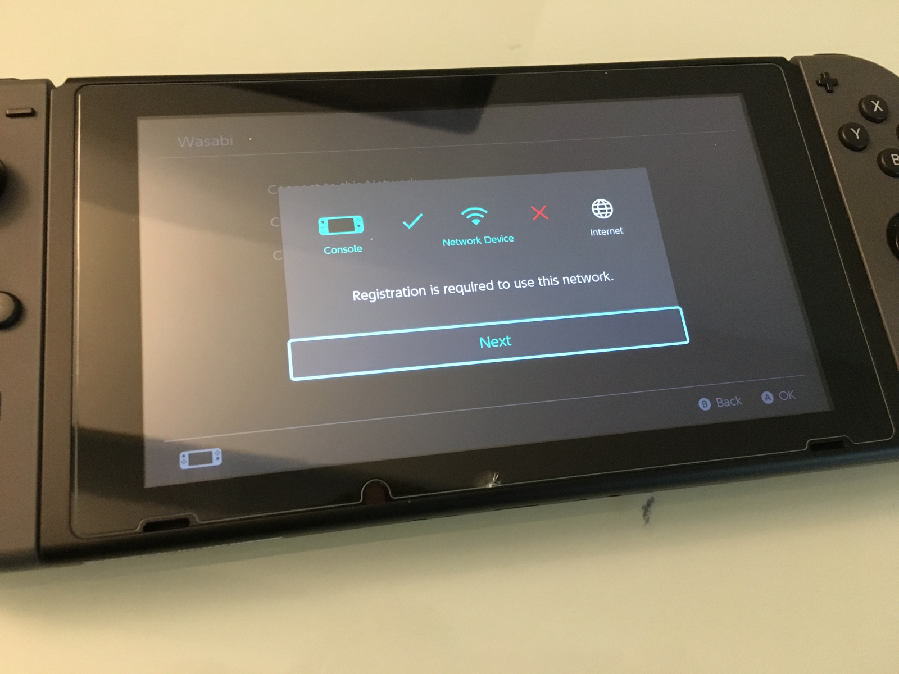

### Setting Up the Nintendo Switch as a Display

Setting up the Nintendo Switch is quite an enjoyable experience, and only takes a couple of minutes.

#### Enter your Display URL

Once the page loads, enter your Display Key. An example:

```
wearverbpower
```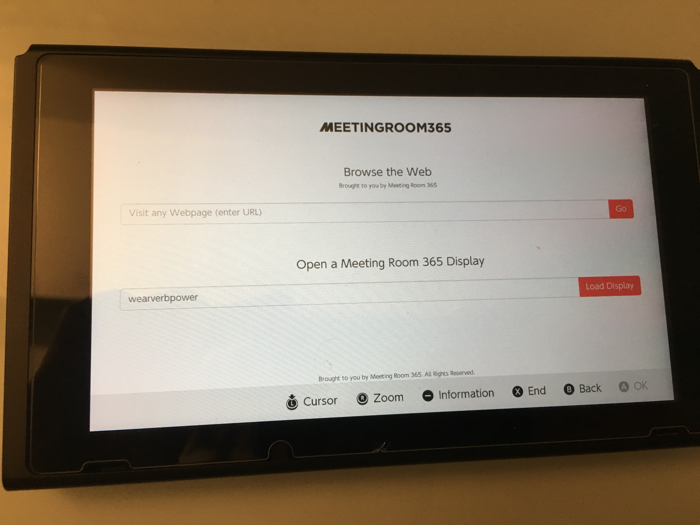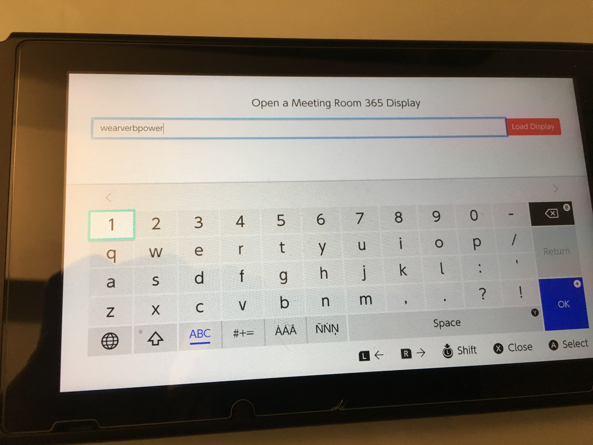

If you need the full URL:

```
https://meetingroom365.com/display?key=wearverbpower
```

**Tip:** Use the touch-screen keyboard, not your joycons!

#### Press Load Display

Your display should now load!

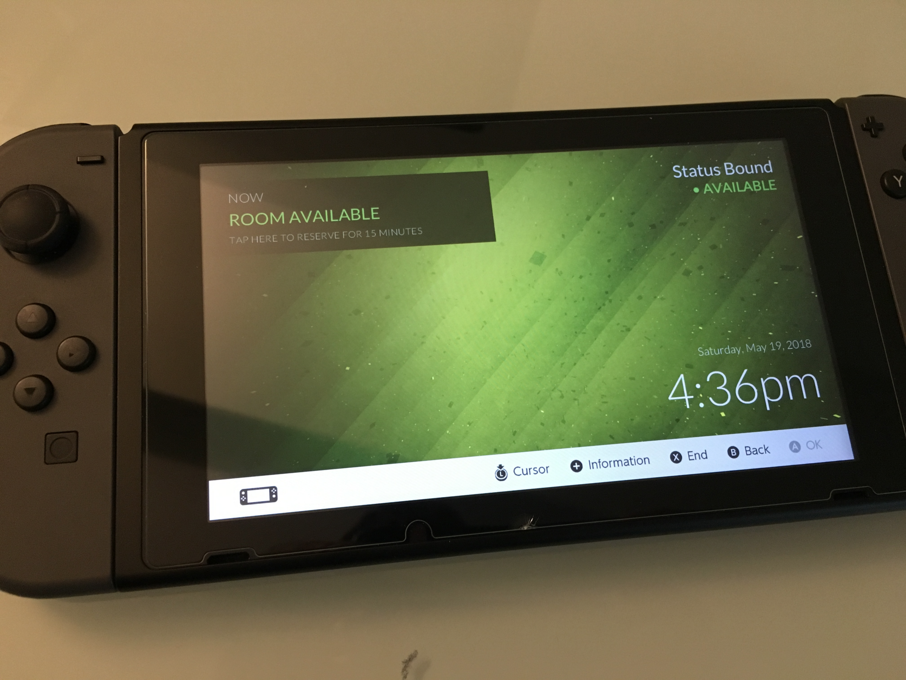

#### Browse the Web

Maybe this is what you’re really here for: to see how easy it can be to browse the Web on your Nintendo Switch.


The good news is, you’re already there! Simply enter any URL you like, to start browsing the web on your switch. Note: there are limitations. Flash is not supported, and neither are most HTML5 video players, including Youtube. Also, there may be some issues with very large (or slow) web pages. But, other than that, it seems to be a very complete, standards-compliant, and up-to-date modern web browser!

### How to get back to the Web Browser

In the future, if you want to get back to the web browser, just find your desired internet connection and press **‘Connect to Network’** again. You will load the same connecting screen, and then the web browser

#### What if you want to go back to normal mode?

Inevitably, you will want to revert these changes so you can access normal services, like Updates and the Nintendo eShop.

The simplest way to revert this change it to switch your **DNS Settings** back from **Manual** to **Automatic**. Your previous DNS IP will even be saved, to make it that much easier to get back to the web browser in the future.

### More Realistic Considerations for using the Nintendo Switch as a Meeting Room Display

#### Display Cost

So, it’s not completely crazy to use a Nintendo Switch as a meeting room display. It could be really fun in a gaming-focused company, such as Nintendo.

But, at $299, a new Switch is a bit more expensive than alternatives, even the iPad Mini.

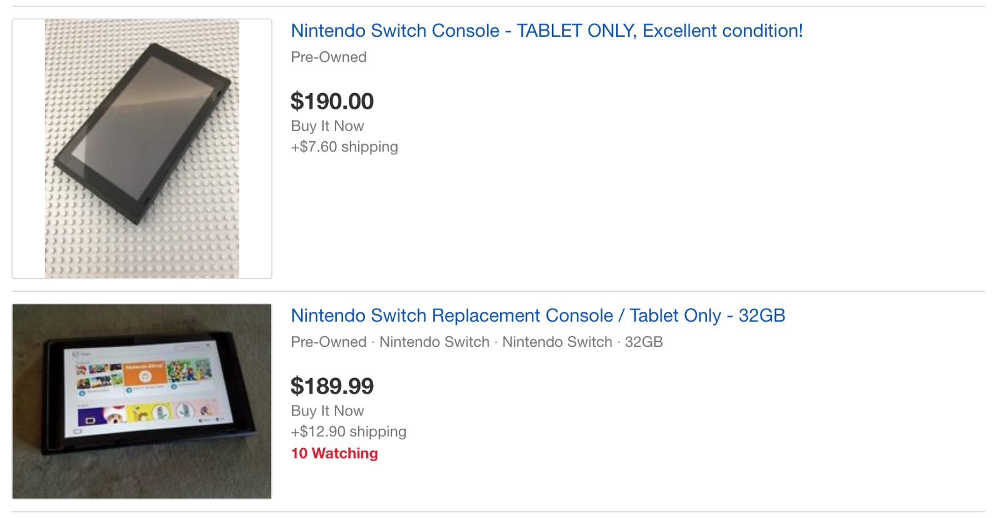

Ebay to the rescue! There is no shortage of tablet-only listings in the $160-$180 range (shipped). Throw in a USB-C charger ($8 new) and you’re all set.

#### Power Considerations

When setting up a Meeting Room display, Power is one of the most tricky concerns.

Officially, the Nintendo Switch AC power adapter is a cheap and simple solution, with a decent-length cable.

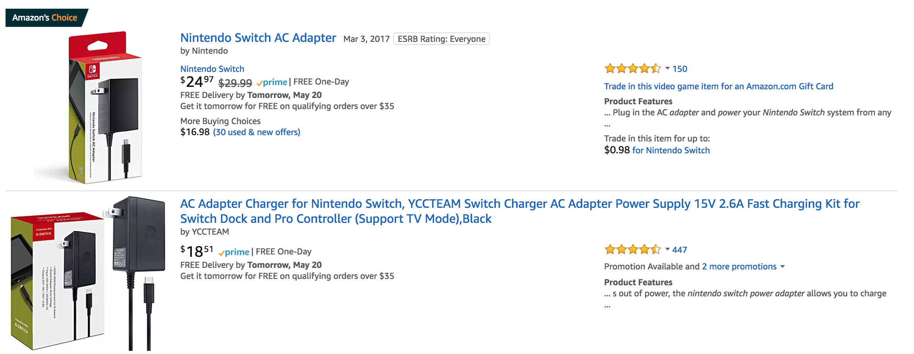

There are also third-party knockoffs from about $8.

However, Switch owners will be quick to point out, you need to find a Power adapter capable of **15V / 2.8A** over **USB-C**. The standard **5V/1A** adapters aren’t going to keep your Switch powered-on for long.

#### Mounting your displays

Once everything is set up, you’re ready to mount your displays.

For the Nintendo Switch, you may be happy placing it on a table or counter and utilizing the Kickstand!

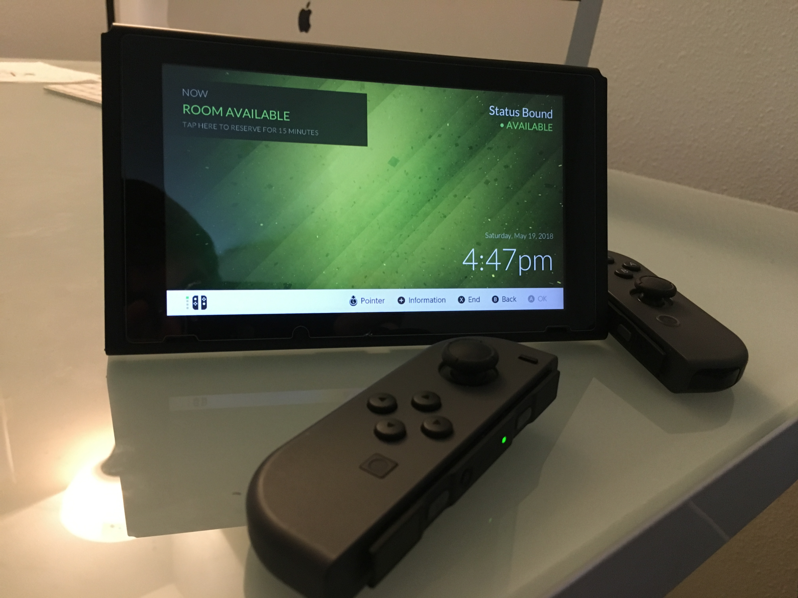

However, for a standard display, you’re probably going to want to mount it to a wall.

You will either mount your display using 3m adhesive (fastest), or drywall / mounting screws.

For instance, the Koala Mount consists of two small, sturdy plastic brackets that gently cradle your device. Designed to be used with 3M Command Strips (included). The strips are rated to hold up to 5 lbs each (far more than any tablet). To remove, the strips can simply be stretched off without causing any damage.

### Full Guides for Meeting Room 365

Interested in Setting up your own display using Meeting Room 365? We can support any tablet hardware you come up with, including older iPads, Android tablets, FireOS Devices, Windows & RT devices. We’ve even supported custom and proprietary display hardware. Reach out and let us know what you’re considering!

[**How to Add a Meeting Room Display to Office 365**  
_Mount any tablet or iPad outside your conference rooms as a meeting room display, and keep your space organized_medium.com](https://medium.com/meeting-room-365/how-to-add-a-meeting-room-display-to-office-365-6d42561e2f5b "https://medium.com/meeting-room-365/how-to-add-a-meeting-room-display-to-office-365-6d42561e2f5b")[](https://medium.com/meeting-room-365/how-to-add-a-meeting-room-display-to-office-365-6d42561e2f5b)

[**How to Add a Meeting Room Display to Office 365 \[iPad Version\]**  
_Setting up an iPad with Meeting Room 365_medium.com](https://medium.com/@jamesfuthey/how-to-add-a-meeting-room-display-to-office-365-ipad-version-24b1338702c "https://medium.com/@jamesfuthey/how-to-add-a-meeting-room-display-to-office-365-ipad-version-24b1338702c")[](https://medium.com/@jamesfuthey/how-to-add-a-meeting-room-display-to-office-365-ipad-version-24b1338702c)

[**How to Add a Meeting Room Display to Office 365 \[Android Tablets\]**  
_Setting up an Android Tablet with Meeting Room 365_medium.com](https://medium.com/@jamesfuthey/how-to-add-a-meeting-room-display-to-office-365-android-tablets-70dca93afc92 "https://medium.com/@jamesfuthey/how-to-add-a-meeting-room-display-to-office-365-android-tablets-70dca93afc92")[](https://medium.com/@jamesfuthey/how-to-add-a-meeting-room-display-to-office-365-android-tablets-70dca93afc92)

[**How to use the Amazon Fire Tablet as an Office 365 Meeting Room Display / Conference Room signage…**  
_See how I set up meeting room display kiosks for Office 365 at just $27.41 per room, with ultra-cheap Fire tablets from…_medium.com](https://medium.com/@jamesfuthey/how-to-use-the-amazon-fire-tablet-as-an-office-365-meeting-room-display-conference-room-signage-777b7a793e1d "https://medium.com/@jamesfuthey/how-to-use-the-amazon-fire-tablet-as-an-office-365-meeting-room-display-conference-room-signage-777b7a793e1d")[](https://medium.com/@jamesfuthey/how-to-use-the-amazon-fire-tablet-as-an-office-365-meeting-room-display-conference-room-signage-777b7a793e1d)

[**Using a Raspberry Pi as a Meeting Room Display \[Office 365\] \[DIY\]**  
_How to Add a Meeting Room Display to Office 365_medium.com](https://medium.com/@jamesfuthey/using-a-raspberry-pi-as-a-meeting-room-display-office-365-diy-ad34b8c3e5da "https://medium.com/@jamesfuthey/using-a-raspberry-pi-as-a-meeting-room-display-office-365-diy-ad34b8c3e5da")[](https://medium.com/@jamesfuthey/using-a-raspberry-pi-as-a-meeting-room-display-office-365-diy-ad34b8c3e5da)