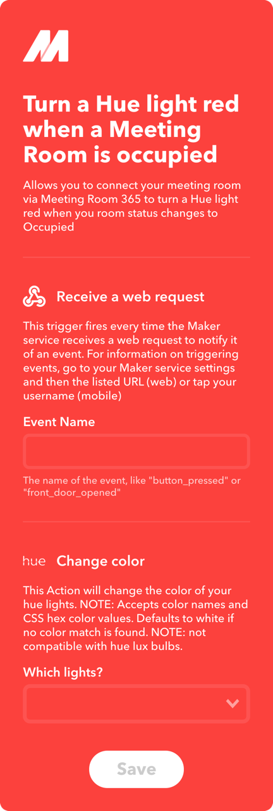
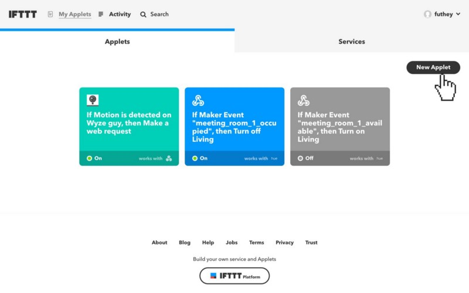
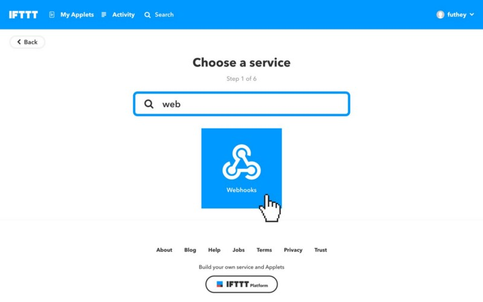
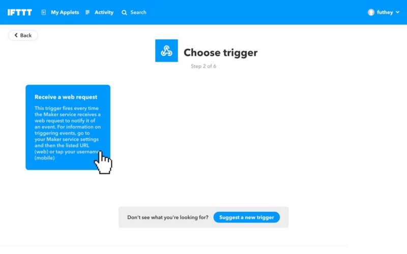
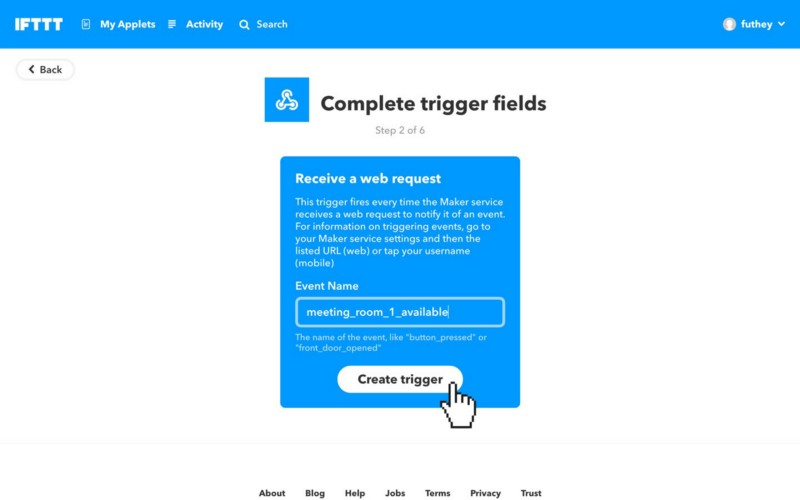
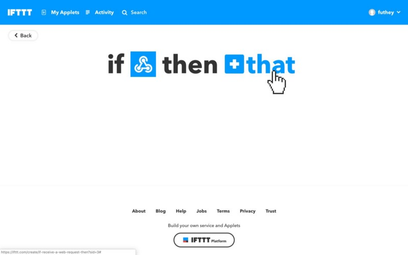
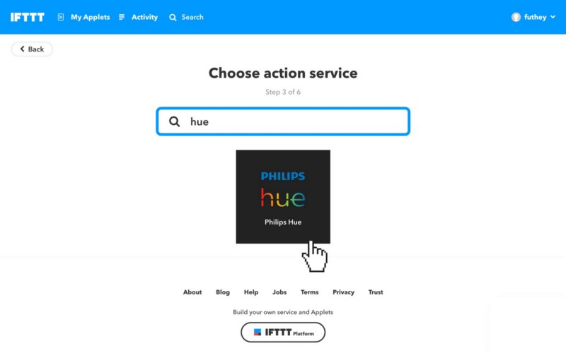
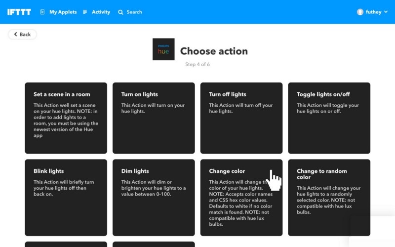
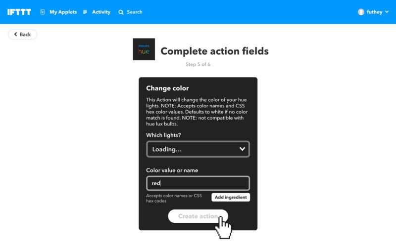

#### Trigger an action based on Meeting Room Status

Below are some very basic instructions for connecting a Meeting Room 365 Display with external hardware via IFTTT.

  

  

### Applet Template

For this example, your IFTTT applet will listen for an event sent from a Meeting Room 365 display, updating your lighting status when the event is received. Below is the completed applet template.

You can pick any event names you like, however, you must supply us with the event names, one when the display becomes “available”, and one when the display becomes “occupied”. These may be fired more than once.

Contact Support to have these event names attached to your displays.

  

### Steps

  

