Hopelessly addicted to Pokémon GO? Looking for a sure-fire way to impress your friends? Have about 10 minutes to spare? Then keep reading, and in about ten minutes, you’ll have a live, sharable map of every Pokémon, Gym, Lure, and Pokéstop that’s sure to impress your friends.

---

### Update

Niantic has implemented sophisticated methods of banning accounts and limiting unauthorized access to their APIs. The methods described below will no longer work.

#### Updated August 13th

Niantic has began the process of scanning and banning accounts which use the spiral scanning method. It is no longer recommended to run your own Pokemon GO map, and this information is no longer accurate. Use at your own risk. Thanks for all the shares and recommends!

#### Updated August 7th

This tutorial has been updated on August 7th to work with a new release of PokemonGo-Map.

#### Updated August 3rd

Niantic released another patch today which has broken most API access to Pokémon GO, including PokemonGo-Map. There is more information in [**https://www.reddit.com/r/pokemongodev**](https://www.reddit.com/r/pokemongodev). This article will be updated as more information becomes available.

#### **Updated** July 31st

Niantic recently made an update to the Pokémon GO backend servers, which makes previous versions of this tutorial obsolete. This tutorial has been updated on Sunday, July 31st, 2016 to accommodate the recent update.

---

### **1\. Create a new** Pokémon **Go Account**

**Estimated time to complete: 2 minutes**

[**https://club.pokemon.com/us/pokemon-trainer-club/sign-up/**](https://club.pokemon.com/us/pokemon-trainer-club/sign-up/)

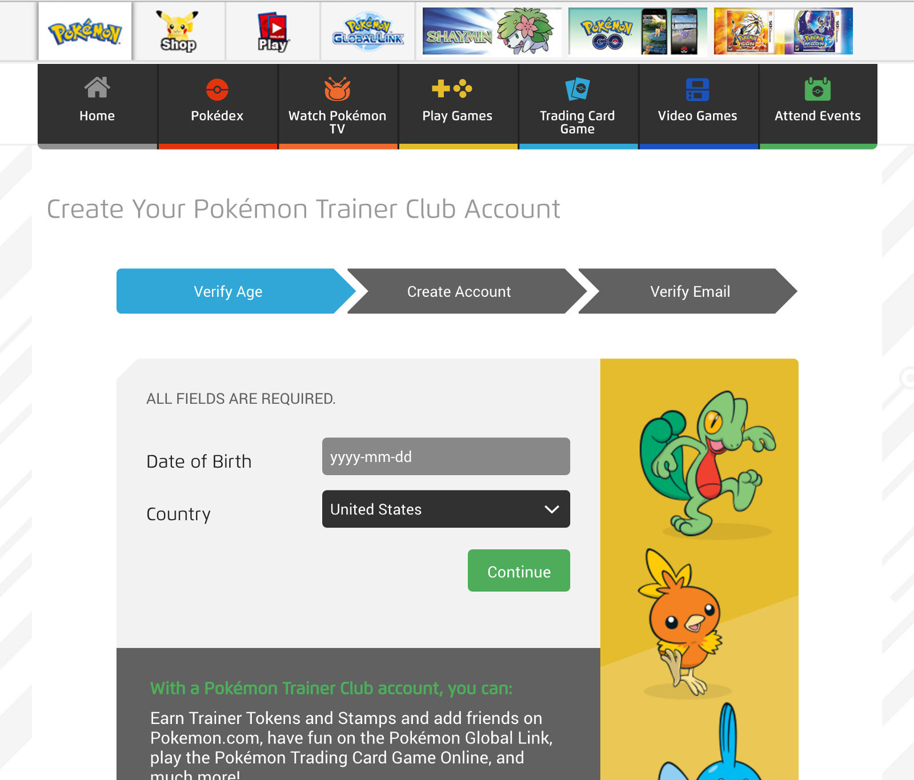

I suggest using a Pokémon Trainer account and an email not previously associated with a Niantic account, so that if Niantic ever decides to crack down on bot accounts, your player account is in the clear.

#### Updated August 7th

When creating a new account (after August 7th), will need to log in and accept the Terms and Conditions before you are able to use a new account to scan.

---

### **2\. Deploy PokemonGo-Map to a server by clicking the “Deploy to Jelastic” button**

**Estimated time to complete: 3 minutes**

After you’ve signed up for a new Pokemon GO account, Navigate to this page: [**https://github.com/PokemonGoMap/PokemonGo-Map**](https://github.com/PokemonGoMap/PokemonGo-Map)

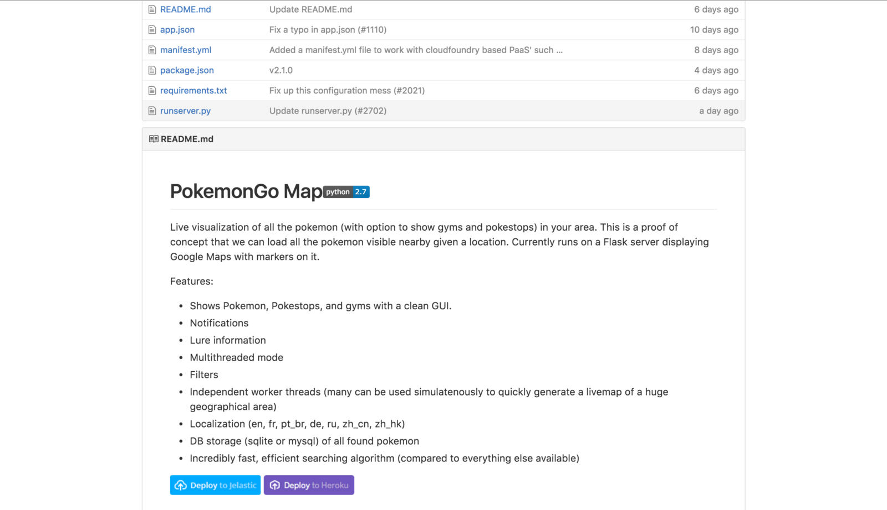

Then, scroll down until you see the blue **“Deploy to Jelastic”** button. Click it, and follow the instructions to deploy a new server to Jelastic. You will probably need to press the button again on the next page, depending on your configuration.

#### A word of warning

Using this software is technically against the ToS of the game. Your Pokemon GO account could get banned, so use this tool at your own risk. Be sure you are not using an account or email address associated with your main Pokémon GO account!

#### Complete the Registration Form

**Important:** There are multiple reports that the default **service provider** option is not currently working (August 7th). Be sure to change the service provider (Webhosting.net works for me). You can change this to almost any provider, even if you do not live in the country listed (however, it will be slightly faster if you pick your region).

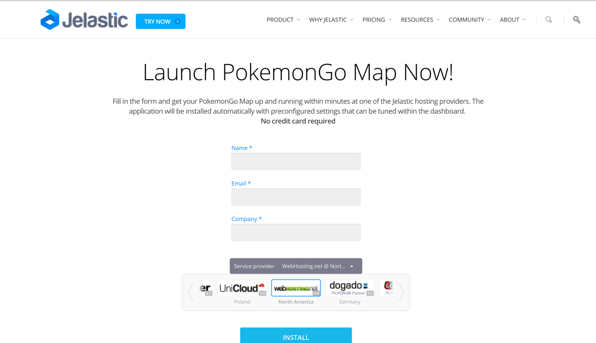

#### Configure your map

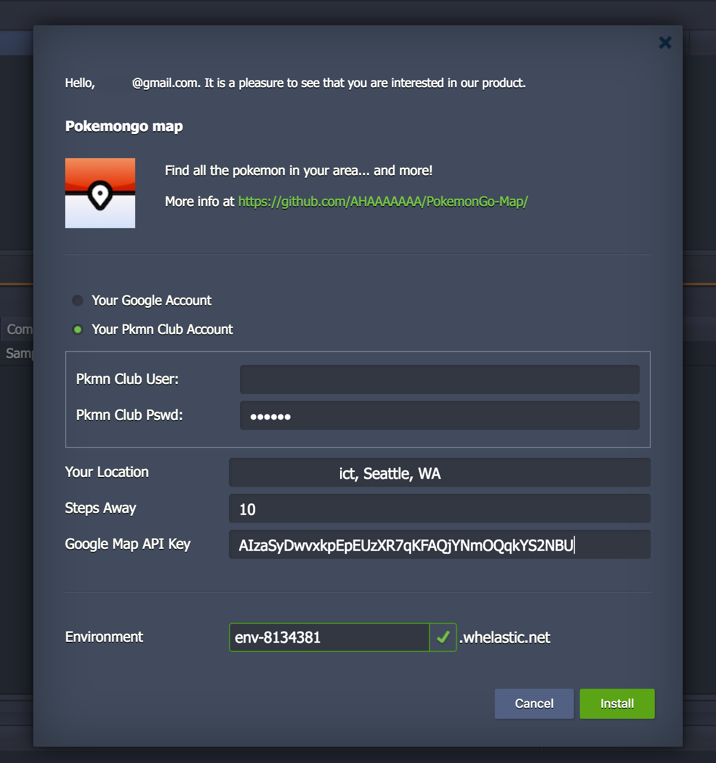

#### **Use the following settings:**

> **AUTH\_SERVICE:** Your Pokemon Club Account

> **Pokemon Club USER:** This is your Pokémon Go Account username

> **Pokemon Club PASSWORD:** This is your Pokémon Go Account password

> **YOUR LOCATION:** Pick a central location or your neighborhood (but avoid using your home address)

> **STEPS AWAY:** 5 (I suggest a value between 4 and 7)

> **GOOGLE MAPS API KEY:** AIzaSyDd2–8JfUbP5883DV7NoOBaK6KIPEb-MSk (you may also choose to use a pre-filled google maps key)

> **ENVIRONMENT:** This is the URL to your server, once it is live. Use the pre-filled environment name, or create your own.

Once you have entered the information and completed the form, press the green “Install” button. It will take 1–2 minutes to complete this step (be patient). It’s cloning the latest source code from Github, and building the server environment for you as you wait.

#### **Wait for your map server to be setup**

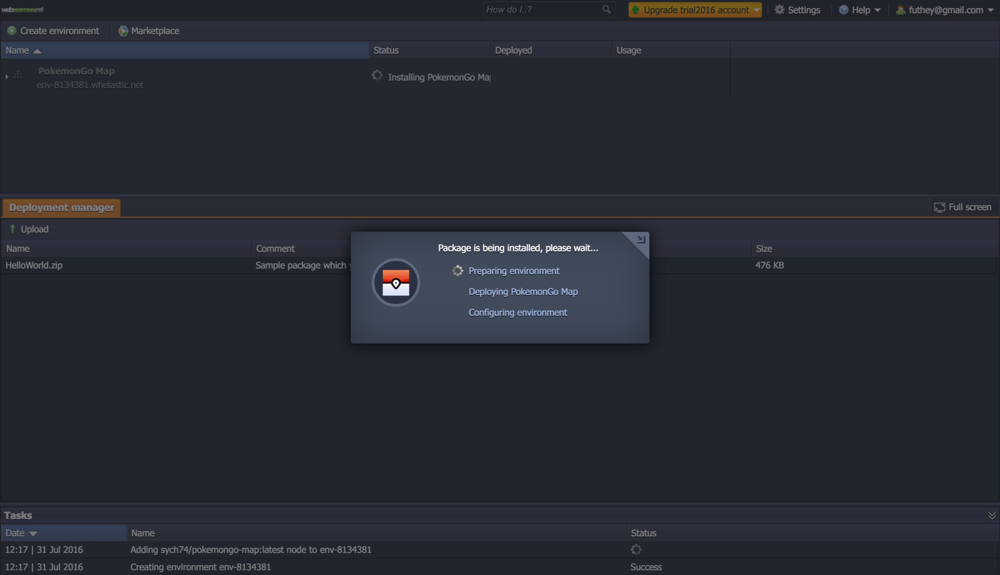

#### Once your map has been built, click ‘View’

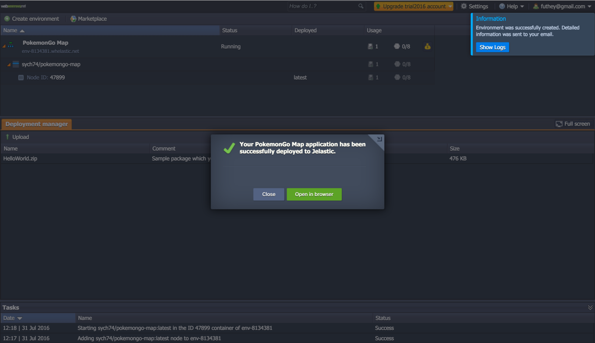

#### Here is your completed map!

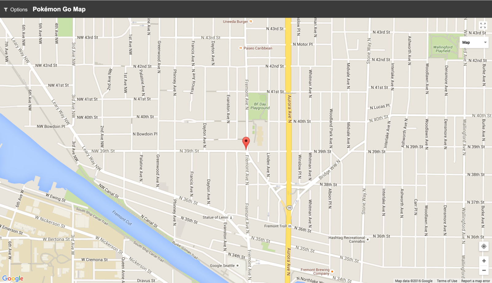

---

### **3\. Add your server location to this database**

**Estimated time to complete: 1 minute**

Navigate to [**https://live.luresquad.com/**](https://live.luresquad.com/)

Then, click the ‘Plus’ symbol in the bottom-right.

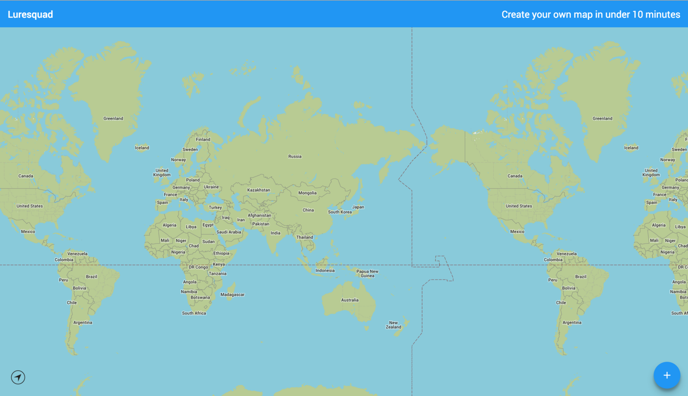

Next, using one simple form, add your map location from step 3, and the URL of your Jelastic server.

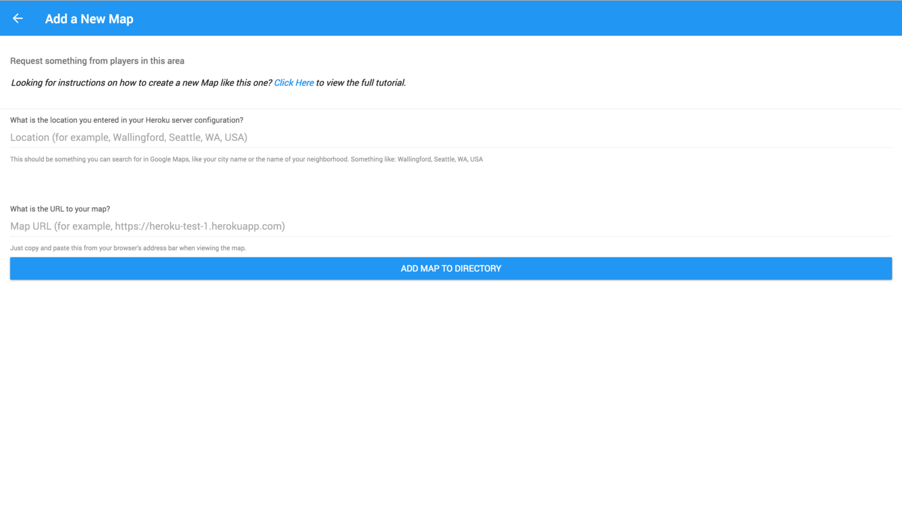

This will allow others to easily discover your map (and earn you tons of good karma with other Pokémon GO players).

### Don’t see any Pokémon on your map?

#### Hint: It’s not you. By default, nothing is turned on. You have to open the menu and tell the map what you want to see.

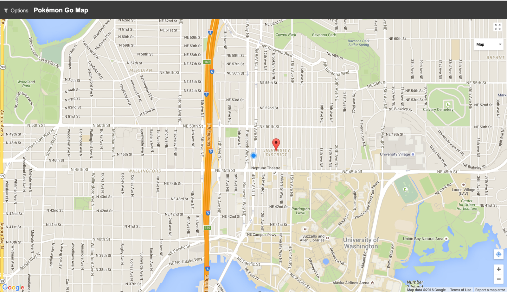

#### **Press ‘Options’ in the upper-right corner of the map, then toggle the items you would like to see.**

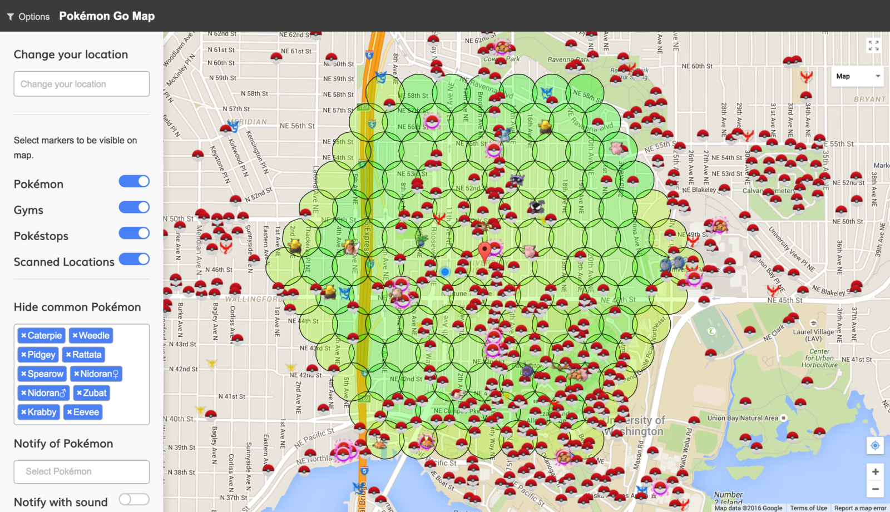

---

### 4\. Share your map with your friends!

[**Map to find the best Pokémon. Keep up with your friends as you play - Lure Squad**  
_Earn rewards for playing Pokemon Go!_luresquad.com](https://luresquad.com/ "https://luresquad.com/")

Copy the URL of your map to a safe location, and share it with your friends, so they can see Pokémon in your neighborhood.

#### Luresquad for Android & iOS

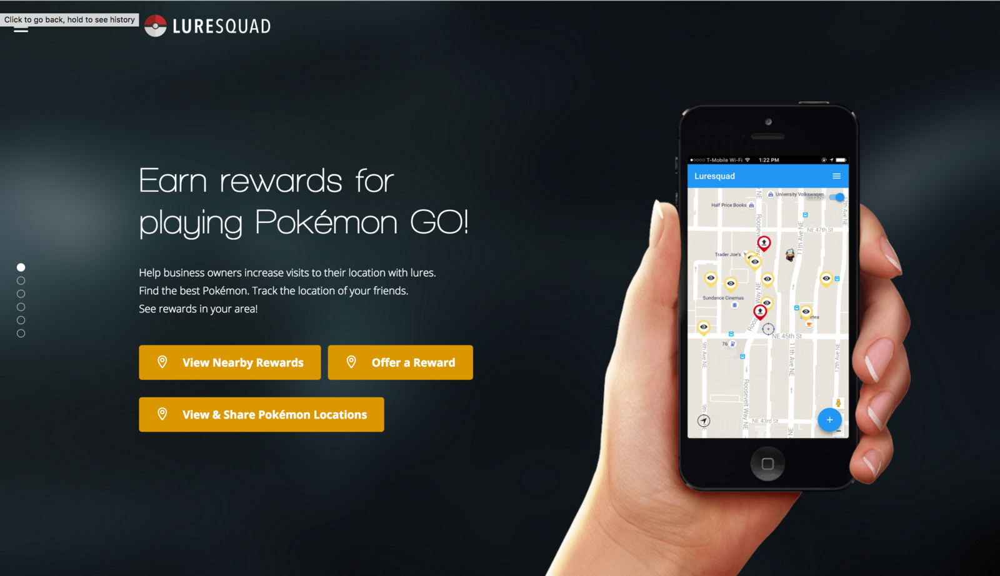

Looking for the best Android and iOS apps for finding the best Pokémon in your area, and to get rewards from local businesses for playing Pokémon GO?

Check out [**https://luresquad.com/**](https://luresquad.com/).

### Enjoyed this article? Was it helpful? Help us out by hearting this story & sharing with your friends.

