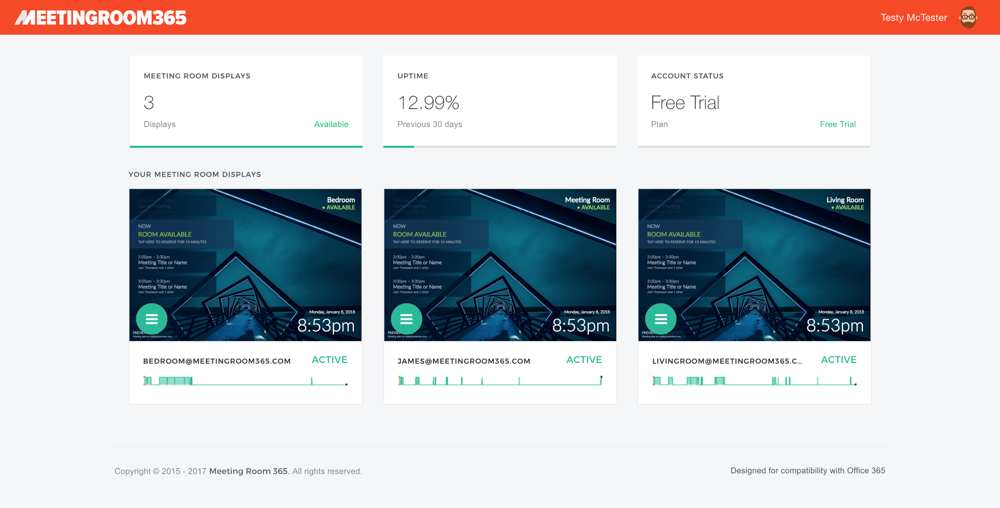

## Get to know our latest offering, with native apps on the App Store (iOS), Google Play (Android), and Amazon App Store (FireOS)

We’re currently in the process of upgrading our meeting room display apps and admin portal to take advantage of new Microsoft APIs, which have recently become more stable.

View the following guide to get started:

[**Getting Started with Meeting Room 365 (Public Beta)**  
_How to get set up with the Meeting Room 365 Public Beta, and provision your first displays._medium.com](https://medium.com/@jamesfuthey/getting-started-with-meeting-room-365-public-beta-adb981c958f5 "https://medium.com/@jamesfuthey/getting-started-with-meeting-room-365-public-beta-adb981c958f5")

Please note, these are separate systems, so we are asking that you create a new account if you would like to try the beta. Your existing credentials will not work. At some point in the future we will perform a migration for existing accounts.

Please consider this a beta, and reach out if you run into any issues.

Native apps are currently available in the **iTunes App Store**, **Amazon App Store**, and **Google Play Store.**

If you would like to continue to use a webapp (Windows RT / 8 / 10, Raspberry Pi, custom hardware, etc.), use the URL [**https://app.meetingroom365.com/intro**](https://app.meetingroom365.com/intro)  (we aim for this app to work on all devices).

The new authorization scheme stores credentials securely on your tablet in the form of an authorization token and a renewal token. This is much safer than the previous authentication scheme, since no one except you will ever store or see your credentials. We’ve simply been waiting for a few bug fixes from Microsoft to release a public beta, which is now possible.

When you install the app, you will be asked to log in using your meeting room display (resource mailbox) credentials. Then, you will be asked to create a Meeting Room 365 account (or log into an existing one).

---

Another key difference is that, in the new system, you won’t need to provision a display to use it. You simply set up your displays through the app, and as long as everything is on the same tenant / domain, it will all appear in your admin portal.

The admin portal can be found at: [**https://beta.meetingroom365.com/**](https://beta.meetingroom365.com/)

---

The version of the API we have been previously using will be depreciated by Microsoft on **November 1st, 2018**. We will need to end support for our legacy apps at that time as well.

You can read more about the depreciations here: [https://dev.office.com/blogs/outlook-rest-api-v1-0-office-365-discovery-and-live-connect-api-deprecation](https://dev.office.com/blogs/outlook-rest-api-v1-0-office-365-discovery-and-live-connect-api-deprecation)

**Thanks for your understanding! Please reach out if you have any questions.**