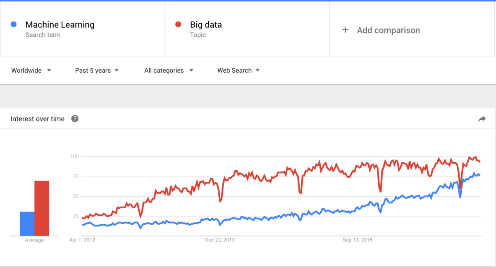
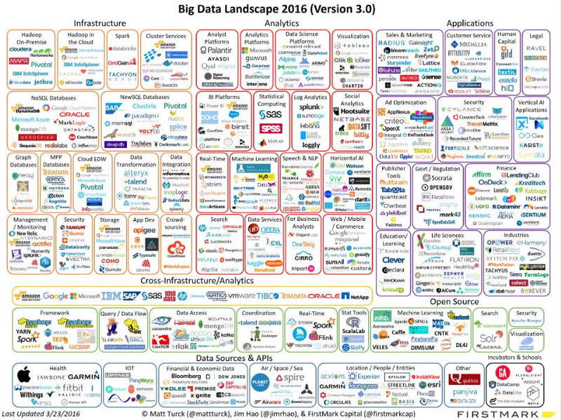

### Sophistication seems to be a key differentiator for… everyone?

I just left an amazing startup building a product around Machine Learning and Retention-focused Predictive Analytics. One of our biggest challenges was, standing out in a crowded marketplace where everyone is essentially crafting the same message. 

> “Buy our product. We use the latest, most sophisticated AI-powered data science techniques on big data to solve real problems”.

And to make things worse, some of these products are, at their core, Descriptive Analytics. But savvy marketers, at some point, realized interest was waning, and they had to up their game. 

So, they break out their research, and sure enough, Big Data, Machine Learning, and Predictive Analytics are what’s trending upwards right now. Not the product they’re currently building.

So, it’s understandable that companies are trying to craft a message that aligns with what their potential customers are searching for.

### Everyone thinks they have “Big Data”

Everyone with a website today seems to think they have **Big Data problems**. Actually, go work for a company that specializes in Big data. The market is small, niche, and specialized. **But the marketing opportunity for Big Data products is virtually unlimited.**

A unique problem arises: When everyone is trying to buy a **Maserati**, but their needs would better fit a **car2go**, products no longer focusing on catering to the needs users actually have. Instead, they get stuck building a backlog of features to support requests related to how they are perceived in the market, vs. the product they want to be building.

They end up building performance features to support race car drivers, because their users imagine that they‘re actually race car drivers, or because they imagine that someday they’ll become race car drivers.

### Who owns “Small Data” ?

So if everyone is racing to become the **Maserati of Analytics**, who‘s going to become the Honda or the Fiat?

Right now, if you take a look at the chart above, you’ll see a ton of “big data” and “predictive analytics” companies, but only a handful of “accessible analytics” companies (if any). 

That’s because that market is owned by Google Analytics. A free product with virtual ubiquity. Everyone is using it. Except in Europe, where Yandex Metrica plays virtually the same role.

### So, how do you compete with free and ubiquitous?

  

  

### Leveraging our strengths