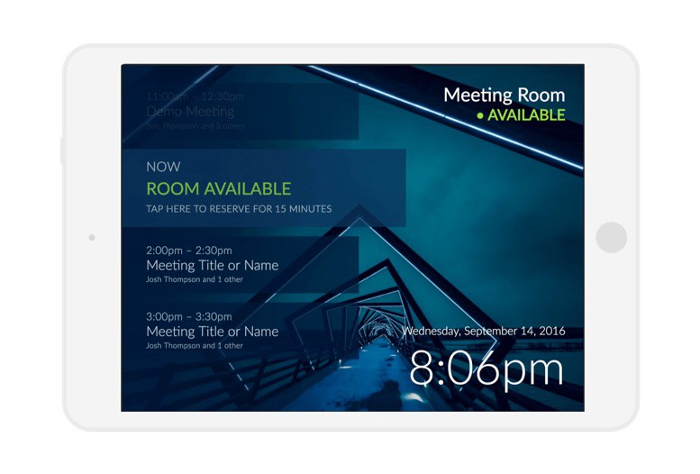
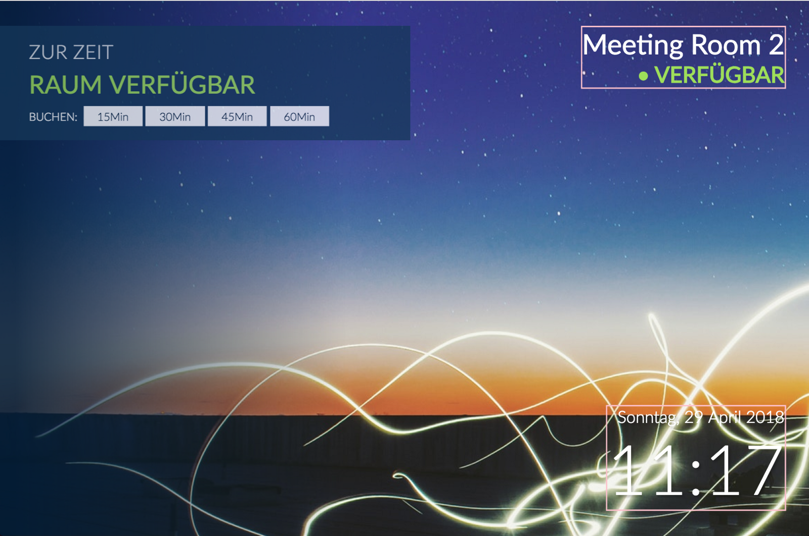
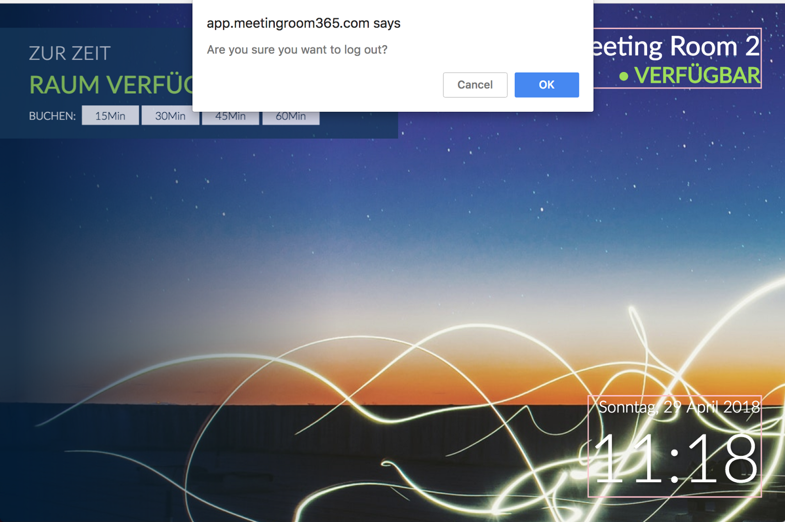
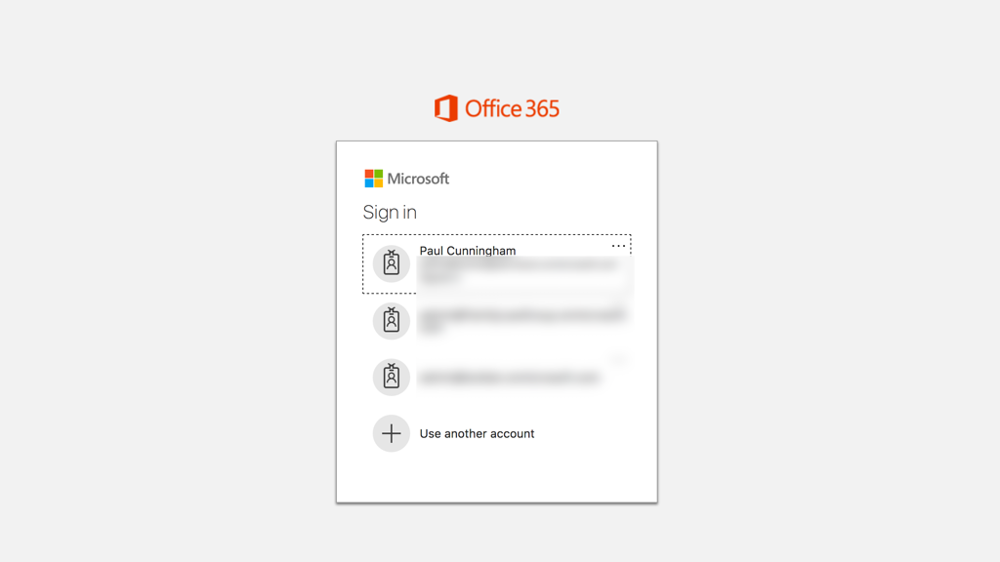

## A quick guide explaining how to sign out of the Meeting Room 365 App once you have signed in.

You may have noticed there is no “sign out” button on the native apps once you have logged in.

However, we have added a quick trick that lets you log out without exposing this option in an obvious way to your users.

You will need to tap on two areas on the screen:

1.  The meeting room name (highlighted above)
2.  The Date / Time area (highlighted above)

### Logging Out

To log out, tap on the following areas:

1.  Meeting Room Name
2.  Date / Time area
3.  Meeting Room Name
4.  Date / Time area
5.  Meeting Room Name
6.  Date / Time area

Then, you will see a popup asking you if you wish to log out:

Press `OK` or `Confirm`to return to the login screen

That’s it! Let us know if you have any questions.