## A How-to Guide

So, you heard about Sketch Libraries, and thought **“Wow, this is exactly what I need!”**

**Just one problem:** You’re currently in the middle of a huge project. Dozens or hundreds of artboards. So many local symbols you’ve lost count.

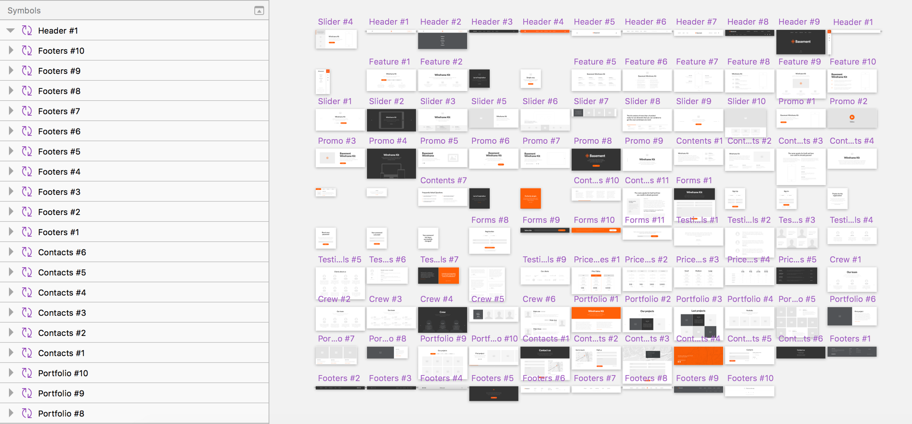

> Ulg, am I going to have to **recreate all of my artboards** in order to upgrade to Libraries? Isn’t there some way I can just import them?

– Me

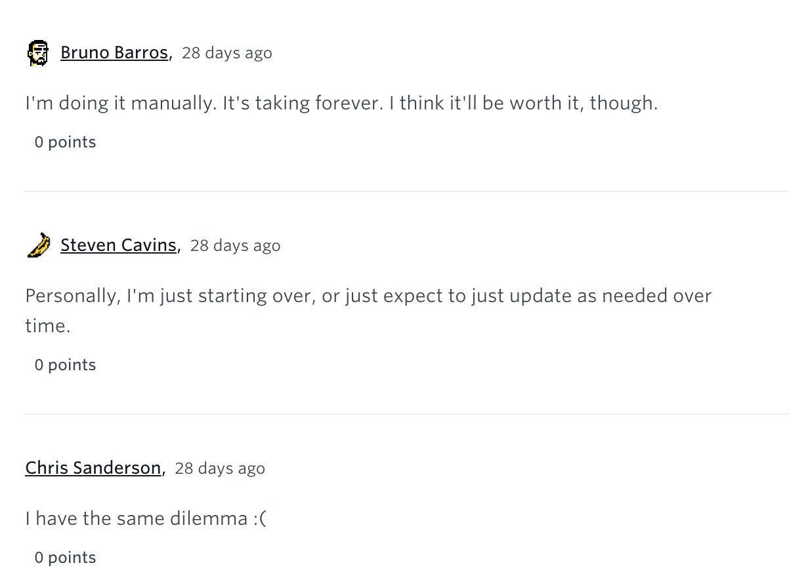

---

#### The solution: Symbol Migration to Libraries via a Sketch Plugin.

---

### What are Libraries?

The best design happens when designers collaborate together. With Libraries, designers can now share Symbols across documents and have them update to be always kept in sync.

A Library is just an ordinary Sketch document that contains [Symbols](https://sketchapp.com/docs/symbols/) which you can then use in any other Sketch document. If you [update any of those Symbols](https://sketchapp.com/docs/libraries/library-symbols) in your Library file, documents containing instances of those Symbols will receive a notification telling you that they can be updated. Here you can preview, check, and confirm changes — and by doing so, you can always ensure your documents are using the up-to-date copies of those components.

#### Why you should switch to Libraries

Whether you design alone, or as part of a team —you’re going to love Libraries. Individual designers will see benefit by being able to quickly insert Symbols of their commonly used components straight from the Insert menu. By default you should already see the “iOS UI Design” template as a Library so you can start with these building blocks for your next design. [Add an already-existing document as a Library, or create a new one](https://sketchapp.com/docs/libraries/adding-libraries) so you can use its Symbols in all your new documents going forward. By doing so, you can [effortlessly update them](https://sketchapp.com/docs/libraries/library-updates) with any changes that you make.

Designers in teams can take full advantage of a Library’s ability to make sure they’re using the most up-to-date versions of icons, or the latest branding from the company’s style guide. With the Library document safely separated, [updates to Symbols](https://sketchapp.com/docs/libraries/library-symbols) can only be made here so you don’t inadvertently make any edits in your design that will embarrassingly appear across all your colleague’s documents!

If another team member makes a change to the Library’s Symbols, you’ll get the opportunity to review the change and make sure all is as it should be before accepting the update to your own document.

### Moving to libraries (if you’re already using Symbols)

So, the problem I faced (and I imagine a lot of you are facing, if you stumbled upon this guide), is that I’m already heavily invested in **Local Sketch Symbols**. They’re embedded in my **working file**, and I share that with my team. It’s far too large and complicated to recreate from scratch.

#### What you’ll need

-   **Sketch 47+**
-   **A cloud storage provider** (Dropbox, Box, Google Drive, Creative Cloud, etc.)
-   A Sketch file with **Artboards** and **Local Symbols**

#### Concepts

Currently, you should have one Sketch file, with **Artboards,** and **Local Symbols**. While you could immediately convert this to a library, all of the artboards you’ve previously created will be subscribed to the local symbols in your document. If you delete those symbols, they’re gone. Your artboards revert to groups/layers/etc.

As I alluded to, our goal is to move from one file to two. The first file will be our **Shared Library**, and the second file will be our **Shared Design document**.

Ideally, the Library needs to live in a shared folder that all our collaborators have access to. You can restrict write permissions on this file in your file sharing platform if you want some members of your team to be library authors, and restrict others from making direct changes (perhaps accidentally) to your shared Sketch library.

**WARNING:** Backup your current design, just in case.

### Guide

#### **Step one:** Clone your current design file (and **BACK IT UP!**)

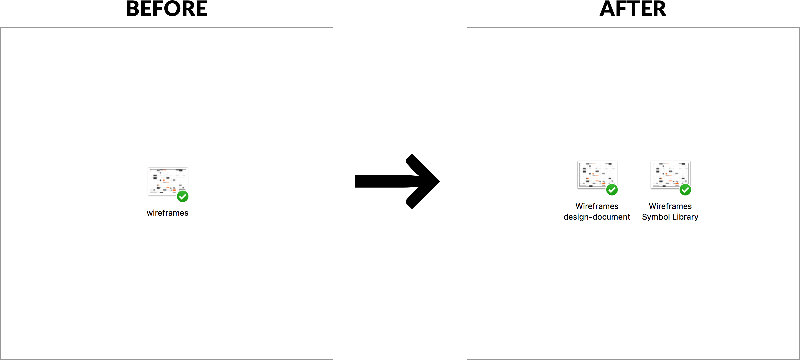

#### Step Two: Add your library to Sketch

The easiest way to do this is to Place your file in your desired “shared folder”, and open it. Then, you can click **_File_**, and **_Add Library_**.

That’s it! You should see this:

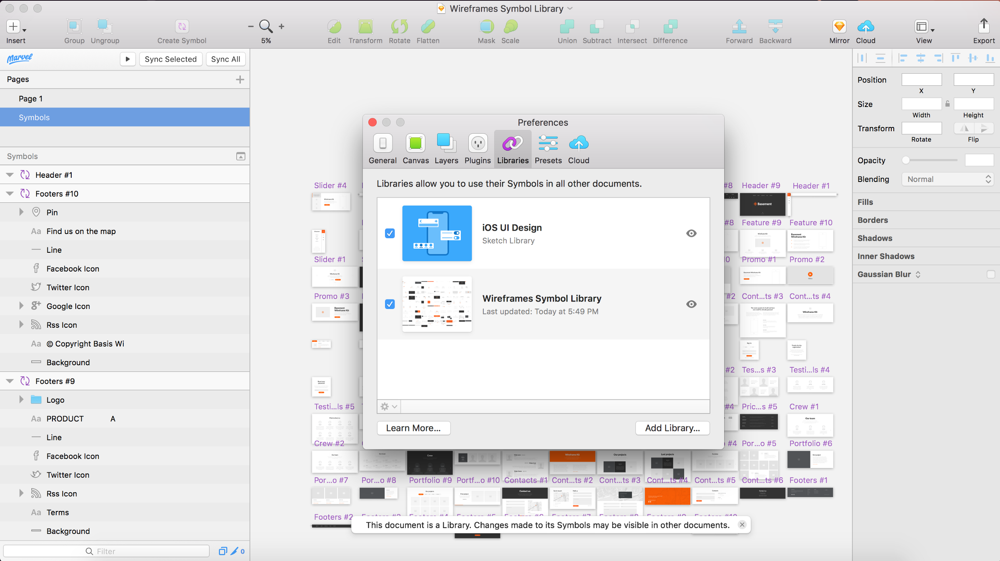

You can come back here in the future to enable / disable / add more libraries.

#### Step Three: Delete Artboards from your Library (optional)

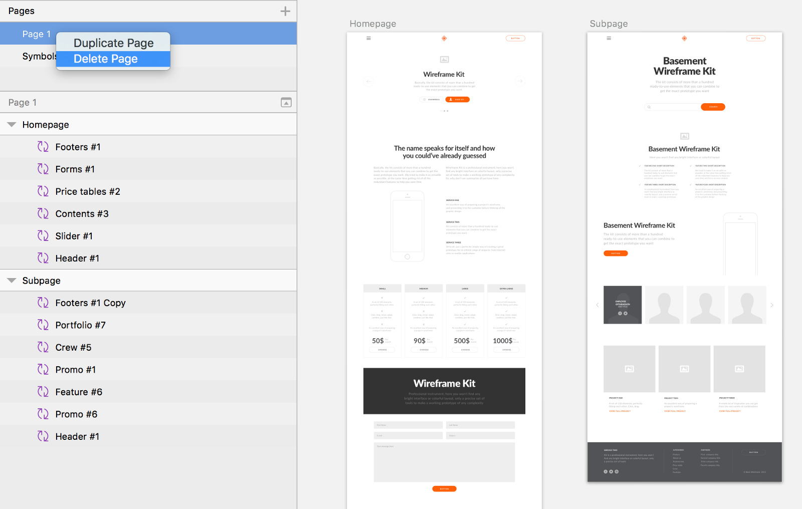

You’re not going to need your artboards in your library (anymore). Just delete them from this document to save space, and to prevent anyone from accidentally treating it like a design document in the future.

#### Step Four: Migrate your Local Symbols to Imported Symbols

Next, we’ll open our design document and migrate our **Local Symbols** to **Imported Symbols**. This is what Sketch calls our shared symbols that live in **Libraries**.

To do this, we’ll need a plugin.

#### Library Migration Plugins

There are currently at least three plugins to accomplish “migration to Libraries”. They work (almost) the same, so it’s really a matter of preference at this point. The **“Automate Sketch”** plugin is part of a larger, awesome package of tools (and some of you may already be using it). **“Library Symbol Replacer”** does one thing, and does it well: Replace your local symbols with imported ones. For the purposes of this guide, we’ll use **“Library Symbol Replacer”**.

[**zeroheight/library-symbol-replacer**  
_library-symbol-replacer - Sketch plugin to replace symbols in an existing documents with library symbols 💎 📚_github.com](https://github.com/zeroheight/library-symbol-replacer "https://github.com/zeroheight/library-symbol-replacer")

[**Ashung/Automate-Sketch**  
_Automate-Sketch - Make your workflow more efficient._github.com](https://github.com/Ashung/Automate-Sketch "https://github.com/Ashung/Automate-Sketch")

**Edit:** Adding this plugin to the list, which has some extra flexibility for some of the edge-cases you might run into, like duplicate / same-named symbols, etc. Haven’t had a good opportunity to “put it through it’s paces” though.

[**sonburn/symbol-swapper**  
_symbol-swapper - Swap the selected symbols and/or symbol instances to a master of the same name in a library._github.com](https://github.com/sonburn/symbol-swapper "https://github.com/sonburn/symbol-swapper")

If you run into any of these issues, try it out and let me know how it goes!

---

#### Performing the Migration

When you open your design document, at this stage it should contain both **Symbols** and **Artboards**.

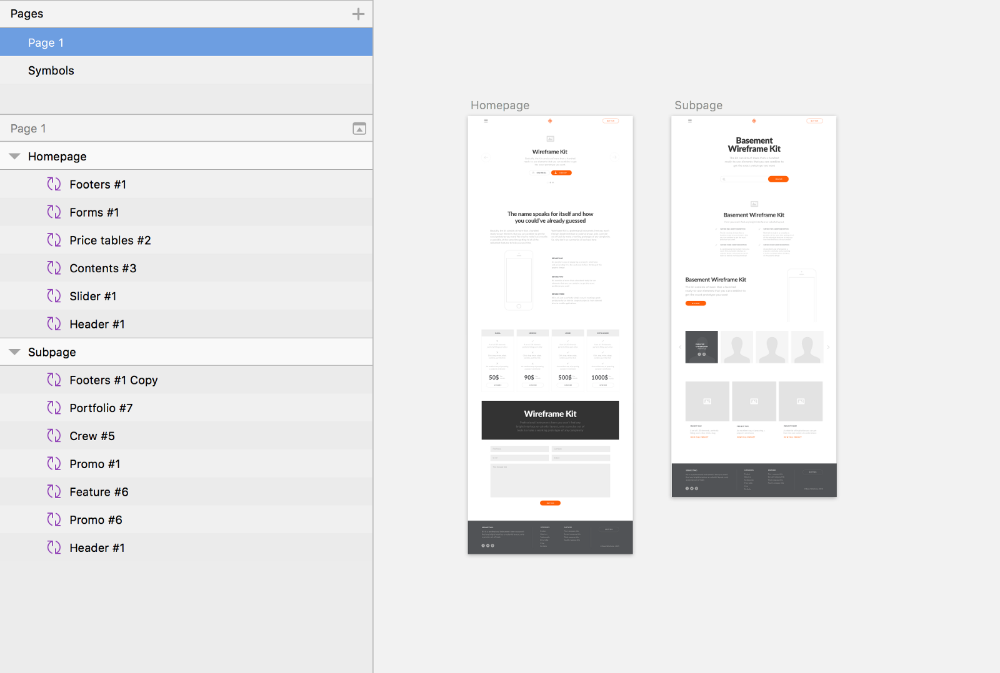

To migrate our Local Symbols to our recently added Library Symbols, we’ll use our plugin **“Library Symbol Replacer”**. You’ll want to click **“Replace symbols from a new library”**.

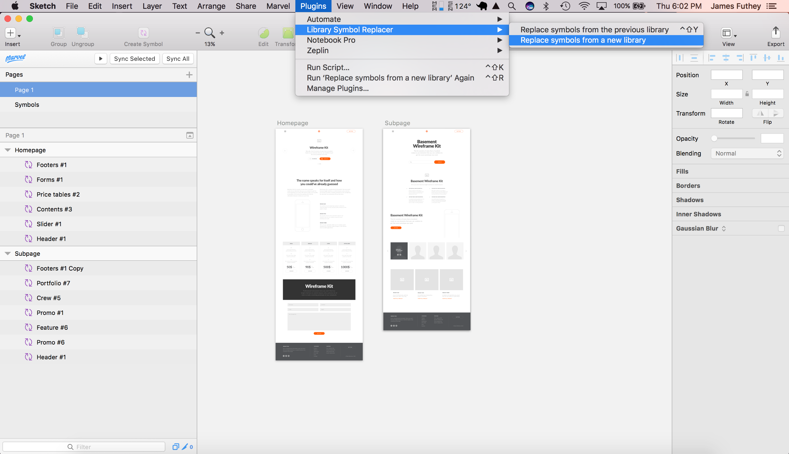

Next you’ll choose your library from the file explorer prompt:

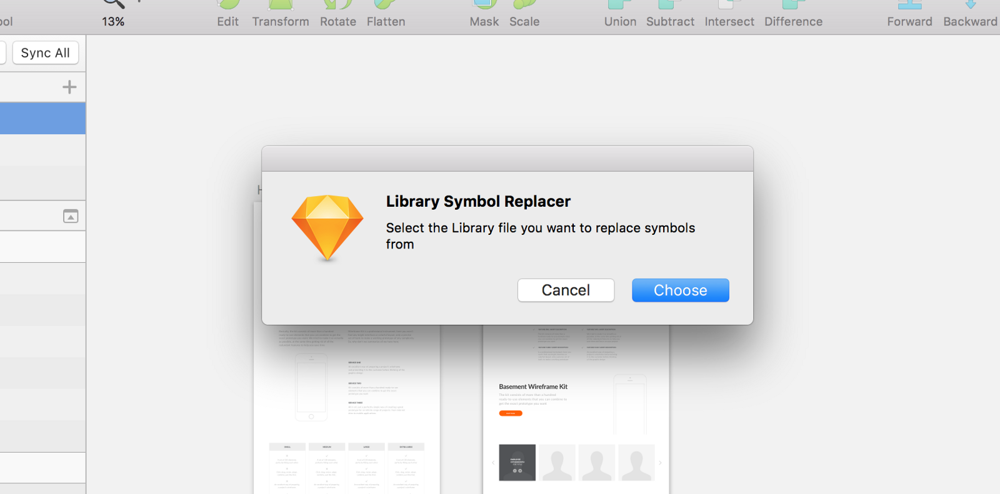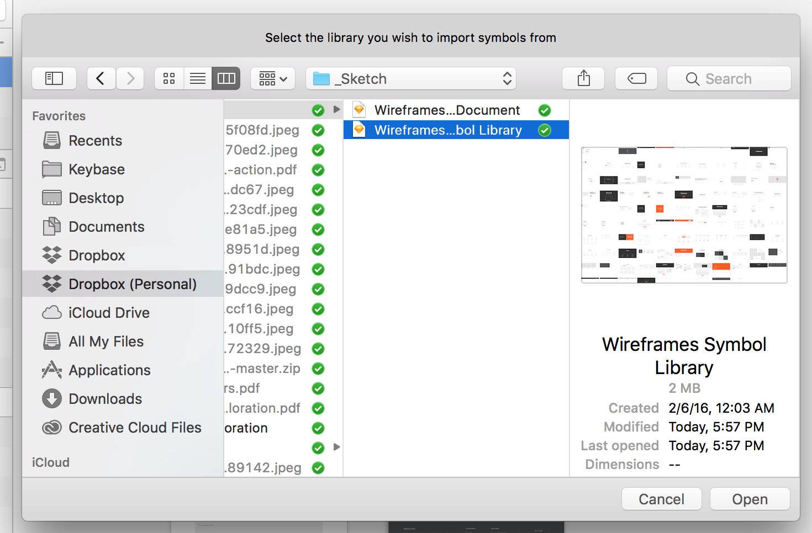

Then, you’ll do the replacement. This works through all of your local symbols, and replaces them with Library symbols.

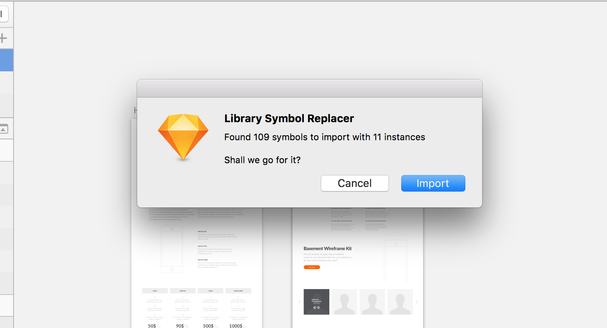

Next, the plugin will prompt you to delete your (now unused) local symbols. This is optional, but you’re probably going to want to delete them at this point.

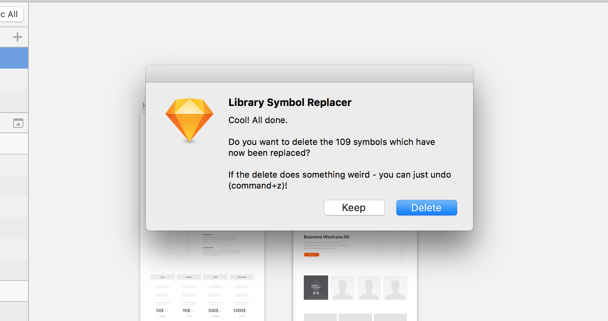

Now, you’ll notice your symbol icons have changed to “link” icons. All of the symbols in your design are now referencing symbols shared through your library.

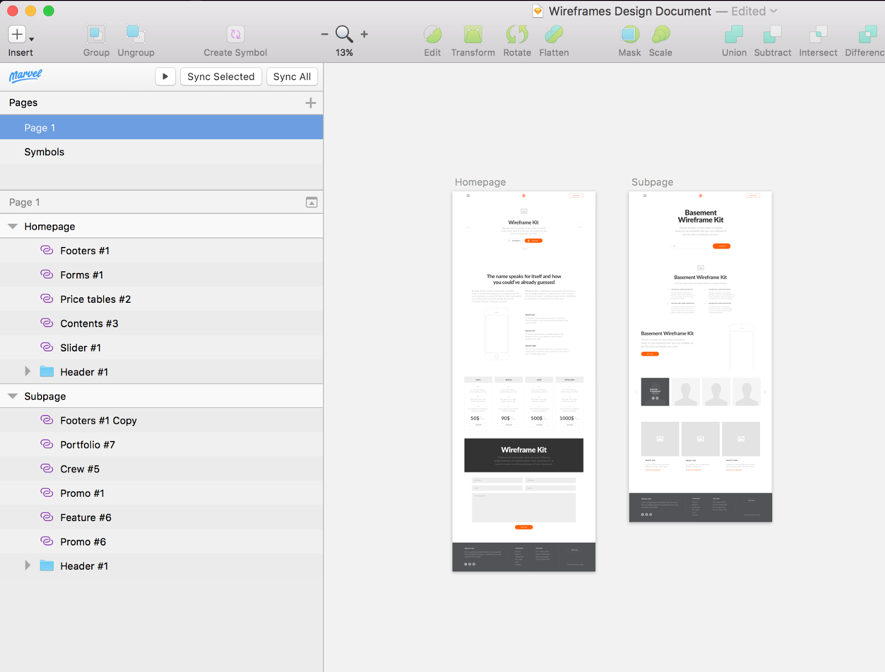

And, when you go to your symbols page, you’ll notice it’s (hopefully) empty. Now you can delete it!

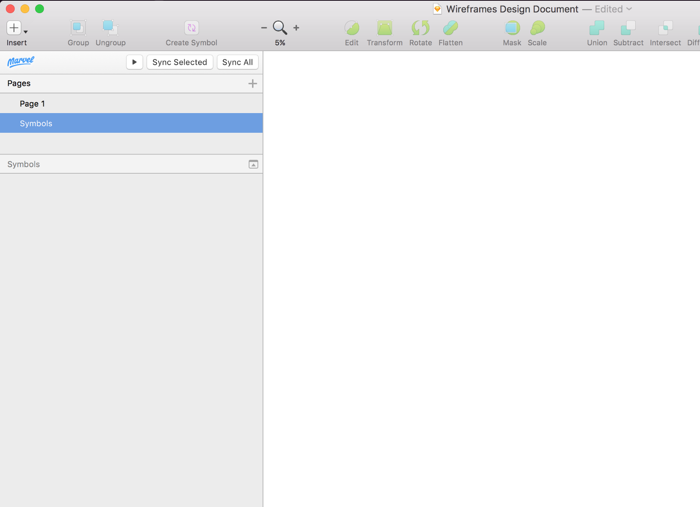

If your symbols page is not empty, most likely you had some unused symbols in your document. Since you just copied this file from the file which became your library, you should be safe to delete any unused symbols on the symbols page, along with the Symbols page itself.

### Testing out your new Library

Now that you’ve completed the migration to Libraries, you can test it out and see how it works.

In your design document, double-click on a shared symbol to modify it. Click “Open in Original Document” to modify your shared symbol.

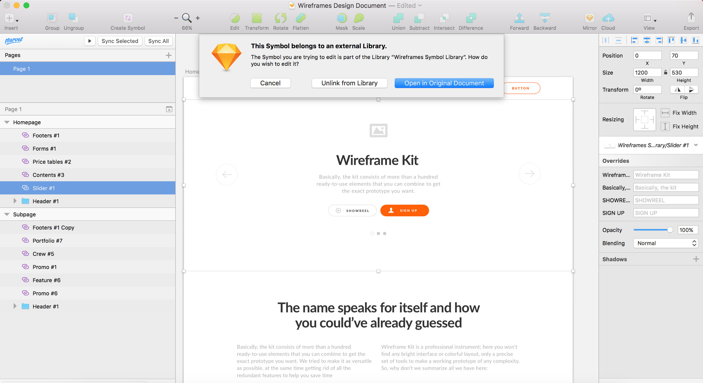

This will launch your shared document, and you can modify your shared symbol, just like a regular symbol.

When you are finished, save your updated Library file.

Now, switch back to your **Design Document**. In the top-right corner of your screen, you should see a notification which says **“Library Update Available”**. **Click it.**

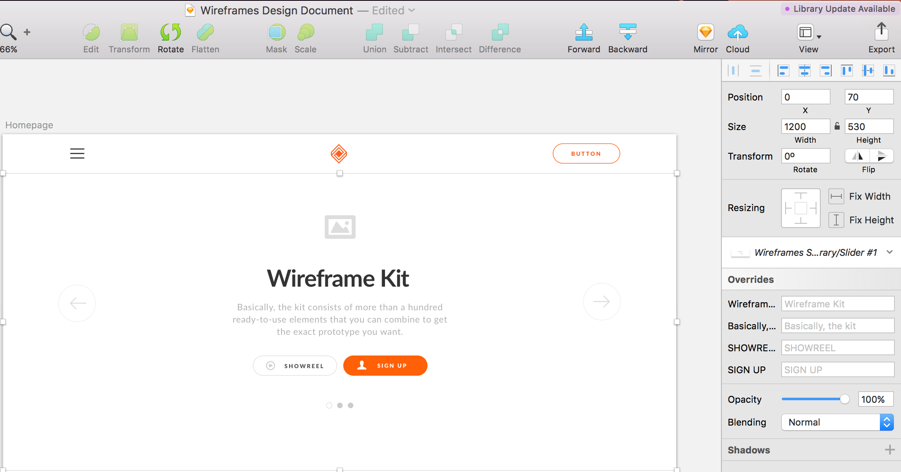

You’ll see a modal window informing you of the changes made to your shared library, and giving you the option to import the updates.

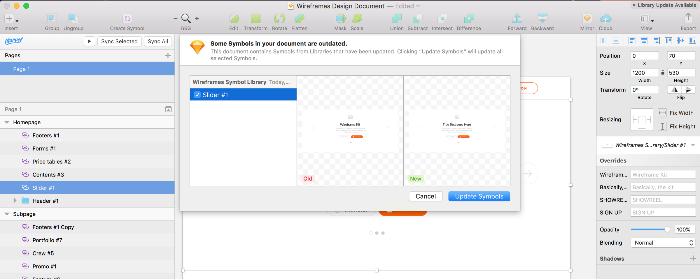

Review the changes, and click **“Update Symbols”** to accept changes.

Piece of cake! Now your changes should appear in your design document.

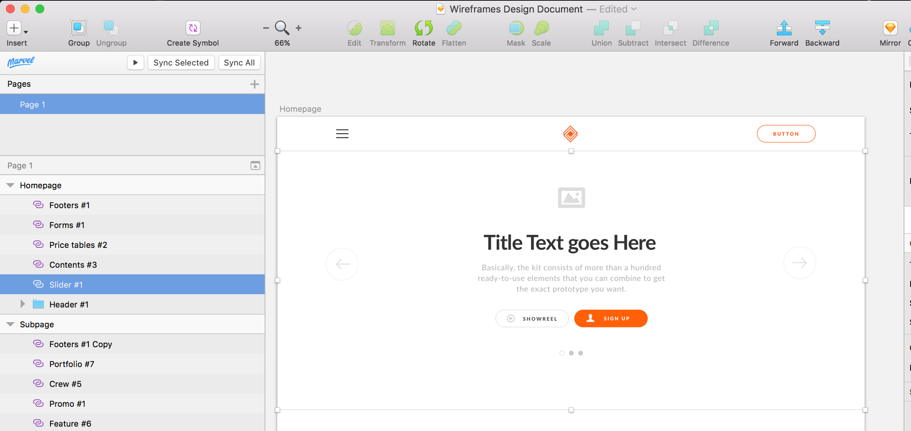

And best of all, your entire team can share these changes.

### Next Steps

Now, I recommend doing two things:

1.  **Examine your design document** to see if anything has changed. Be sure you check for any overrides that may not have migrated. You shouldn’t see any issues, but apparently previous versions of the plugin had some issues here.
2.  **Talk through your intended workflow with your team.** Link them to some resources about libraries, and explain that now, your goal is to maintain a shared symbol library that is separate from your design documents, so you don’t end up with conflicts, or need to do extra work to merge changes in the future.

### Further Reading

[Introduction to Sketch Libraries](https://www.sketchapp.com/docs/libraries/library-symbols)

[Sketch Libraries: Sketch Documentation](https://sketchapp.com/docs/libraries/)

---

### **Thanks!**