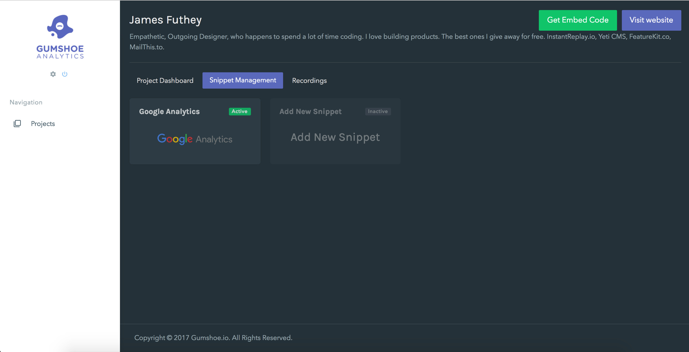
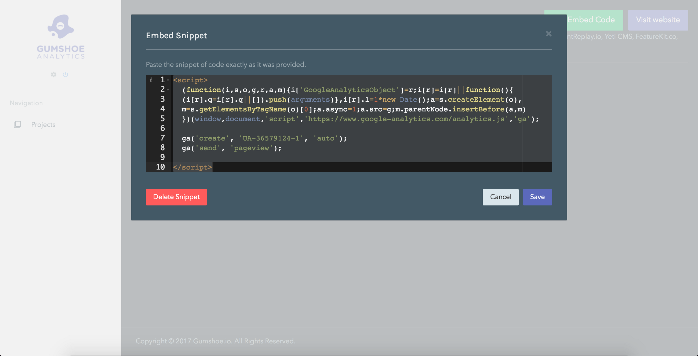

## Using Gumshoe Analytics as a platform to manage all the Javascript snippets other services keep asking you to embed in your website

### Problem

Every service I sign up for asks me to embed a couple lines of Javascript on every webpage in my website and web app.

Now, I’ve either got to open every .html file of my website, or make some complicated changes to my web app (as a developer) to actually get this code to appear in every one of my pages.

Okay, so if we’re doing this once, this is manageable (but not easy).

However, Imagine that I need to keep track (as an IT department, or during a Legal audit) with what I’ve got going on. Maybe someone in my organization becomes a subject-matter expert on how many snippets of Javascript I’ve got installed and where.

**Questions arise:** Do I need up update my privacy policy to cover all of these?

Maybe I find a solution like **Google Tag Manager** to solve this problem for me. This is a fine solution, but it introduces minor issues of access control.

### Solution

We’ve replicated this feature in Gumshoe Analytics.

#### Why would we do this?

Similar to how Segment.com lets you write event tracking code once and send events to multiple data collectors in a very seamless way, we would like you to easily place Gumshoe Analytics upstream of your existing analytics solution, and send newly-created events to your existing platforms.

So, if you use our UI to create a new event (without code), new tracking events will be created to pipe this data to Mixpanel, Heap, Segment, or Amplitude, etc.

<Embed src="https://www.youtube.com/embed/2dfr2ELdtnE?feature=oembed" aspectRatio={0.562} />

#### Future Expansion

Currently, we only allow you to do this on a per-domain basis (including subdomains), and toggle each snippet on and off. In the future, we could expand this to allow you to create management rules (i.e. this only appears on specific pages or under specific conditions).

---

Thanks for taking the time to check this out! Let us know what you think!

**If you’re new to our publication, welcome!**  A month ago, five of us set out to build a startup. We’re documenting & sharing the process, so you can follow along as we build & launch our company, and present it to the world in Vienna this June.