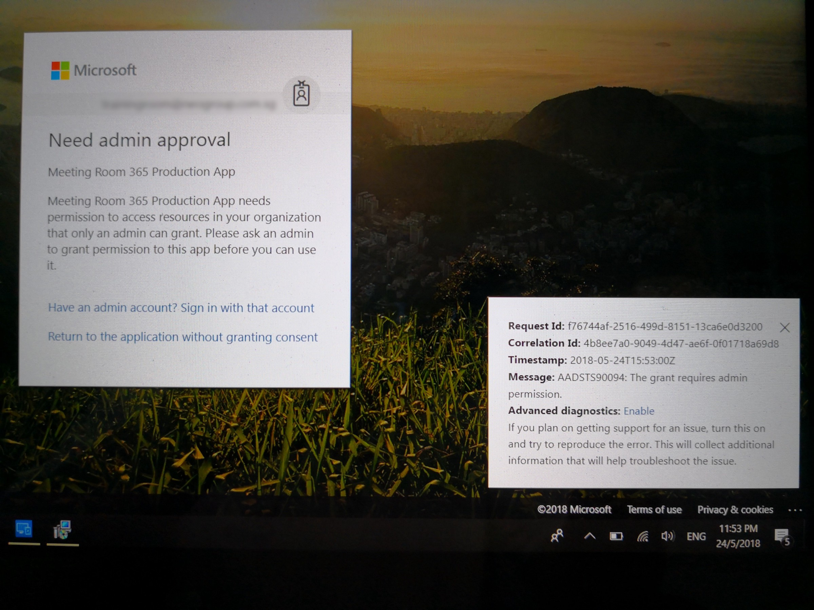
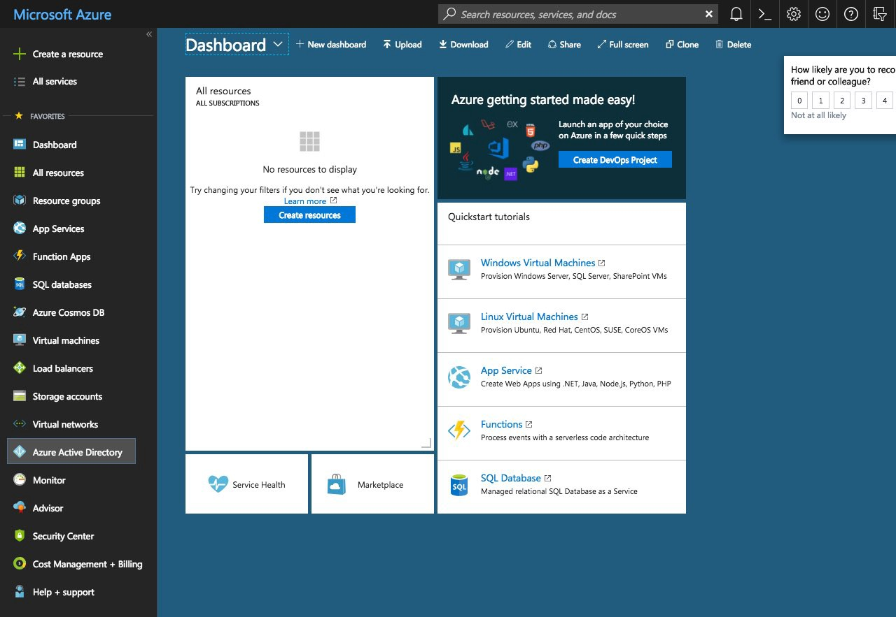
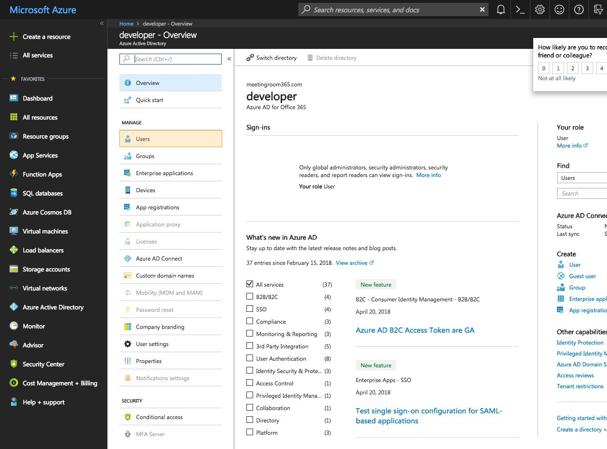
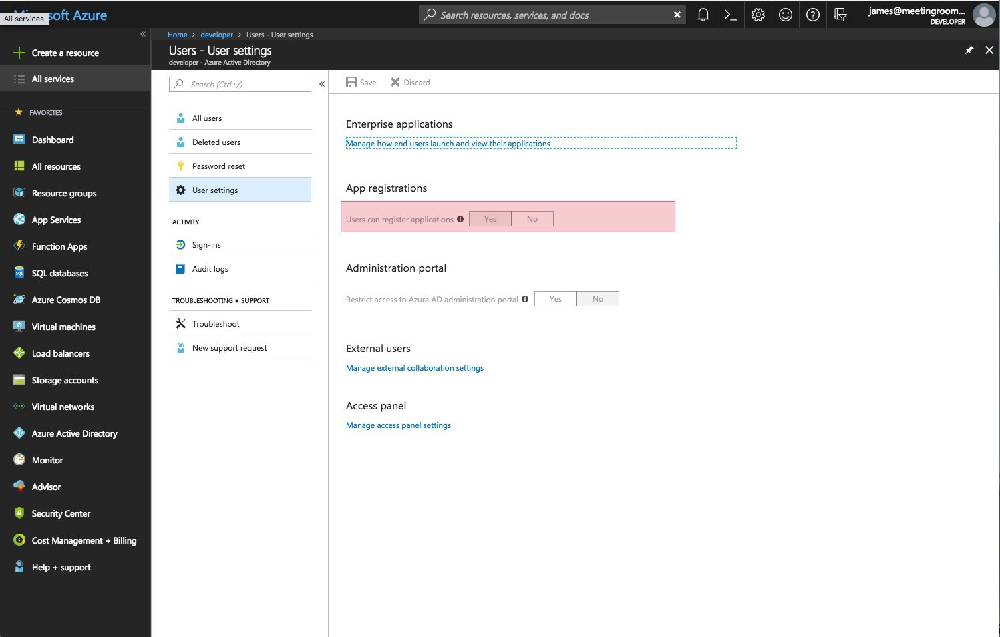

## How to adjust your OAuth settings in Office 365 / Azure AD to install third-party apps like Meeting Room 365

#### Background

Meeting Room 365 for Office 365 uses Office 365 Single-sign on, an OAuth 2.0 compliant service, to securely access calendar data stored in Office 365 Resource Mailbox calendars.

However, some Office 365 admins (for various reasons) may have disabled the installation of third-party apps which pull data from their Office 365 tenant.

To Provision Meeting Room 365 tablets, however, this must be temporarily allowed, either on a per-tenant or a per-user basis.

#### Need admin approval

The most common symptom of this error is an Office 365 branded error page which states:

**Need admin approval**

Meeting Room 365 Production App

Meeting Room 365 Production App needs permission to access resources in your organization that only an admin can grant. Please ask an admin to grant permission to this app before you can use it.

AADSTS90094: The grand requires admin permission.

### Solution

The solution to this issue is quite simple.

#### Log into the Azure Portal

[https://portal.azure.com/](https://portal.azure.com/) — You must log in as an admin

Next, click on **Azure Active Directory** in the left-hand menu.

Next, select **Users**

Then, select **User Settings**.

You will see a section labeled **App registrations**. You must select **Yes** to allow new permission grants to third-party apps, like Meeting Room 365.

That’s it! Let us know if you have any issues.