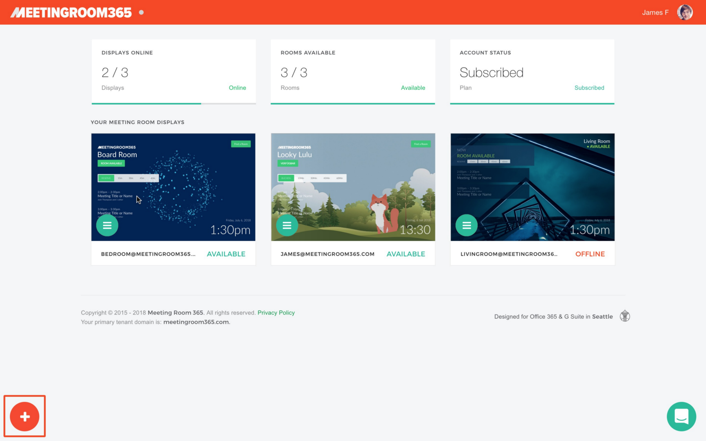
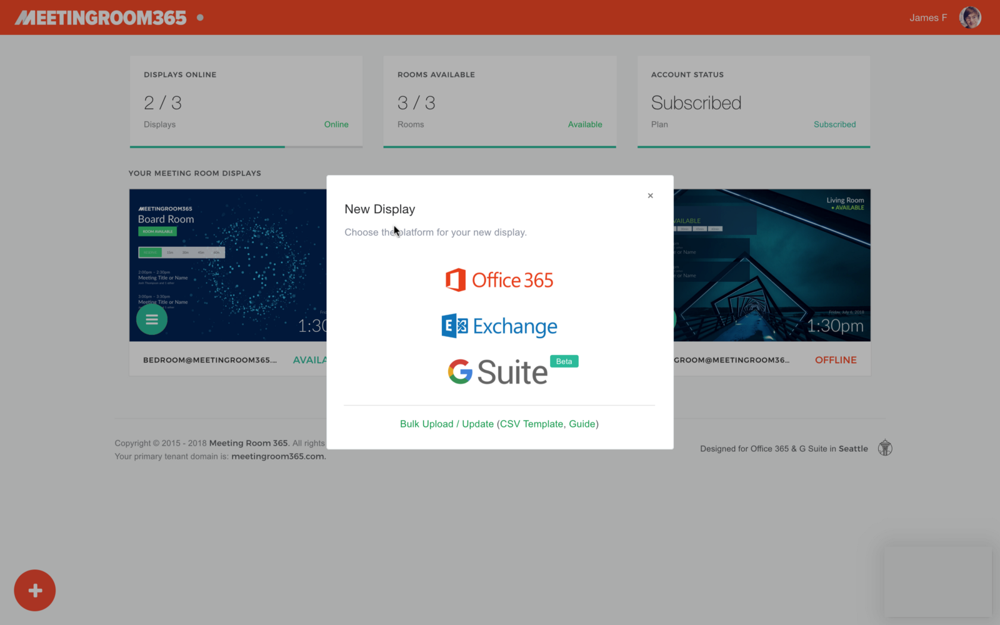
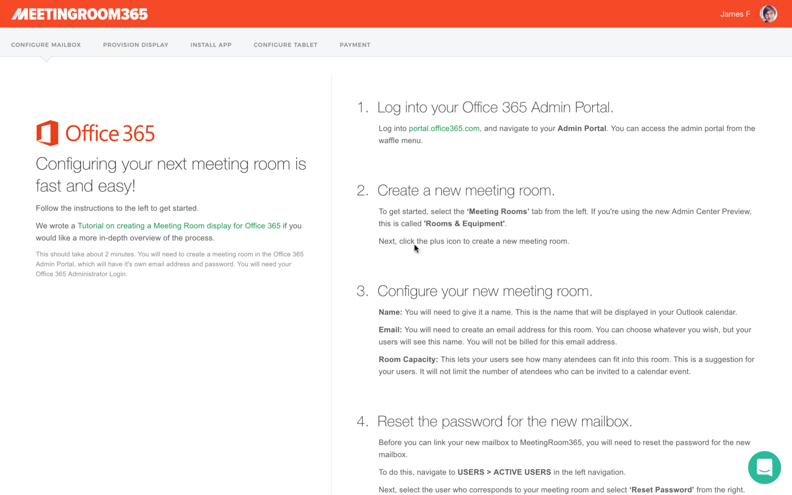
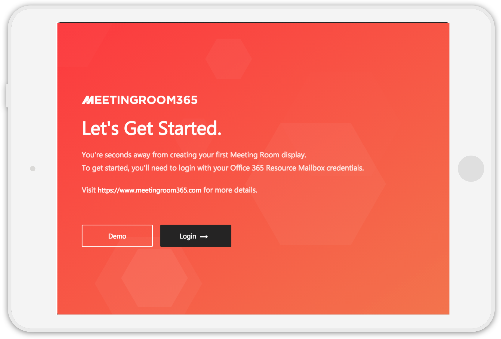
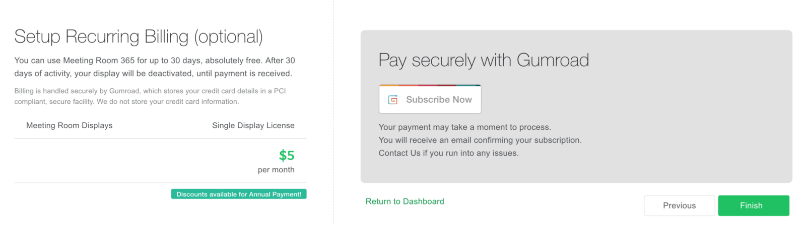

## A Guide to Setting up a new Display in Meeting Room 365

### Logging into Meeting Room 365 (Admin Portal)

Once you create an account, you can log into your Meeting Room 365 Admin portal from any computer to manage the displays associated with your Office 365 Tenant. Simply visit: [**https://beta.meetingroom365.com/**](https://beta.meetingroom365.com/) **to view your Admin portal or manage display configuration**.

### View your Existing Displays

From the Meeting Room 365 Admin Portal, you’ll see a list of existing displays linked to your tenant domain and/or account.

---

### Add a New Display

When you are ready to add a new display, just click the large, **Plus button** in the bottom right corner.

#### Next, select the appropriate display type.

**Note:** If you select Exchange, you will be directed to our Legacy platform. Our new platform is not currently set up to support Exchange.

#### Complete the Wizard Steps

Next, you’ll be guided through a short setup process to provision your mailbox in **G Suite** or **Office 365**. Complete these steps, if you have not done so already.

#### Provide your Meeting Room Resource Email address and choose a Display Name

You will be asked to provide the resource mailbox email address, and choose a name for your meeting room. This can be updated later.

**Note:** A resource mailbox is a specialized mailbox in Office 365, Exchange, and G Suite. You should not use a normal user and mailbox calendar for Meeting Room displays.

If you’re a **G Suite** user, you will also receive a **Display Key** at this step, which you will need to set up your tablet.

Also, in **G Suite**, a Resource Mailbox email address will always end in **@resource.calendar.google.com** (this is our #1 support question for **G Suite**).

---

#### Install the Meeting Room 365 app and provision your tablet

Native apps are currently available in the **iTunes App Store**, **Amazon App Store**, and **Google Play Store.** Download the app to your device to get started.

**Here is a full guide to setting up your display:**

[**Setting up the Meeting Room 365 App**  
_Downloading and setting up the app on your tablet_medium.com](https://medium.com/meeting-room-365/setting-up-the-meeting-room-365-app-5e5a2c8bfc03 "https://medium.com/meeting-room-365/setting-up-the-meeting-room-365-app-5e5a2c8bfc03")

#### Set up recurring payment (optional)

Next, you are given a prompt to set up recurring payment, for the convenience of existing users adding an additional tablet. However, new users are able to evaluate each display they set up for 30 days. Reach out if you have any questions!

---

#### That’s it! If you’re stuck, you can always contact us from your admin portal, and we can help you out with setup, configuration, and provisioning.

---

### Thanks for reading!

Please Recommend and Share if you found this article useful!