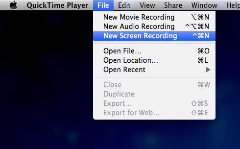
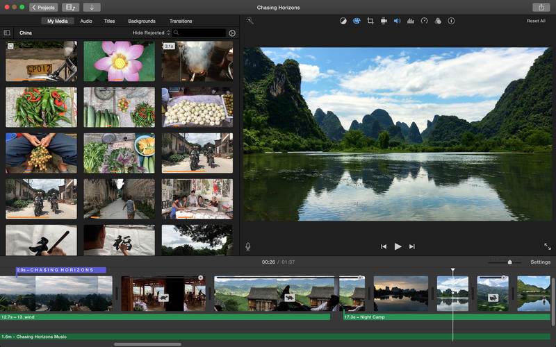

## Creating a polished product demo video for our website, in a few hours, and for free

### The challenge

Iasked myself: What would be the best way to demonstrate our product to potential users upon launch?

The simple answer: **A product demo video!**

Our finished product demo video

So, how would we go on to create this product demo video, in a couple of hours, and without any budget?

### Creating an outline

First, we asked a few simple questions.

**_Q. What are we offering?_**

**A.** Free, no-nonsense heatmaps.

**_Q. What is the most appealing quality of our solution?_**

**A.** You don’t need to do anything complicated to get started. Just grab the code and embed it in your website.

**_Q. What is the most important thing for us to communicate?_**

**A.** The process of installing the script, and then the product in action.

Now, we had all of the right answers to create an outline of what we wanted to present. It also serves as a “How it works” for our product:

1.  Get your embed code via email
2.  Paste the code in your website
3.  Go to your website
4.  Press `Shift + H+M` to view a heatmap of your current website

### Recording the footage

Little-known fact: On **OSX**, you don’t need any fancy software to do high-quality screen recording. All you need is **Quicktime Player** (pre-installed on any modern Mac).

### Finding the background music

For the last 2–3 years, I’ve been downloading the monthly freebie from [https://audiojungle.net/](https://medium.com/r/?url=https%3A%2F%2Faudiojungle.net%2F) and saving it to my dropbox. After 15–20 minutes of hunting, I found a track that was suitable for our project. _Your results may vary._

### Editing

Once again, having a Mac really pays off here! If you’ve bought your system in the last couple years, it should have included a **free copy of iMovie** (you can download it from the Mac App Store if you haven’t already).

There really isn’t anything better at this price point (on a Mac)!

And, if you’re familiar with more sophisticated software (such as Adobe Premiere), the same principals apply for editing. But, instead of spending a ton of time on the basics, you can churn out something really polished in about half an hour.

### Publishing

It’s 2017. This is no longer complicated. You can host unlimited, ad-free HD video on Youtube and embed it on your website in a few minutes.

---

Thanks for taking the time to check this out! Let us know what you think!

**If you’re new to our publication, welcome!**  A month ago, five of us set out to build a startup. We’re documenting & sharing the process, so you can follow along as we build & launch our company, and present it to the world in Vienna this June.