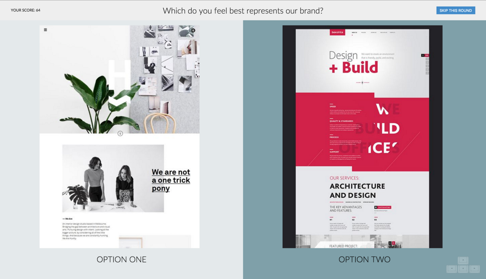
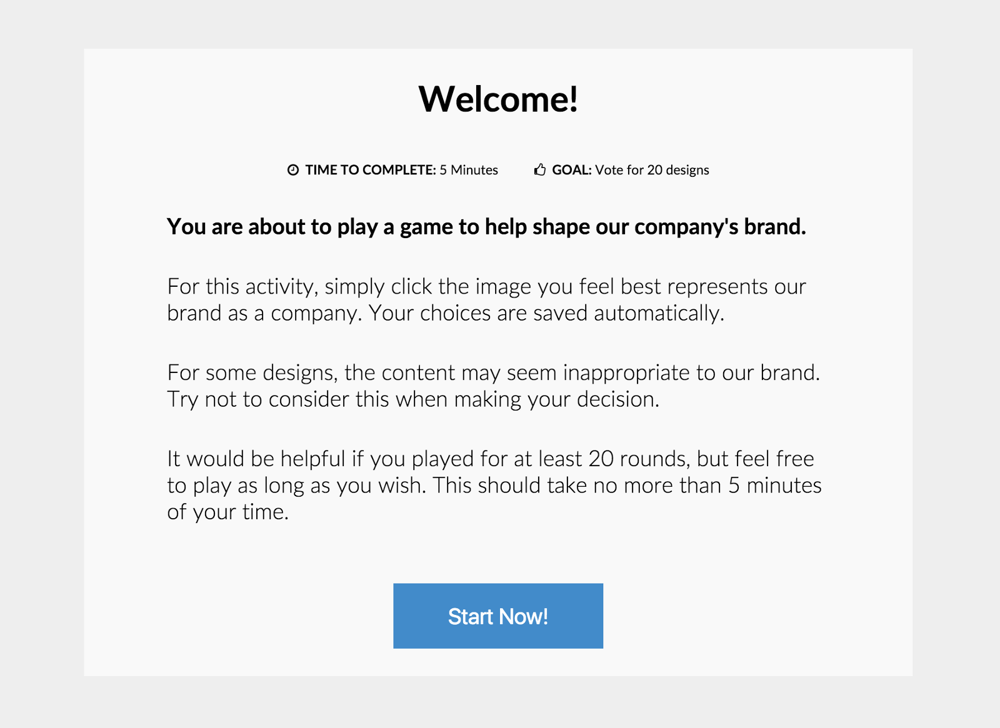
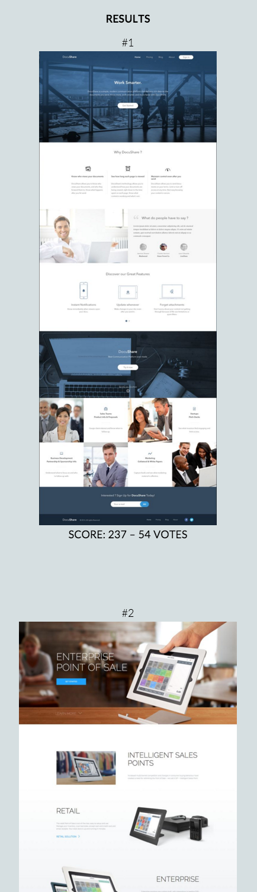

**View the Demo:** [https://bittitan-branding.firebaseapp.com/](https://bittitan-branding.firebaseapp.com/) (voting has been disabled).

#### Background

I’m a designer who recently joined a small (but successful!) startup as a User Experience Program Manager. I have a background in software development and design, and truly believe that technology can be utilized to improve the lives of everyone.

While I used to spend most of my time committing code or designing solutions which could become products for the companies I worked for, in my current position I now find myself designing solutions and writing code that enables others to do their jobs more effectively.

The most exciting thing for me is finding the intersection between design, code, and process to elegantly solve a problem in a new way.

#### The Idea

One of my highest priorities when I accepted my new role in this company was to enable key stakeholders to participate in a real conversation about the company’s brand, and what they would like to see it become as the company grew.

However, in my experience, it’s difficult to get useful feedback from a large group of people (over 100 employees!). It tends to be more useful to go deep with a few key stakeholders, until you really understand what the company represents at a human level.

So, my goal was to enable the entire company (in a fun way!) to feel like they had a voice in the direction of the project.

From that aspiration, I came up with the idea to create a “Facemash for Design” application.

#### The Prototype

I quickly prototyped the main interaction in HTML, CSS, Javascript, & jQuery, so that I could show it to the design team as quickly as possible.

Initially I created a hard-coded list of images (pulled from a Pinterest search for “Web Design”. I stored these in a Javascript object and created the UI to allow users to vote in rapid succession on “Which item best represented our company’s brand”. At this point, I had invested about an hour in the idea, and written a couple hundred lines of code.

#### Feedback from my team

I showed it to our design team & a few close friends, and received a lot of enthusiastic feedback. This helped validate the concept.

One key stakeholder provided the most useful feedback at this point. Instead of demoing the concept in person, I had sent a link to the concept via email.

He responded a few hours later: “I voted about a hundred times now, how long is this survey supposed to last?”

This led to the creation of the splash page you see today, and the popup which is displayed after the user votes 20 times. Apparently, most users skimmed past the instruction which told them they were able to vote as much or as little as they like.

#### Elo Rating System

After consulting the internet and researching a few different approaches, I ended up discovering that most _Facemash_ implementations on Github used the **Elo Rating System** to score votes. Besides being the solution used in the movie _The Social Network_, the Elo rating system allowed me to compute scores quickly and efficiently in Javascript.

From Wikipedia:

> The **Elo rating system** is a method for calculating the relative skill levels of players in competitor-versus-competitor games such as [chess](https://en.wikipedia.org/wiki/Chess "Chess"). It is named after its creator [Arpad Elo](https://en.wikipedia.org/wiki/Arpad_Elo "Arpad Elo"), a [Hungarian](https://en.wikipedia.org/wiki/Hungary "Hungary")\-born [American](https://en.wikipedia.org/wiki/United_States "United States") [physics](https://en.wikipedia.org/wiki/Physics "Physics") professor.

> The Elo system was originally invented as an improved [chess rating system](https://en.wikipedia.org/wiki/Chess_rating_system "Chess rating system") but is also used as a rating system for multiplayer competition in a number of[video games](https://en.wikipedia.org/wiki/Video_game "Video game"), [association football](https://en.wikipedia.org/wiki/Association_football "Association football"), [gridiron football](https://en.wikipedia.org/wiki/American_football "American football"), basketball, [Major League Baseball](https://en.wikipedia.org/wiki/Major_League_Baseball "Major League Baseball"), [competitive programming](https://en.wikipedia.org/wiki/Competitive_programming "Competitive programming"), Scrabble, and other games.

> The difference in the ratings between two players serves as a predictor of the outcome of a match. Two players with equal ratings who play against each other are expected to score an equal number of wins. A player whose rating is 100 points greater than their opponent’s is expected to score 64%; if the difference is 200 points, then the expected score for the stronger player is 76%.

Other approaches I considered required data about the entire set of data points to recalculate scores and rankings. The Elo Rating System, however, provided a very simple algorithm that only required the scores of the two items being compared, and the result (win, loss, or tie) to compute scores.

#### Finishing The Script

Now that I had a game plan for scoring results, I spent a few additional hours finishing the game itself.

I used **Firebase** and **Firebase Hosting** to quickly prototype and deploy the application using only Javascript.

This also gave us access to **websockets** out of the box, so I could easily ensure our scores were being computed with up-to-date data.

#### Curating a set of designs

Now that the script was nearing completion, I asked the design team to help curate a set of images that represented different branding approaches.

To facilitate this, we identified five key trends in modern web design, and attempted to curate an equal distribution of high-quality designs following each trend:

-   **Simple & Lightweight**
-   **Clean & Professional**
-   **Colorful & Energized**
-   **Flat & Muted**
-   **Fresh & Detailed**

We also attempted to choose designs which relied heavily on either illustrations or photography to express their brand. This resulted in a set of 60 images.

#### Involving the entire company in the rebranding process

Once the design team was satisfied with the result, I sent the game out to the entire company, soliciting their participation.

I was initially concerned that only a low number of employees would participate in a “Branding Survey”, so I rewrote my draft email to characterize it as a “Game” instead.

Here is the email I sent out to all of our worldwide employees:

#### You have been chosen to participate in the <Company Name> Branding Game!

> Hello <Company Name>!

> As you may know, our marketing & design teams are collaborating on a company branding project, and we want your feedback!

> We’ve created a short game that will allow the entire company to help shape the company’s brand. It should take less than 5 minutes of your time to participate.

> To play, visit [https://bittitan-branding.firebaseapp.com/](https://bittitan-branding.firebaseapp.com/ "https://bittitan-branding.firebaseapp.com/
> Cmd+Click or tap to follow the link").

> Thanks for your participation! We’ll share the results in a few weeks.

#### The results

To my surprise, over 80% of the company participated in the survey, and we gathered several thousand votes. Some participants voted over 100 times!

It was a really amazing to walk around the office and see the app open on most of employee’s laptops after the email was sent out. I felt like our team had accomplished something really magical at that point.

In my excitement I generated a page to display a ranked list of results, along with the number of votes they received, and their scores: [https://bittitan-branding.firebaseapp.com/results/](https://bittitan-branding.firebaseapp.com/results/).

#### Gathering qualitative data to learn more

After a few days of voting, it was easy to identify a few key trends, but I wanted more. So, I created a google survey and asked for more qualitative feedback on the results.

But, how can I encourage participation?

#### <company name> Branding Game Results

> Hello <company>!

> We got a ton of responses in the <company> Branding Game, way more than I expected. Thanks for participating!

> Wanted to share the top five results, if you’re interested.

> Please, take a look!

> http://goo.gl/forms/<form ID Masked>

> Thanks!

This seemed a bit sneaky, but it worked. Most participants were naturally curious to see the results, and many took the opportunity to give feedback.

Guerrilla UX Research has to be scrappy!

#### Reviewing the results

After the qualitative data came in, I assembled the team to review the results, which led to some really interesting analysis where we identified a few key trends in the data.

#### On with the Branding Project!

This was a really great kickoff activity that brought the entire company together and started a conversation about rebranding. We were able to include everyone in a meaningful way and produce a key deliverable we can utilize to make design decisions in an intelligent way.

Thanks for Reading! If you haven’t taken a look already, **View the Demo:** [https://bittitan-branding.firebaseapp.com/](https://bittitan-branding.firebaseapp.com/) (voting has been disabled).