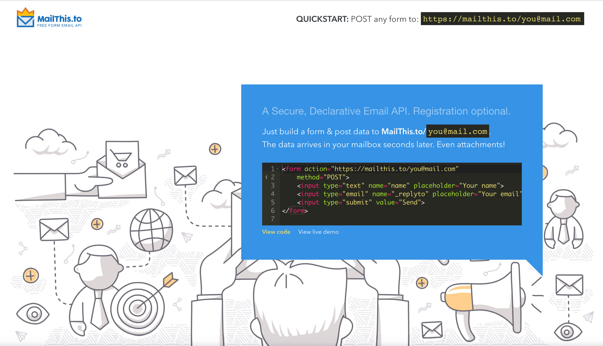
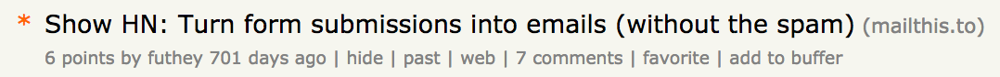
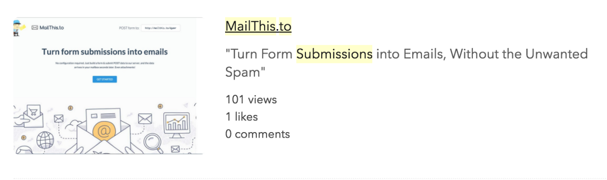
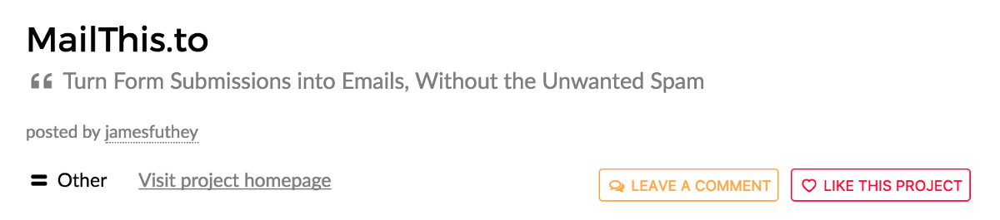
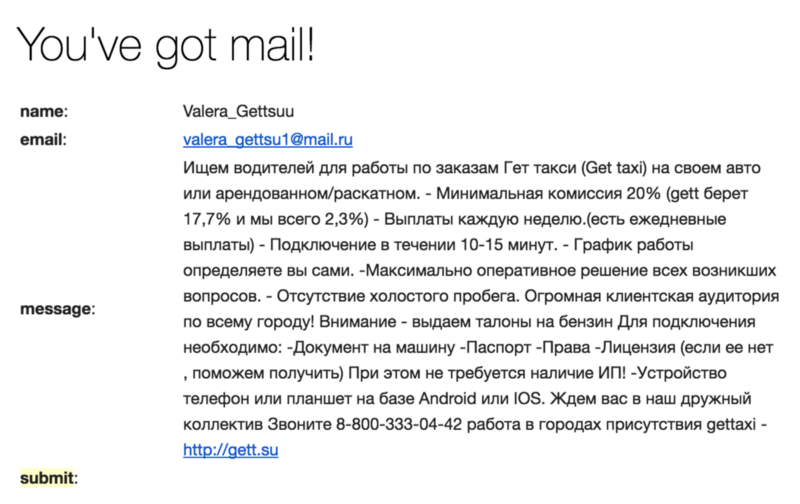
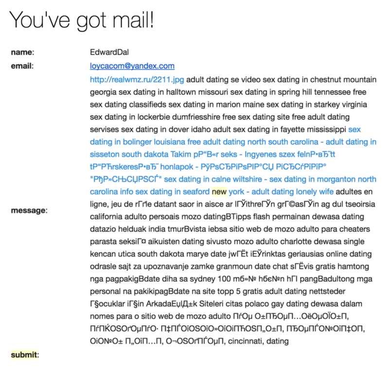
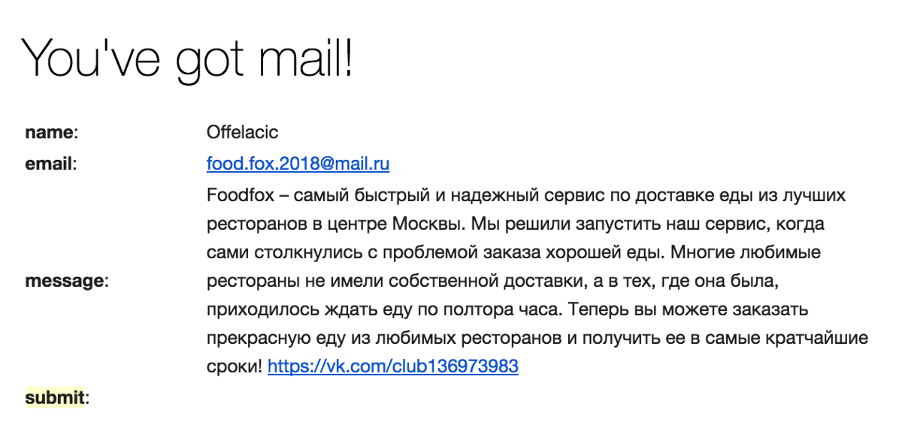
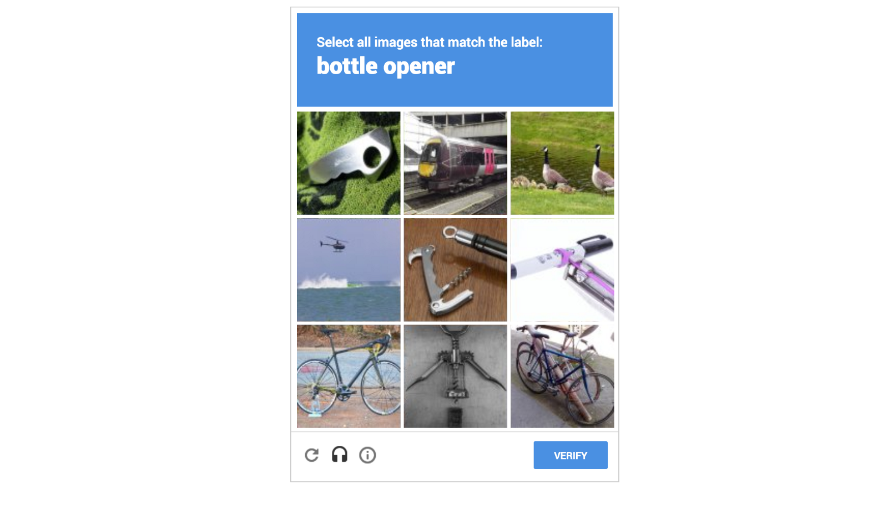

## What it’s been like running MailThis.to for the last 2 years

#### What is MailThis.to?

**MailThis.to** is a Free Email API, which you can securely embed into your website, to receive an email whenever a visitor submits a form. Think of it as **form2mail as a service**, for static websites.

You get a permanent, memorable address that can receive **POST DATA**, including file attachments. So, you just remember **MailThis.to/<email>** whenever you are building a landing page, or a website, or a quick project, and you have an instant, working HTML form.

A simple example

A week ago, I decided to re-launch [**MailThis.to**](https://mailthis.to/), our **free Form-to-Email service,** rewriting the backend service to run on [**now.sh**](https://now.sh/), fixing some common bugs, and cleaning-up the web design for the [landing page](https://mailthis.to/).

I didn’t really like that it didn’t have a real logo. I wasn’t really happy with the landing page, and the API was far more complicated than it needed to be.

Here is what the [previous landing page](https://web.archive.org/web/20160312083808/http://www.mailthis.to:80/) looked like:

)](./asset-2.png)

#### Why I decided to build MailThis.to

Originally an MVP, I had prototyped it in a few days using PHP, mostly because that’s what the server I was hosting it on was running, and because it was such a simple project.

I had seen a similar service, [FormSpree](https://web.archive.org/web/20150801124417/http://formspree.io/), but disliked the fact that it exposed your email address in the source code of your website. Displaying the email in the action attribute is a sure-fire way to get your email added onto spam lists, sold, re-sold, and spammed until the end of time.

So, I figured, what if you just created an alias, and looked up the email address on the server when sending the email?

Sounded like an entertaining side-project to me.

#### Promotion

I didn’t have to work very hard to promote the project. I posted it on a few forums and reddit, and a few hundred people found the site.

Over the last two years, it built up to a few thousand active users a month (well within the limitations of the Free SendGrid plan which powered the website), with just over 10,000 total signups. Most people were using it just to build simple websites (and some even used it for websites built for their clients).

All in all, most users didn’t send that much email with the service, so legitimate utilization never became a problem.

> **But lordy-lord did we get spammed.**

As comment-spam bots found our forms, I would tag and filter out the most common bots by regex or by a specific field value. Didn’t think this would last as long as it did, but I credit this to our small scale. I assume more sophisticated spammers simply didn’t find our forms.

Thankfully, a bulk of the spam came directly to our landing page, and when it landed in my inbox, I would be able to filter it out before it reached one of our users.

And apparently, we weren’t the only ones:

> **At Formspree we struggle every day against this problem, and it seems very difficult to solve while keeping a simple API.**

#### ReCaptcha to the ReScue

---

The service had accumulated a backlog of bugs, and I was getting somewhat annoyed by a few of them. Also, it was still running in PHP, the language I prototyped it in, and I wanted to rewrite it using Node.js, to save some money and deploy it to a more secure service.

All in all, it only took a few hours over two days to rewrite the entire service in **Node.js**. It’s a single file, about 400 lines of code, built on top of **Node,** **Express, MongoDB, Recaptcha, & SendGrid.**

It currently costs $0 to host, $0 for SendGrid (still within the limits of the free API), and $45 per year for the domain name. If it grows, it could end up utilizing more of my now.sh resources (currently $20 per month for multiple projects), or force me to upgrade my SendGrid account (Currently something like 0.02¢ per email sent).

#### Pricing

To avoid this, I’ve introduced soft limits on each account at 1,000 emails, prompting the user to “top-up” their account ($5 per 1,000 emails).

This matches the pattern of usage we’ve seen over the last two years of operating this service. If anyone is looking for a discount on more utilization, we can always work something out.

### Thanks for Reading!

Please let me know if you have any comments.