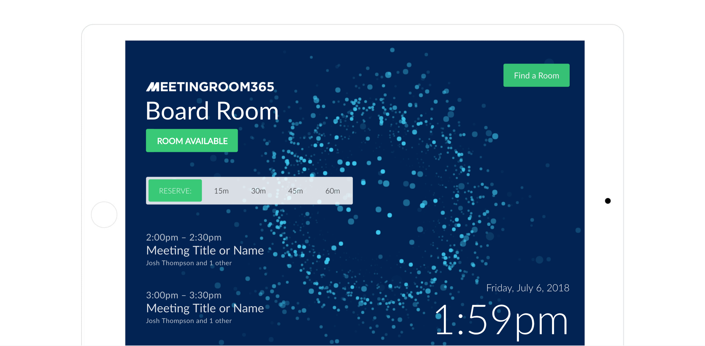
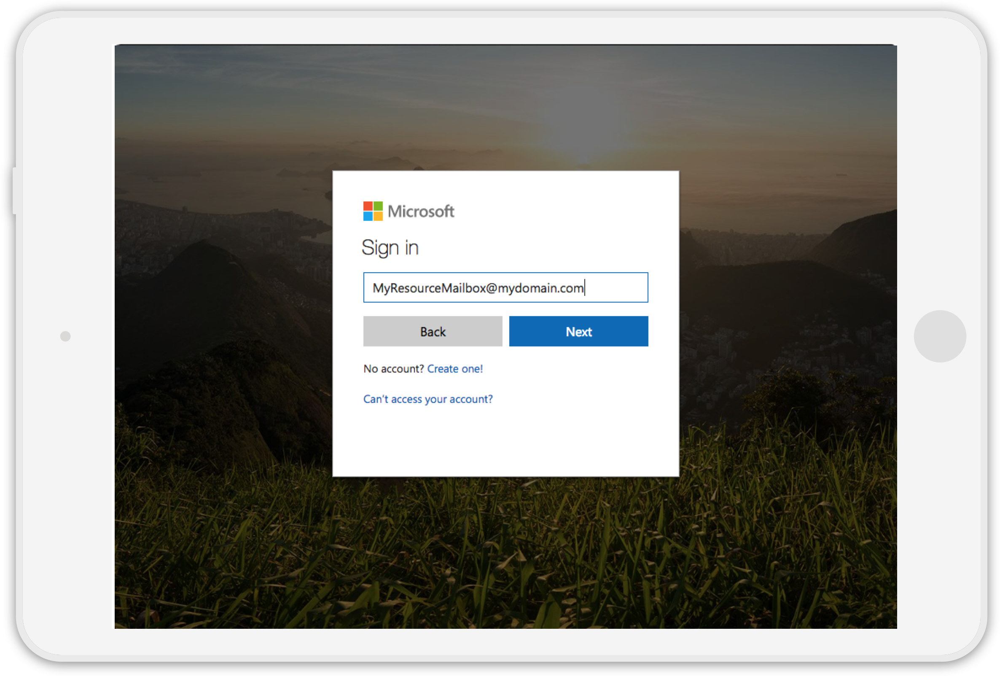
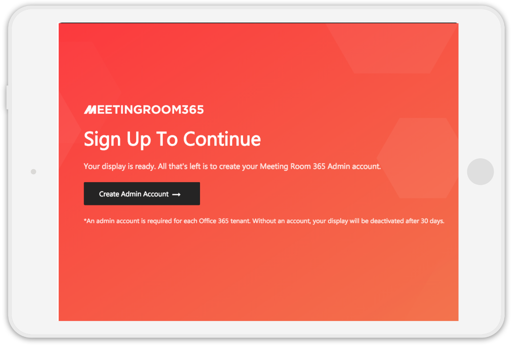
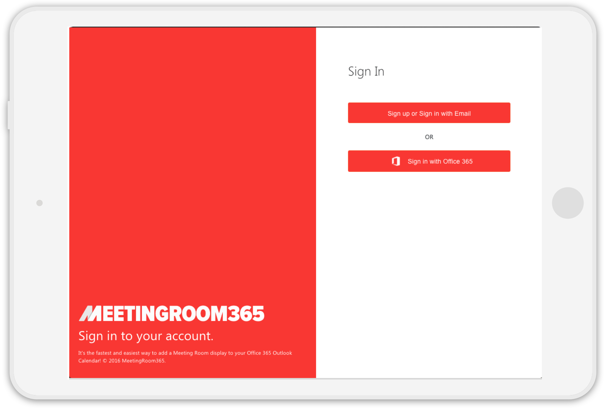

## Downloading and setting up the app on your tablet

### Downloading the Apps

The biggest change with this version of our application is that everything starts from the Tablet. Since credentials are stored on the tablets, there’s no need to provision anything before getting started.

Native apps are currently available in the **iTunes App Store**, **Amazon App Store**, and **Google Play Store.** Download the app to your device to get started.

### Log in to the Meeting Room 365 App on your tablet

Now that we have a Resource Mailbox ready to go, you’ll be able to complete setup from your tablet.

When prompted, simply use the credentials from the previous step to log in on your tablet, from the Meeting Room 365 app.

### Create a Meeting Room 365 account (optional)

Next, if you haven’t provisioned a tablet yet from your Meeting Room 365 Admin Portal, you’ll be prompted to **Link or Create a Meeting Room 365 account** to manage your displays.

This lets you monitor uptime, and update your tablet configuration remotely. If you’ve already created one, go ahead and sign in, since the display needs to attach itself to your account.

Optionally, you can use **Office 365 Single-sign on** (SSO) or **Google Single-sign on** (SSO) to manage your displays. Note, your **tenant domain must match** if you use **Single-sign on** (or we can link them manually).

---

Once you sign in, your tablet will be associated with your admin account, and you should be redirected to your meeting room display. If you run into an error, you can try closing and re-opening the app.

---

### Mounting your Hardware

You can configure any tablet with a full-screen web browser to run MeetingRoom365, such as the iPad, any Android Tablet, or Windows tablet. Configuration steps may vary depending on the model you have selected.

The [iPad Mini](http://www.apple.com/shop/buy-ipad/ipad-mini-2) (any generation) can be purchased with the [Heckler Design Wall Mount](http://hecklerdesign.com/shop/highsign/) for a premium experience.

An inexpensive **universal tablet mount**: [https://www.amazon.com/Damage-free-Dockem-Smartphones-eReaders-chrome-plated/dp/B008E0Q0C0/](https://www.amazon.com/Damage-free-Dockem-Smartphones-eReaders-chrome-plated/dp/B008E0Q0C0/)

#### Other Mounting Hardware

Looking for an “invisible mounting solution”? Try this **invisible mount** [https://www.amazon.com/PadTab-Damage-Free-Universal-locations-smartphones/dp/B01EBAOUZ0/](https://www.amazon.com/PadTab-Damage-Free-Universal-locations-smartphones/dp/B01EBAOUZ0/)

or **3m velcro adhesive strips** [https://www.amazon.com/3M-Company-RF9731-Re-Close-Strip/dp/B001LTTNOI/](https://www.amazon.com/3M-Company-RF9731-Re-Close-Strip/dp/B001LTTNOI/)

You can also opt to use older hardware you might have lying around. Anything with a web browser will do. For example, a meeting room display might be a great use for a Windows RT tablet you aren’t using. We even have a guide for the Raspberry Pi! Reach out if you have something you want to try.

### Mount Displays

Once everything is set up, you’re ready to mount your displays. This is probably the most challenging part of this guide.

Depending on the hardware you choose, you will either need to mount your display using 3m adhesive (fastest), or drywall / mounting screws.

For instance, the Koala Mount consists of two small, sturdy plastic brackets that gently cradle your device. Designed to be used with 3M Command Strips (included). The strips are rated to hold up to 5 lbs each (far more than any tablet). To remove, the strips can simply be stretched off without causing any damage.

### Configure your tablet for Kiosk mode

Next, you’ll probably want to configure your tablet so that it doesn’t **put it’s display to sleep**, or **power down on idle**. For most hardware, this is called **Kiosk Mode**, and you can find instructions for most devices by googling `<Tablet Name> Kiosk Mode.`

If you have an iPad, for example, the quickest solution is to enable **“Guided Access”**. Howtogeek has a detailed tutorial for how to do this on an iPad:

[**How to Put an iPad Into “Kiosk” Mode, Restricting It to a Single App**  
_An iPad makes a great “kiosk” device-a tablet restricted to one specific app for your home or small business. You can…_www.howtogeek.com](https://www.howtogeek.com/252670/how-to-put-an-ipad-into-kiosk-mode-restricting-it-to-a-single-app/ "https://www.howtogeek.com/252670/how-to-put-an-ipad-into-kiosk-mode-restricting-it-to-a-single-app/")

If you’re on **Android**, it’s called **“Pin-task mode”**:

[**How to use screen pinning in Android Lollipop? — Android Guides**  
_What is screen pinning in Android Lollipop? Screen pinning allows you to pin (lock) the screen to a certain app. This…_gadgetguideonline.com](http://gadgetguideonline.com/android/lollipop/how-to-use-screen-pinning-in-android-lollipop/ "http://gadgetguideonline.com/android/lollipop/how-to-use-screen-pinning-in-android-lollipop/")

Note: If you want to further “lock down” your Android device, try **“Lock-task mode”**:

[**Set up Single-Purpose Devices | Android Developers**  
_Learn how to develop single-use solutions for Android devices._developer.android.com](https://developer.android.com/work/cosu.html "https://developer.android.com/work/cosu.html")

If you’re on **Windows**, you can use this guide to create a Kiosk:

[**Set up a kiosk on Windows 10 Pro, Enterprise, or Education (Windows 10)**  
_Looking for Windows Embedded 8.1 Industry information? See Assigned Access A single-use or kiosk device is easy to set…_docs.microsoft.com](https://docs.microsoft.com/en-us/windows/configuration/set-up-a-kiosk-for-windows-10-for-desktop-editions "https://docs.microsoft.com/en-us/windows/configuration/set-up-a-kiosk-for-windows-10-for-desktop-editions")

#### Other things to Consider

#### Power

You will also need to provide continuous power to your display. Fortunately, Extra-long USB cables for most tablets can be purchased inexpensively on Amazon, along with cable clips and more 3m adhesive tape (optional).

### If you’re stuck, you can always contact us from your admin portal, and we can help you out with setup, configuration, and provisioning.

---

### Thanks for reading!

Please Recommend and Share if you found this article useful!