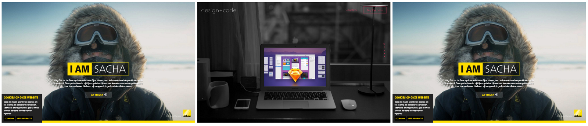

#### Avoiding the use of a back-end service

Our team was building a website editor. This editor parsed a template file and broke it down into reusable components, which could then be reused in any other portion of the website. In our initial version, we relied on a backend service to take screenshots of our HTML templates, and loaded these into the editor. Over time, however, the process of taking, updating, and publishing screenshots became cumbersome. We finally opted to utilize a technique we had seen in other web applications, such as  [**codepen.io**](http://codepen.io), to avoid the use of a backend service.

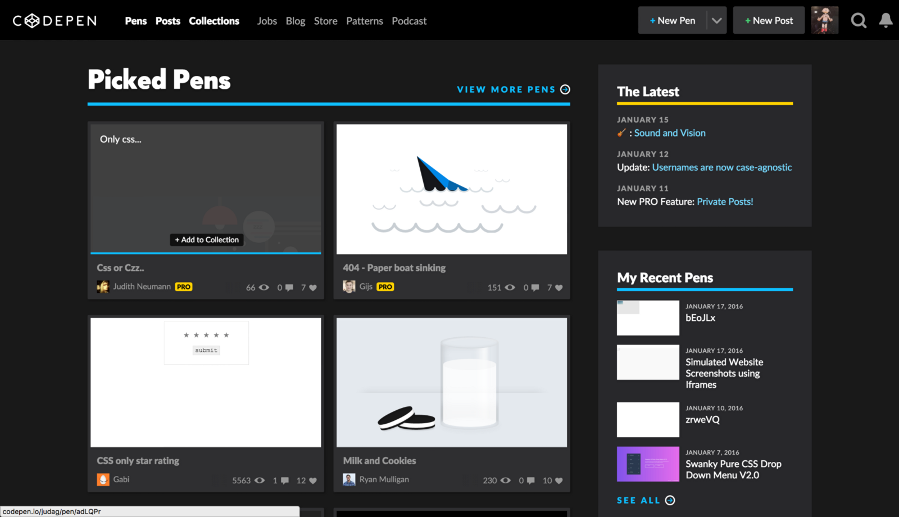

### Where do we use it?

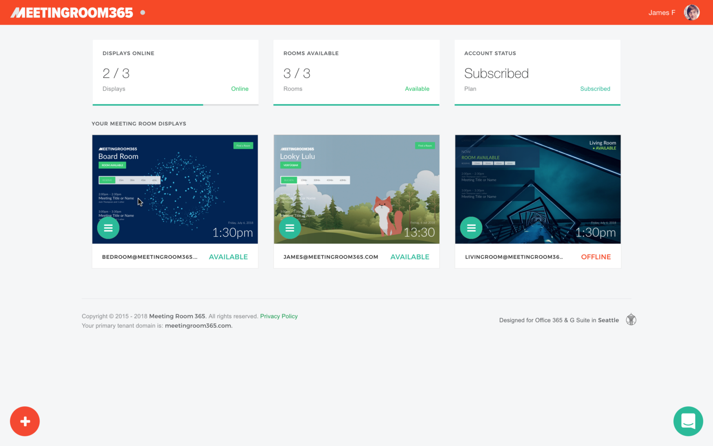

We’re currently using this technique in our product, [Meeting Room 365](https://meetingroom365.com/), for users with fewer than 10 displays, to show a preview of their meeting room display in a tile on the dashboard. Very similar to the CodePen use-case.


#### Performance

Hilariously, at one point, we realized that some users with too many displays would experience slow page load times if we continued with the iFrames, and removed them (as many of you have commented). Several users quickly emailed us complaining that their dashboards were broken, and politely requested that we re-enabled “real-time animated screenshots” in the tiles.

So, we added it back in, for users with 10 or fewer screens. Once a user hits 10 displays, the iFrames are replaced with screenshots, automated via [https://www.screenshotapi.io/](https://www.screenshotapi.io/)

#### Displaying the webpage in an iframe

```
<div class="thumbnail-container">
  <div class="thumbnail">
   <iframe src="http://www.iamsacha.nl/" frameborder="0"></iframe>
  </div>
</div>
```

For this example, we will use an iframe to contain the webpage we wish to “simulate” a screenshot of. Next, we will add a wrapper which will mask the IFRAME element, and an additional wrapper which will modify the behavior of the element to more closely match an IMG element.

Also notice we declare **_frameborder=”0”_** explicitly in our markup, which helps us avoid an ugly border. Remember, our goal is for the user to believe they are interacting with an IMG element.

#### Styling the IFRAME element with CSS

At this stage, we will assign width and height to the IFRAME element, so that we display the entire page we wish to capture in our screenshot. The following CSS will do the trick:

```
.thumbnail iframe {
  width: 1440px;
  height: 900px;
}
```

This should give us an appropriate size and aspect ratio to capture most webpages in an appealing manner.

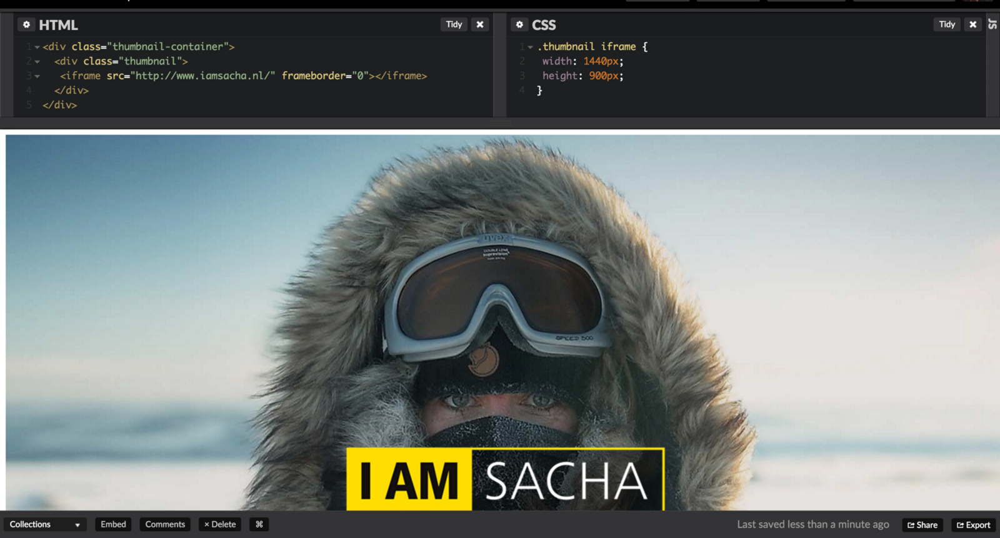

#### Scaling the iframe

Next, we wish to cover scaling the IFRAME element to 25% of it’s original size. This will produce a 360px x 225px thumbnail.

```
.thumbnail {
  position: relative;
  -ms-zoom: 0.25;
  -moz-transform: scale(0.25);
  -moz-transform-origin: 0 0;
  -o-transform: scale(0.25);
  -o-transform-origin: 0 0;
  -webkit-transform: scale(0.25);
  -webkit-transform-origin: 0 0;
}
```

CSS3 image scaling, a 2d transformation, will work in all modern desktop and mobile browsers (IE9+). The only caveat to this being that some mobile browsers will run into memory limit issues if you attempt to use this technique to create a large number of “simulated” thumbnails, since the total size of the webpage being rendered will be much larger than a typical webpage.

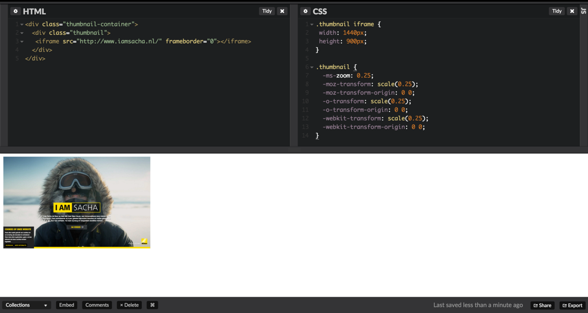

#### Masking the iframe so it behaves like an image

Next, in order to maintain our illusion, we will mask the image so that it behaves more like an image. If the user is able to manipulate the webpage with their scroll wheel, or click the buttons inside the webpage, then it may become less clear what we wish them to do with the thumbnail. In many cases, we may even wish for them to click on it, making this step an absolute necessity.

```
.thumbnail:after {
  content: "";
  display: block;
  position: absolute;
  top: 0;
  left: 0;
  right: 0;
  bottom: 0;
}
```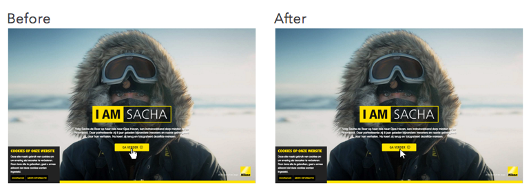

#### Adding a container so the image behaves like an IMG element

Since an IMG element is an inline-block element, our simulated thumbnail should be positioned as one.

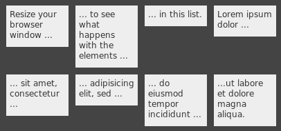

We can achieve this with the following code:

```
.thumbnail-container {
  width: calc(1440px * 0.25);
  height: calc(900px * 0.25);
  display: inline-block;
  overflow: hidden;
  position: relative;
}
```

In the demo I will share at the end of this tutorial, I converted by example to use a CSS preprocessor, so I could easily adjust the size of the thumbnail. This is why I am using **calc()** values instead of declaring the size we are looking for. For some browsers, It is also important to declare the overflow to be hidden. This is because the inner element will be rendered using the full unscaled size of the thumbnail, which will result in a large, unwanted margin.

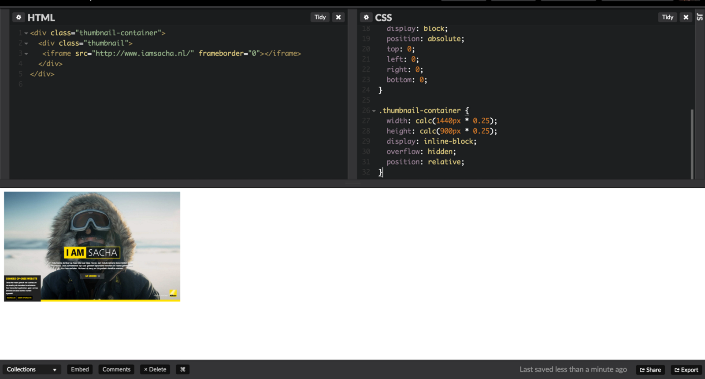

#### Optional: Adding a fade effect to avoid loading artifacts

Next, I will demonstrate how we can use the Javascript onload property to avoid loading artifacts by fading in the thumbnail once it is ready.

To achieve this, we will use the following CSS to ensure our image is not displayed until we call it:

```
.thumbnail iframe {
  opacity: 0;
  transition: all 300ms ease-in-out;
}
```

Next, we will use the Javascript **onload** event to trigger the thumbnail to display, but only when the page has been rendered by the browser:

```
<iframe src="http://www.iamsacha.nl/" frameborder="0" onload="this.style.opacity = 1"></iframe>
```

#### Optional: Increasing the loading delay for websites containing excessive animation

For some webpages with excessive animation, as our example above, we may wish to increase the delay. To do this, we can use this simple Javascript, which uses setTimeout to add a delay and preserves the scope of the **\`this\`** variable:

```
var that = this;
setTimeout(function () {
  that.style.opacity = 1;
}, 500);
```

Which, would be applied to our markup to look like this:

```
<iframe src="http://www.iamsacha.nl/" frameborder="0" onload="var that=this;setTimeout(function() { that.style.opacity = 1 }, 500)"></iframe>
```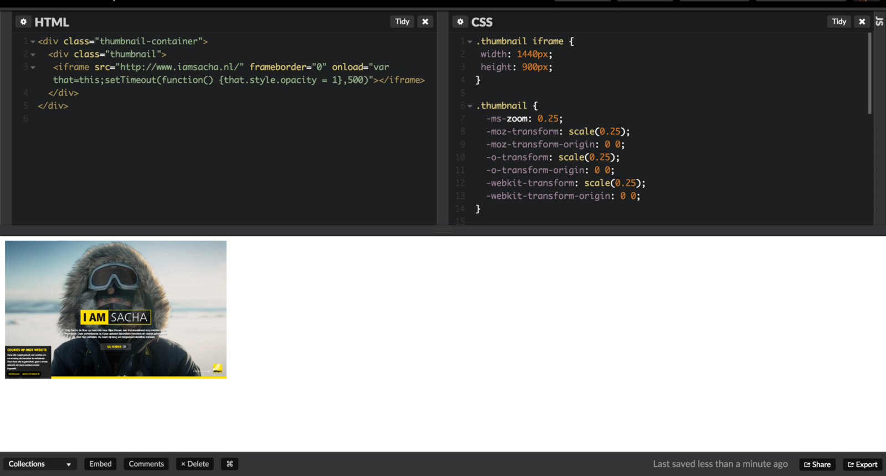

#### Optional: Adding a placeholder image

To further improve the experience, I have opted to create a “placeholder image” using CSS pseudo-elements to indicate to the user that, yes, an image is about to appear on our webpage.

To achieve this, I first change the background color of the thumbnail container to grey:

```
.thumbnail-container {
  background: #f9f9f9;
}
```

Then, I utilize a base-64 encoded SVG image inside a **::before** pseudo-element to simulate an image placeholder:

```
.thumbnail-container::before {
  position: absolute;
  left: calc(50% — 16px);
  top: calc(50% — 18px);
  opacity: 0.2;
  display: block;
  -ms-zoom: 2;
  -o-transform: scale(2);
  -moz-transform: scale(2);
  -webkit-transform: scale(2);
 
  content: url("data:image/svg+xml;base64,PD94bWwgdmVyc2lvbj0iMS4wIiA/PjwhRE9DVFlQRSBzdmcgIFBVQkxJQyAnLS8vVzNDLy9EVEQgU1ZHIDEuMS8vRU4nICAnaHR0cDovL3d3dy53My5vcmcvR3JhcGhpY3MvU1ZHLzEuMS9EVEQvc3ZnMTEuZHRkJz48c3ZnIGVuYWJsZS1iYWNrZ3JvdW5kPSJuZXcgMCAwIDMyIDMyIiBoZWlnaHQ9IjMycHgiIGlkPSJMYXllcl8xIiB2ZXJzaW9uPSIxLjEiIHZpZXdCb3g9IjAgMCAzMiAzMiIgd2lkdGg9IjMycHgiIHhtbDpzcGFjZT0icHJlc2VydmUiIHhtbG5zPSJodHRwOi8vd3d3LnczLm9yZy8yMDAwL3N2ZyIgeG1sbnM6eGxpbms9Imh0dHA6Ly93d3cudzMub3JnLzE5OTkveGxpbmsiPjxnIGlkPSJwaG90b18xXyI+PHBhdGggZD0iTTI3LDBINUMyLjc5MSwwLDEsMS43OTEsMSw0djI0YzAsMi4yMDksMS43OTEsNCw0LDRoMjJjMi4yMDksMCw0LTEuNzkxLDQtNFY0QzMxLDEuNzkxLDI5LjIwOSwwLDI3LDB6ICAgIE0yOSwyOGMwLDEuMTAyLTAuODk4LDItMiwySDVjLTEuMTAzLDAtMi0wLjg5OC0yLTJWNGMwLTEuMTAzLDAuODk3LTIsMi0yaDIyYzEuMTAyLDAsMiwwLjg5NywyLDJWMjh6IiBmaWxsPSIjMzMzMzMzIi8+PHBhdGggZD0iTTI2LDRINkM1LjQ0Nyw0LDUsNC40NDcsNSw1djE4YzAsMC41NTMsMC40NDcsMSwxLDFoMjBjMC41NTMsMCwxLTAuNDQ3LDEtMVY1QzI3LDQuNDQ3LDI2LjU1Myw0LDI2LDR6ICAgIE0yNiw1djEzLjg2OWwtMy4yNS0zLjUzQzIyLjU1OSwxNS4xMjMsMjIuMjg3LDE1LDIyLDE1cy0wLjU2MSwwLjEyMy0wLjc1LDAuMzM5bC0yLjYwNCwyLjk1bC03Ljg5Ni04Ljk1ICAgQzEwLjU2LDkuMTIzLDEwLjI4Nyw5LDEwLDlTOS40NCw5LjEyMyw5LjI1LDkuMzM5TDYsMTMuMDg3VjVIMjZ6IE02LDE0LjZsNC00LjZsOC4wNjYsOS4xNDNsMC41OCwwLjY1OEwyMS40MDgsMjNINlYxNC42eiAgICBNMjIuNzQsMjNsLTMuNDI4LTMuOTU1TDIyLDE2bDQsNC4zNzlWMjNIMjIuNzR6IiBmaWxsPSIjMzMzMzMzIi8+PHBhdGggZD0iTTIwLDEzYzEuNjU2LDAsMy0xLjM0MywzLTNzLTEuMzQ0LTMtMy0zYy0xLjY1OCwwLTMsMS4zNDMtMywzUzE4LjM0MiwxMywyMCwxM3ogTTIwLDhjMS4xMDIsMCwyLDAuODk3LDIsMiAgIHMtMC44OTgsMi0yLDJjLTEuMTA0LDAtMi0wLjg5Ny0yLTJTMTguODk2LDgsMjAsOHoiIGZpbGw9IiMzMzMzMzMiLz48L2c+PC9zdmc+");
}
```

I have also added a bit of styling to double it’s size, center the image, and adjust it’s opacity.

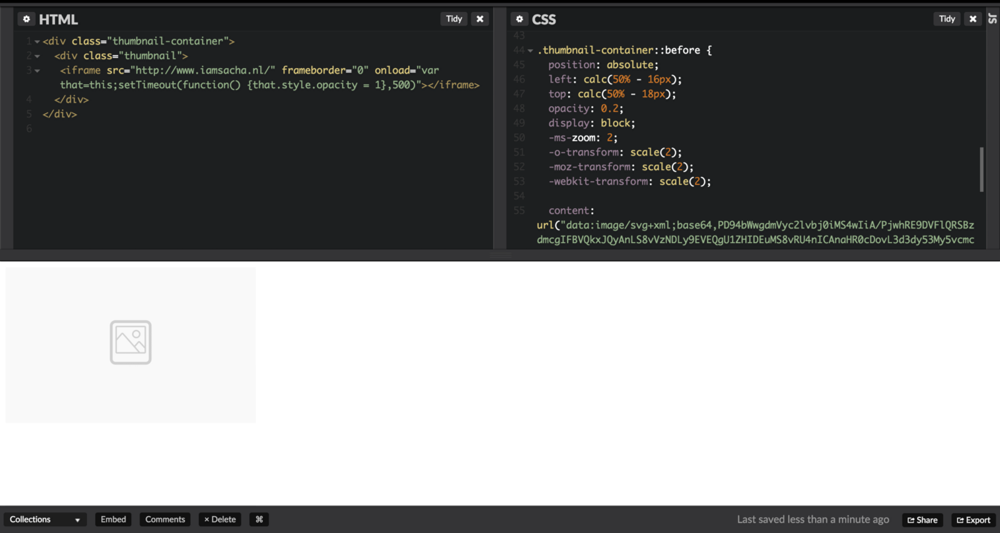

#### Optional: Simulating ALT text with the Title Attribute

For the final (optional) step, I will simulate ALT text using the title attribute. Since we are not creating an actual IMG element, we are forced to use this alternative method to ensure search engines and accessibility devices understand our element.

To achieve this, we make the following adjustment to our markup:

```
<div class="thumbnail-container" title="Thumbnail Image of designcode.io">
  <div class="thumbnail">
   <iframe src="https://designcode.io/" frameborder="0" onload="this.style.opacity = 1"></iframe>
  </div>
</div>
```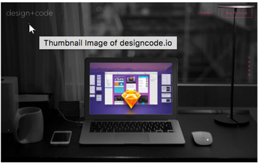

#### Customizing the Example

In this example, you will notice that I have replaced the thumbnail width, height, and scale with LESS variables. This should make it easier to modify and tweak to fit your needs. If you wish to avoid the use of a pre-processor, you can click **“view compiled”** to view the resulting CSS.

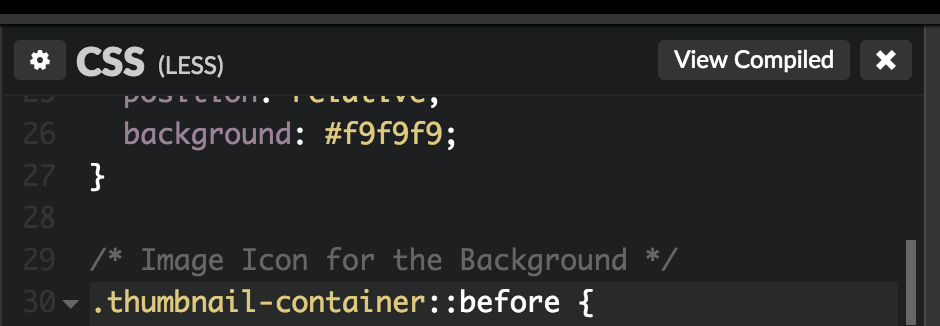

#### Final Working Example (CodePen)

](./asset-16.png)The final example (with comments!) can be found at [http://codepen.io/kidGodzilla/pen/KVXGeM](http://codepen.io/kidGodzilla/pen/KVXGeM)

#### Thanks for reading!

If you have any questions or feedback, please respond in the comments.