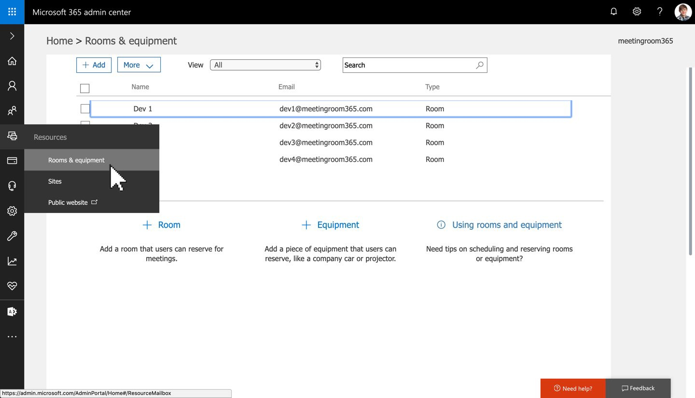
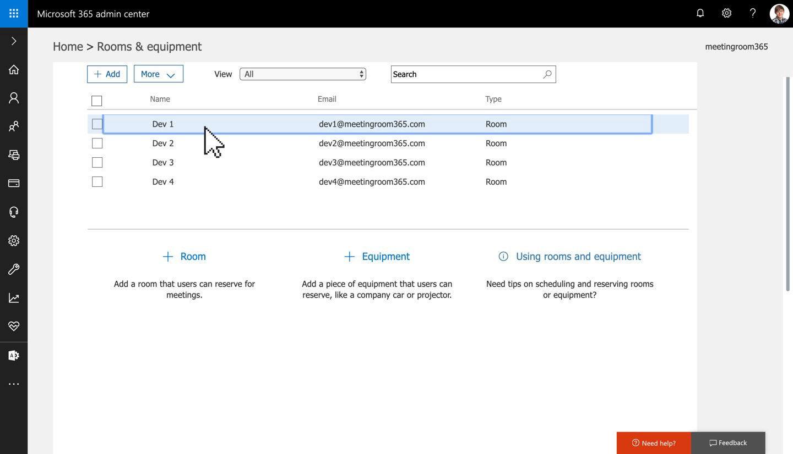
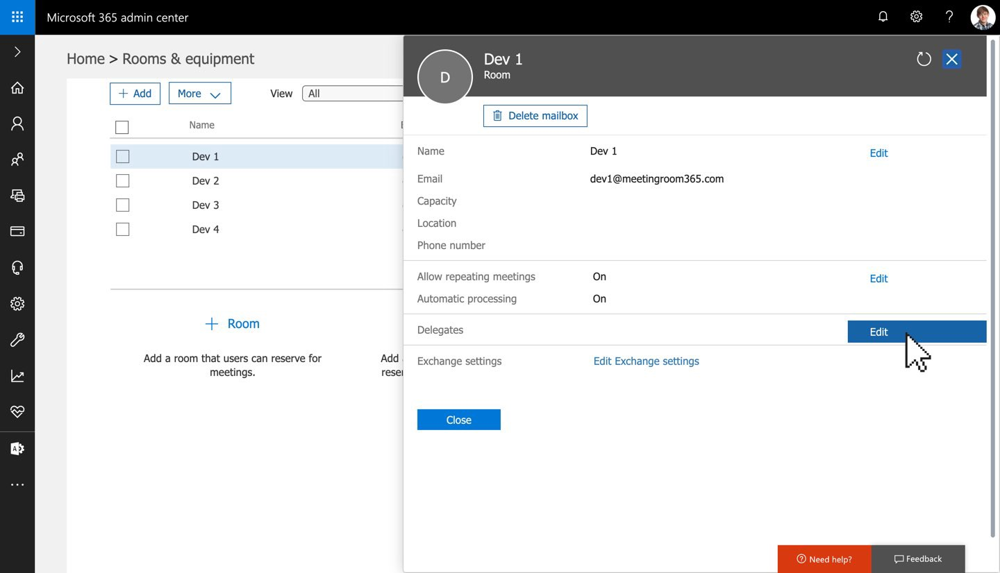
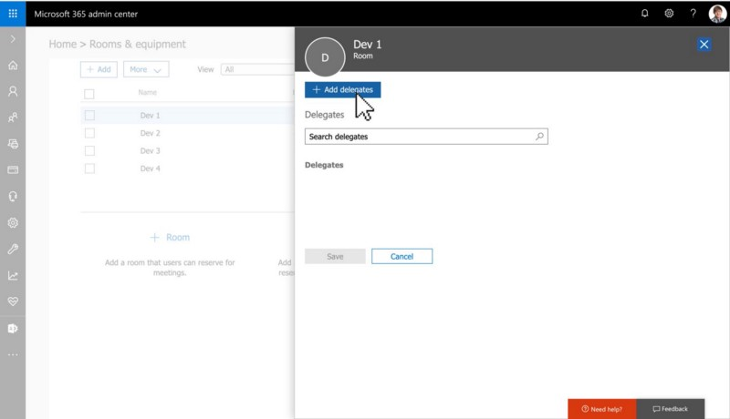
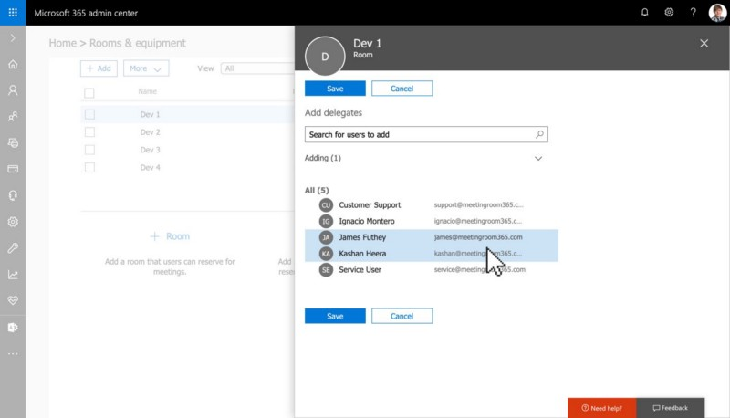
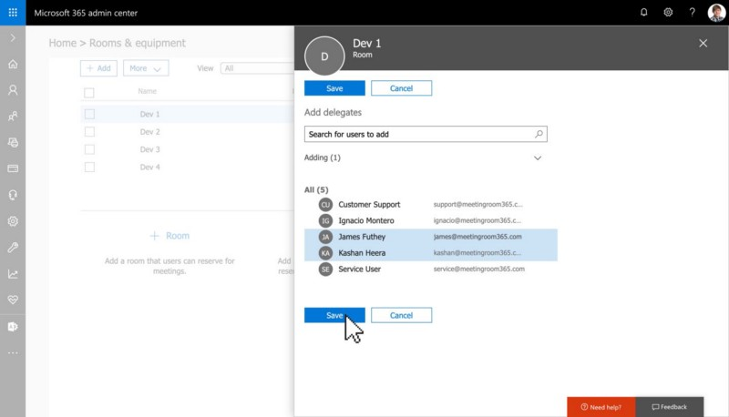
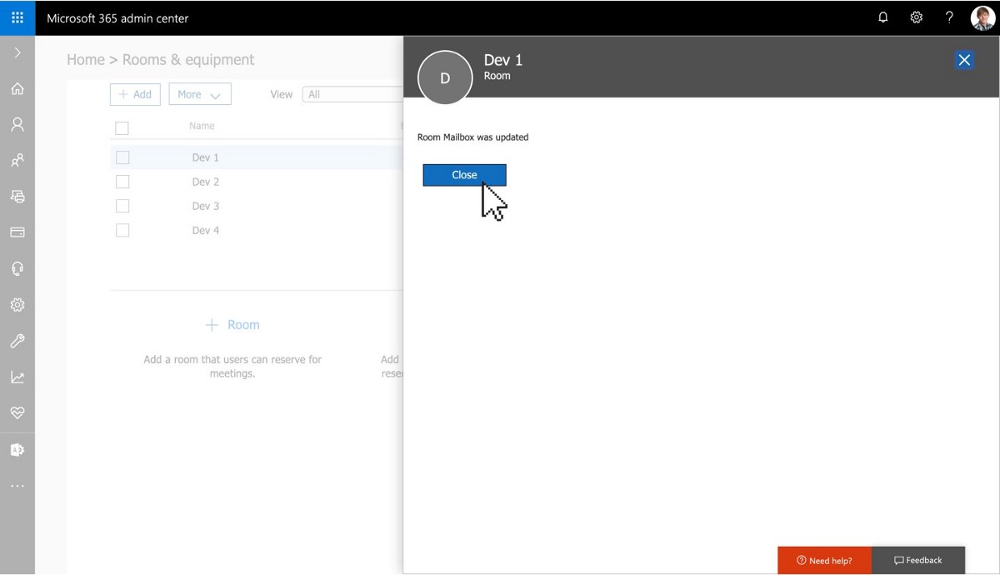
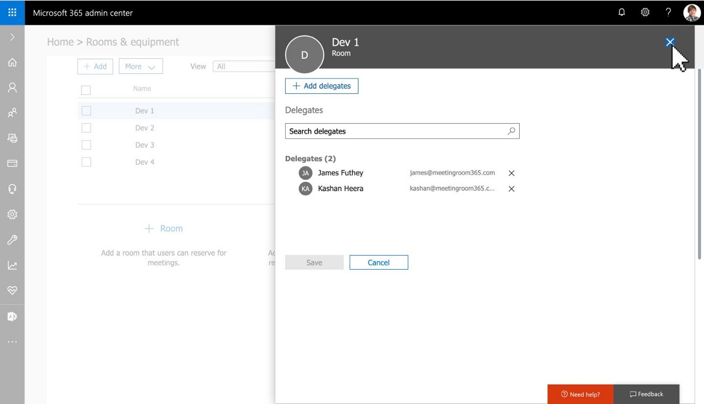
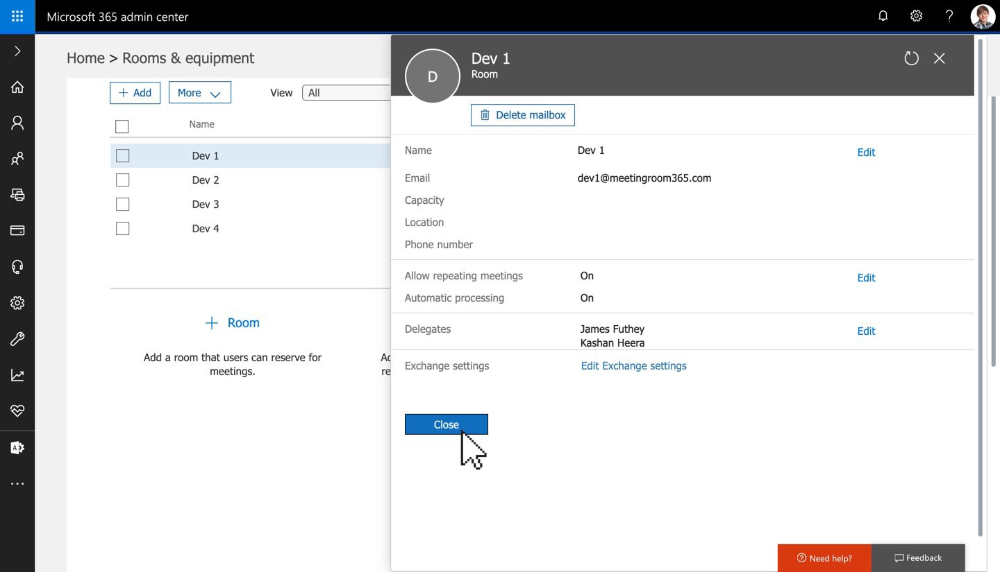

For some services, such as ours, it can be useful to create a **Service Account** that can access all of the resource mailboxes in your company, so that you can easily control third-party access to your tenant via a single set of credentials. Not to mention, this also simplifies the setup and provisioning process.

This has always been an option for Office 365 and Exchange users via EMC and PowerShell. But recently, the Office 365 Admin portal has quietly added the feature as well. Meaning, you can enable delegated access and create a service account in just a few clicks.

### 1\. Log into the Office 365 Admin Portal & Select Rooms and Equipment from the Left Menu

First, you’ll want to log into the Office 365 Admin Portal, located at [**https://portal.office.com/**](https://portal.office.com/) (select Admin). You will need to be an Office 365 Administrator to complete this step.

### 2\. Select your Resource Mailbox

This is the mailbox which will be accessed via your service account.

### 3\. Select Edit to edit your list of Delegates

### 4\. Click ‘Add Delegate’, and add your service account as a delegate

Then click ‘Save’ to confirm.

Once you confirm your list of delegates, which should include your service account, you can close this pane.

### 5\. Confirm your service account as a delegate

### That’s it!

You’ll need to repeat this process for each Office 365 Resource Mailbox you want to access via a Service User.