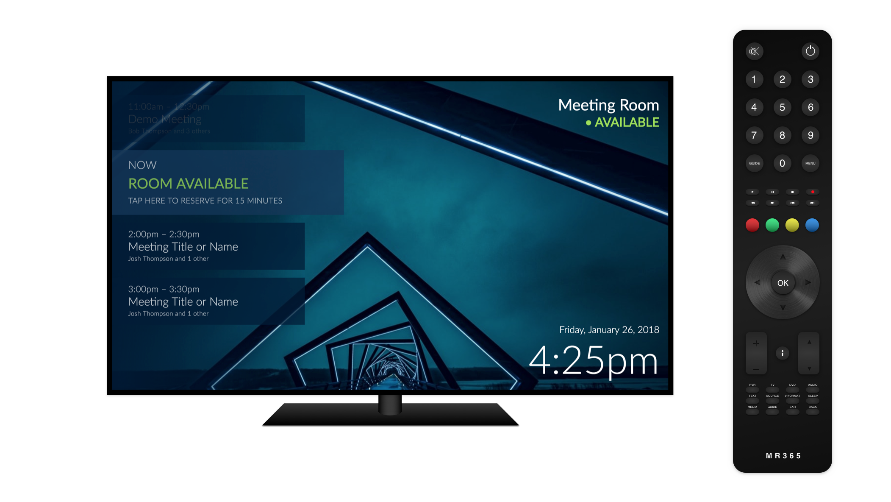
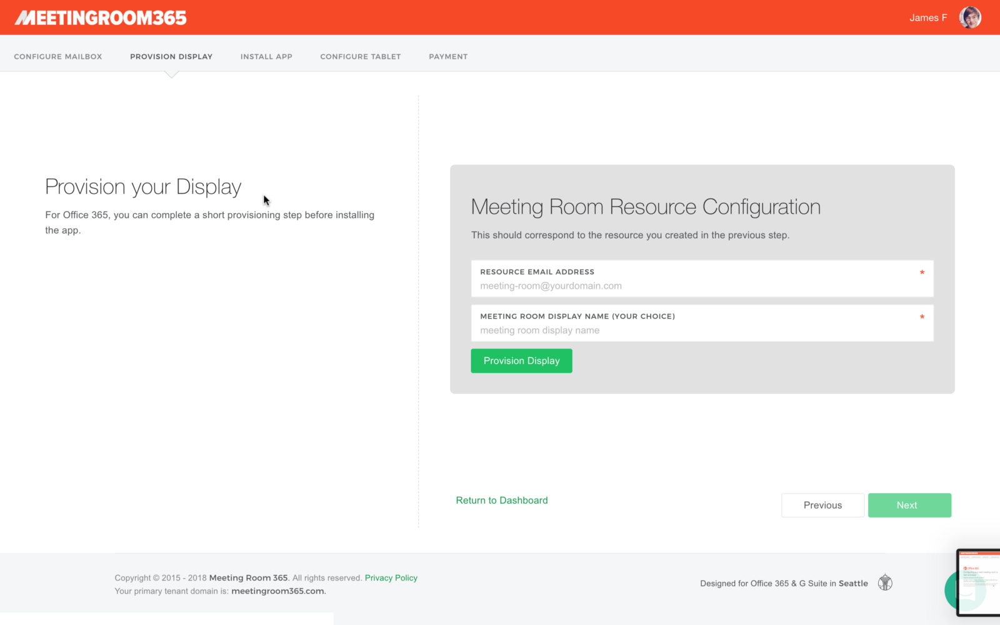
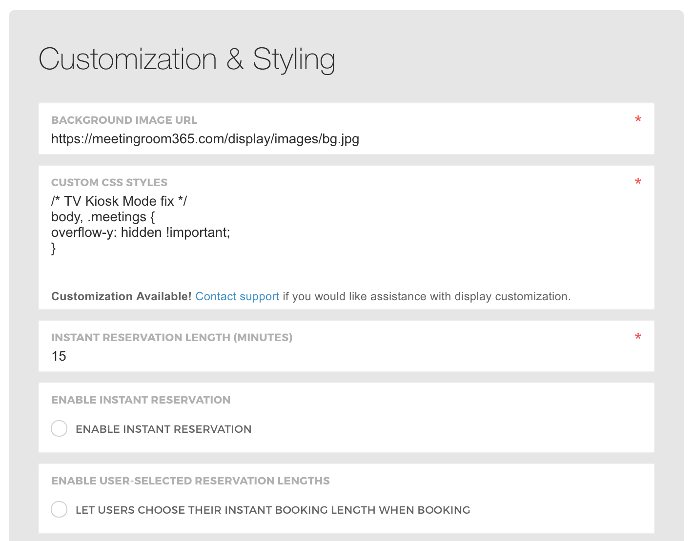
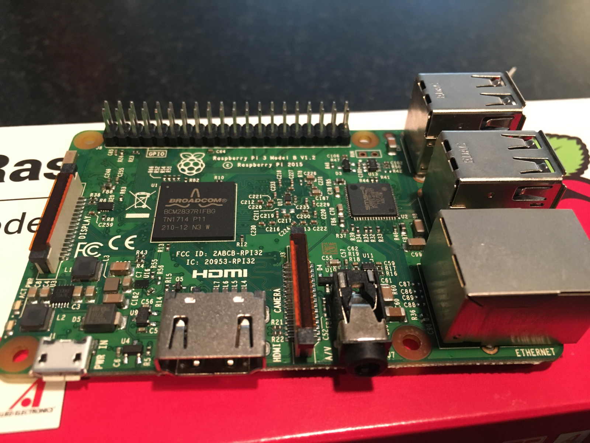
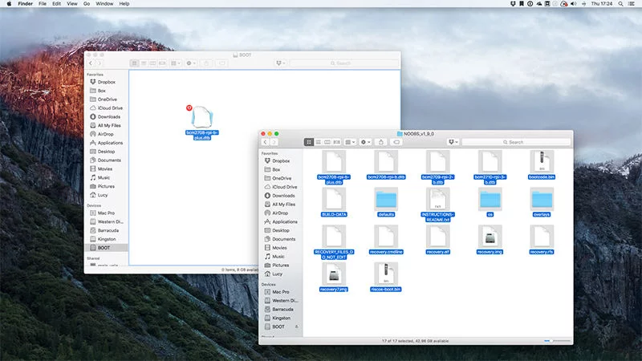
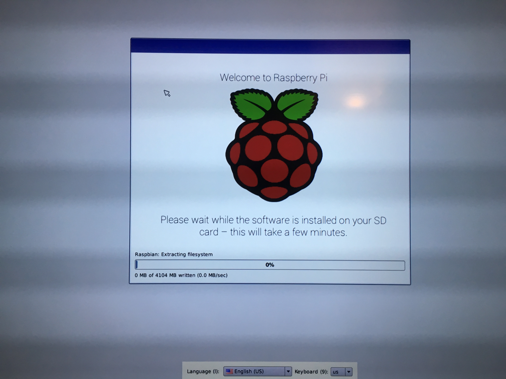
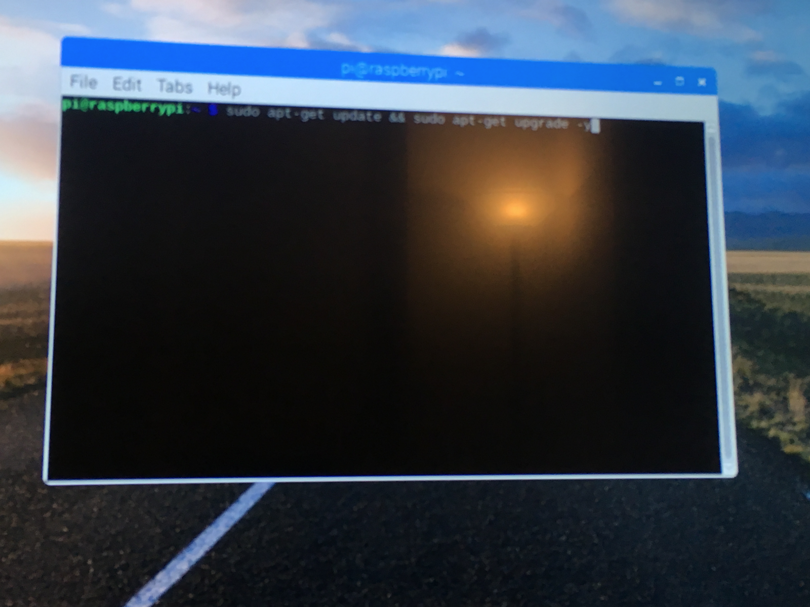
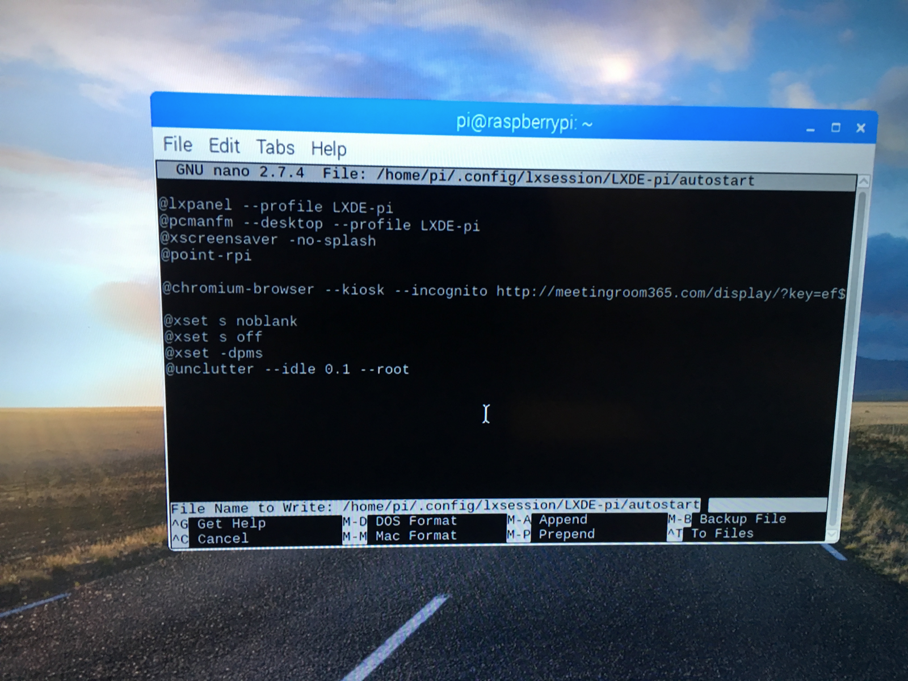
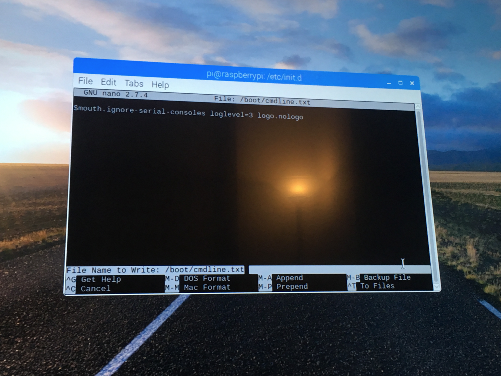
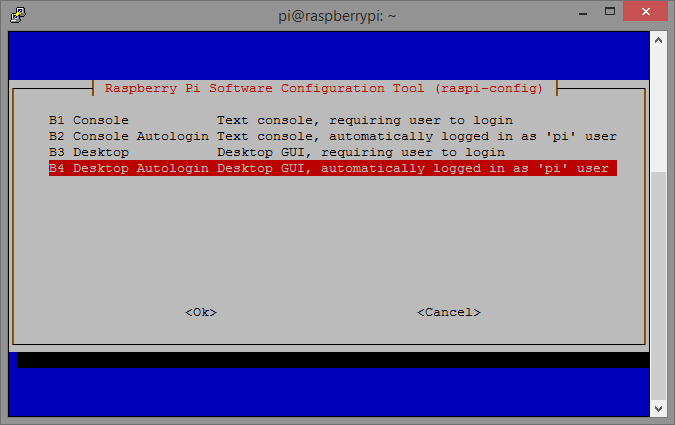

## How to Add a Meeting Room Display to Office 365



#### Who are we?

We’re [Meeting Room 365](https://meetingroom365.com/), and we produce a meeting room display solution specifically for Office 365. Designed to run on tablets, the Raspberry Pi guide is a bit of a passion project for us. See the below guide if you’re interested in our Tablet-first solution.

[**How to Add a Meeting Room Display to Office 365 in 5 minutes \[DIY\]**  
_Mount any tablet or iPad outside your conference rooms as a meeting room display, and keep your space organized_medium.com](https://medium.com/@jamesfuthey/how-to-add-a-meeting-room-display-to-office-365-in-5-minutes-diy-6e6ee6d4aec7 "https://medium.com/@jamesfuthey/how-to-add-a-meeting-room-display-to-office-365-in-5-minutes-diy-6e6ee6d4aec7")[](https://medium.com/@jamesfuthey/how-to-add-a-meeting-room-display-to-office-365-in-5-minutes-diy-6e6ee6d4aec7)

[**Creating a Miniature Meeting Room Display for Office 365 (Arduino)**  
_Creating a tiny, embedded version of our Meeting Room display software for Office 365_medium.com](https://medium.com/@jamesfuthey/mini-meeting-room-365-display-c627aab4468 "https://medium.com/@jamesfuthey/mini-meeting-room-365-display-c627aab4468")[](https://medium.com/@jamesfuthey/mini-meeting-room-365-display-c627aab4468)

#### Choosing the best hardware

We designed this using the **Raspberry Pi 3b** board, but it should work with any recent version of the platform. One consideration is to look for the **RP3b** board (with Wifi), or the **Raspberry Pi Zero W** board (also with wifi), if you’re going to need it. Not all versions of the board have Wireless connectivity, if you need it.

The Raspberry Pi Zero requires a USB OTG adapter (Micro USB to USB) to connect a keyboard and mouse, which is recommended for setup.

The item below should include the accessories you need to get started:

[**Vilros Raspberry Pi Zero W Basic Starter Kit- Black Case Edition-Includes Pi Zero W -Power Supply &…**  
_This is The Vilros Raspberry Pi Zero W Basic Kit--Clear Case Edition KIT CONTENT Raspberry Pi Zero W 2.5A Power Supply…_www.amazon.com](https://www.amazon.com/Vilros-Raspberry-Starter-Power-Premium/dp/B0748MPQT4 "https://www.amazon.com/Vilros-Raspberry-Starter-Power-Premium/dp/B0748MPQT4")[](https://www.amazon.com/Vilros-Raspberry-Starter-Power-Premium/dp/B0748MPQT4)

### What you’ll need:

1.  A **Raspberry Pi**. Any version with a network connection suitable for your environment (Ethernet or Wireless), and an HDMI port will do.
2.  A **power supply** & **USB -> Micro USB cable**, long enough to power your Pi (You might even be able to pull power off the TV if your set supports it)
3.  Blank Micro SD card (or bundled, pre-installed NOOBS card)
4.  **Office 365 Tenant Credentials**
5.  A free **Meeting Room 365** account.
6.  **Optional:** Adhesive Mounting Strips (to hide your Pi behind your Television Screen)
7.  **Optional:** Raspberry Pi case

#### What we’re going to do

1.  Provision a Meeting Room in Office 365
2.  Provision a display in Meeting Room 365
3.  We’re going to setup a Raspberry Pi 3 (or Raspberry Pi Zero W) as a Meeting Room display, connected to a television or similar output.
4.  We’ll install **Raspbian** via the **NOOBS** operating system installer
5.  We’ll setup a script to automatically log in on boot & start our display
6.  We’ll setup quiet boot options for a more polished experience

### Create a free Meeting Room 365 Account

Sign up for a Free [**Meeting Room 365**](https://www.meetingroom365.com/) account. This will allow you to create and deploy unlimited, customizable meeting room displays. Pay when you’re ready (each display is free to try for 30 days, then it’s $5/month per display. Annual and bulk discounts available).


### Configure Office 365

You will need to login to your Office 365 admin portal and provision free meeting room mailboxes. You will not be charged for these meeting-room-only accounts, but they will all get an email address @yourdomain.com (or the onmicrosoft.com variant).

#### 1\. Log into your Office 365 Admin Portal.

Log into [https://portal.office365.com](https://portal.office365.com), and navigate to your **Admin Portal**. You can access the admin portal from the waffle menu.

#### 2\. Create a new meeting room.

To get started, select **‘Rooms & Equipment’** from the left**,** which takes you to [https://admin.microsoft.com/AdminPortal/Home](https://admin.microsoft.com/AdminPortal/Home)


Next, click the plus icon to create a new meeting room.

#### 3\. Configure your new meeting room.

**Name:** You will need to give it a name. This is the name that will be displayed in your Outlook calendar.

**Email:** You will need to create an email address for this room. You can choose whatever you wish, but your users will see this name. You will not be billed for this email address.


**Room Capacity:** This lets your users see how many attendees can fit into this room. This is a suggestion for your users. It will not limit the number of attendees who can be invited to a calendar event.

#### 4\. Reset the password for the new mailbox.

Before you can link your new mailbox to Meeting Room 365, you will need to reset the password for the new mailbox.

To do this, navigate to **USERS > ACTIVE USERS** in the left navigation, which takes you to: [https://admin.microsoft.com/AdminPortal/Home#/users](https://admin.microsoft.com/AdminPortal/Home#/users)

Next, select the user who corresponds to your meeting room and select **‘Reset Password’** from the right.


Save the email address and new password. **You will need this to complete the next steps.**

#### 5\. Complete Provisioning in Meeting Room 365

This will provision a display that automatically updates when your meeting room is booked via Outlook.



#### Fix to remove scrollbars in Chromium

Add the following custom CSS to your display under **Customization & Styling** to remove scrollbars in Chromium:

```
/* TV Kiosk Mode fix */

body, .meetings {
  overflow-y: hidden !important;
}
```

Also, you’ll want to **disable Instant Reservations** since your display has no user input:



### Raspberry Pi Setup



\*Based in part on [this guide](https://www.danpurdy.co.uk/web-development/raspberry-pi-kiosk-screen-tutorial/) by **Dan Purdy**.

#### Download NOOBS

The easiest way to set up a Raspberry Pi on a Mac is to copy the NOOBS files from the Raspberry Pi organization to a blank SD card. If this is the first time you’ve set up a Raspberry Pi, then we recommend you go this route.

[https://www.raspberrypi.org/downloads/](https://www.raspberrypi.org/downloads/)

#### Setup NOOBS on your SD Card

This varies from operating system to Operating system. Follow the below instructions, or visit the guide (official) for up-to-date information:

[**Help Videos - Raspberry Pi**  
_What is a Raspberry Pi? What is a Raspberry Pi? Made by Saladhouse. Sound Design by Marcus Alexander. Voiced by Amy…_www.raspberrypi.org](https://www.raspberrypi.org/help/noobs-setup/2/ "https://www.raspberrypi.org/help/noobs-setup/2/")[](https://www.raspberrypi.org/help/noobs-setup/2/)

### Install Instructions

1.  Insert an SD card that is 8GB or greater in size into your computer.
2.  Format the SD card using the platform-specific instructions below:

#### **Windows** (32GB cards and under):

1.  Download the SD Association’s Formatting Tool from [https://www.sdcard.org/downloads/formatter\_4/eula\_windows/](https://www.sdcard.org/downloads/formatter_4/eula_windows/)
2.  Install and run the Formatting Tool on your machine
3.  Set “FORMAT SIZE ADJUSTMENT” option to “ON” in the “Options” menu
4.  Check that the SD card you inserted matches the one selected by the Tool
5.  Click the “Format” button

#### Mac (32GB cards and under)

1.  Download the SD Association’s Formatting Tool from [https://www.sdcard.org/downloads/formatter\_4/eula\_mac/](https://www.sdcard.org/downloads/formatter_4/eula_mac/)
2.  Install and run the Formatting Tool on your machine
3.  Select “Overwrite Format”
4.  Check that the SD card you inserted matches the one selected by the Tool
5.  Click the “Format” button

#### **Linux**

1.  We recommend using gparted (or the command line version parted)
2.  Format the entire disk as FAT32

#### Cards over 32GB

Follow the instructions on [https://www.raspberrypi.org/documentation/installation/sdxc\_formatting.md](https://www.raspberrypi.org/documentation/installation/sdxc_formatting.md)

#### Extract NOOBS



1.  Extract the files contained in this NOOBS zip file.
2.  Copy the extracted files onto the SD card that you just formatted so that this file is at the root directory of the SD card. Please note that in some cases it may extract the files into a folder, if this is the case then please copy across the files from inside the folder rather than the folder itself.
3.  Insert the SD card into your Pi and connect the power supply.  
    Your Pi will now boot into NOOBS and should display a list of operating systems that you can choose to install.

**Note:** If your display remains blank, you should select the correct output mode for your display by pressing one of the following number keys on your keyboard:

1.  HDMI mode — this is the default display mode.
2.  HDMI safe mode — select this mode if you are using the HDMI connector and cannot see anything on screen when the Pi has booted.
3.  Composite PAL mode — select either this mode or composite NTSC mode if you are using the composite RCA video connector.
4.  Composite NTSC mode

#### Completing Installation

Remove the SD Card from your computer, and insert it into the Raspberry Pi. Attach the power, HDMI cable and other peripherals.

Your Raspberry Pi will boot, and a window will appear with a list of different operating systems that you can install. We recommend that you use Raspbian — tick the box next to Raspbian and click on `Install`.


Raspbian will then run through its installation process. Note that this can take a while.



### Once you’ve installed the Raspbian OS:

Congrats! You’ve setup your Raspberry Pi, & you’re halfway there. Just a few more steps to setup our TV for Kiosk mode.


#### Launch the Terminal / Console (command line interface)

Everything we’re about to do happens through the command-line interface (Terminal). If you’re familiar with Unix / Debian, this should be a breeze. If not, pay close attention to the commands we cover in this guide.


#### Update your package lists

The first thing you’ll want to do, once you connect to the internet (Wifi is in the upper-right corner if you haven’t found it already), is to update your package lists and installed packages to their latest versions.

```
sudo apt-get update && sudo apt-get upgrade -y
```

#### Hide the idle mouse cursor

Now, let’s install `unclutter` so we can hide the mouse cursor when the display is idle:

```
sudo apt-get install unclutter
```

#### Configure an Autostart script

Next, we’ll configure an autostart script to launch the Kiosk application automatically on boot.

To do this, edit the LXDE Autostart file to run some additional commands on boot:

```
sudo nano ~/.config/lxsession/LXDE-pi/autostart
```

Add the following content to the end of it (most likely after `@point-rpi`):

```
@chromium-browser --kiosk --incognito --noerrdialogs  https://app.meetingroom365.com/

@xset s noblank
@xset s off
@xset -dpms
@unclutter --idle 0.1 --root
```

\*You will need to sign in to your Resource Mailbox on first boot or configure a key in your URL (i.e. https://app.meetingroom365.com/?key=<your-key>)

Press **CTRL+O** to write the output (save the file), and **CTRL+X** to exit.



#### Polish the Boot Experience

Next, you’re going to polish the log output and get rid of the Pi logo on boot:

```
sudo nano /boot/cmdline.txt
```

1.  Locate the section that says “_console=tty1″_ and make it “_console=tty_“. This pushes the logs to the fourth virtual terminal
2.  Add a space in the end and add “_consoleblank=0 loglevel=1 quiet_“. This sets the severity of the logging level to “warning and above”.
3.  Add a space in the end of the line and add “_logo.nologo_“. That’s logonologo that — you guessed it — hides the little raspberry fruit logo.

```
console=tty consoleblank=0 loglevel=1 quiet logo.nologo
```

Press **CTRL+O** to write the output (save the file), and **CTRL+X** to exit.

#### Optional: Cleaning up the splash screen

You can further improve the boot experience by cleaning up the splash screen.

Edit your _/boot/config.txt_

```
sudo nano /boot/config.txt
```

Add the following to the bottom:

```
disable_splash=1
```

Press **CTRL+O** to write the output (save the file), and **CTRL+X** to exit.

#### Reboot your Pi!

Now for the moment of truth! Reboot your Pi by typing:

```
sudo reboot
```

#### Boot times

Our reference takes almost exactly 60 seconds to boot.

<Embed src="https://www.youtube.com/embed/rFX6yhqLoE0?feature=oembed" aspectRatio={0.75} />

### That’s it!

You should now have a working Meeting Room 365 TV Display, powered by the Raspberry Pi. If you run into any issues, feel free to reach out and let us know.


---

### Other considerations:

#### If your date/time is not correct by default

One of our test units needed the timezone to be set manually.

The most basic command for finding out the time on your server is `date`. Any user can type this command to print out the date and time:

```
date
```

Outputs:

```
Wed Apr 26 17:44:38 UTC 2017
```

Most often your device will default to the _UTC_ time zone, as highlighted in the above output. UTC is _Coordinated Universal Time_, the time at zero degrees longitude. Consistently using Universal Time reduces confusion when your infrastructure spans multiple time zones.

If you have different requirements and need to change the time zone, you can use the `timedatectl`command to do so.

First, list the available time zones:

```
timedatectl list-timezones
```

A list of time zones will print to your screen. You can press `SPACE` to page down, and `b` to page up. Once you find the correct time zone, make note of it then type `q` to exit the list.

Now set the time zone with `timedatectl set-timezone`, making sure to replace the highlighted portion below with the time zone you found in the list. You'll need to use `sudo` with `timedatectl` to make this change:

```
sudo timedatectl set-timezone America/New_York
```

You can verify your changes by running `date` again:

```
date
```

Outputs:

```
Wed Apr 26 13:55:45 EDT 2017
```

The time zone abbreviation should reflect the newly chosen value.

(You may have to log out and back in to see the changes)

#### If your Pi doesn’t log in by default

The default user is `pi` and the default password is `raspberry`. Once you get in, open the console and run:

```
sudo raspi-config
```

This will take you to a menu that lets you update your Raspberry Pi configuration, including boot options.

Select **Enable Boot to Desktop**, and then **Desktop Autologin**.



---

#### If your Pi falls asleep..

Depending on your version / configuration, you might still have issues keeping your Pi from falling asleep. If so, try one of the following methods:

#### Method one

Next, we’ll need to add a kbd config to prevent the screen from going to sleep:

```
sudo nano /etc/kbd/config
```

Contents:

```
BLANK_TIME=0
POWERDOWN_TIME=0
```

If you get an error, you may need to create the kbd directory.

```
cd /etc/
sudo mkdir kbd
```

#### Method Two

Here is another method to prevent the Pi from sleeping, if you still can’t get it to work.

Edit the `lightdm` config:

```
sudo nano /etc/lightdm/lightdm.conf
```

and modify the xserver-command line to this:

```
xserver-command= X -s 0 -dpms
```

Press **CTRL+O** to write the output (save the file), and **CTRL+X** to exit.

---

#### Localization

We’ve put together a short guide on localizing your display. Check it out!

[**How to Localize your Meeting Room 365 Display (Office 365)**  
_Customize language, time format, and other options_medium.com](https://medium.com/@jamesfuthey/how-to-localize-your-meeting-room-365-display-office-365-2432d8ef48c6 "https://medium.com/@jamesfuthey/how-to-localize-your-meeting-room-365-display-office-365-2432d8ef48c6")[](https://medium.com/@jamesfuthey/how-to-localize-your-meeting-room-365-display-office-365-2432d8ef48c6)

---

#### PowerShell Configuration for Office 365 Resource Mailboxes

By default, in Office365, a [**Resource mailbox’s calendar will show the organizer’s name instead of the subject in an Exchange Server environment**](https://support.microsoft.com/en-us/help/2842288/resource-mailbox-s-calendar-shows-the-organizer-s-name-instead-of-the)**.** You will need to run a short PowerShell command to solve this issue.

[**Meeting Room 365**](https://meetingroom365.com/) will run this automatically for you after your tablet is provisioned.

---

### If you’re stuck, you can always send an email to [Meeting Room 365](https://meetingroom365.com/), and we can help you out with setup, configuration, and provisioning.

---

### Thanks for reading!

Please Recommend and Share if you found this article useful!