## Force check-ins without the hassle.

We’ve added an IFTTT integration, which allows you to connect hundreds of hardware devices to Meeting Room 365, including Blink and Wyze cameras, and various IR presence detection sensors, to enable room booking, automatic reservations, end early, forced check-ins, and calendar sync, based on the physical presence of employees in a particular meeting room.

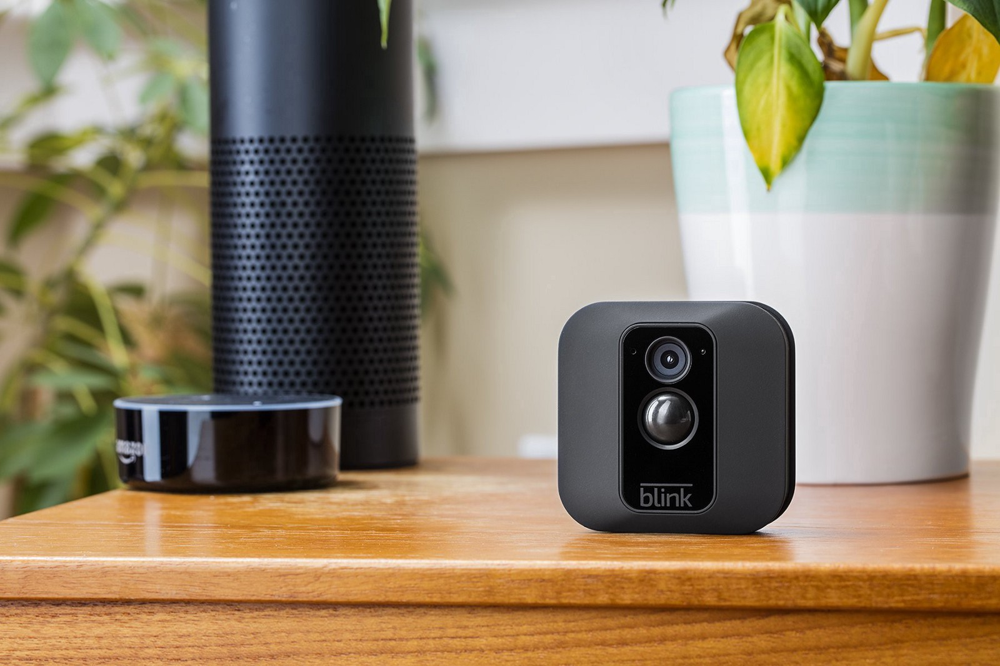

This makes it much easier to enable the “force-check-in” option, and “end-early” features, since they happen automatically, regardless of whether your team knows how to use them (or remembers).

### Choosing Hardware

We’ve tested presence detection ourselves extensively with the inexpensive [Wyze camera](https://www.wyze.com/wyze-cam/) ($26 shipped), and the [Blink](https://www.amazon.com/Blink-Home-Security-Detection-Included/dp/B019S3ULQM/) cameras (from $64). Additionally, there are hundreds of supported devices in the IFTTT ecosystem, which can be used for presence detection.

While every situation is different, there seems to be many paths to reliably implementing this and many factors to consider. Purchasing a single test device for a pilot is almost always a safe bet.

### Setting up your Camera in Meeting Room 365

Your first step will be to set up your camera hardware in Meeting Room 365. To do this, just open your display, head to the Hardware tab, and check `Receive Motion events from IFTTT`.

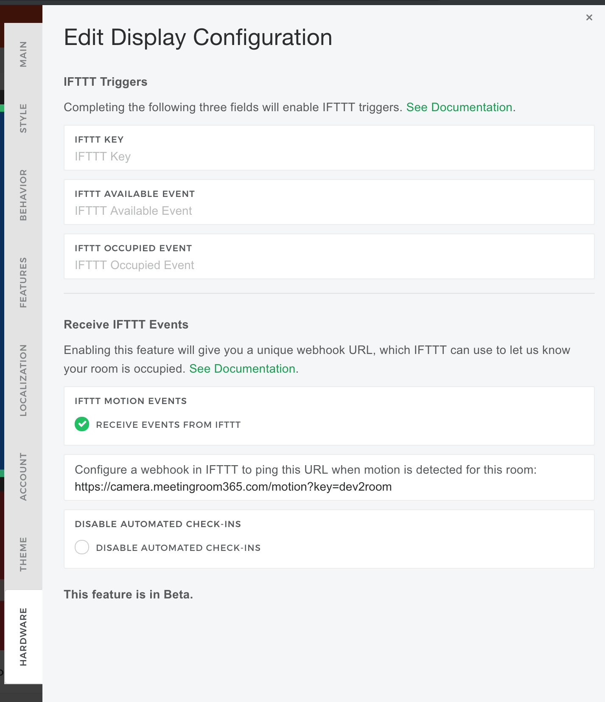

This will give you a unique URL which you can later use in IFTTT to configure a webhook trigger.

Optionally, you can disable automated check-ins from the Meeting Room 365 admin portal, by later checking the box **“Disable automated check-ins”**. This lets you keep IFTTT configured if you need to modify or disable this feature in the future.

### Configure a trigger in IFTTT

Next, you’ll want to configure a trigger in IFTTT. We’ll be setting up the Wyze camera in our example, but you should be able to do this with a variety of hardware products, including motion sensors, and cameras with presence detection.

#### Create a New Applet

**Choose your service**

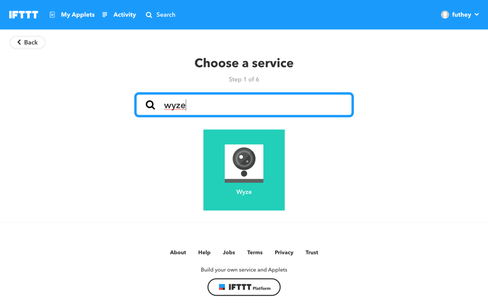

**Choose a motion detection trigger**

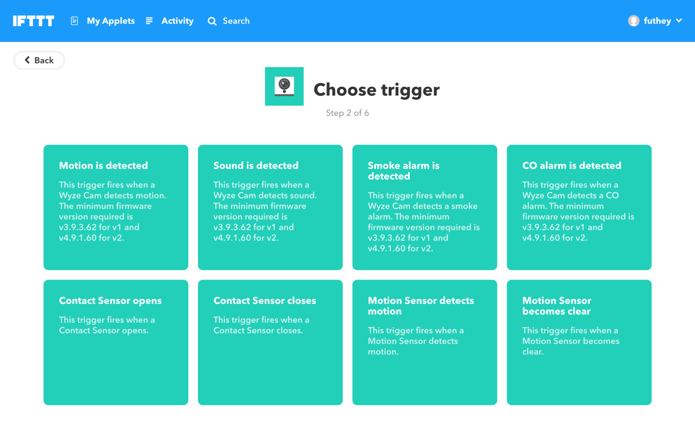

**Choose a device  
**You may have to configure this device by connecting it to IFTTT

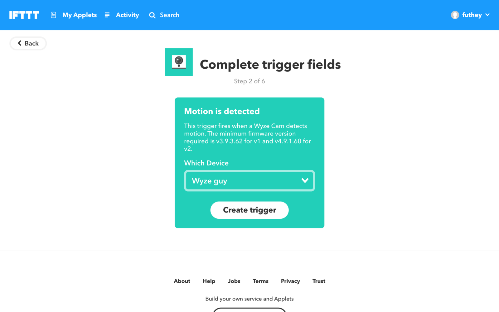

**Configure a Trigger**

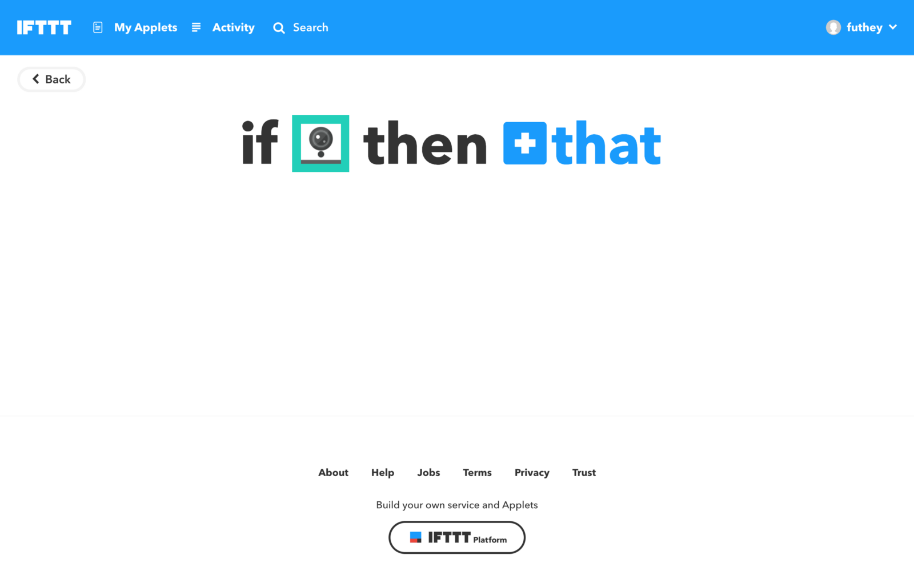

Select **Webhooks**

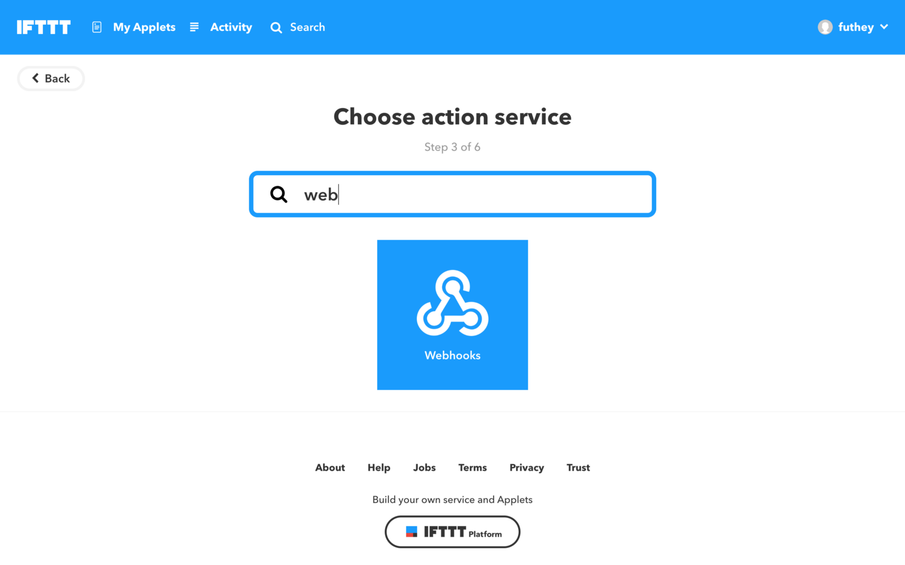

Choose **Make a Web Request**

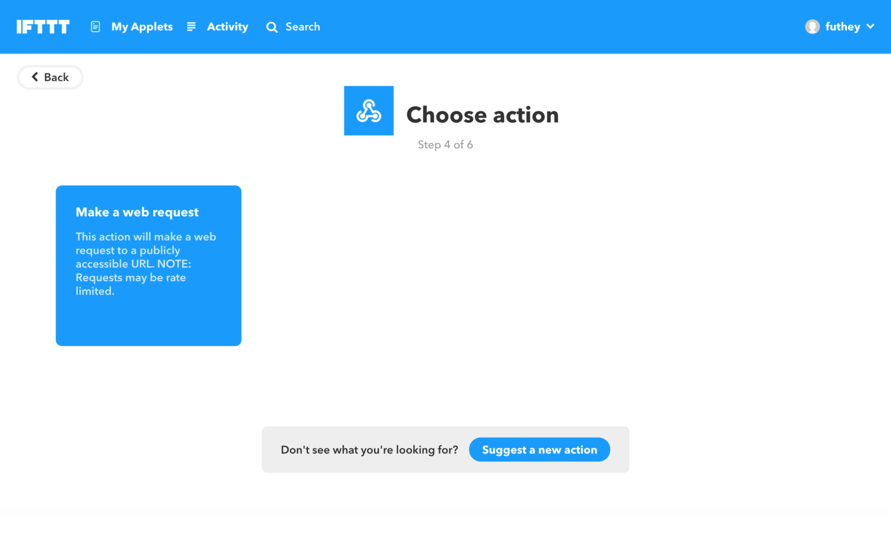

**Grab your Webhook URL from Meeting Room 365**

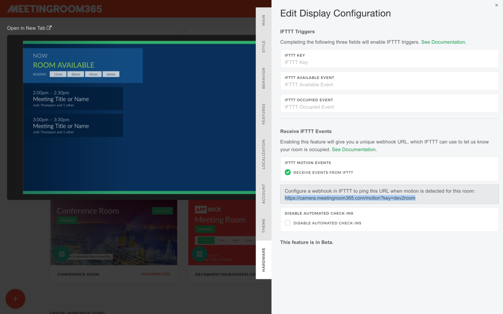

**Configure this as your trigger URL**

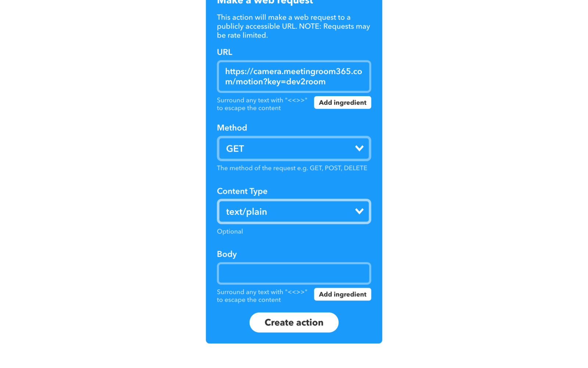

Make sure to select GET method and text/plain content type.

**Turn off notifications**

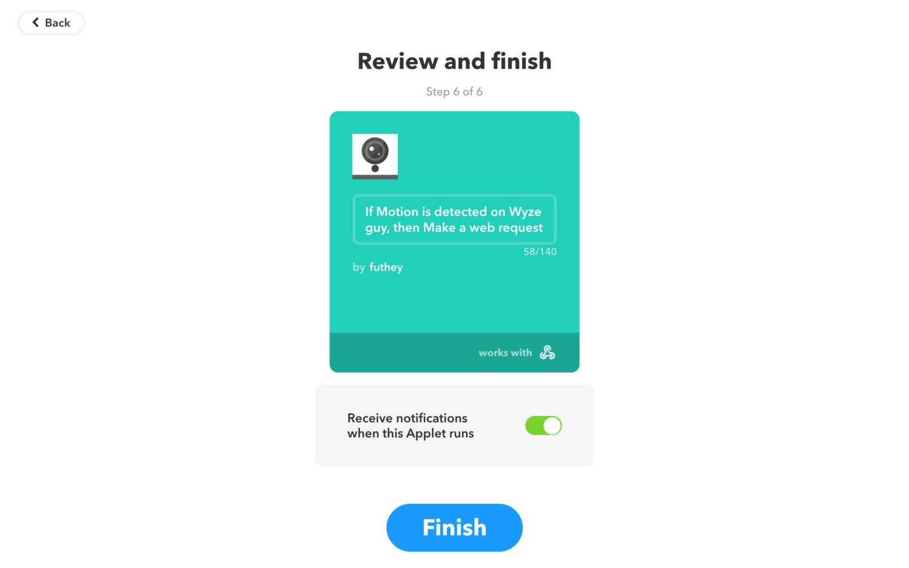

You won’t want to get an email each time motion is detected, unless you’re just troubleshooting your initial setup.

**Click Finish**

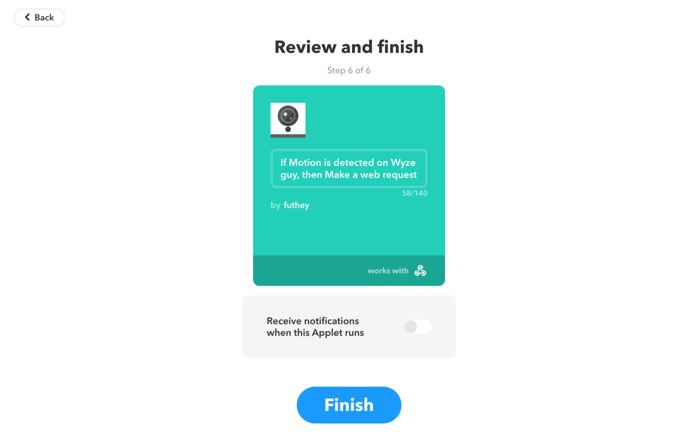

That’s it!

**You should now see this IFTTT applet enabled:**

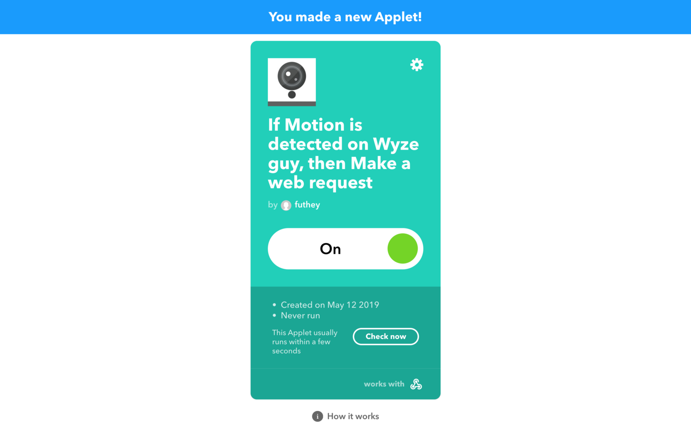

Now, if you have I**nstant Reservations** enabled, they will happen automatically (in 15 minute increments) when someone walks into an empty meeting room.

If you have **End Early** enabled, your meetings will end early when no one is in the room for 5 minutes or longer, keeping Outlook current.

If you have **Force Check-in** enabled, this will occur automatically when users are present in the room.

As always, if you have any questions, please reach out to support and let us know. **Thanks for reading!**