## Turn on or change the color of a light when a meeting room becomes occupied or available

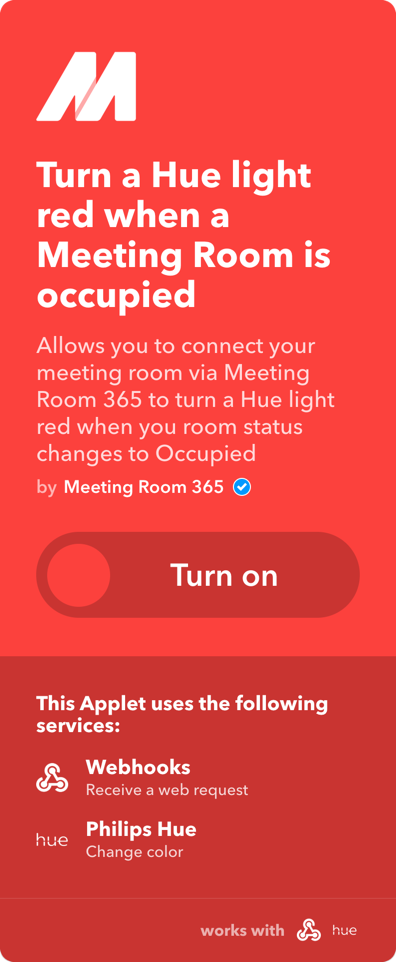

We’ve added IFTTT support to Meeting Room 365, which now gives you the ability to quickly configure hundreds of smart devices to interact with your meeting room displays. In this example, we’ll configure a Phillips Hue bulb, based on our current Meeting Room status.

#### Trigger an action based on Meeting Room Status

Below are some very basic instructions for connecting a Meeting Room 365 Display with external hardware via IFTTT.

#### Applet Template

For this example, your IFTTT applet will listen for an event sent from a Meeting Room 365 display, updating your lighting status when the event is received. Below is the completed applet template.

You can pick any event names you like, however, you must supply us with the event names, one when the display becomes **“available”**, and one when the display becomes **“occupied”**. Keep in mind, these may be fired more than once.

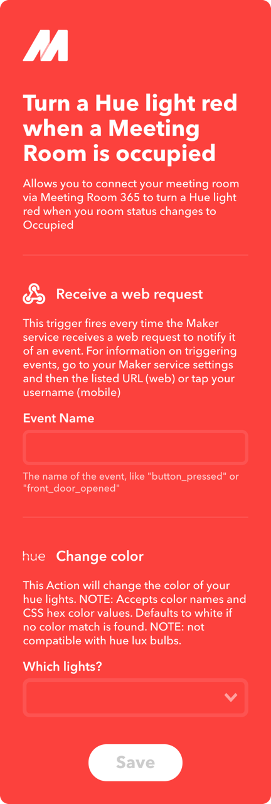

### Before you begin

Before you begin, you will need to create two keys, which can be anything you like. These do not need to be secret, they’re just a string used for an event name.

The first key will be unique to your meeting room, and will be fired each time your meeting room becomes available (and possibly multiple times while it is still available). In our example, I came up with `meeting_room_1_available`.

The second key will be similar, but it will be fired when the meeting room is occupied. I chose `meeting_room_1_occupied`. You can choose whatever you like.

You will need to create a new key for each meeting room you wish to configure.

You will also need to sign up for an IFTTT account, and have your hardware ready to test.

### Steps in IFTTT

The following steps are completed in IFTTT, which manages your hardware integrations:

#### Create a New Applet

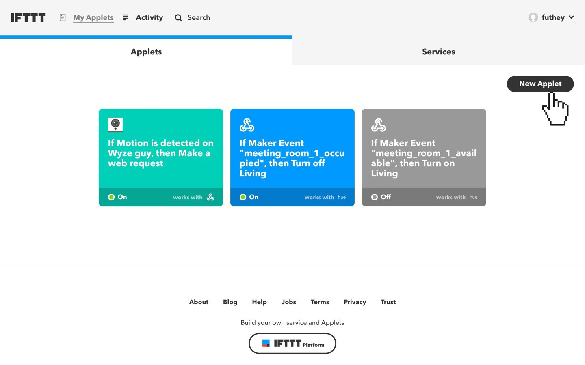

**Choose the Webhooks service**

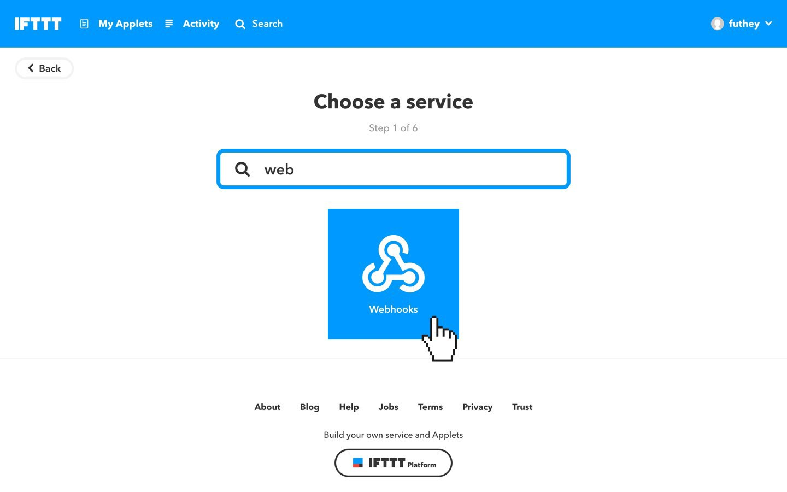

**Choose a Trigger**

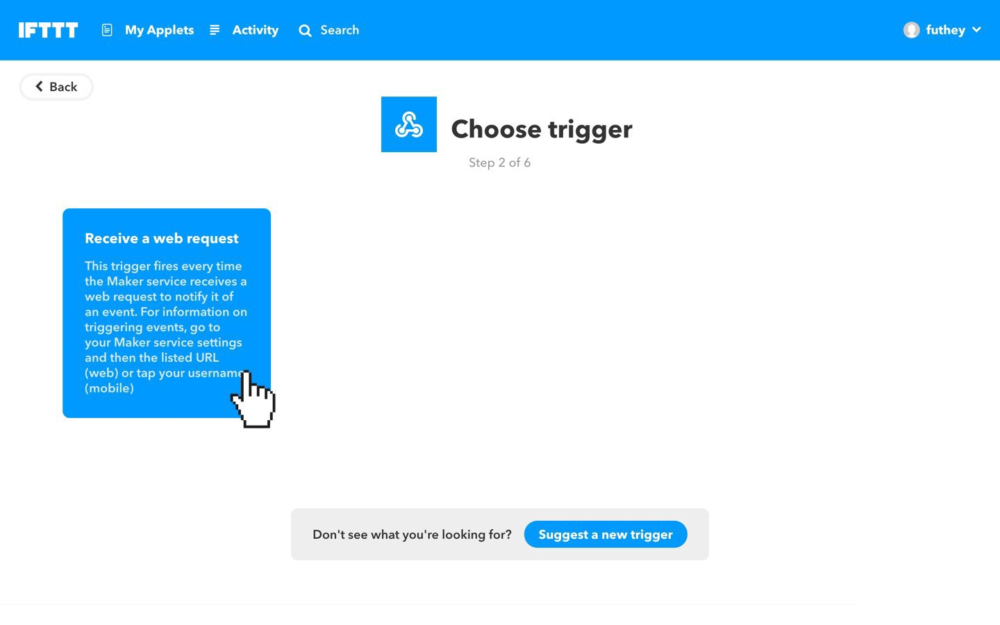

**Enter your trigger key name**

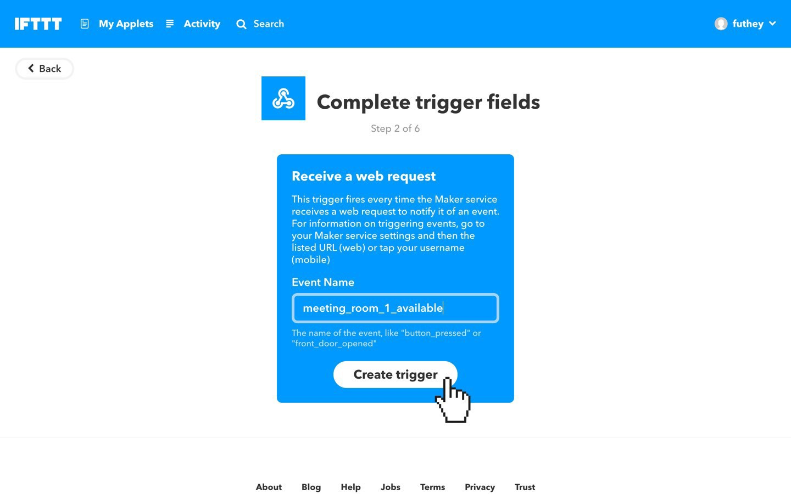

**Create an action**

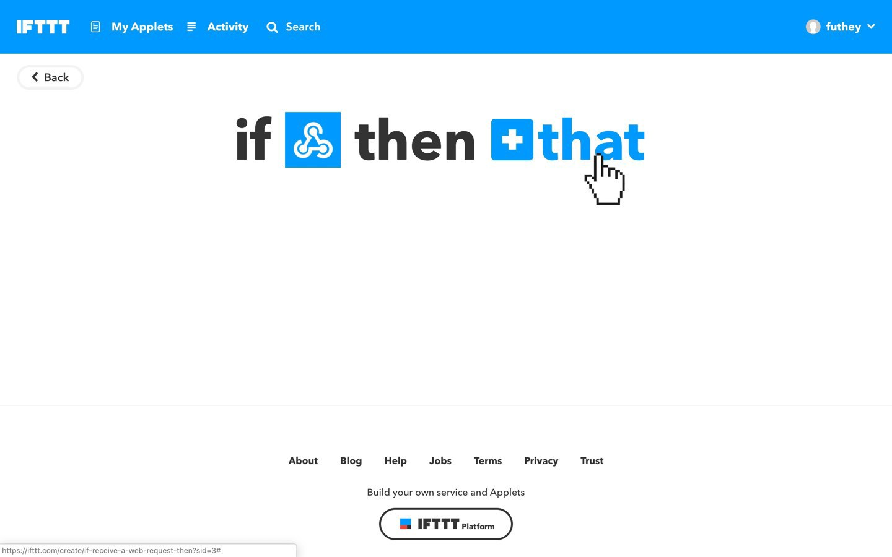

**Configure an action (result) of meeting room status changes**

\*This will depend on your hardware. See IFTTT documentation for more details.

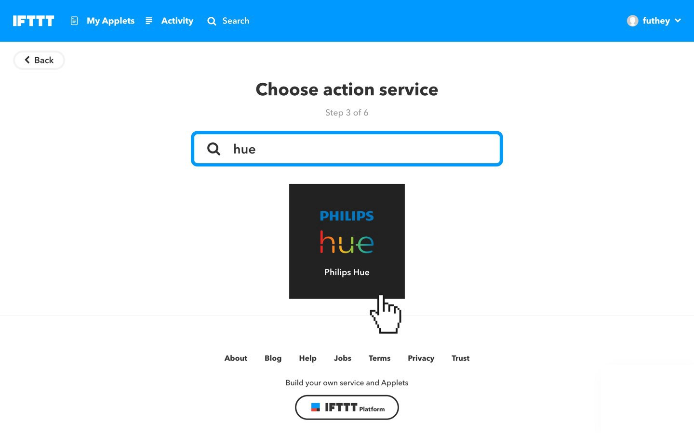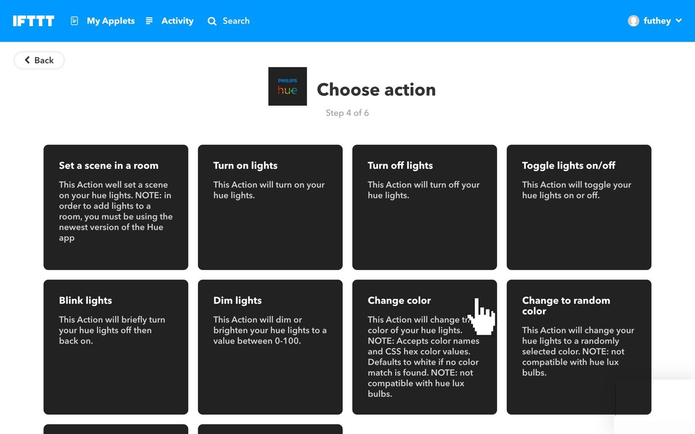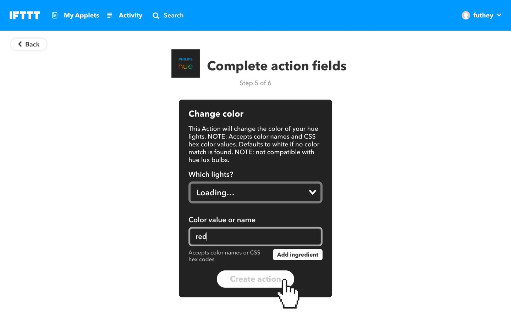

#### Congratulations! You’ve set up your first action.

You will need to repeat this for your `occupied` event, and any other rooms you wish to enable.

Get your IFTTT Maker Key for Webhooks  
Next, you’ll need to get a key which Meeting Room 365 uses to push webhooks to IFTTT. You can find that here: [https://ifttt.com/services/maker\_webhooks/settings](https://ifttt.com/services/maker_webhooks/settings)

You’ll need to copy the section of the URL we’ve blurred to your Meeting Room 365 configuration. Since you will need to do this for each display, you might want to document this along with your meeting room names and the keys you chose.

### Update your Meeting Room configuration in Meeting Room 365

Next, you will update your meeting room configuration in Meeting Room 365.

**Click to enable IFTTT events to be sent**

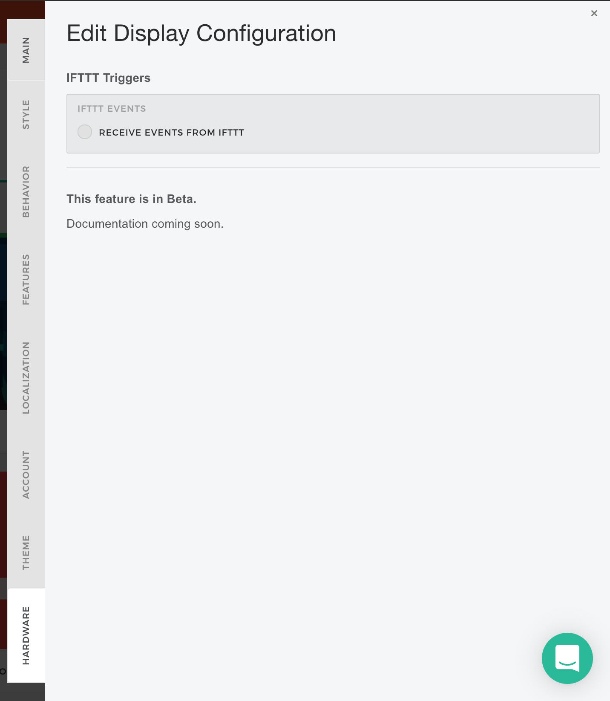

**Enter your IFTTT Webhook key, and your event keys**

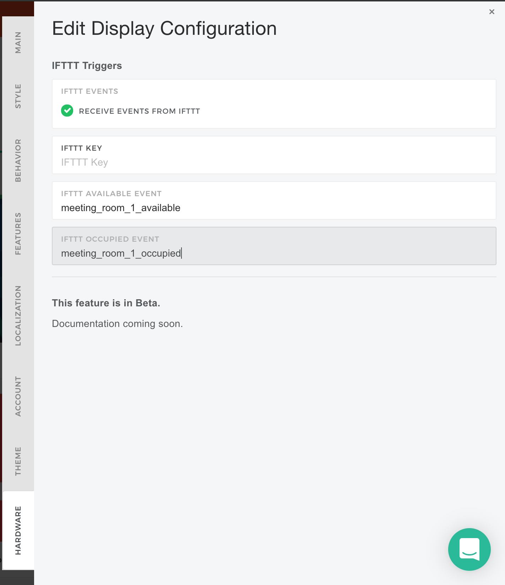

That’s it! You can now test your lights by making an instant reservation, and see their status change.

You can verify that your event fired in IFTTT from the IFTTT admin portal.

---

**Thanks for reading!** If you have any questions, please contact us via our support channel.