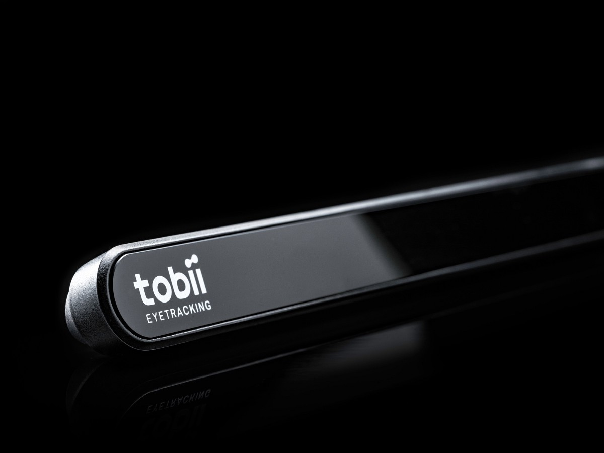
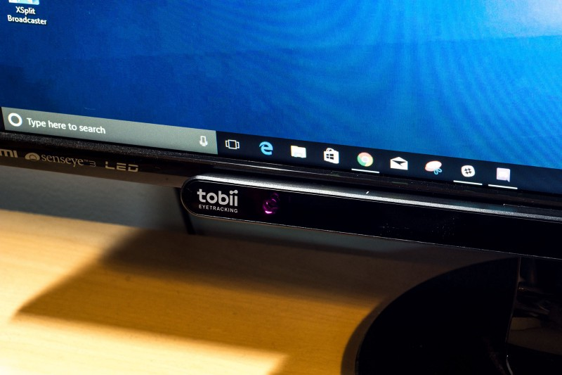
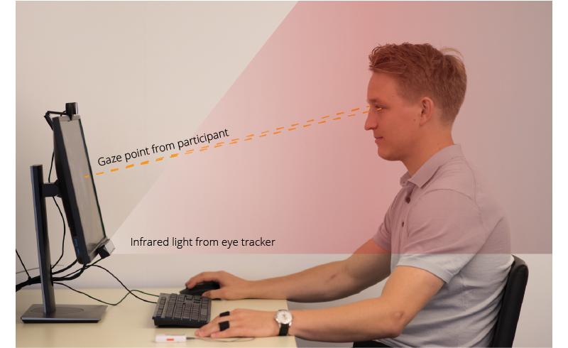
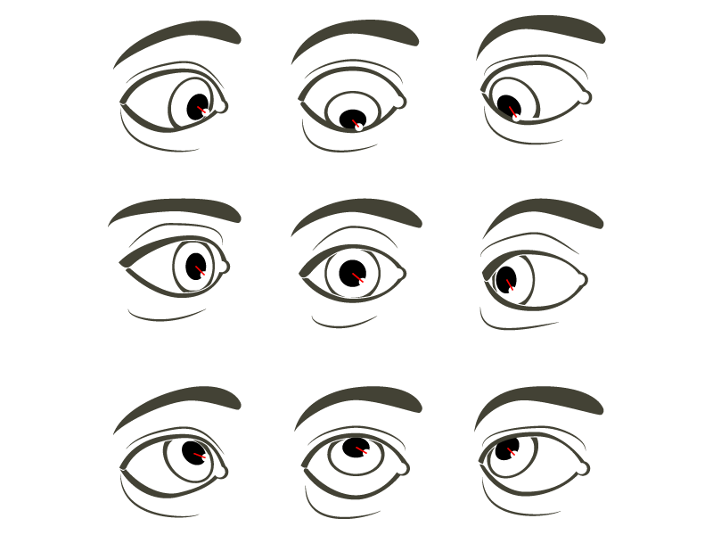
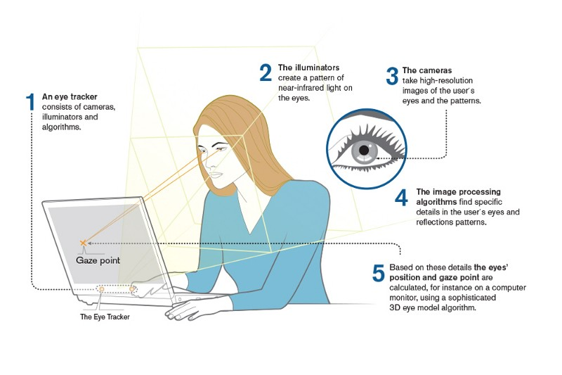
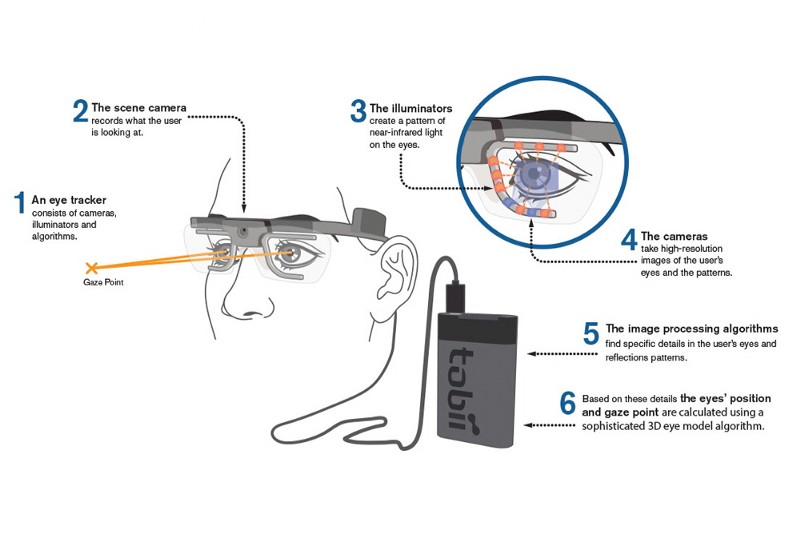
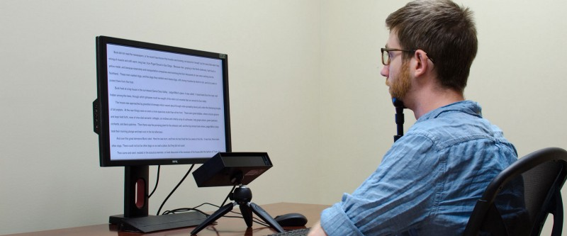
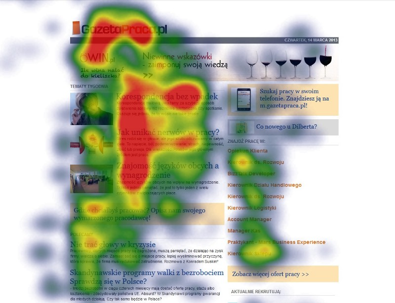

### Background

Commercial Eye Tracking isn’t yet widely available for individual researchers, and students. Professional-grade hardware starts at about $10,000, and can be much more expensive. Additionally, licensing hinders most researchers from using low-end hardware, even as economies of scale and new manufacturing techniques drive prices down to almost zero. On a hardware level, this is just a fancy webcam with IR, after all.

This presents real issues for researchers who want to practice their skills, and students who want to learn more about the techniques utilized in Eye Tracking studies.

While we don’t encourage anyone to violate the EULAs and licensing bundled with the hardware we explore, everyone will benefit if at some point in the future low-end eye-tracking hardware becomes more widely available.

  

### Benefits of Eye Tracking in Research

  

Better understand how your content is perceived

Understand Visual hierarchy & weight

Gauge Readability

Understand where patterns break-down & where problems lie

Better understand how users navigate and accomplish goals

Gauge the effectiveness of signifier and affordances

Which elements are the most distracting to a user task

  

  

### What makes Eye Tracking Hardware special?

Eye tracking has long been known and used as a method to study the visual attention of individuals. There are several different techniques to detect and track the movements of the eyes. However, when it comes to remote, non‐intrusive eye tracking the most commonly used technique is **pupil centre corneal reflection (PCCR)**. The basic concept is to use a light source to illuminate the eye causing highly visible reflections, and a camera to capture an image of the eye showing these reflections. The image captured by the camera is then used to identify the reflection of the light source on the cornea (glint) and in the pupil. We can then calculate a vector formed by the angle between the cornea and pupil reflections — the direction of this vector, combined with other geometrical features of the reflections, is then used to calculate the gaze direction.

Tobii eye trackers are an improved version of the traditional PCCR remote eye tracking technology (US Patent US7,572,008). Near-infrared illumination is used to create the reflection patterns on the cornea and pupil of the eye of the subject and image sensors are used to capture images of the eyes and the reflection patterns. Advanced image-processing algorithms and a physiological 3D model of the eye are then used to estimate the position of the eye in space and the point of gaze with high accuracy.

\[ **Source:** [Tobii](https://www.tobiipro.com/learn-and-support/learn/eye-tracking-essentials/how-do-tobii-eye-trackers-work/), [imotions](https://imotions.com/blog/eye-tracking-work/) \]

  

### Types of Eye Tracking

#### Screen-based Eye Tracking

The image below shows how a screen based eye tracker works. The basic eye tracking components are the illuminators, cameras, and the processing unit containing the image detection, 3D eye model and gaze mapping algorithms.

One drawback of these systems is that they require the participant to remain in a relatively fixed position. Otherwise, re-calibration will be required to maintain accuracy.

  

  

#### Eye Tracking Glasses (Wearables)

The image below shows how a wearable eye tracker works. Just like the screen based counterparts, a wearable eye tracker also is constituted by the same basic eye tracking components: illuminators, cameras, and the processing unit containing the image detection, 3D eye model and gaze mapping algorithms.

\[ **Source:** [Tobii](https://www.tobiipro.com/learn-and-support/learn/eye-tracking-essentials/how-do-tobii-eye-trackers-work/) \]

While this requires initial calibration and optimally a participant who does not move, it is more accurate in the event of a participant’s movement, especially if this can be limited by additional hardware.

### Licensing

> **_Important:_**  Tobii’s **EULA** requires the payment of an additional licensing fee for commercial research (even if you do not use any of their premium / professional grade hardware or software). This guide is intended for non-commercial research and evaluation purposes only.

  

### Purchasing a Tobii 4c Eye Tracker

The Tobii 4c device retails at $149 new, and there is a range of similar devices which retail around the $149 price point (I’ve seen as low as $80 used on eBay). Some gaming laptops even include Tobii hardware now.

To my knowledge, the steps in this guide can only be performed with Tobii screen-based hardware & software, which means you can basically use any Tobii screen-based tracker in a similar way. Other manufacturers may or may not include similar functionality or software with their products. You will be limited to Windows. Other models of Tobii hardware have not been tested.

If you wish to follow this guide step-by-step, I would recommend purchasing the 4c. 

###   

  

  

### My Testing Environment

  

  

  

### Hardware Setup

  

  

  

  

  

  

###   

### Tobii Ghost for Windows

  

  

  

### Enabling Heatmaps

  

  

  

### Learn More about Eye Tracking

#### Common Findings

Before you begin, I recommend taking a look at existing resources which apply to Eye Tracking. [This article](https://medium.com/@101/ux-rules-from-eye-tracking-studies-1a2573448437) outlines many common findings which have resulted from eye-tracking studies, and are generally applicable.

[**UX Rules From Eye Tracking Studies**  
_Eye-tracking research tells us about the way in which site visitors read websites. When users get a great experience…_medium.com](https://medium.com/@101/ux-rules-from-eye-tracking-studies-1a2573448437 "https://medium.com/@101/ux-rules-from-eye-tracking-studies-1a2573448437")

#### Common Eye-tracking Techniques: A Case Study

This example of an eye-tracking test provides a nice overview of some common eye-tracking techniques and findings.

[**Testing content design using eye tracking and heat maps**  
wearecitizensadvice.org.uk](https://wearecitizensadvice.org.uk/testing-content-design-using-eye-tracking-and-heat-maps-4223a6fbe850 "https://wearecitizensadvice.org.uk/testing-content-design-using-eye-tracking-and-heat-maps-4223a6fbe850")

  

#### Eye Tracking: It’s like “Think out Loud” on Steroids

My favorite technique for a tool like this would be to add-in eye tracking “in the background”, without making it an explicit goal or task for the user.

Imagine the most basic implementation of Eye Tracking, in conjunction with Normal Observation, as “Think out Loud on Steroids”. Forget Heatmaps and F-shaped patterns. Think more about using this as a tool to better understand what your users see, without having to ask them. Follow their eyes, in real time, and let yourself observe your interface literally through their eyes.

#### Problems with “Think out Loud”

The “Think out Loud” protocol can, in theory, get us 60% of what we get from Eye Tracking. But in reality, it just never comes close.

Most participants forget to “think out loud”. Even if it worked, reminding them constantly can become a distraction. Stop scolding your participants!

Further, think about **Unconscious vs. conscious actions** for a bit. Do you want to get just your user’s conscious feedback, or do you want to better understand how your users interpret things, from their perspective?

Another big reason to start using eye-tracking in conjunction with regular testing is that **complex instructions break your participant’s flow**, and affect how they consume an interface.

  

  

  

### Test Planning & Design

  

  

### Conducting your First Test

  

  

### Tips for Keeping your Participants Still

  

  

  

  

### Testing Non-Windows Software

  

Video calls, RTC, Remote viewing

HDMI Input Capture

Android Simulator (mobile) 

Casting / Mirroring

  

  

#### Additional Resources

1.  [16 Ecommerce A/B Test Ideas Backed by UX Research](https://conversionxl.com/16-ecommerce-ab-test-ideas-backed-ux-research/)   
    Ben Labay
2.  [5 Ways Eye Tracking Can Improve Your Web Usability](http://uxbert.com/5-ways-eye-tracking-improve-web-usability/)  
    [UXBERT Usability Lab](https://medium.com/u/fab03de9636c)
3.  [Use AB Testing to Increase Digital Innovations](https://uxplanet.org/use-ab-testing-to-increase-digital-innovations-37075481eec0#.jz3ifyxic)  
    [Luca Longo](https://medium.com/u/70340b448fc3)
4.  [**How to Use UX Research to Create Smarter A/B Test Variations**](https://conversionxl.com/ux-research-and-ab-tests/)  [Shannelle Mullin](https://conversionxl.com/author/shanelle-mullin/)   
    _Some great tips and tricks about A/B testing here, as well as some good reminders for optimizing research._
5.  [Measuring the User Experience, Second Edition: Collecting, Analyzing, and Presenting Usability Metrics](https://www.elsevier.com/books/measuring-the-user-experience/albert/978-0-12-415781-1)  
    William Albert, Thomas Tullis
6.  [Quantifying the User Experience: Practical Statistics for User Research](https://www.amazon.com/Quantifying-User-Experience-Practical-Statistics/dp/0123849683%3FSubscriptionId%3DAKIAI4GZY7NDTOQXBWMA%26tag%3Dactualinsights-20%26linkCode%3Dxm2%26camp%3D2025%26creative%3D165953%26creativeASIN%3D0123849683) — Jeff Sauro, James R. Lewis
7.  [https://medium.com/the-versatile-designer/adding-mobile-eye-tracking-to-your-usability-studies-a-step-by-step-guide-4ba161cb3a74](https://medium.com/the-versatile-designer/adding-mobile-eye-tracking-to-your-usability-studies-a-step-by-step-guide-4ba161cb3a74)
8.  [https://uxplanet.org/uxers-quick-guide-to-eye-tracking-edf70bffd03d](https://uxplanet.org/uxers-quick-guide-to-eye-tracking-edf70bffd03d)
9.  [https://medium.com/@InVisionApp/designing-with-eye-tracking-in-mind-b52eb048c390](https://medium.com/@InVisionApp/designing-with-eye-tracking-in-mind-b52eb048c390)

\[ [Credit](https://medium.com/user-research/user-research-weekly-5-fda04b694a53) \]