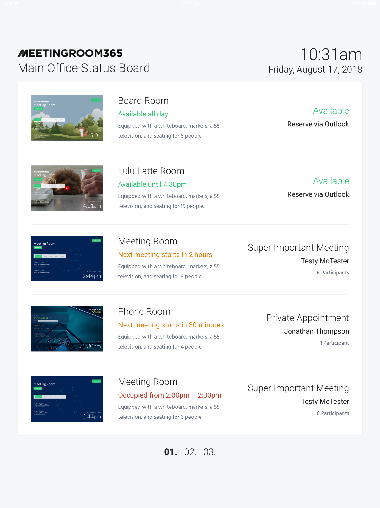

I wanted to share a project we‘ve been working on, our new Status Board display. This should be ready for release in September — October. It will be free during beta (about three months), afterwards costing just one display license ($5/month or free with the Unlimited Plan).

It allows you to mount a display which helps your employees and guests find available rooms, or rooms near their local area.

---

We’ll be adding support for Office 365 first, through **Delegated Access** (service accounts). We’ve put together a quick guide for how to designate a **Service User** in the **Office 365 Admin Portal**.

[**The Simple Way to add Account Delegates (Exchange Delegates) to Office 365 Resource Mailboxes**  
_For some services, such as ours, it can be useful to create a Service Account that can access all of the resource…_medium.com](https://medium.com/meeting-room-365/adding-account-delegates-exchange-delegates-to-an-office-365-resource-mailbox-a90b93678da2 "https://medium.com/meeting-room-365/adding-account-delegates-exchange-delegates-to-an-office-365-resource-mailbox-a90b93678da2")

If you’re interested in trying it out, let us know via support email or chat.

### Thanks for reading!